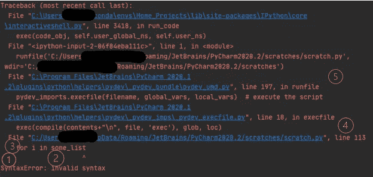
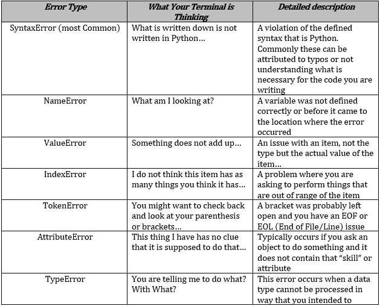

# Python 初学者突破(错误处理)

> 原文：<https://towardsdatascience.com/python-beginner-breakthroughs-error-handling-b04f85b4b543?source=collection_archive---------38----------------------->

## [入门](https://towardsdatascience.com/tagged/getting-started)

## 知道如何解释运行代码时收到的错误，可以让您立即诊断和解决问题！

[西格蒙德](https://unsplash.com/@sigmund?utm_source=medium&utm_medium=referral)在 [Unsplash](https://unsplash.com?utm_source=medium&utm_medium=referral) 上拍照

对于学习编程语言的人来说，理解语法是理解如何编写和实现代码的核心。一旦你开始理解语法和代码结构，关键的下一步是理解当你的代码不运行时你可能遇到的错误。彻底了解错误是什么以及为什么会出现错误，可以更快地诊断和排除错误。当我试图自学 Python 时，最初当我遇到错误时，我会将它复制并粘贴到 stackoverflow.com 的黑洞中，并在阅读其他人的问题时迷失。直到我参加了一门正规的大学编程课程，了解了各种错误类型及其与我的代码问题的关系，我才变得不那么依赖“谷歌搜索答案”。

## 避免危机

当遇到错误时，有一个更系统的方法来处理错误，这使得错误处理的故障排除部分变得容易得多。随着经验的积累和对 Python 语法的更好理解，您将学会快速识别您所得到的错误类型、根本原因以及如何修复它们。你最不想做的事情就是进入危机模式，在这种模式下，你很快就被时间限制住了，并且被错误所困扰。快速吸一口气，用一个清单来帮助解决这个问题，这就是我们在这篇文章中试图帮助你组装的东西。

马库斯·温克勒在 [Unsplash](https://unsplash.com?utm_source=medium&utm_medium=referral) 上拍摄的照片

## 故障排除流程

1.  确定错误类型。
2.  请阅读描述，了解引发该错误/异常的详细原因。参考 Python 文档和/或可能受错误影响的库文档是一个很好的做法。大多数文档会详细说明函数输入或调用输出的要求，以及它的类型和任何其他可能需要的要求。
3.  确定错误是否属于以下类型:a)语法/打字错误或 b)与流程/逻辑相关。
4.  如果错误与语法有关，请查看代码中错误发生的位置(通常回溯会突出显示错误的行和位置)以进行修复。
5.  如果错误与流程/逻辑相关，请检查错误类型和描述，然后查看错误发生的位置以及您要执行的代码的流程。很多时候，更好的方法是回顾一下您在代码的特定部分中试图完成的过程，看看您是否满足该功能或代码行的要求。
6.  一旦被诊断，返回并修复错误。

## 回溯剖析

下面我复制了一个简单的语法错误追溯，并会分解如何解释/理解它:

PyCharm IDE 中一个回溯的屏幕截图。作者图片

1.  错误类型—导致文件无法正确运行的特定错误

2.错误描述—证明所发生的错误或异常的描述的文本的简短描述。

3.错误位置——根据错误的类型(通常是语法错误),它将表示程序确定某些东西应该或不应该在哪里(即，缺少符号、圆括号、方括号等)

4.错误行位置——和上面一样，有时代码中有问题的行会被突出显示

5.错误追溯—现在，为了编译和运行代码，命令被发送，其他文件在后台运行，而您可能不知道，有时这真的很有帮助，如果您有更高阶的函数，和/或从其他文件调用函数，追溯可以让您深入了解当您点击 run 时在哪里启动了什么。

常见错误类型:

常见的典型错误类型表以及解释这些错误的简短描述。作者图片

## 包裹

为了更好地解决这些讨厌的错误问题，分解错误追溯，了解您收到的错误是什么，并确定它是快速修复/打字错误类型的问题，还是可能需要您重新考虑您试图完成什么的流程/逻辑问题。在一个完美的世界里，你越少依赖像 stackoverflow.com 和其他问题型论坛这样的网站，你就会过得越好。学习编程的一些最难的部分就像学习一门新语言，你希望能够在所有情况下都流利，而不是一直跑回到谷歌翻译。对错误有一个系统的方法会让你成为一个故障排除高手！

如果你对这篇文章有任何问题，请告诉我。此外，如果你想了解或解释一些事情，请回复！