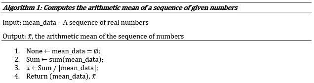

# Python 初学者突破(函数)

> 原文：<https://towardsdatascience.com/python-beginner-breakthroughs-functions-2de3a6db77ac?source=collection_archive---------19----------------------->

## Python 编码的核心和灵魂…学习在 Python 中创建干净、简单、易读的函数是无价的。


沙哈达特·拉赫曼在 [Unsplash](https://unsplash.com?utm_source=medium&utm_medium=referral) 上拍摄的照片

我认为有人会说函数编程结构可能是编码中最重要的概念之一。功能的概念是一种抽象，允许用户能够简单地知道功能做什么以及生成输出所需的输入。这允许包含该函数的一小部分代码块充当进入该函数的数据的自动处理器，该处理器可由匹配输入的所需数据类型的所有输入重用。可以构建函数来过滤输入数据、执行数据转换、准备和显示绘图和可视化。本质上，函数功能允许将代码模块化为执行特定任务的更小的代码片段，并与其他函数组合来执行更复杂的任务。函数的效用是无限的，但是如果不知道如何从概念上设计、构建和记录一个函数，它很容易成为一个穷尽的任务。

一个函数如何工作的基本概念非常简单，但是理解如何为一个函数开发一个高质量的工作流是使它清晰、简单、易读和易懂的关键。我将重点介绍构建函数的基础知识、开发优秀函数的概念，以及如何用 docstrings 正确地记录函数。

## 基本函数语法

```
def arithmetic_mean(mean_data):
    *"""
    This function will calculate the arithmetic mean of the list of the numbers inputted
    Input: num_list - A list of numbers in either integer or float type
    Output: The arithmetic mean of the list of numbers
    """* if not mean_data:
        return None
    elif mean_data is not None:
        add = sum(mean_data)
        avg = add/len(mean_data)
    return avg
```

功能的组成部分:

*   第 1 行:“def”是函数的定义调用，后面是函数名，括号中是函数的输入或参数。在上面的示例中，名称是“算术平均值”，输入是“平均值数据”。请注意，一个函数可以有多个用逗号分隔的输入。
*   第 2–8 行:docstring 是函数的注释部分(这是" "(或三撇号)" " " "内的所有项目)，用于解释函数的作用以及输入和输出。
*   第 9–13 行:这些行是函数被调用时将执行的语句。
*   第 14 行:函数的返回调用，或者函数被调用后的输出会是什么。


[斯科特·格雷厄姆](https://unsplash.com/@homajob?utm_source=medium&utm_medium=referral)在 [Unsplash](https://unsplash.com?utm_source=medium&utm_medium=referral) 上拍照

## 功能开发和建设:

开发和构建一个函数的一个关键方面是确定它需要做什么，考虑构造它的最佳或最简单的方式，然后获取一组需求并用 Python 编码。在我学习编码的早期，我完全弄错了，看到一个问题，我需要构建一个函数，然后直接开始编码。这绝对不是处理问题的正确方法。你将花费无数的时间试图处理一行你认为可以解决问题的代码，老实说，用这种方法可能会使问题变得更加复杂。

理想的开始方式是拿起笔和纸，离开电脑，依次写出这个函数需要做什么。确定输入是什么，它们将如何被处理，然后输出应该全部手写出来。这个过程称为构建伪代码。您可能在笔记本上写的速记可能足以让您进入下一步编码。

对于一个更正式的方法和正确的函数文档，接下来需要做的是开发 ***伪代码*** 。简而言之，伪代码是一种在函数中表示代码的方式，这种方式与特定的编程语言无关，并正式表示函数中的进程。此外，特定于某种编程语言的数据类型(如列表、字典和其他结构)分别被更一般化的术语(如序列或映射)所替代。下面是我为上面的算术平均值函数写的伪代码的例子。请注意，它比您在家中进行的标准项目需要的格式要正式得多，但是对于更多的技术或研究目的，以下格式可能是必要的。



算术平均值函数的伪代码。作者图片

## 函数返回

函数的最后一行通常保留给作为函数输出返回的对象。在大多数情况下，赋值变量用于返回该对象的值。在算术平均值函数的情况下，返回是变量‘avg ’,它将产生‘avg’变量的值，在这种情况下是算术平均值。需要记住的重要一点是，可以对返回进行定制，以提供各种输出，比如前面提到的变量，还有字符串。此外，像函数的输入一样，可以分配多个输出来返回。它们和输入一样，会在返回行中用逗号分隔出来。需要记住的一件重要事情是，返回多个输出的函数的输出序列将与它们编写脚本的方式保持一致。请参见下面的示例:

```
def function(input):
    return output1, output2, output3t = function(some_input)
print(t)output1, output2, output3
```

请注意，上面的函数返回三个变量，如果您将该函数赋给一个变量并打印它，输出的顺序将与输入中脚本的顺序相同。在这个函数将被用于馈送其他函数和/或您需要单独调用返回的输出的情况下，了解这一点很重要。

总结:

希望这篇文章列出了关于如何构建一个函数的基础知识，以及你需要注意的关于函数语法的关键事项。此外，我想重申的要点是，远离计算机的功能开发是使编码成为简单练习的关键部分，而不是试图同时解决过程和语法问题。如果您有任何反馈，请回复和/或联系我们！谢了。