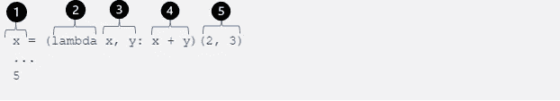
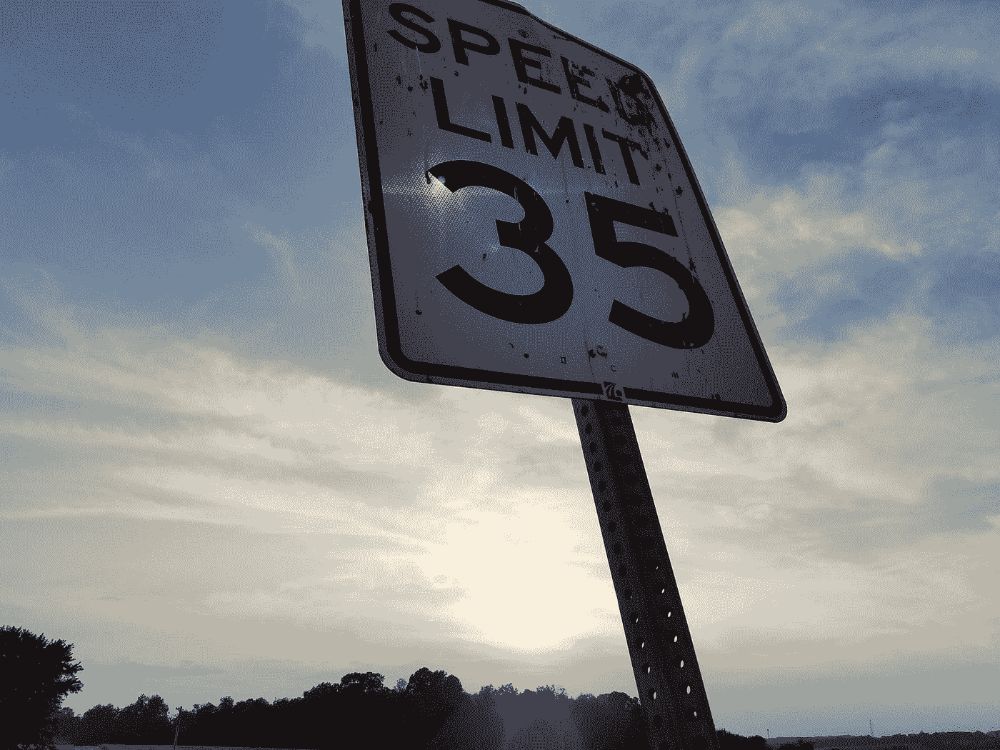

# Python 初学者突破(Lambda 函数)

> 原文：<https://towardsdatascience.com/python-beginner-breakthroughs-lambda-functions-cf932befb4a4?source=collection_archive---------38----------------------->

## 当函数不是函数时


[粘土银行](https://unsplash.com/@claybanks?utm_source=medium&utm_medium=referral)在 [Unsplash](https://unsplash.com?utm_source=medium&utm_medium=referral) 拍摄的照片

Lambda 函数是 Python 世界中非常强大的工具，它弥补了是否需要正式定义函数的差距。我认为 Python 中的 lambda 函数是一张王牌，可以帮助您快速、轻松地实现一些东西，而不需要定义函数的形式和任何额外的工作。记住 ***“能力越大，责任越大”*** ，知道什么时候可以，什么时候不应该使用 lambda 函数同样重要。


照片由[本·怀特](https://unsplash.com/@benwhitephotography?utm_source=medium&utm_medium=referral)在 [Unsplash](https://unsplash.com/?utm_source=medium&utm_medium=referral) 上拍摄

# “A-Ha”突破:Lambda 函数

如果您已经很好地掌握了在 Python 中导航语法和理解一些核心方法和函数如何工作的方法，那么学习 lambda 函数是什么和如何工作的可能有助于缓解一些在处理“简单函数”时不必要的困难问题。在函数中构建所有的代码总是一个好的做法，但是有时你想让事情变得非常简单，并且不想经历定义一个新函数的形式…这就是 lambda 函数的用武之地。Lambda 函数允许你声明一个带有参数和表达式的匿名函数。对于简单的例程操作，与构建标准函数相比，lambda 函数可能是一个理想的选择。

细节中的魔鬼是 lambda 函数的过度使用或不当使用可能会导致在进行故障排除时出现令人头疼的问题，因为您可能需要上下搜索代码来找到错误和/或对代码进行更改/更新。Lambda 函数应该在适当的时候谨慎使用。

## 基本 Lambda 函数形式和语法



lambda 函数部分的分解

1.  要赋值的变量—这对于如何实现 lambda 函数是可选的，但是您可以将其赋值给一个变量，并使用该变量进行进一步的计算和操作
2.  函数调用——只需使用 lambda 来实现函数
3.  函数的参数——可以有多个参数，但通常不超过两个是 lambda 函数的一个好的经验法则。如果您需要更多的参数，您可能需要重新考虑构造一个标准函数
4.  表达式——Lambda 函数旨在用一行代码编写(因此它们可以帮助简化短小的代码)
5.  IFFE 参数赋值— IFFE(立即调用函数表达式)参数用作首字母缩写词，表示以这些值作为参数来运行函数。这一部分是可选的，因为您可以像传统函数一样调用 lambda 函数并分配参数值，如下面的下一个代码块所示。

你可以在上面的图片中看到，执行 lambda 函数的单行代码将得到 5，就像下面用不同的方法实现的结果一样。

```
x = (lambda x, y: x + y)
z = x(2,3)
print(z)
...
5
```


迈克·彼得鲁奇在 [Unsplash](https://unsplash.com?utm_source=medium&utm_medium=referral) 上的照片

## 实现 lambda 函数的不同方法:

由于 lambda 函数允许您构建一个单行函数并实现它的简单本质，您可以通过各种不同的方式使用它们来使您的代码更具功能性。一种方法是使用λ**来设置排序键**，如下所示。

```
rank_list = sorted(score_mean.items(), 
                   reverse=True, 
                   key=lambda x: x[1])
```

因此，在名为“rank_list”的新列表中，我们使用 lambda 函数根据字典值的第二个元素 score_mean 进行排序。

另一种可能的使用方法是作为一个简单的函数应用于如下的迭代。

```
distance = (lambda x, y: 
(1 - np.dot(x, y) / (np.linalg.norm(x) * np.linalg.norm(y))))
...for idx, vector_1 in enumerate(projected_vector):
    article_distance[articles[idx]] = distance(vector_1, vector_2)
```

在上面的代码块中，我们使用 lambda 来捕获余弦相似性计算，然后应用它来查找两个向量之间的距离。我们对循环中的每一项都这样做，并捕捉距离以便以后操作。



乔治·霍夫曼在 [Unsplash](https://unsplash.com?utm_source=medium&utm_medium=referral) 上的照片

## 兰姆达斯的限制

如前所述，使用 lambdas 应该谨慎，考虑清楚和必要性，以确保良好的代码审查，并促进未来的更新。尽管 lambda 函数的行为类似于普通函数，但在直接进入 lambda 函数之前，您应该考虑一些限制:

*   因为 lambda 函数是快速的一行程序，所以普通的 python 语句不能用在表达式中。
*   由于函数本质上在技术上是匿名的，所以它们不一定与名称绑定。
*   由于前面提到的项目，复杂性有限:一个语句，一行，可能不(或不应该)包括太多的参数

## 包裹

兰姆达斯是你包里非常有用的工具。它们允许在您的代码中实现快速简单的功能，但是在它们能做什么方面有一些限制。想想你什么时候和为什么要使用它们，为什么一个普通的函数可能不是最佳的。正如我在开始时提到的“能力越大，责任越大！” 同样适用于兰达斯。如果您有任何问题、意见或反馈，请告诉我！谢了。