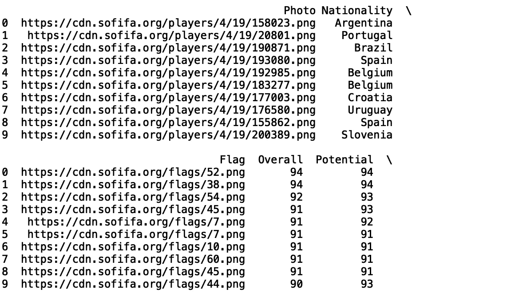

# 用于熊猫统计的 Python 类

> 原文：<https://towardsdatascience.com/python-classes-for-statistics-with-pandas-69360f9f1db9?source=collection_archive---------11----------------------->

## 用于从数据中生成统计见解的自定义 Python 类


马克斯·菲舍尔在[像素](https://www.pexels.com/photo/teacher-asking-a-question-to-the-class-5212345/)上拍摄的照片

在计算机编程中，类是用户定义的数据类型的蓝图。类是根据属性(数据)和方法(函数)来定义的。这些数据结构是组织数据和方法的一种很好的方式，这样它们在将来很容易重用和扩展。在本文中，我们将定义一个 python 类，它将允许我们生成简单的汇总统计数据，并对数据执行一些 EDA。

我们开始吧！

出于我们的目的，我们将使用 *FIFA 19* 数据集，可以在这里[找到](https://www.kaggle.com/karangadiya/fifa19)。

首先，让我们导入熊猫包:

```
import pandas as pd
```

接下来，让我们将显示列和行的最大数量设置为“None”:

```
pd.set_option('display.max_columns', None)
pd.set_option('display.max_rows', None)
```

现在，让我们读入数据:

```
df = pd.read_csv('fifa_data.csv')
```

接下来，我们将打印前五行数据，以了解列类型及其值(列结果被截断):

```
print(df.head())
```


首先，让我们定义一个名为“Summary”的简单类，它读入数据并在初始化时显示前五行:

```
class Summary:
    def __init__(self, data):
        pd.set_option('display.max_columns', None)
        pd.set_option('display.max_rows', None)
        self.df = pd.read_csv(data)
        print(self.df.head())
```

如果我们用 data = 'fifa_data.csv '调用我们的 Summary 类的实例，我们得到:

```
Summary('fifa_data.csv')
```


让我们修改这个类，这样我们就有了一个可以调用来显示前五行的方法:

```
class Summary:
    def __init__(self, data):
        pd.set_option('display.max_columns', None)
        pd.set_option('display.max_rows', None)
        self.df = pd.read_csv(data)
    def print_head(self):
        print(self.df.head())
```

现在，如果我们定义一个实例，我们可以在实例上调用“print_head”方法，它将显示前五行:

```
data = Summary('fifa_data.csv')
data.print_head()
```

我们还可以修改我们的“print_head”方法，使它可以打印多于默认的五行。

```
class Summary:
    def __init__(self, data):
        pd.set_option('display.max_columns', None)
        pd.set_option('display.max_rows', None)
        self.df = pd.read_csv(data)
    def print_head(self, rows):
        print(self.df.head(rows))
```

现在，如果我们调用“行数”为 10 的打印头 get(我截断了显示的列数:):

```
data = Summary('fifa_data.csv')
data.print_head(10)
```



让我们定义一个函数来获取数据的列名:

```
class Summary:
    ...
    def get_columns(self):
        print(list(self.df.columns))
```

如果我们调用“get_columns ”,我们会得到:

```
data.get_columns()
```


我们还可以定义一个打印列数和行数的方法:

```
class Summary:
    ...
    def get_dim(self):
        print('Rows:', len(self.df))
        print('Columns:', len(list(self.df.columns)))
```

如果我们对“数据”调用“get_dim”:

```
data.get_dim()
```


我们看到我们的数据有 18，207 行和 88 列。现在让我们定义一些能给我们一些统计见解的函数。Pandas 数据框有一个“describe()”方法，为我们提供一些基本的统计信息。这包括计数、平均值、标准差、最小值、最大值和四分位数:

```
class Summary:
    ...
    def get_stats(self):
        print(self.df.describe())
```

现在让我们调用' get_stats '。下面显示了“特殊”、“国际声誉”、“弱脚”、“技能移动”的统计数据:

```
data. get_stats()
```


由于数据包含 88 列，一次检查所有这些列的汇总统计数据可能有点令人畏惧。我们可以定义一个函数来计算特定列的平均值:

```
class Summary:
    ...
    def get_mean(self, column):
        print(f"Mean {column}:", self.df[column].mean())
```

让我们在“年龄”列上调用这个方法:

```
data.get_mean('Age')
```


我们可以对标准差做同样的处理:

```
class Summary:
    ...
    def get_standard_dev(self, column):
        print(f"STD {column}:", self.df[column].std())...data.get_standard_dev('Age')
```


对于分类列，我们可以使用 collections 模块中的“Counter”方法定义一种方法来显示分类值的分布。让我们将此应用于“国籍”列:

```
...
from collections import Counter
class Summary:
    ...
    def get_counter(self, column):
        print(dict(Counter(self.df[column])))
...
data.get_counter('Nationality')
```


我们可以定义一个函数来显示特定数字列的直方图。让我们将此应用于“年龄”列:

```
...
import matplotlib.pyplot as plt
import seaborn as sns
class Summary:
    ...
    def get_hist(self, column):
        sns.set()
        self.df[column].hist(bins=100)
        plt.title(f"{column} Histogram")
        plt.show()
...
data.get_hist('Age')
```


接下来，我们可以使用箱线图来可视化分类列中不同分类值之间的数值分布:

```
class Summary:
    ...
    def get_boxplot_of_categories(self, categorical_column, numerical_column, limit):
        keys = []
        for i in dict(Counter(self.df[categorical_column].values).most_common(limit)):
            keys.append(i)
        df_new = self.df[self.df[categorical_column].isin(keys)]
        sns.set()
        sns.boxplot(x = df_new[categorical_column], y = df_new[numerical_column])plt.show()
```

让我们为 5 个最常见的民族的“年龄”生成箱线图:

```
data.get_boxplot_of_categories(df, 'Nationality', 'Age', 5)
```


最后，我们可以定义一个函数来显示特定数字列的热图:

```
class Summary:
    ...
    def get_heatmap(self, columns):
        df_new = self.df[columns]
        sns.heatmap(df_new.corr())
        plt.title(f"Heatmap of {columns}")
```

让我们将此应用于“年龄”、“总体”、“潜力”、“特殊”:

```
data.get_heatmap(['Age', 'Overall', 'Potential', 'Special'])
```


这个类的好处在于它是一个通用的蓝图，可以重新应用于任何“csv”文件。您需要做的只是用文件名初始化实例:

```
data = Summary('new_file.csv')
```

使用“get_head”和“get_column”后，您将学习列名和类型，并能够开始应用我们在本文中使用的统计和可视化方法。我就讲到这里，但是我鼓励你自己动手处理数据和编写代码。

## 结论

总之，在这篇文章中，我们展示了如何使用 python 类通过 Pandas 库生成简单的汇总统计数据。首先，我们展示了一些基本操作，比如如何获得第一组行、列和行的长度，以及使用 describe 方法的简单统计。这些方法允许您快速获得对数据类型及其值的粗略理解。此外，我们构建了定制的统计函数，允许我们分析特定的列。当我们有太多的列需要快速分析时，这很有用。我们还展示了一些可视化数据中数值分布的方法，让我们了解哪些值接近平均值，哪些值是异常值。最后，我们讨论了如何定义一种方法来生成相关值的热图。这有助于我们想象变量是如何相互依赖的。这对于机器学习中的特征工程和模型构建非常有用。我希望你觉得这篇文章有用/有趣。这篇文章中的代码可以在 [Github](https://github.com/spierre91/medium_code/blob/master/classes_in_python/EDA_class.py) 上找到。感谢您的阅读！