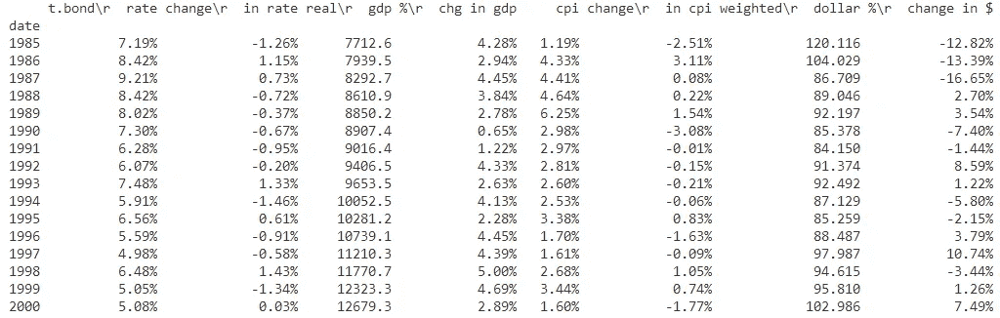
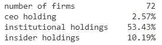

# Python 可比金融数据包

> 原文：<https://towardsdatascience.com/python-comparables-financial-data-package-ee8863fe7bb1?source=collection_archive---------33----------------------->

## 利用 Aswath Damodaran 提供的全面可比数据


***注来自《走向数据科学》的编辑:*** *虽然我们允许独立作者根据我们的* [*规则和指导方针*](/questions-96667b06af5) *发表文章，但我们不认可每个作者的贡献。你不应该在没有寻求专业建议的情况下依赖一个作者的作品。详见我们的* [*读者术语*](/readers-terms-b5d780a700a4) *。*

著名价值投资家乔尔·格林布拉特在他的《特殊情况下的投资》一书中，用了一个有趣的故事来强调使用可比数据来识别低价出售的错误定价资产的好处。

> “[……][T]姻亲遵循一个非常简单的策略。无论他们找到一件漂亮的古董家具标本[……]还是一幅印象派画作，他们在购买前只会问自己一个问题。是否有类似的家具或绘画作品最近在拍卖会上以远高于潜在购买价格的价格售出[……]”—乔尔·格林布拉特[1]

正如格林布拉特继续解释的那样，这种方法也适用于股票市场，在股票市场，将一家公司与同行进行比较是至关重要的。只有通过观察一家公司相对于同类公司的表现，投资者才能确定他们看到的是一家真正管理良好的公司，还是仅仅是有利的整体市场环境的受益者(正如巴菲特所说:“水涨船高[…]”)。

因此，任何投资决策都应该基于对可比公司数据的分析。此类可比数据的一个重要来源是“估价学院院长”NYU 教授的网站。在他的网站上，Damodaran 提供了大量不同指标的详细数据集，作为公司估值模型的重要输入。虽然这些数据集可以免费查找并以 CSV 文件的形式下载，但将这些数据集集成到 Python 估值模型中的唯一方法是通过网络搜集数据。

为了简化从 Damodaran 网站检索数据的任务，我创建了一个简单的 Python 包。这个库以可访问的 pandas 数据帧和系列的形式返回 Damodaran 的数据集，使得在定制 Python 脚本中实现数据变得更加容易。

# 安装和导入

可以使用简单的 pip install 命令安装 compdata 包:

```
$ pip install compdata
```

随后，投资者可以导入 comp_data 模块来访问市场和行业类:

```
from compdata import comp_data
```

# 市场等级

为了访问一般的市场数据，如历史回报率或税率，该软件包允许投资者创建一个市场类的实例。随后，可以使用各种类方法来检索包含数据的数据帧。

```
market = comp_data.Market()
macro_df = market.get_macro()
print(macro_df)
```

上述代码产生以下数据帧:



输出数据帧

# 行业类别

对于更具体的可比数据，投资者可以创建行业类的实例，将相应行业的名称作为参数传递。为了识别足够的数据，行业名称必须与 Damodaran 使用的术语之一相匹配，这些术语在 industry_name_list 中提供。与 Market 类非常相似，可以使用各种方法来检索数据。

```
print(comp_data.industry_name_list)>> ['Aerospace/Defense', ..., 'Utility (Water)', 'Total Market', 'Total Market (without financials)]aerospace = comp_data.Industry('Aerospace/Defense')
holdings = aerospace.get_holdings()
print(holdings)
```

以上脚本返回以下熊猫系列:



输出系列

# 结束语

我想指出的是，compdata 包只是 Damodaran 工作的一个小贡献和补充。所有收集和整合数据的功劳显然都归于阿斯瓦特·达莫达兰。他提供的数据只能以他允许的方式使用。

以下是 compdata GitHub 存储库的链接:

  

# 放弃

上面提供的代码只是将 Python 编程应用于金融领域的一个练习。本文和 compdata 程序包代码中包含的信息不应用于投资决策。

[1]格林布拉特，J. (2010 年)。*你可以成为股市天才*。试金石。【http://pages.stern.nyu.edu/~adamodar/】