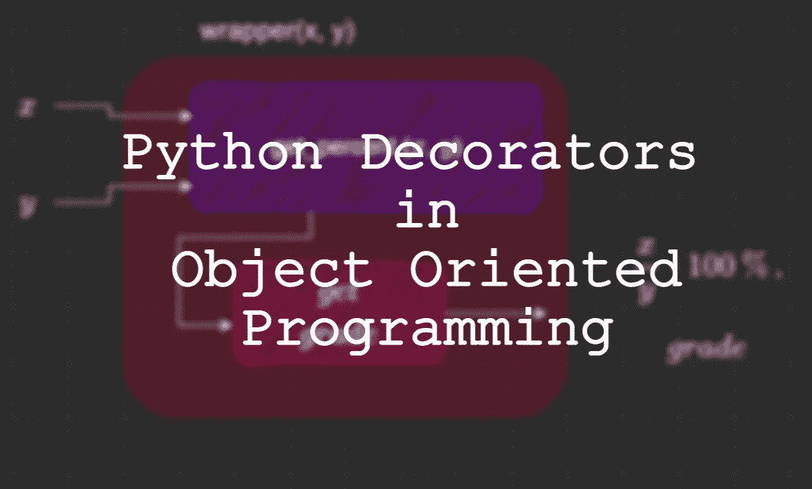
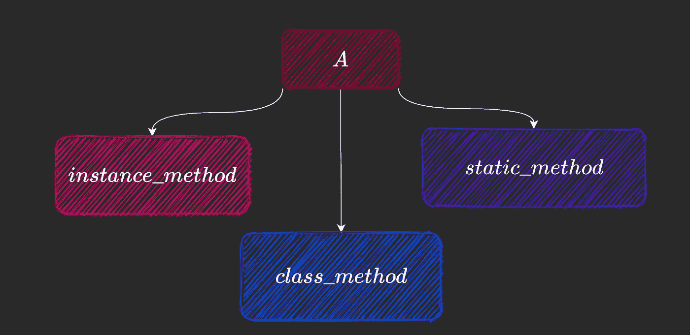

# python:OOP 中的装饰者

> 原文：<https://towardsdatascience.com/python-decorators-in-oop-3189c526ead6?source=collection_archive---------5----------------------->

## 关于类方法、静态方法和属性装饰器的指南



作者图片

**面向对象的编程范例**在 60 年代和 70 年代流行起来，出现在 Lisp 和 Smalltalk 等语言中。这些特性也被添加到现有的语言中，如 Ada、Fortran 和 Pascal。

Python 是一种面向对象的编程语言，尽管它不支持强封装。

Python 中面向对象编程的介绍性主题——更一般地说——包括定义类、创建对象、实例变量、继承的基础知识，甚至可能包括一些特殊的方法，如`__str__`。但是当我们有一个高级的外观时，我们可以谈论像装饰器的使用，或者写一个定制的`new`方法，元类，和多重继承。

在这篇文章中，我们将首先讨论什么是装饰器，然后讨论 classmethods 和 staticmethods 以及属性装饰器。

> Classmethods、staticmethods 和 property 是描述符的例子。这些是实现`__get__`、`__set__`或`__delete__`方法的对象。

但是，这是另一篇文章的主题。

# 目录

我们将在本文中讨论以下内容:

```
**- what are decorators?
- classmethods
- staticmethods
- @property**
```

# 一个例子

让我们来看一个简单的例子:一个学生类。

目前，这个类有两个变量:

*   名字
*   年龄
*   得分

当提供了这两个属性时，我们将添加一个简单的`__init__`方法来实例化一个对象。

我们将在整篇文章中对此进行修改。

# 装修工

> 装饰器是为原始函数(或类)提供增强功能的函数(或类)，而程序员不必修改它们的结构。

一个简单的例子？

假设我们想在我们的`Student`类中添加一个方法，该方法获取学生的分数和总分，然后返回一个百分比。


get_percent 函数—作者使用 [draw.io](https://app.diagrams.net/) 生成的图像

我们的百分比函数可以这样定义:

让我们定义我们的装饰者，创造性地命名为`record_decorator`。它将一个函数作为输入，并输出另一个函数(本例中为`wrapper`)。


我们的装饰者——作者使用 [draw.io](https://app.diagrams.net/) 绘制的图像

`wrapper`功能:

*   接受我们的两个参数`score`和`total`
*   调用传递给`grade_decorator`的函数对象
*   然后计算与分数相对应的等级。
*   最后，它返回计算出的百分比和分数。


如何应用装饰器——作者使用 [draw.io](https://app.diagrams.net/) 绘制的图像

我们可以这样实现我们的装饰器。

现在，为了改进`get_percent`函数，只需在我们的函数上方使用带有修饰名称的`@`符号，它的定义与之前完全相同。

要使用它，我们不需要修改 call 语句。执行此操作:

```
**get_percent(25, 100)**
```

返回

```
**25.0, D**
```

基本上发生的事情是，当我们应用装饰器时，函数`get_percent`被替换为`wrapper`。

我们将把`get_percent`方法放在`Student`类中，把装饰器放在类外。由于`get_percent`是一个实例方法，我们给它添加了一个`self`参数。

装饰者在课堂上是如何使用的？

我们将看到在类中使用的三个流行的装饰器和它们的用例。



我们的 A 类中的各种方法—图片由作者使用 [draw.io](https://app.diagrams.net/)

# 分类方法

先说实例方法。实例方法是那些被对象调用的方法，因此被传递关于该对象的信息。按照惯例，这是通过`self`参数完成的，当调用该方法时，对象的信息通过`self`隐式传递。

例如，我们可以在我们的类中添加一个方法来计算学生的分数和百分比(使用 get_percent 方法),并生成一个包含学生姓名、百分比和分数的字符串形式的报告。

**来到类方法**，这种类型的函数在类上被调用，因此，它需要一个类被传递给它。按照惯例，这是通过`cls`参数完成的。我们还将`@classmethod`装饰器添加到我们的类方法中。

它看起来像这样:

```
class A:
    def instance_method(self):
        return self **@classmethod
    def class_method(cls):
        return cls**A.class_method()
```

## 类方法的用例

由于类方法处理的是类，而不是实例，所以它们可以被用作工厂模式**、**的一部分，在工厂模式中，对象是基于某些参数返回的。

例如，在 pandas 中创建数据帧有多种方法。方法有:`from_records()`、`from_dict()`等。它们都返回一个 dataframe 对象。尽管它们的实际实现相当复杂，但它们基本上是像字典一样，对其进行操作，然后在解析数据后返回 dataframe 对象。

回到我们的例子，让我们定义一些方法来创建我们的`Student`类的实例。

*   由两个独立的自变量:例如，<name>、20 和 85</name>
*   由逗号分隔的字符串:例如，“<name>，20，85”。</name>
*   通过元组:例如，(<name>，20，85)</name>

要在 Java 中实现这一点，我们可以简单地重载我们的构造函数:

在 python 中，一种干净的方法是通过类方法:

我们还定义了`__str__`方法，这样我们就可以直接打印一个 Student 对象，看看它是否被正确实例化了。我们的类现在看起来像这样:

现在，为了测试这一点，让我们创建三个`Student`对象，每个对象来自不同类型的数据。

从上面的`__str__`方法的定义来看，输出完全符合预期:

```
Name: John Score: 25 Total : 100
Name: Jack Score: 60 Total : 100
Name: Jill Score: 125 Total : 200
```

# 静态方法

静态方法不关心实例，像实例方法一样。它不需要向它隐式传递一个类。

静态方法是放置在类中的常规方法。可以使用类和对象来调用它。我们使用`@staticmethod`装饰器来实现这些方法。

一个简单的例子:

```
class A:
    def instance_method(self):
        return self @classmethod
    def class_method(cls):
        return cls **@staticmethod
    def static_method():
        return**a = A()a.static_method()
A.static_method()
```

## 静态方法的用例

为什么这会有用？为什么不把这样的函数放在类的外面呢？

当将函数放在类中更有意义时，使用静态方法代替常规函数。例如，放置只处理类或其对象的实用方法是一个好主意，因为这些方法不会被其他任何人使用。

回到我们的例子，我们可以让我们的`get_percent`方法成为静态的，因为它服务于一个通用的目的，不需要绑定到我们的对象。为此，我们可以简单地在`get_percent`方法之上添加`@staticmethod`。

# 财产

属性装饰器提供了访问( *getter* )、修改( *setter* )和删除( *deleter* )对象属性的方法。


房产装饰者——作者使用 [draw.io](https://app.diagrams.net/) 绘制的图片

## getter 和 setter 方法

让我们从 getter 和 setter 方法开始。这些方法分别用于访问和修改私有实例。在 Java 中，我们会这样做:

现在，无论何时访问或修改这个值，都可以使用这些方法。因为变量`x`是私有的，所以它不能在`JavaClass`之外被访问。

> 在 python 中，没有`private`关键字。我们在变量前加上一个 dunder( `__`)来表明它是私有的，不应该被直接访问或修改。

在变量名前加一个`__`会把那个变量名从`varname`修改成`_Classname__varname`，所以像`print(obj.varname)`和`obj.varname = 5`这样的直接访问和修改是行不通的。尽管如此，这并不是很强，因为您可以用修改后的表单直接替换`varname`,以直接进行修改。

让我们以下面的例子来理解这一点:

## **添加 getter 和 setter 方法**

以我们的学生类为例，让我们通过在变量名前添加一个 __ 来使 score 属性成为“private”。

如果我们像 Java 一样直接添加`get_score`和`set_score`，主要问题是，如果我们想对现有代码这样做，我们必须将每个访问从:

```
**print("Score: "  + str(student1.score))**
**student1.score = 100**
```

对此:

```
**print(student1.get_score())
student1.set_score(100)**
```

这就是`@property`装饰师的用武之地。您可以使用此功能简单地定义`getter`、`setter` 和`deleter` 方法。

我们的类现在看起来像这样:

**要使** `**score**` **属性只读，**只需去掉 setter 方法即可。

然后，当我们更新`score`时，我们得到以下错误:

```
Traceback (most recent call last):
  File "main.py", line 16, in <module>
    student.score = 10
**AttributeError: can't set attribute**
```

## **删除器方法**

`deleter`方法允许您使用`del`函数删除受保护的或私有的属性。使用与前面相同的示例，如果我们直接尝试删除 score 属性，我们会得到以下错误:

```
student = Student("Tom", 50, 100)
del student.scoreThis gives:
Traceback (most recent call last):
  File "<string>", line 17, in <module>
**AttributeError: can't delete attribute**
```

但是当我们添加一个 deleter 方法时，我们可以删除我们的私有变量`score`。

该属性现在已成功删除。打印出`score`的值给出“对象没有属性……”，因为我们删除了它。

```
Traceback (most recent call last):
  File "<string>", line 23, in <module>
File "<string>", line 9, in x
**AttributeError: 'PythonClass' object has no attribute '__score'**
```

## 属性装饰器的用例

当定义数据验证方法时，属性装饰器是非常有用的**，比如当决定一个要赋值的值是否有效并且不会导致代码中的问题时。**

另一个用例是当**想要以特定方式**显示信息时。回到我们的例子，如果我们想显示一个学生的名字为`“Student Name: <name>”`，而不仅仅是`<name>`，我们可以从 name 属性的属性 getter 返回第一个字符串:

现在，任何时候我们访问`name`，都会得到一个格式化的结果。

```
student = Student("Bob", 350, 500)
**print(student.name)**
```

输出:

```
**Student Name: Bob**
```

**`**property**`**装饰器也可以用于记录变更。****

**例如，在一个`setter`方法中，您可以添加代码来记录变量的更新。**

**现在，每当调用 setter 时，也就是变量被修改时，就会记录更改。假设鲍勃的数学考试有一个总错误，他最后多得了 50 分。**

```
student = Student("Bob", 350, 500)
print(student.score) **student.score = 400** print(student.score)
```

**上面给出了以下输出，并显示了记录的更改:**

```
70.0 %
**INFO:root:Setting new value...**
80.0 %
```

**最后，我们的类看起来像这样:**

## **注意#1:你应该在类的什么地方定义装饰器？**

**你可以在很多地方定义装饰器:在类的外部，在一个单独的类中，或者甚至在一个内部类中(相对于我们使用装饰器的类)。在这个例子中，我们简单地在`Student`类之外定义了`grade_decorator`。尽管这样做是可行的，但装饰器现在与我们的类没有任何关系，这可能是我们不喜欢的。**

**关于这一点的更详细的讨论，请查看这个帖子:**

 **[## Python 类中的装饰器

### 假设我们需要一个装饰器，我们只在一个特定的类中使用它。大概是这样的:

medium.com](https://medium.com/@vadimpushtaev/decorator-inside-python-class-1e74d23107f6)** 

## **注意#2:除了 Java 中的构造函数重载之外，还有其他选项来模拟我们讨论的方法吗(比如，from_str 或 from_tuple)？**

**除了重载构造函数，我们还可以利用 java 中的**静态工厂方法。我们可以定义一个像`from_str`这样的静态方法，从传递给它的字符串中提取关键信息，然后返回一个对象。****

# **结论**

**面向对象编程是一个非常重要的学习和使用范例。不管你是否需要在你的下一个项目中使用这里讨论的主题，非常好地了解基础知识是必要的。与更基本的概念(如继承或类和对象的基本实现)相比，本文中的主题并不经常被使用，它们是建立在这些基础上的。无论如何，我希望这篇文章能让你了解 Python OOP 中的其他方法(除了实例方法)和属性装饰器。**