# Python 字典可以改进

> 原文：<https://towardsdatascience.com/python-dictionary-can-be-improved-f5dce4f5d0af?source=collection_archive---------15----------------------->


[奥利切尔](https://pixabay.com/users/olichel-529835/)在 [Pixabay](https://pixabay.com/photos/man-male-person-model-eating-973240/) 拍摄的照片

## 第三方图书馆带来更多便利

只要我们使用 Python，字典就是我们几乎无法避免使用的数据结构。我认为 Python 字典在灵活性方面已经足够好了。毕竟，Python 语言本身就是以动态著称的。

但是，如果您也像我一样出于某些目的使用 JavaScript，您可能会熟悉使用“dot”从字典中获取对象值。本文将从一个例子开始，展示 Munch 试图解决的不便之处。然后，我将介绍这个库的其他特性。

# 原始 Python 字典


照片由 [DariuszSankowski](https://pixabay.com/users/dariuszsankowski-1441456/) 在 [Pixabay](https://pixabay.com/photos/glasses-book-education-eyeglasses-1052010/) 上拍摄

我假设大多数像您一样的开发人员已经熟悉 Python 字典了。这是一个为演示目的而创建的示例词典。

```
my_profile = {
    'name': 'Chris',
    'age': 33,
    'address': {
        'country': 'Australia',
        'state': 'Victoria'
    }
}
```

如果我们想得到“名称”的值，只需做`my_profile['name']`。

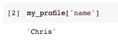

如果我们想获得“country”的值，我们可以将方括号链接起来，因为它嵌套在对象“address”内部。

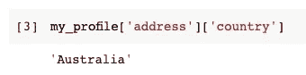

老实说，没什么大问题。如果我们坚持要找一个，那就是键必须是一个字符串。除非我们定义一个合适的类并将`my_profile`实例化为一个实例，否则我们必须使用 string 来获取值。

Munch 就是这样一个绕过这个问题的库。

# 使用蒙克字典


由[自由照片](https://pixabay.com/users/free-photos-242387/)在 [Pixabay](https://pixabay.com/photos/pencil-sharpener-notebook-918449/) 上拍摄的照片

Munch 是在 PyPI 中注册的，所以我们可以使用 pip 轻松获得它。

```
pip install munch
```

一旦我们得到了库，就需要从模块中导入类`Munch`。

```
from munch import Munch
```

然后，我们可以如下定义我们的字典。

```
my_profile = Munch({
    'name': 'Chris',
    'age': 33,
    'address': Munch({
        'country': 'Australia',
        'state': 'Victoria'
    })
})
```

然后，Munch 字典和 Python 字典之间的主要区别是前者支持“点”语法来获取值。

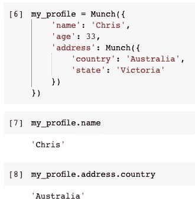

在上面的例子中，我们不必使用字符串来获取值。好处是它更加可靠和方便，因为大多数 IDE 工具都有自动完成按键的功能。

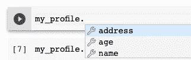

如果你不确定为什么使用可访问属性比字符串更可靠，请参考我以前的一篇文章。

> 如何在 Python 中少犯“错误”

</how-to-make-fewer-mistakes-in-python-6925619ce87e> [## 如何在 Python 中少犯“错误”

towardsdatascience.com](/how-to-make-fewer-mistakes-in-python-6925619ce87e) 

# 构建蒙克词典


照片由 [satynek](https://pixabay.com/users/satynek-8757289/) 在 [Pixabay](https://pixabay.com/photos/cat-dachowiec-kitten-kocurek-4294780/) 上拍摄

您可能已经注意到，在前面的例子中，我们从 Python 字典创建了 Munch 字典。当然，如果我们已经有一个字典，这是很方便的，我们只是想使用一些来自 Munch 的特性。

然而，有时我们可能想在字典不存在的时候建立一个字典。在这种情况下，我们**不必**首先构建一个 Python 字典，然后将其转换为 Munch。我们可以使用点语法从头开始构建字典。这非常类似于 JavaScript。

例如，我们想重新构建我们在前面的例子中使用的字典。

```
my_new_profile = Munch()
```

这个可以当做`my_new_profile = {}`，但是我们从一开始就有 Munch 的特性。所以我们可以做以下事情来添加键值对。

```
my_new_profile.name = 'Chris'
my_new_profile.age = 33my_new_profile.address = Munch()
my_new_profile.address.country = "Australia"
my_new_profile.address.state = "Victoria"
```

`my_new_profile`将与`my_profile`相同。

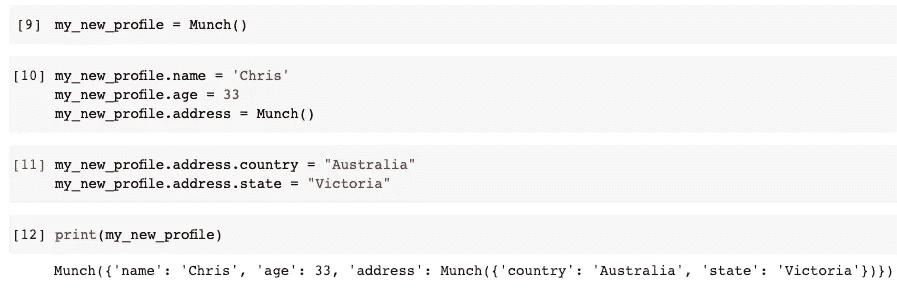

# 蒙克还是字典的一个子类


由 [TaniaVdB](https://pixabay.com/users/taniavdb-54472/) 在 [Pixabay](https://pixabay.com/photos/kitten-playful-siamese-cat-bite-408853/) 上拍摄的照片

事实上，Munch 类是 Python 字典的一个子类。

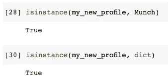

上面的例子表明我们创建的`my_new_profile`既是蒙克又是`dict`。了解到这一点，可以很有信心的说，Munch 也将继承 Python Dictionary 的所有原创特性。

例如，我们仍然可以使用字符串来设置键值对或获取值。如果键是变量，我们可能仍然需要这个特性。

```
my_new_profile['programming_language'] = 'Python'
my_new_profile['programming_language']
```

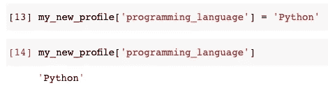

当然，Python 字典的所有功能在这里也将可用，比如获取一个 Munch 字典的所有键。

```
my_new_profile.keys()
```

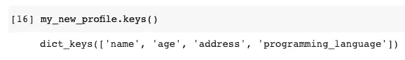

序列化是 Python 字典最重要的特性之一。很多时候，我们可能想要在 Python 字典和 JSON 字符串之间进行转换。显然，通过使用 Munch，我们从未失去这一功能。

```
# Serialisation
import jsonprofile_json = json.dumps(my_new_profile)
print(profile_json)
```

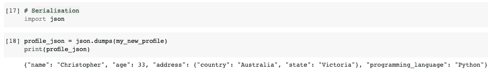

# 默认值

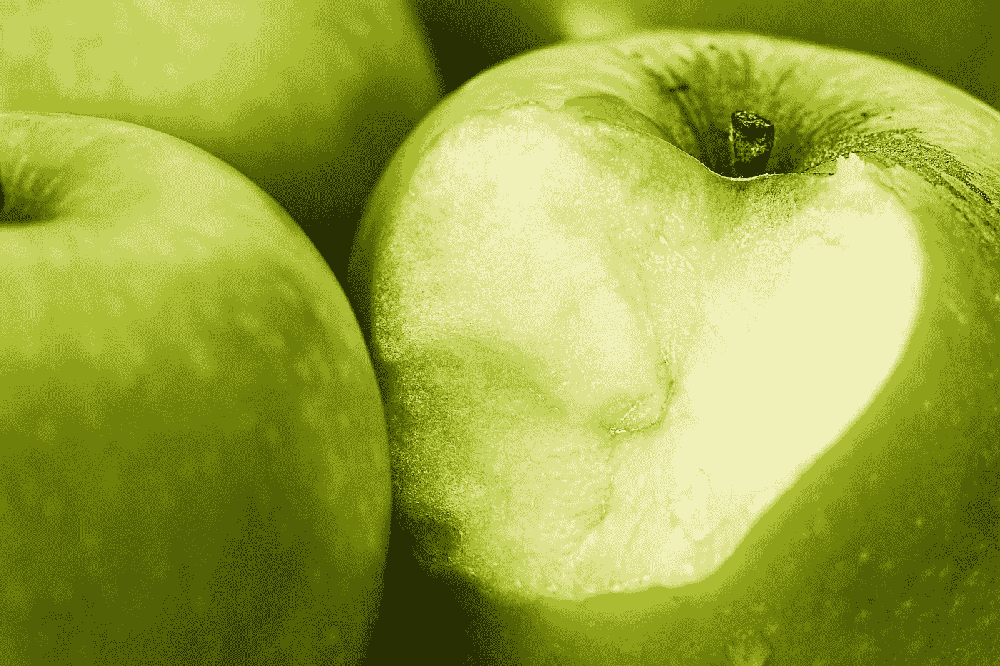

照片由 [stevepb](https://pixabay.com/users/stevepb-282134/) 在 [Pixabay](https://pixabay.com/photos/green-apple-bite-food-apple-fruit-1051018/) 上拍摄

现在，让我们看看 Munch 还提供了哪些很酷的功能。默认值是其中之一。

关于 Python 字典，我们需要知道的一个重要提示是关键错误。

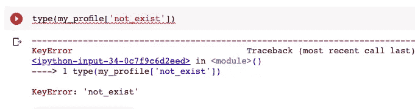

当担心按键错误时，建议使用`get()`功能。使用此功能时，我们可以设置默认值。

```
my_profile.get('programming_language', 'undefied')
```

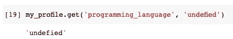

这还不错，但是我们每次使用`get()`函数时都必须传递默认值。有了蒙克字典，我们只需要做**一次**。

```
from munch import DefaultMunchmy_profile = DefaultMunch('undefined', {
    'name': 'Chris',
    'age': 33
})
```

如图所示，这一次我们需要导入`DefaultMunch`类。当我们定义字典时，当我们试图获取一个不存在的键时，第一个对象将是默认值。让我们试一试。

```
my_profile.whatever_not_exists
```

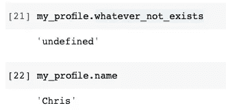

当密钥不存在时，将返回预定义的默认值。如果确实存在，则正确返回该值。

# 查询时添加关键字


照片由 [AlbanyColley](https://pixabay.com/users/albanycolley-6298107/) 在 [Pixabay](https://pixabay.com/photos/dogs-play-retriever-golden-2690582/) 上拍摄

Munch 库的另一个小块糖是默认的工厂类。当我们试图从一个键中获取一个值时，如果这个键不存在，它将被自动添加到 Munch 字典中。

我们需要用`DefaultFactoryMunch`类定义一个 Munch 字典。

```
from munch import DefaultFactoryMunchmy_profile = DefaultFactoryMunch(list, {
    'name': 'Chris',
    'age': 33
})
```

请注意，默认值需要在`DefaultFactoryMunch`的实例中定义。当访问不存在的键时，将使用该默认值。

假设我们正在查询 Munch 字典。如果键不返回任何值，我们希望给键增加值。

```
if not my_profile.languages:
    my_profile.languages.append('Python')print(my_profile.languages)
```

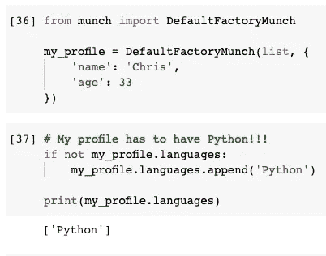

它保证我的个人资料必须有 Python:)

# 摘要


照片由[坎霍](https://pixabay.com/users/khamkhor-3614842/)在[皮克斯贝](https://pixabay.com/photos/baby-beautiful-food-nature-girl-3041366/)上拍摄

在本文中，我介绍了名为 Munch 的库。它完全继承了 Python 字典，因此它支持我们熟悉的所有原始功能。此外，它支持“点语法”。这比传递一个字符串来获取一个键值更方便、更可靠。除此之外，当我们希望从字典中访问一个不存在的键时，它还提供了一个更好的解决方案。

<https://medium.com/@qiuyujx/membership>  

如果你觉得我的文章有帮助，请考虑加入 Medium 会员来支持我和成千上万的其他作者！(点击上面的链接)