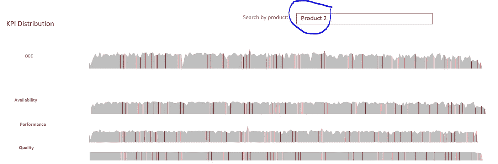

# Python Excel 与 Xlwings 的集成

> 原文：<https://towardsdatascience.com/python-excel-integration-with-xlwings-f9bf9d1332ea?source=collection_archive---------11----------------------->

## 用 Python Xlwings 为您的 Excel 插上翅膀


学习如何用 Xlwings 飞行(巴伐利亚天空，图片由作者提供)

## **动机:**

我们经常进行令人印象深刻的 Python 分析，但我们的同事所要求的只是在 Excel 中获得最终结果。我们的许多同事不想使用 Jupyter Notebook、Python 脚本之类的东西。他们只想坚持使用他们钟爱的电子表格工具(比如微软的 Excel)。在“[面向非 Python 爱好者的 Excel-Python 应用](/excel-python-app-for-non-pythonists-68b4fec0fabf)”中，我们学习了如何为那些同事构建一个完整的 Excel-Python 应用。在本帖中，我们将更深入地考察 [**Xlwings**](https://www.xlwings.org/) 。Xlwings 让我们能够使用 Excel 电子表格作为 GUI(图形用户界面)来开发交互式应用程序，而 Python 则在后台完成这项工作，通过单击 Excel 中的按钮或 UDF(用户定义的函数)来调用。在这个故事的结尾，你将拥有一个漂亮的 [**Excel KPI 仪表板模板**](https://chandoo.org/wp/kpi-dashboard-revisited/) :


非常感谢最伟大的 CEO 之一(首席 Excel 官): [Chandoo](https://chandoo.org/) ，这一切都是从你那里学来的！

..其从数据库连接接收数据，使用 **Pandas** 数据帧和 **Numpy** 数组**计算总设备效率(OEE)。**我们还将讨论为什么我们坚持 Excel 的**可视化**部分，而不是使用 Xlwings 的图表和静态图片的可能性。

## **解决方案:**

正如我们许多人已经体验过的，与 Numpy 数组和 Pandas 数据框架相比，Excel 的电子表格网格使用类似的逻辑。由于这一点，Xlwings 的核心特性之一是使读取和写入 Excel 数据变得极其方便。

## 导入包和数据

在我们检查之前，我们需要确保我们已经安装了 xlwings。如果您尚未安装，请现在安装，例如通过 [pip 安装](https://pypi.org/project/xlwings/):

```
pip install xlwings
```

现在我们可以导入 Xlwings 并调用 Xlwings 的 Book 函数来访问我们的 input.xlsx 文件。然后我们使用 Xlwings 的视图功能来证明上面关于其可用性的陈述:

```
import xlwings as xw
import pandas as pd
df = pd.read_excel('input.xlsx')
xw.view(df)
```


这就是我们的制造业 KPI 在 Xlwings 看来的样子

如果您想从 SQL Server 数据库中导入数据，可以这样做:

```
import pandas as pd 
import pyodbc 
sql_conn = pyodbc.connect(‘Driver={SQL Server};’
 ‘Server=MsSqlServerName;’ 
 ‘Database=DatabaseName;’ 
 ‘Trusted_Connection=NO;UID=USER;PWD=PASSWORD) 
query = “SELECT * from dbo.input“ 
df = pd.read_sql(query, sql_conn)
```

与熊猫相反，Xlwings 打开这个 Excel 文件(。**查看**，这样我们可以直接在 Excel 电子表格中查看数据框。该函数支持所有常见的 Python 对象(数字、列表、字典、字符串、元组、数组和数据帧)。默认情况下，视图打开一个新工作簿并将该对象粘贴到第一个工作表的单元格 A1 中。由于 Excel 的 autofit，甚至列宽也会自动调整。查看功能在检查大数据框时非常方便(比在 Juypter 笔记本单元格中直接浏览大数据框更方便，尤其是在交叉检查大量计算时)。

## 关于书本和床单的一些单词

最高粒度的**工作簿**、**工作表**、**范围**或特定的**单元格**是我们在 Excel 中处理的最重要的组件。因此，现在让我们做一些与这些概念相关的基本任务。

我们通过调用 Xlwings 的 Book 函数来访问我们的 input.xlsx 文件:

```
wb=xw.Book(r”C:\users\input.xlsx”)
wb.name
```


调用 wb.name，我们可以将 Input.xlsx 作为输出。

```
wb.sheets
```


Xlwings 自动将输入选项卡检测为唯一填写的表单。我们也可以直接从这本书里调用这一页:

```
sht = wb.sheets[‘Input’]
```

我们也可以使用索引来代替工作表的名称。与 Python 类似，Xlwings 从零开始索引:

```
sht= wb.sheets[0]
sht.name
```


输入工作表名称，因为工作表索引 0 是 Excel 中的工作表 1。

下一步，我们可以使用 range 作为工作表对象的属性:

```
sht.range(“A1”)
```


以上范围仅激活 A1 单元格。但是我们希望看到从单元格 A1 开始的完整表格，不管这个表格包含多少行和多少列。因此，我们必须提供 DataFrame 类作为 options 方法中的 convert 参数。此外，我们使用 header 1 表示 yes 和 table expand 这样的选项。默认情况下，数据帧应同时具有标题和索引:

```
sht.range(“A1”).options(pd.DataFrame, header=1, index=False, expand=’table’).value
```


我们收到了完整的表格，但没有明确说明完整的范围。

range 对象的 value 属性接受并返回单个单元格的标量和二维范围的嵌套列表。上面的扩展表选项比以元组样式硬定义范围对象要方便和灵活得多:

```
sht.range(“A1:AI253”).value
```


数据帧通常比元组更容易处理。

我们还可以通过索引和切片工作表对象来排列对象。用 A1 表示法做这件事感觉更直观，使用整数索引让 Excel 感觉有点像 Numpy 数组:

```
sht[“A1:AI253”]
```


```
sht["A1:AI256"] [:, 10]
```


## 计算 OEE

从我们对 Excel 对象的小小探索中回来，现在让我们回到我们想要计算 OEE 的输入数据:

```
dfInput = sht.range(‘A1’).options(pd.DataFrame, header=1, index=False, expand=’table’).value
```

出于培训目的，我们将这个简单的 OEE 计算添加到我们的数据框架中:

```
dfInput[‘OEECalc’]=(dfInput[‘Availability’]+dfInput[‘Performance’] + dfInput[‘Quality’]) /3
```

下一步，我们将打开 KPI 仪表板模板，我们希望将其他工作簿中的数据转移到该模板中:

```
wbNew=xw.Book(r”C:\users\KPIDashboard_Xlwings.xlsx”)
```

更准确地说，我们希望将表格的内容复制到选项卡 InputNew 中，从单元格 B4 开始(您可能会问为什么是 B4？仅供学习之用):

```
shtout = wbNew.sheets[‘InputNew’]
shtout.range(‘B4’).options(pd.DataFrame, index=False).value = dfInput
```

## 关于 Xlwings 绘图的几点思考

多亏了 Xlwings，我们可以将数据从一个 Excel 文件复制到另一个文件中，包括一个 OEE 计算。Xlwings 还支持使用 Matplotlib 绘图，我们现在可以使用它来绘制 KPI。但事实上，我们决定坚持使用 Excel 的仪表板功能来显示我们的 KPI 输入数据。这是因为在当前状态下，Excel 的图表和图像功能远远优于 Xlwings。得益于 Excel 函数，我们还使该 OPS KPI Excel 模板非常动态且易于调整，尤其是对于我们无法使用 Python 的同事而言:


通过单击圆圈对 KPI 进行排序


如果不应显示任何目标，则取消勾选。



搜索特定产品在所有 KPI 中的分布。


绘制相互对立的 KPI。


统计过程控制(SPC)仍然没有过时。


最终，箱线图通常被严重低估。

## Xlwings Excel 加载项

我们现在能够在 Jupyter 笔记本中启动读取(从 Excel)、计算和写入(返回 Excel)过程。到目前为止，没什么特别的。但多亏了 Xlwings，我们现在可以在 Excel 中添加 VBA 宏，这样我们就可以在 Excel 中启动 Jupyter 笔记本了。基本概念是简单地将 Jupyter 笔记本代码编写到主函数中，导出为 Python 文件。py)并从 Excel VBA 编辑器中调用 Python 脚本。好了，现在我们谈了。

首先，让我们确保我们已经安装了插件。否则，您必须在您的终端中安装 xlwings addin:

```
xlwings addin install
```


现在，当您打开 Excel 时，您将看到新的加载项:


然后，您必须在 Excel 中激活 Xlwing 插件，方法是转到您的插件设置:


单击加载项以激活 Xlwings 加载项

然后，单击搜索按钮并转到您的加载项文件夹，例如:C:\ Users \ AppData \ Roaming \ Microsoft \ AddIns。选择 [Xlwings.xlam](https://github.com/DAR-DatenanalyseRehberg/Xlwings) ，一切就绪:


从现在开始，你可以直接从 Excel 中调用任何 Python 脚本。您只需将这个子程序添加到您的 VBA 模块中:

```
Sub SampleCall()
    mymodule = Left(ThisWorkbook.Name, (InStrRev(ThisWorkbook.Name, ".", -1, vbTextCompare) - 1))
    runpython ("import " & mymodule & ";" & mymodule & ".main()")
End Sub
```


如果 Python 和 Excel 具有相同的名称，您的 VBA 子例程应该与此类似。

请将您的 Jupyter 笔记本修改为一个 def main:

```
import pandas as pd
import xlwings as xw
def main():
 wb=xw.Book(r”C:\users\input.xlsx”)
 wbNew=xw.Book(r”C:\users\KPIDashboard_Xlwings.xlsm”)
 # more specifically, we want to work with the sheet Input
 sht = wb.sheets[‘Input’]
 # and to be even more precise, we are only using the cells which belong to the table’s range starting with cell A1
 dfInput = sht.range(‘A1’).options(pd.DataFrame, header=1, index=False, expand=’table’).value
 # for training purpose, we add an easy OEE calculation to our dataframe
 dfInput[‘OEECalc’]=(dfInput[‘Availability’]+dfInput[‘Performance’] + dfInput[‘Quality’]) /3
 shtout = wbNew.sheets[‘InputNew’]
 shtout.range(‘B4’).options(pd.DataFrame, index=False).value = dfInput
[@xw](http://twitter.com/xw).func
def hello(name):
 return f”Hello {name}!”
if __name__ == “__main__”:
 xw.Book(“input.xlsx”).set_mock_caller()
 main()
```

..并将这个 Jupyter 笔记本下载为 Python(只需点击 Jupyter 笔记本菜单中的“文件”，选择“下载为 py”)文件。请将其命名为与您的 Excel 文件相同的名称，并确保 Excel 文件与您的 Jupyter 笔记本位于同一文件夹中，以便正常工作:


**祝贺你！**

我们现在有一个很好的 Excel-Python OPS KPI 模板，它从数据库中获取数据，使用 Pandas 计算 OEE，并使用动态 Excel 图表功能。都直接出 Excel 了。我们将在另一篇文章中更详细地讨论制造业 KPI 的定义(链接将尽快添加)。你可以在 [my github](https://github.com/DAR-DatenanalyseRehberg/Xlwings) 上找到 Jupyter 笔记本和 Python，以及 Excel 插件和 KPI 仪表盘。

非常感谢您的阅读！希望这篇文章对你有帮助。请随时在 [LinkedIn](https://de.linkedin.com/in/jesko-rehberg-40653883) 、 [Twitter](https://twitter.com/DAR_Analytics) 或[工作室](https://jesko-rehberg.medium.com/virtual-reality-vr-for-education-a532aa5b6272)与我联系。

<https://jesko-rehberg.medium.com/membership>  

最初发表在我的网站 [DAR-Analytics](http://dar-analytics.com/) 。