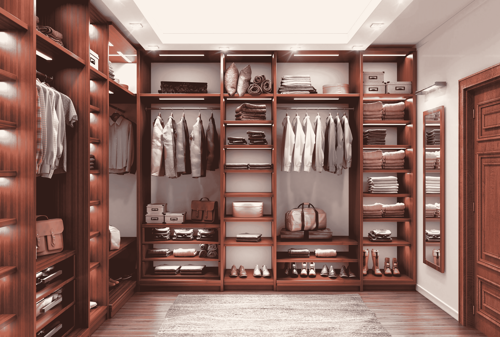

# Python 工厂提供可伸缩、可重用和优雅的代码

> 原文：<https://towardsdatascience.com/python-factories-for-scalable-reusable-and-elegant-code-1358ea06936d?source=collection_archive---------4----------------------->

## 通过将行为(在工厂超类中定义)与对象创建(在子类中)分离，创建灵活、可扩展的代码

缺席 84 /AdobeStock

在现实生活中的工厂里，相同或相似物品的生产不是单独完成的，而是在装配线上进行的。类似地，工厂设计模式允许您创建不依赖于特定产品的软件，而是可以在许多类似的应用程序中重用。工厂模式是著名的 Gof(四人帮)设计模式之一[1]。这是一种创造性的设计模式，它将对象创建封装在一个名为工厂的类中。这种模式通过从系统中分离出如何、何时以及由谁创建对象来提高系统的灵活性[6]。

当您需要创建新类型的对象时，工厂特别有用。如果对象创建分散在整个代码中，那么您将不得不花费时间在代码中找到对象类型起作用的确切位置[2]。用软件工程的术语来说，这意味着你有大量的*技术债务*要处理。在机器学习中尤其如此，如[4]中所解释的。机器学习会因数据依赖性、数据漂移和隐藏的反馈循环而导致巨大的维护成本。最近，通过创建*功能商店*【3】【5】，工厂找到了进入机器学习的途径。特性存储可以是在线的，也可以是离线的，它们的主要目的是在数据转换应用于不同的特性时对其进行抽象，并以这种方式实现更快的开发、更好的协作、高效的模型部署和扩展[7]。

## 1.0 Python 中工厂实现的示例

现在让我们看一个如何在 Python 中使用工厂的具体例子。让我们假设，我们想为一个刚从大学毕业、在一家银行找到第一份工作——定量金融分析师——的儿子打造一个新衣柜。鉴于他精通 Python，他决定实现一个虚拟衣柜索引。我们将帮助他为每套服装分配一个“正式等级”,因为他完全有能力穿着 t 恤和破洞牛仔裤出现在重要会议上。

斯维塔/AdobeStock

如下图所示，虚拟衣柜索引从创建两个抽象的*工厂*开始，一个是鞋类(*鞋类*，另一个是服装(*男装*)。这些是抽象类，它们只用于模板的目的。与 Java 不同，Python 没有固有的抽象类类型。相反，它提供了一个名为 *abc* 的模块，该模块提供了抽象类基础设施。*男装*类的 *colort* 和 *colorb* 变量代表上衣(衬衫、毛衣等)的颜色。)和下(裤)分别。注意我们给鞋子和顶部和底部的颜色分配了一个默认值*“棕色”*(总是一个安全的颜色)。

现在让我们通过定义具体的类 *Boots* 和 *Loafers* 来实现两种类型的鞋。我们从*鞋类*类继承，然后覆盖它的 *shoespecs()* 方法来实现每个具体类的特定动作。

类似地，我们创建了两个具体的类，分别继承自*men swath*、*sweater andurdoropants、*和*buttondownshirtandresspants*。每个具体的类都覆盖了抽象类方法 *clothespecs()* ，以便为每个样式指定细节。请注意， *clothespecs()* 方法接受一个*鞋类*对象，以便将鞋类的颜色与裤子的颜色相匹配。

抽象类*装*下面是一个工厂，提供衣服和鞋子的选择方法，*choose _ clothis()*和 *choose_shoes()* 分别是*、*，并且有一个实例属性， *formality* 。

下面的具体类*light color _ ColdAndCasualDay*继承了抽象类 *Outfit* 并有以下方法:

(A)指定*形式*和*名称*变量的构造函数。*形式*变量继承自*装备*。

(b)类*装备*的*choose _ ways()*方法的覆盖形式，返回一个*SweaterAndCorduroyPants*对象。

(c)一个被覆盖的 *choose_shoes()* 方法的形式，该方法返回一个 *Boots* 对象。

正如我们所看到的，当我们在类的层次结构中向上移动时，事情变得更加具体，而较低级别的类，如*鞋类*、*男装*和*服装*、*是* ***不可知的子类，它们的对象是在哪里创建的，以及它们是如何聚集的*** *。*为下面的*dark color*_*WarmSemiFormalDay*类定义了类似的结构，该类定义了为衣服返回一个*buttondownshirtandresspants*对象，为鞋类返回一个*Loafers*对象的方法。

对比抽象工厂，到目前为止我们看到，*dark color _ WarmSemiFormalDay*和*light color _ ColdAndCasualDay*是*具体* *工厂*。它们如何作为对象的工厂在下面的类 *Look* 的定义中说明。 ***类 Look 是负责对象创建的编排类。*** 下面我们可以看到，它的构造函数以一个*工厂*作为实参。在我们有限的衣柜里，工厂可以是一个*浅色 _ 冷色和浅色*或*深色* _ *暖色半正式*的物件。当我们创建一个类 *Look* 的对象时，工厂的*choose _ ways()*和 choose _ shoes()被调用，它们分别给实例变量 *clo* 和 *sho* 赋值。然后这些变量被用在 ***all-important dress()方法中，该方法将所有东西放在一起，创建完整的外观*** ！由于策略性地放置了对象创建封装和多态，这是可伸缩的、可重用的代码。

在下面的代码片段中，我们可以看到我们的对象创建和对 *dress()* 方法的调用。注意，我们检查两个对象是否相等，或者对象 *g2* 是否大于对象 *g1* 。在上面的 *Look* 类的定义中，我们将 *__eq__* 运算符的输出定义为两个对象的*手续*的相等比较的输出。正如我们已经讨论过的，我们崭露头角的财务分析师对正式风格一无所知，所以我们需要以一种特定的方式告诉他(*正式*评级)，这种方式在正式程度上被认为是等同的。所以，3 是最高*正式*(西装)，0 是无*正式* (T 恤和球鞋)。下面的*等于*运算返回*假*，更大的*运算返回*真*，因为 *g2* 比 *g1* (1)具有更高的*形式*等级(2)。*

最后，在下面的代码片段中，我们导入当前的虚拟衣柜，它作为一个字典存在于一个文本文件中，并将我们创建的两个新外观附加到它，以*服装*对象的名称作为键，以*正式度*作为值。

你可以看到完整的代码，作为一个木星笔记本在我的 github 目录:[https://github.com/theomitsa/Python-factories](https://github.com/theomitsa/Python-factories)

感谢您的阅读！

# 参考

1.  Gamma，e .，Helm，r .，Johnson，和 r .，J. Vlissides，**设计模式:可重用面向对象软件的元素**，Addison-Wesley Professional，1994 年 10 月。
2.  埃凯尔，b .等人， **Python 3 模式、配方和习惯用法**，阅读文档[(电子书)](https://freecomputerbooks.com/Python-3-Patterns-Recipes-and-Idioms.html)
3.  飞，a .，[**特征存储:一个数据科学工厂的组件，**](/feature-stores-components-of-a-data-science-factory-f0f1f73d39b8) 媒介:走向数据科学，2019 年 9 月。
4.  Sculley，d .等人， [**机器学习:技术债务的高息信用卡**](https://research.google/pubs/pub43146/) ，机器学习的软件工程，NIPS 会议研讨会，2014 年。
5.  Taifi， [**ML 特色店:一次休闲之旅 1/3** ，](https://farmi.medium.com/ml-feature-stores-a-casual-tour-fc45a25b446a)中型，2020 年 4 月。
6.  Bishop， **C# 3.0 设计模式**，奥赖利媒体，第 336 页，2007 年。
7.  Hirschtein，a .， [**什么是特征库，为什么它们对扩展数据科学至关重要？**](/what-are-feature-stores-and-why-are-they-critical-for-scaling-data-science-3f9156f7ab4) ，中:走向数据科学，2020 年 4 月。