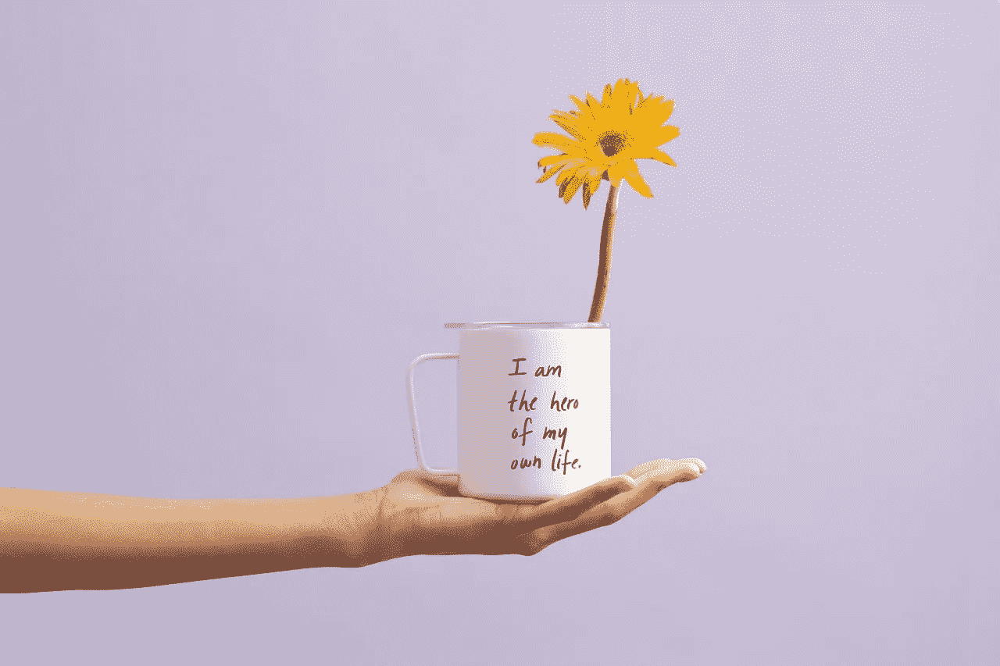
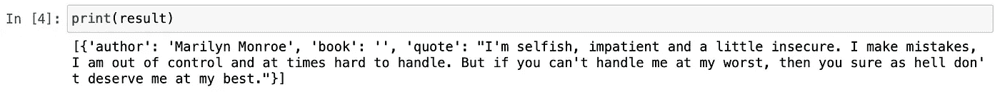
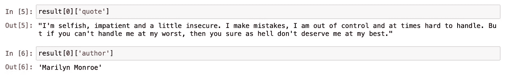
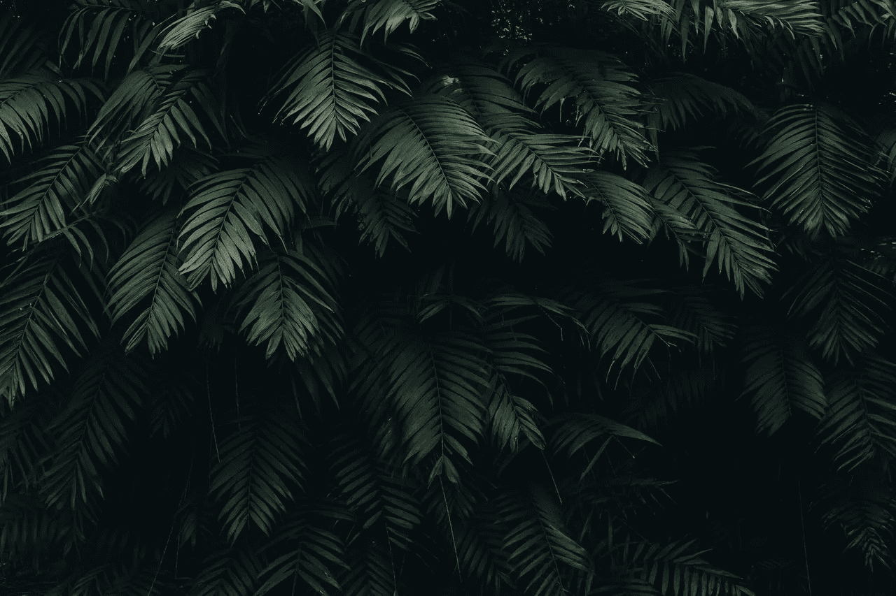
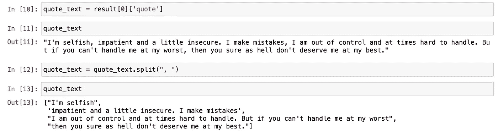
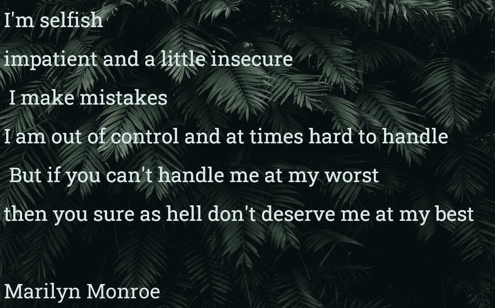

# 艺术 Python:使用 Python 设计个性化报价图像

> 原文：<https://towardsdatascience.com/python-for-art-design-personalized-quote-images-using-python-44ef4d8876d8?source=collection_archive---------26----------------------->

## 通过机器学习自动生成报价图像



图片来自 [Pexels](https://www.pexels.com/photo/yellow-petaled-flower-in-white-mug-2228585/?utm_content=attributionCopyText&utm_medium=referral&utm_source=pexels) 的[思想目录](https://www.pexels.com/@thought-catalog-317580?utm_content=attributionCopyText&utm_medium=referral&utm_source=pexels)

本文将向您展示如何创建报价图像，而不使用任何图形设计软件或程序。还有，你不用花时间找报价；机器会为你选择一个。自动化应用的领域很多，平面设计也是其中之一。随着超级强大的 GPU 的发展，计算机科学家开始使用这种能力来获得乐趣。我相信你已经听说过 OpenAI，以及如何用一句话来描述它就能设计出东西。机器的智能会完成剩下的工作。这个项目叫做 DALL-E。

在今天的文章中，我们将创建一个在图片上添加引号的程序，我们所要做的就是选择一张图片并选择一个关键字。如果你准备好了，让我们开始吧！

## 目录

*   ***第一步——库***
*   ***第二步—报价生成***
*   ***步骤 3 —选择一幅图像***
*   ***步骤 4 —在图像上渲染报价***
*   ***最后一步——导出结果***

# 步骤 1 —库

首先，让我们谈谈图书馆。我们将在这个项目中使用两个主要的库，它们被称为: *Pillow 和*Quote。Pillow 是一个知名的图像编辑/处理库。Quote 是 Goodreads Quote API 的 python 包装器。以下是这两个库的官方文档链接:

*   [枕头](https://pypi.org/project/Pillow/)
*   [引用](https://pypi.org/project/quote/)

那么，我们如何安装它们呢？简单。

```
pip install pillow quote
```

我们准备好了包裹。现在，让我们开始编程。我将使用 Jupyter 笔记本作为我的编码环境。更容易在步骤内来回移动。

如果你想进一步了解枕头库和一些实际应用，这里有一篇我为你找到的颇有见地的文章:[用 Python 进行图像处理](/image-processing-with-python-5b35320a4f3c)作者是[詹姆斯·布里格斯](https://medium.com/u/b9d77a4ca1d1?source=post_page-----44ef4d8876d8--------------------------------)。

# 第 2 步—报价生成

让我们从将报价模块导入我们的程序开始。

```
from quote import quote
```

我们将使用报价模块从 API 获取随机报价。我们甚至可以传递关键字；这将返回符合我们请求的报价选择。决定权在你。

我会把我的关键词设为生活。让我们看看会得到什么样的报价。顺便说一下，limit 参数是我们选择想要得到多少报价的地方。

```
keyword = 'Life'result = quote(keyword, limit=1)print(result)
```



图片由作者提供。

如您所见，返回的列表项是一个字典。我们有几个键和值。关键词是作者、书和引用。我们可以分别访问它们，如下所示:

```
result[0]['quote']result[0]['author']
```



图片作者。

我们的报价准备好了！是时候选择一张我们想要添加引用的图片了。

# 步骤 3 —选择一幅图像

这将是最容易的一步。我们要做的就是选择一个图像。你可以在 Pexel 上找到很棒的股票图片。确保选择一张合适的图片。否则，对于图像来说，文本可能看起来很大。我在这个项目中使用的价值观可能不是对每个人都是最好的。请随意相应地调整它们。

这是我挑选的图片，一个干净的背景图片:



照片由 [Pexels](https://www.pexels.com/photo/green-leaves-1072179/?utm_content=attributionCopyText&utm_medium=referral&utm_source=pexels) 的 [Cátia Matos](https://www.pexels.com/@catiamatos?utm_content=attributionCopyText&utm_medium=referral&utm_source=pexels) 拍摄

# 第 4 步—在图像上呈现报价

这一步我们会做很多事情。对于这一步，我们必须从之前安装的 Pillow 库中导入几个模块。

```
from PIL import Image, ImageFont, ImageDraw
```

## 背景图像

酷！现在让我们继续导入我们选择的图像。ImageDraw 方法将图像转换为可编辑的格式。

```
bg_image = Image.open("image_leaves.jpg")quote_image = ImageDraw.Draw(bg_image)
```

## 文本属性

现在，让我们定义想要使用的文本字体。我用 Roboto 字体，字体大小为 52。我已经从谷歌字体网站下载了这种字体。我们还将报价和作者值赋给新的变量。

```
quote_font = ImageFont.truetype('Roboto_Slab/RobotoSlab-VariableFont_wght.ttf', 52)quote_text = result[0]['quote']
```

## 图像上的文本

棘手的部分来了，就是将引用的文本放入图像中。因为完整的报价在一行中，所以我们需要把它分成不同的行来更好地工作。我尝试在不使用任何库的情况下进行这种拆分，下面是我所做的。

要做的第一件事是用逗号分隔完整的引号。但是你看下面，有一条线还是那么长。



然后，我决定运行一个 for 循环来按句点进行拆分。在进行拆分的同时，另一个循环是在图像上呈现文本。所以 2 合 1 解决方案适合长行和逐行呈现文本。Offset 用于在行之间添加一些空白像素。

```
offset = 0
for i in quote_text:
    i = i.split(".")
    for ix in i:
        quote_image.text((15,15+offset), ix, (216, 233, 237), font=quote_font)
        offset += 100
```

让我带您看一下这段代码的核心部分，它将文本呈现在图像上:

*   (15，15+offset):文本开始的 x 和 y 点。在枕头中，轴系统是笛卡尔轴系统。所以，左上角是(0，0)点。
*   ix:是文本行。
*   (216，233，237):文本的颜色。如果想改变每行的文本颜色，也可以给这些可更新的变量。
*   font=quote_font:传递我们之前导入的字体信息。

最后，让我们在底部加上作者的名字。这条线不在循环内。

```
quote_image.text((15,15+offset), quote_author, (216, 233, 237), font=quote_font)
```

# 最后一步—导出结果

最后一步来了！你准备好看到结果了吗？让我向你展示它的样子:

```
bg_image.save("marilyn_quote_on_image.jpg")
```



完美！我觉得这个很有意思！我们已经创建了一个程序，可以生成个性化的报价图像，而无需进行任何报价搜索或使用图形设计软件。所有这些都是由几行代码组成的。感谢 Goodreads 的报价 API 和 Pillow python 图像处理库。在这个项目中，我演示了一个例子；您甚至可以在几秒钟内自动创建数百个报价图像。让我知道你的想法！

我希望你今天学到了新东西。如果您喜欢这篇文章，请随意查看我的其他动手编程文章。快乐编码，保持创造力！

> 我们来连线。查看我的[博客](https://medium.com/@lifexplorer)和 [youtube](https://www.youtube.com/watch?v=7I9eg3G1mnE&list=PLudLCLvpppAJ7OsgrQxqY-n8Ok9Nt-Rtr) 来获得灵感。谢谢你，

## 为您的艺术项目提供 Python 实践

[](/building-an-image-color-analyzer-using-python-12de6b0acf74) [## 使用 Python 构建图像颜色分析器

### 使用 Scikit-learn 和 OpenCV 的机器学习项目

towardsdatascience.com](/building-an-image-color-analyzer-using-python-12de6b0acf74) [](/python-for-art-fast-neural-style-transfer-using-tensorflow-2-d5e7662061be) [## Python for Art 使用 TensorFlow 2 进行快速神经风格转换

### 用神经网络在几毫秒内创建迷人的照片

towardsdatascience.com](/python-for-art-fast-neural-style-transfer-using-tensorflow-2-d5e7662061be)