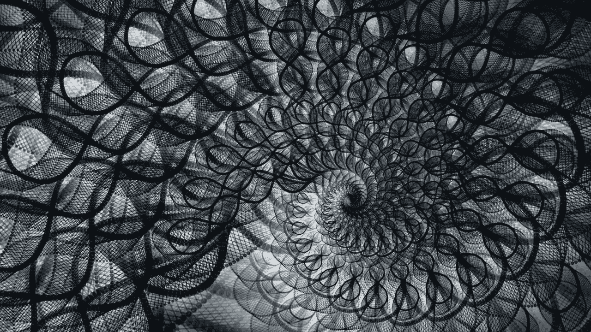
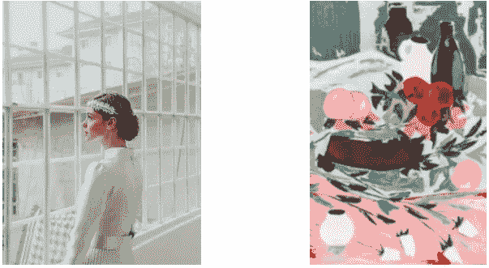
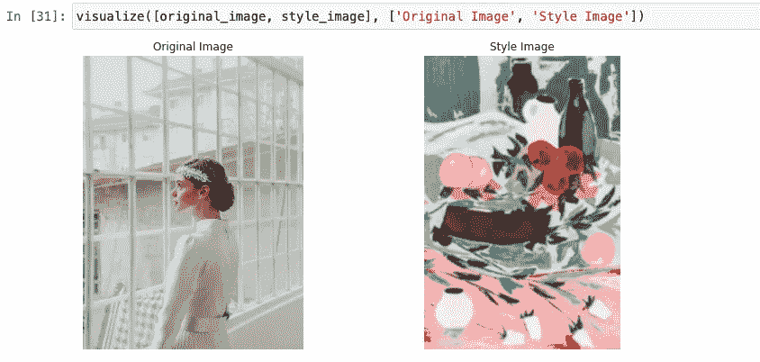
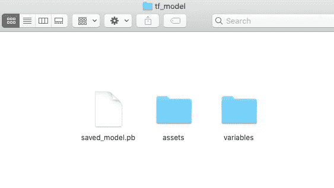
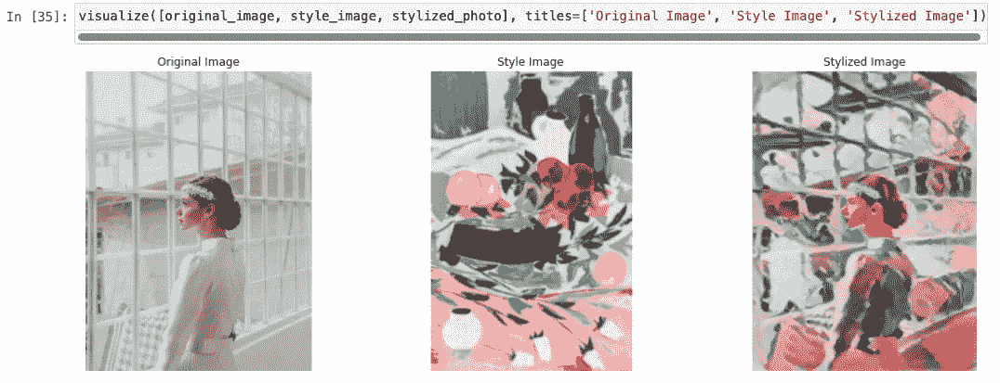
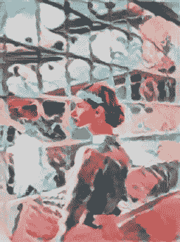

# Python for Art:使用 TensorFlow 2 的快速神经风格转换

> 原文：<https://towardsdatascience.com/python-for-art-fast-neural-style-transfer-using-tensorflow-2-d5e7662061be?source=collection_archive---------7----------------------->

## 用神经网络在几毫秒内创建迷人的照片



来自 [Pexels](https://www.pexels.com/photo/cloth-with-artistic-design-3573555/?utm_content=attributionCopyText&utm_medium=referral&utm_source=pexels) 的 [Frank Cone](https://www.pexels.com/@frank-cone-140140?utm_content=attributionCopyText&utm_medium=referral&utm_source=pexels) 摄影

在这篇文章中，我将向你展示如何用快速神经风格转换来使你的照片风格化。神经风格转移是一个很好的方法，可以在几秒钟内将你的普通快照变成艺术品。感谢我们在 TensorFlow 的朋友，他们为我们创建并训练了模块，以便我们可以快速应用神经网络。阅读本实践教程后，您将有一些在项目中使用 TensorFlow 模块的实践。如果你准备好了，让我们开始吧！

## 目录

*   **简介**
*   **步骤 1 —库**
*   **步骤 2 —功能**
*   **步骤 3 —原稿和样式图像**
*   **步骤 4 —任意图像风格化**
*   **最后一步——导出结果**

# 介绍

先从理解他们话中的张量流和神经风格转移开始。然后我们将进入应用部分。

## 张量流

*“tensor flow 是机器学习的端到端开源平台。它有一个全面、灵活的工具、库和社区资源的生态系统，让研究人员推动 ML 的最新发展，开发人员轻松构建和部署 ML 驱动的应用程序。”*
参考:【https://www.tensorflow.org】T21

## 神经类型转移

*“神经样式转移是一种优化技术，用于获取两个图像—一个内容图像和一个样式参考图像(如著名画家的作品)—并将它们混合在一起，以便输出图像看起来像内容图像，但以样式参考图像的样式“绘制”*
参考:[https://www . tensor flow . org/tutorials/generative/style _ transfer](https://www.tensorflow.org/tutorials/generative/style_transfer)

在我们继续之前，我想分享一篇由博士研究员 Matthew Stewart 写的关于神经 styler 转移的文章。你将对神经类型转移的工作原理有一个很好的幕后理解。

[](/neural-style-transfer-and-visualization-of-convolutional-networks-7362f6cf4b9b) [## 卷积网络的神经类型转移和可视化

### 使用迁移学习在 10 分钟内创建专业外观的艺术品。

towardsdatascience.com](/neural-style-transfer-and-visualization-of-convolutional-networks-7362f6cf4b9b) 

# 步骤 1 —库

首先，我们必须为这个项目安装几个库。这些库可以列举如下:Matplotlib、Numpy、TensorFlow、TensorFlow Hub 和 PIL。

*   Matplotlib 用于可视化我们 Jupyter 笔记本中的图像。如果我们想记录这个过程，它还允许我们保存图形。
*   *Numpy* 是一个需要安装的科学库。它是在后台工作的顶级库之一。因为图像是由像素组成的，并且是以多维数组的形式收集的，所以 Numpy 库可以帮助我们处理这种数组。
*   *TensorFlow* 是由谷歌开发者和软件工程师开发的机器学习生态系统。许多大公司都在使用 TensorFlow 开展业务。
*   *TensorFlow Hub* 是一个训练有素的机器学习模型库，可随时进行微调，并可部署在任何地方。它是张量流伞的一部分。
*   *PIL* 是一个图像处理库。非常有用的库，尤其是在从事计算机视觉项目时。它是作为枕头安装的。导出最终结果时，我们将使用 PIL。

我们可以使用 python 包管理器 pip 在一行中安装所有这些包和库。在您的终端窗口中运行以下行:

```
pip install matplotlib numpy TensorFlow tensorflow_hub pillow
```

安装过程结束后，我们可以继续创建新的 Jupyter 笔记本。然后将它们导入程序中。

```
from matplotlib import gridspec
import matplotlib.pylab as plt
import numpy as np
import tensorflow as tf
import tensorflow_hub as tf_hub
import PIL
```

# 第 2 步—功能

在这一步，我们将定义两个函数。我将在下面添加每个功能的简短描述。

## **加载图像**

在这个函数中，我们将图像解码成三个不同的通道。这就像进入事物的像素级。然后我们裁剪图像的中心。最后，我们正在调整图像的大小，以便我们的内容和样式图像在大小上匹配。

```
def load_image(image_path, image_size=(512, 256)):
    img = tf.io.decode_image(
      tf.io.read_file(image_path),
      channels=3, dtype=tf.float32)[tf.newaxis, ...]
    img = tf.image.resize(img, image_size, preserve_aspect_ratio=True)
    return img
```

## 可视化图像

在这个函数中，正如你从它的名字可以理解的那样，我们以网格的顺序来可视化这些图。

```
def visualize(images, titles=('',)):
    noi = len(images)
    image_sizes = [image.shape[1] for image in images]
    w = (image_sizes[0] * 6) // 320
    plt.figure(figsize=(w  * noi, w))
    grid_look = gridspec.GridSpec(1, noi, width_ratios=image_sizes)

    for i in range(noi):
        plt.subplot(grid_look[i])
        plt.imshow(images[i][0], aspect='equal')
        plt.axis('off')
        plt.title(titles[i])
        plt.savefig("final.jpg") plt.show()
```

# 步骤 3-原始和样式图像

这将是一个简单的步骤。我们将选取两幅图像，然后将它们导入我们的程序。我们将使用之前定义的 *load_image* 函数来导入图像。

以下是我选择的图片的原始版本:



**左**:来自 [Pexels](https://www.pexels.com/photo/gentle-woman-behind-shabby-window-4042112/?utm_content=attributionCopyText&utm_medium=referral&utm_source=pexels) 的 [Furknsaglam](https://www.pexels.com/@furknsaglam-1596977?utm_content=attributionCopyText&utm_medium=referral&utm_source=pexels) 拍摄的照片。**右**:照片由 [Pexels](https://www.pexels.com/photo/teal-and-pink-cherry-print-garment-2086361/?utm_content=attributionCopyText&utm_medium=referral&utm_source=pexels) 的[埃伯哈德](https://www.pexels.com/@eberhardgross?utm_content=attributionCopyText&utm_medium=referral&utm_source=pexels)拍摄

原始图像(左图)是我们想要风格化的主要图像。样式图像(右图)是我们在转换样式时将用作参考的图像。

```
original_image = load_image("original_image.jpg")style_image = load_image("style_image.jpg")
```

我们已经将图像加载到程序中。现在，让我们用我们的风格图像来训练我们的神经网络模型。我们将使用 *avg_pool* 方法。

```
style_image = tf.nn.avg_pool(style_image, ksize=[3,3], strides=[1,1], padding='VALID')visualize([original_image, style_image], ['Original Image', 'Style Image'])
```



作者图片

# 步骤 4 —任意图像风格化

我们将定义并加载我们希望在此步骤中使用的 TensorFlow hub 模型。我们将使用的模型被称为任意图像风格化。加载模型有不同的方式，一种是通过 url 加载，另一种是下载模型文件夹。

对于这个项目，我更喜欢下载模型并从我的本地驱动器加载它。这样，程序就不必每次运行代码时都下载模型。

```
stylize_model = tf_hub.load('tf_model')
```

tf_model 是下载的模型的文件夹名称。[这里的](https://tfhub.dev/google/magenta/arbitrary-image-stylization-v1-256/2)是*任意图像风格化*模型的下载链接。该文件夹将如下所示:



作者图片

现在，让我们使用我们的原始和样式图像运行模型。

```
results = stylize_model(tf.constant(original_image), tf.constant(style_image))stylized_photo = results[0]
```

# 最后一步—导出结果

快到了！在最后一步中，我们将可视化最终结果，以查看快照之前和之后的情况。我们将调用在函数步骤中定义的*可视化*函数。

```
visualize([original_image, style_image, stylized_image], titles=['Original Image', 'Style Image', 'Stylized Image'])
```



作者图片

这难道不令人着迷吗？正如你所看到的，我们在原始镜头中的角色和这幅画融合得非常好。神经风格的转换无疑赋予了照片更多的深度和情感。让我知道你的想法。

为什么不与世界分享这个惊人的作品。为了与我们的朋友分享最终的作品，我会告诉你如何导出它。

以下是导出编辑过的图像的功能:

```
def export_image(tf_img):
    tf_img = tf_img*255
    tf_img = np.array(tf_img, dtype=np.uint8)
    if np.ndim(tf_img)>3:
        assert tf_img.shape[0] == 1
        img = tf_img[0]
    return PIL.Image.fromarray(img)
```

现在，让我们调用 *export_image* 函数。

```
export_image(stylized_photo).save("my_stylized_photo.png")
```



作者图片

## 结论

恭喜你。我们使用 TensorFlow 和神经网络创建了一个独特的艺术品。编程不仅仅是解决问题。我们也可以把它用于像这样迷人的艺术项目。这些项目对我练习新技能帮助很大。在构建机器学习/深度学习项目方面，TensorFlow 是其中的佼佼者。

希望你喜欢读这篇文章，并在今天学到一些新的东西。从事动手编程项目是提高编码技能的最佳方式。如果您在执行代码时有任何问题，请随时[联系我](https://sonsuzdesign.blog/contact)。

> 我们来连线。查看我的[博客](https://medium.com/@lifexplorer)和 [youtube](https://www.youtube.com/watch?v=7I9eg3G1mnE&list=PLudLCLvpppAJ7OsgrQxqY-n8Ok9Nt-Rtr) 来获得灵感。谢谢你，

## 面向您的动手机器学习项目

*   [使用 Python 构建语音情感识别器](/building-a-speech-emotion-recognizer-using-python-4c1c7c89d713)
*   [用代码](/turn-your-photos-into-artistic-sketches-with-code-6694522fa349)把你的照片变成艺术草图