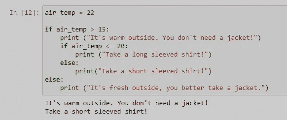

# 面向初学者的 Python 控制流

> 原文：<https://towardsdatascience.com/python-for-beginners-control-flow-b086713ba6bf?source=collection_archive---------27----------------------->

## 你想学习一些关于 fi-else 条件或循环的知识吗？不要再看了！

最近，我开始撰写面向 Python 编程初学者的系列文章。我们已经讨论了与开始您的 Python 之旅相关的主题，上次我们与 T2 操作符一起工作。今天我们将继续我们的旅程，并解决控制流的话题。

或者像 Jake VanderPlas 在“[**Python**](https://www.oreilly.com/library/view/a-whirlwind-tour/9781492037859/)的旋风之旅”中所说:“ ***控制流是编程中真正遇到困难的地方。***

我决定把这篇文章分成几部分，以便于学习。这些部分如下:

*   介绍
*   条件句或条件语句
*   循环
    -用于
    -而
*   带中断和继续的控制循环
    -中断
    -继续
*   结论

快乐阅读！:)

照片由[菲利普·姆罗兹](https://unsplash.com/@mroz?utm_source=medium&utm_medium=referral)在 [Unsplash](https://unsplash.com?utm_source=medium&utm_medium=referral) 上拍摄

# 介绍

首先，什么是控制流？简单来说，它是执行某些操作的顺序。我们举一个简单的例子，说我们要测量外面的空气温度。我们需要做什么？首先我们拿着温度计，然后我们打开门，我们走到外面，我们关上门，我们在阴影中找到一个地方，我们测量温度，我们写下来，等等。

类似的，在编程中，如果我们要做一个特定的任务或者操作，就需要做简单的更小的步骤。这些步骤可以例如包括决策或给定次数的任务重复。

假设我们想要一个脚本，它根据某种标准以不同的方式执行，例如，如果我们测量的空气温度是 3°C，它会打印出“外面很冷”，但如果是 21°C，它会打印出“外面很热”。在这种情况下，检查一些条件，并根据条件执行一个任务(打印出某个语句)。

或者，假设我们想将每个工作日测得的气温从摄氏度转换为华氏度。然后，我们需要一个脚本，它获取每个工作日的测量温度，并执行以下公式:

> **( C * 1.8) + 32 = F**

这意味着我们做一个相似的任务已知的次数，准确地说是 7 次。我们取 7 个数，每个数乘以 1.8，再加上 32。

现在让我们更详细地看一些例子，并提供代码。🙂

# 条件句或条件语句

条件语句，或者通常称为 ***if-then*** 语句，允许我们根据某种条件(布尔条件)执行一段代码。
Python 中的条件语句有:

*   简单 if
*   如果-否则
*   嵌套 if
*   if-elif-else

应用条件语句的关键字(符号)是 i **f、elif、else 和冒号(:)**。重要的是在冒号后缩进新的一行。

## 简单的 if 语句:

让我们想象一下最简单的情况。

按作者

如果 **if** 语句表达式的计算结果为 **True** ，则执行该语句后面的缩进代码。如果表达式评估为 **False** ，则跳过 **if** 语句后的缩进代码，程序执行与 **if** 语句缩进相同级别的下一行代码。

我们声明变量 *x* 为 10。我们检查 *x* 是否大于 5，因为该语句为**真** (10 > 5)，所以 **print** 命令得到执行，并且语句“ **X 大于 5！**"被打印出来。

这个说法不成立的情况呢？然后，这个脚本将什么也不做。

按作者

如果我们想要一个脚本在语句为 **False** 时做一些事情，我们需要稍微修改一下。

## if-else 语句

如上所述，这个语句允许我们给脚本增加第二种可能性，当条件为**假**时该怎么办。让我们想象一下这个案例。

按作者

如果表达式计算结果为**真**，则执行 **if** 语句的缩进代码。紧跟在 **else** 之后的缩进代码仅在表达式评估为 **False** 时执行**。要标记 else 块的结尾，代码必须**非预期**到与起始 if 行相同的级别。**

按作者

上面的代码检查输入的温度是否在 15 以上，如果语句为真，它打印出我们不需要夹克，但是如果空气温度在 15 以下，脚本建议带一件夹克。

现在我们知道，如果气温超过 15 摄氏度，我们就不需要夹克，但应该穿什么衬衫，短袖还是长袖？为了用我们的脚本回答这个问题，我们需要使用一个嵌套的 if 语句。

## 嵌套 if 语句

基本上这是一个 if 语句放在另一个 if 语句中。让我们把它形象化，以便更好地理解。

按作者

像以前一样，代码检查空气温度是否高于 15°C，如果语句为**真**，则表明我们不需要夹克。接下来，它会检查是否低于或等于 20 摄氏度，如果是**真的**，它会建议穿长袖衬衫。如果那是**假**，那么它比 20°C 暖和，它建议一件短袖衬衫。

按作者

这个例子也可以用一个 **if-elif-else** 语句来解决。让我们看看怎么做。

## if-elif-else 语句

**elif** 关键字可以被认为是 ***else if*** ，如果我们想要在 if 和 else 之间进行更清晰的划分，我们就使用它。Python **elif** 语句允许在初始 if 语句之后继续执行检查。一个 **elif** 语句不同于 else 语句，因为提供了另一个表达式来检查，就像最初的 if 语句一样。

按作者

如果表达式**为真**，则执行 **elif** 后面的缩进代码。如果表达式评估为 **False** ，代码可以继续执行可选的 else 语句。在初始 **if** 之后，可以使用多个 **elif** 语句来执行一系列检查。一旦 **elif** 表达式评估为**真**，则不再执行 **elif** 或 **else** 语句。

按作者

代码首先检查**是否**空气温度低于 15°C，如果**为真**，则建议带一件夹克。如果**为假**，则检查**是否低于或等于 20°C，如果**为真**，则建议穿长袖衬衫。如果两个语句都是**假**，则执行**否则**语句，并建议穿短袖衬衫。**

# 环

或通常称为重复语句，用于重复指令块。在 Python 中，有两种类型的循环:

*   对于循环
*   while 循环

## 对于循环

**For** 循环在我们迭代一系列数据时使用，如列表、元组、字典、字符串等。因为我们知道一个列表或字符串中有多少个元素，所以当我们迭代已知(或期望)次数时，就使用它们。应用 for 循环的关键字是 ***for*** 和 中的***。***

按作者

这个可视化展示了一个简单的循环工作流的**。我们初始化一个序列(列表、字符串、元组……)，循环检查该项是否是最后一项，如果**为真**，循环停止，如果**为假**，代码被执行，循环在序列中的下一项重复。直到代码执行完最后一项，循环才会结束。**

让我们看一个例子。我们将用华氏温度计算一周的摄氏温度测量值。因此，我们声明一个 python **字典**，它将工作日保存为**键**，将测得的每日气温保存为**值**。

按作者

当我们循环遍历字典时，我们使用。items()方法，该方法返回 k(键)和 v(值)。接下来，我们创建一个名为 temp_f 的新变量，它保存以 f 为单位的计算温度。这个方法将给定的变量转换成字符串，并允许我们在句子中使用它。我们必须在句子中想要的位置使用花括号{}。

> "在{}日，气温是华氏{:.2f} . "

在句子(字符串)之后，注意引号，我们应用。format()方法。我们在句子中提供了想要打印出来的变量，在本例中，是 k(工作日)和 temp_f(计算出的华氏温度)。“ **:.2f** ”表示我们将计算出的值(float)转换成一个字符串，小数点后有两位小数。[查看官方网站了解更多信息](https://docs.python.org/3/tutorial/inputoutput.html)。

> 。格式(k，temp_f)

关于循环的伟大之处在于，我们需要这样做一次，但是循环将在每个工作日重复并执行想要的任务。

## while 循环

在 Python 中， **while** 循环用于迭代，直到满足某个条件。基本上，只要条件保持为真，循环就会执行多次。当 if 变为 False 时，循环停止。让我们用一个简单的可视化来阐明这个说法。

按作者

一个简单的 while 循环如下工作。参数被求值，根据表达式，代码被执行，直到参数被求值为真。当它变为 False 时，循环停止。

**非常重要:在 while 循环的每一步，我们都需要改变参数，以避免无限循环。**

让我们看一个计算天数的例子。

按作者

我们从第一天开始。检查参数(变量 day 的值)是否小于或等于 8，如果为真，则打印输出。打印之后，我们将变量 day 的值加 1，以避免无限循环。如果我们没有在每个循环中增加一天，变量 day 将保持等于 1，因此小于 8，循环将是无限的。

# 用中断和继续控制循环

**break** 和 **continue** 语句帮助我们微调循环及其执行。

*   **break** 语句完全跳出循环
*   **continue** 语句跳过当前循环的剩余部分，转到下一次迭代

它们都可以在 for 和 while 循环中使用。

## break 语句

按作者

**break** 语句用于我们想要**将**从**循环**中断开的情况，即使条件没有变为 **False** 或者我们已经迭代了整个序列。同样，如果使用了**中断**，则**任何后续的 else 程序块都不会被执行**。

让我们举一个简单的例子，看看我们一周内的气温测量值。假设我们想要停止打印温度值，如果空气温度等于或高于 18°c。

代码打印出温度值，当我们到达星期五，温度为 18.9°C 时，循环中断并停止。

按作者

代码打印出温度值，当我们到达星期五，温度为 18.9°C 时，循环中断并停止。

## 连续语句

按作者

**继续**语句有点类似于**中断**语句，但是**不是中断循环，而是开始下一次迭代**。左边的形象化帮助我们获得更清晰的理解。

假设有这样一种情况，我们希望打印出温度，但不包括低于 15°c 的温度。这意味着，我们打印出除星期四以外的所有温度。对于这样的任务，我们将使用 continue 语句。因此，我们遍历字典，当温度低于 15°C 时，continue 语句被激活，它避免执行 print 语句，而是跳到下一次迭代。让我们来看看代码。

按作者

continue 语句非常适合于丢弃或排除任务，我们的目标是避免一个值、一组值或某种情况。

# 结论

控制流是与编程相关的最重要的主题之一，它当然不同于有用的代码和无用的代码。从简单的数据探索到“最先进的”神经网络，我们到处都在处理某种控制流。

有许多与控制流相关的例子，但是通过这些简单的例子，我们看到了 Python 提供的可能性。我的想法是让例子尽可能简单。最好总是从简单的开始，然后朝着更复杂的例子努力。

随着我们继续我们的旅程，我们将会遇到更复杂的例子，并看到更多有趣的与控制流相关的方法以及我们到目前为止学到的所有东西。

对于这篇文章或我在[媒体](https://medium.com/@Karlo_Leskovar)上的其他文章有任何问题或建议，欢迎通过 [LinkedIn](https://www.linkedin.com/mwlite/in/karlo-leskovar-a8612b105) 联系我。

感谢您抽出时间，干杯！🙂