# 初学 Python 熊猫

> 原文：<https://towardsdatascience.com/python-for-beginners-pandas-e396c8364af1?source=collection_archive---------26----------------------->

## 友好的熊猫帮助我们处理电子表格数据

在上一篇[文章中，我们看到了 Numpy](/numpy-for-beginners-ba9ca0bba441) 在处理大量数字数据时如何让我们的生活变得更加轻松。但是有时候，还会涉及到其他类型的数据，而且 Numpy 并不总是最好的解决方案。在这样的情况下， [**熊猫**](https://pandas.pydata.org/pandas-docs/stable/index.html#) 就派上了用场。它有许多应用的可能性，但我的首选情况是读取文件，而不仅仅是数字，即。csv 或。xlsx 文件，包含某种观察结果(数字数据)，也包含关于这些观察结果的文本信息或元数据。

这篇文章的结构如下:

*   介绍
*   熊猫系列和熊猫数据框
*   读取数据
*   检查数据
*   选择数据
*   简单的情节
*   结论

享受阅读吧！🙂

照片由[翻滚 926](https://unsplash.com/@billow926?utm_source=medium&utm_medium=referral) 上的 [Unsplash](https://unsplash.com?utm_source=medium&utm_medium=referral)

# 介绍

熊猫是什么？Pandas 是一个基于 Numpy 的非常受欢迎的库，用于处理表格数据、数据操作和分析。Pandas 最好的一点可能是它将数据存储为包含行和列的 Python 对象，与存储在 Excel 文件中的数据非常相似。此外，这样我们可以很容易地可视化我们的数据，使我们的工作比处理列表或字典形式的数据容易得多。此外，优于 Numpy 的优点是它处理多种数据类型(即字符串)，而不仅仅是数字数据，尽管我需要提到缺点，这使它与 Numpy 相比速度较慢。

## 熊猫怎么装？

嗯，如果使用 Anaconda，Pandas 是预装在基本环境中的。然而，通常情况下，为您的新项目创建新环境是一个好的实践。要在新环境中安装 Pandas，我们需要激活该环境，然后输入:

> 康达安装熊猫

如果正在使用 pip，可以通过键入以下命令来安装 Pandas:

> pip 安装熊猫

## 如何进口熊猫？

当导入某些库时，包括 Pandas，我们遵循一个惯例，基本上这意味着我们使用已建立的库的缩写。对于熊猫，我们用“ **pd** ”。

> 进口熊猫作为 pd

# 熊猫系列和熊猫数据框

在我们开始讨论 Pandas 的一些工具之前，我们需要提到 Pandas 用来存储数据的两个数据结构，Pandas 系列和 Pandas 数据框架。可以把 Pandas 系列想象成一个有 1 列的 Excel 电子表格，外加一个*索引*列，或者更好，如果你熟悉 Numpy，可以想象成一个一维数组。

想象在一个点位置的每日气象观测，例如两周的风速。让我们看一个例子。

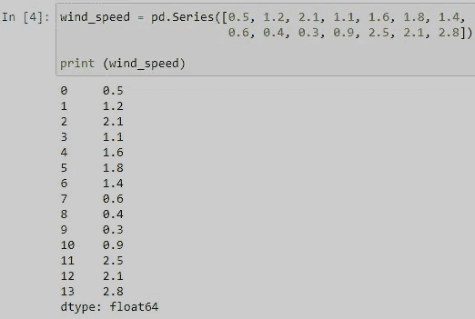

作者图片

我们使用 **pd。Series()** 命令，并提供一个列表，在本例中是一个长度为 14 的 floats 列表。打印出来后，我们还会得到序列中每个元素的索引。我们还可以从一维 Numpy 数组创建一个序列。为了提高效率，我将使用同样的风速表。

尝试打印出新创建的**系列**，并与之前的结果进行比较。

你现在可能会想，如果我们有多个**系列**会怎么样，如果我们也有降水测量，那么 Pandas 会把我们的数据存储在**数据帧**中。我很确定，你明白了，一个**数据帧**只是多个**系列**的容器。可以把它想象成一个包含多个列和一个索引列的 Excel 电子表格，或者一个 N 维的 Numpy 数组。让我们看一个例子。

为了创建数据帧，我们使用 **pd。DataFrame()** 命令，并提供一个字典，其中键表示我们的列名，值是之前创建的 Numpy 数组(我们的数据)。

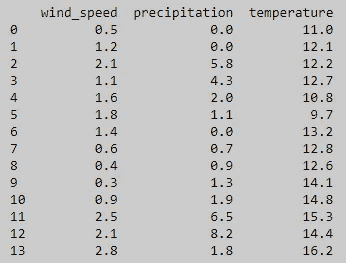

作者图片

看起来有点类似于 N 维数组。每个 Pandas DataFrame 由以下组件组成:**索引、列和数据(值)**。**索引**是每**行**的**标签**(“名称”)，而每**列**也有它们的标签(“名称”)。索引总是从**零(0)** 开始，直到 *n-1* ，其中 *n* 是行数。

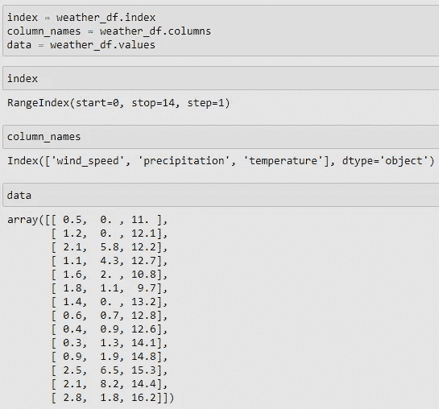

作者图片

这个数据帧只包含浮点(数字)，但是允许任何数据类型(整数、字符串、布尔值..)，尽管如果在一个列中组合多种数据类型，必须小心。

为了避免意外行为，我们还可以如下指定列数据类型:

也可以使用 **pd。Series()** 命令用一个字典，如果你想命名创建的系列。

创建系列和数据框有更多的选择和可能性，你可以在[官方熊猫网站](https://pandas.pydata.org/docs/user_guide/index.html#user-guide)上找到。但是在处理数据科学或数据分析任务时，我们经常需要处理大型数据集，这些数据集以逗号分隔值的形式存储。csv)或 Excel 电子表格(。xlsx)。让我们看看如何将这样的文件读入熊猫数据帧。

# 读取数据

要读取一个. csv 文件，我们使用 **pd.read_csv()** 命令。当文件被正确格式化后，Pandas 会计算出分隔符、列名、数据类型等。都存在于我们的数据中。所有提到的都可以被提供，并且更多的参数可以被添加到 **pd.read_csv()** ，以扩大读取不同格式文件的可能性。此外，为每个(或一些)列提供 dtype 参数，显著提高了读取文件的速度，但也大大降低了内存使用，在这篇[精彩文章](/please-stop-doing-these-5-things-in-pandas-9fbabea897aa)中可以找到更多信息。

为了了解 **pd.read_csv()** 如何工作，我创建了一个数据集，其中包含 2018 年全年的一些气象观测数据，我们将把这些数据作为熊猫数据帧读入并进行处理。为了可视化新创建的数据帧，Pandas 提供了一些方便的方法， **df.head()** 和 **df.tail()** (df 代表我们的数据帧的名称，在我们的例子中是 weather_data)。

在这里，有几件事情是重要的:我们需要确保我们的 test_data 文件在 s **ame 文件夹中，就像我们的 Jupyter notebook** (或者。py 文件),其次我们要正确拼写文件的名称，并提供扩展名**。csv** 。

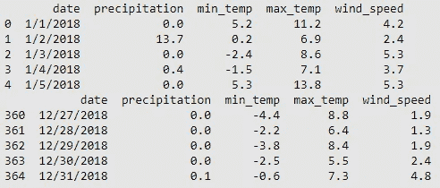

作者图片

**。head()** 方法打印出前 5 行(默认情况下，我们可以通过在括号中输入任意整数来改变)，而**。tail()** 打印出最后 5 行(也是默认的)。

以与…相同的方式。csv 文件，我们也可以读取 Excel 文件。

> weather _ excel = PD . read _ excel(" test _ data . xlsx ")

有时会出现错误，“ ***XLRDError:Excel xlsx 文件；不支持*** ”，那么确保将 **openpyxl** 库安装到您选择的环境中，并使用命令:

> weather _ excel = PD . read _ excel(" test _ data . xlsx "，engine="openpyxl ")

我使用了一个读取逗号分隔值文件或 Excel 文件的基本示例，但是请确保您检查了官方文档([)。csv 此处为](https://pandas.pydata.org/docs/reference/api/pandas.read_csv.html)，而[为。xlsx 这里](https://pandas.pydata.org/docs/reference/api/pandas.read_excel.html))来找出我们可以用这两种方法使用的所有论点。另外，你可以看看我以前的一篇关于[用熊猫](https://medium.com/analytics-vidhya/how-to-extract-time-series-data-from-tabular-strings-e5b2d83fc711)打开和处理格式不太好的文件的文章。

# 检查数据

在我们成功读取数据后，我们需要更仔细地查看我们的数据帧。我们已经打印了前 5 行和后 5 行，但是剩下的呢？类似地，检查数据帧的形状总是一个好的做法，就像我们对 Numpy ndarrays 所做的那样。因此，我们使用 df.shape 方法，该方法返回数据帧的行数和列数。

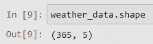

作者图片

数据帧有 365 行和 5 列，因为 2018 年有 365 天，我们有每天的观察值。此外，我们有一个日期栏，和 4 个不同的观察。

通过使用 [df.info](http://df.info) ()方法，我们可以获得关于数据帧的更多信息，该方法产生列的长度、数量和数据类型，以及内存中的大小。

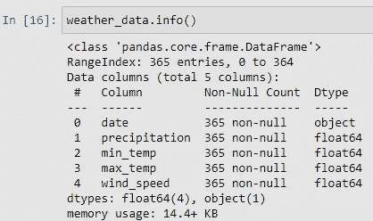

作者图片

在水文(和气象)任务中，我们经常对数据集的统计参数感兴趣，Pandas 为这个问题提供了一个解决方案。它提供了最常用的统计参数，如方法，平均值，中位数，最小值，最大值，偏斜度等。我们来看几个例子。

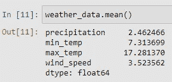

作者图片

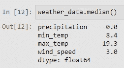

作者图片

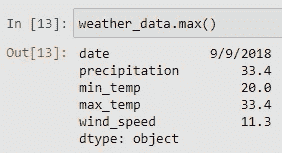

作者图片

有趣的是， **df.max()** 也用日期计算对象类型列。由于我们没有将日期转换为 datetime 格式，因此最大值不是 12/31/2018，而是一个字符串的最大值，即 9，所以是 9/9/2018。为了将日期转换成 datetime 格式(Python 随后将其评估为实际日期)，我们使用了 **pd.to_datetime()** 函数，如下所示:

现在，在我们将日期转换为 datetime 格式之前，尝试打印出 dataframe 的前 5 行，并与前面的示例进行比较。此外，我们可以看到列的数据类型发生了变化。

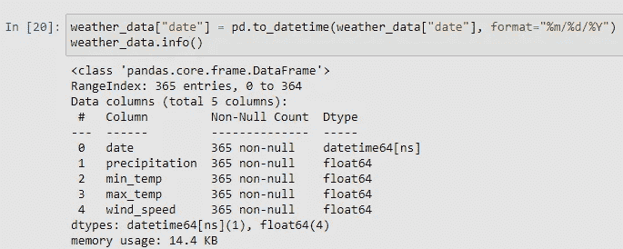

作者图片

现在让我们更进一步，学习从我们的 weather_data 数据框架中选择数据的某些部分。

# 选择数据

为了从数据帧中选择数据，我们有几个选项，例如使用**方括号[]** 、**。loc[]** 或**。iloc[]** 功能。当然还有更多的可能性，但这三种应该可以满足我们的大部分需求。

## 方括号

使用方括号，我们可以选择一列(返回熊猫系列)或多列(返回熊猫数据框架)。假设我们只对降水数据感兴趣。

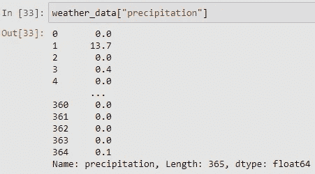

作者图片

或者如前所述，我们还可以在方括号内提供列名列表，然后返回新的 DataFrame。

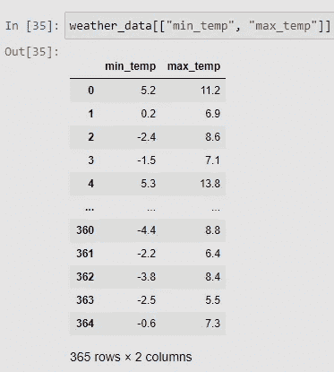

作者图片

也可以通过给方括号提供索引来选择数据，但这种方法不常使用。

## 。位置[]

的。锁定方法工作方式略有不同。这意味着通过索引标签来选择数据，而且，数据类型取决于我们所处理的数据帧的索引数据类型。我们如下使用它:

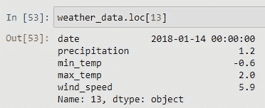

作者图片

它也适用于具有其他类型索引(字符串、日期时间等)的数据帧。).

仅选择一个索引标签，返回一个系列。选择两个标签或一个子集，返回一个新的数据帧。

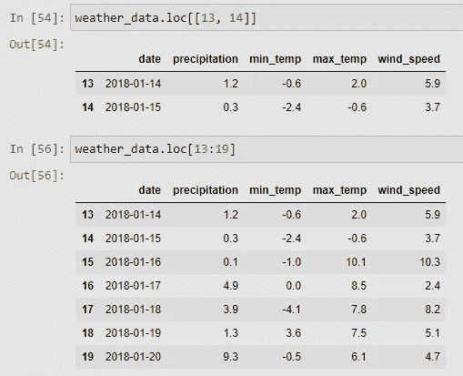

作者图片

请注意，当提供多个标签时，我们需要将它们存储在一个列表中(因此有两个方括号)。还有，**。loc** 包括最后的值，例如与索引一个列表相反。

带**。loc** 我们也可以选择多行多列！

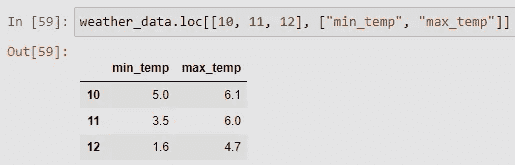

作者图片

所以，。loc 只能用于标签(整数，字符串，日期时间…)，它可以选择行，但也可以选择列，我们可以提供单个标签，子集或列表的选择。

## 。iloc[]

**。iloc** 方法的工作方式与。loc 方法，但是它只支持行的整数位置(无论 DataFrame 的索引是什么数据类型，**)。iloc** 正在通过整数位置选择数据)。仅使用一个值(索引)将返回一个序列，而使用多个索引或一个子集将返回一个数据帧。

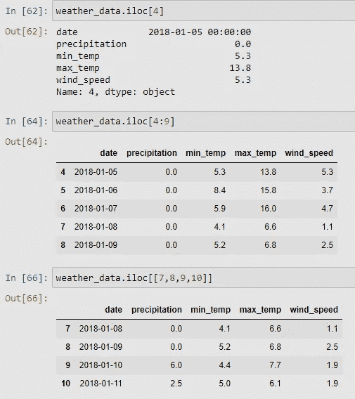

作者图片

**。iloc** 也可用于同时选择列，但方式与行相同，通过它们的整数位置。让我们来看看。

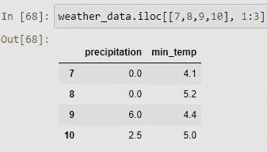

作者图片

所以在上面的例子中，我们选择了第 7、第 8、第 9 和第 10 行，以及第 1 到第 3 列。(行和列的计数都从零开始)

# 简单的情节

获得数据的统计数据并知道如何选择数据帧的某些部分是很好的，但看到数据集的一些图形解释当然更好。所以，作为数据探索的最后一步，让我们来看看熊猫的简单情节。对于这个例子，让我们画出 2018 年 1 月的风速。

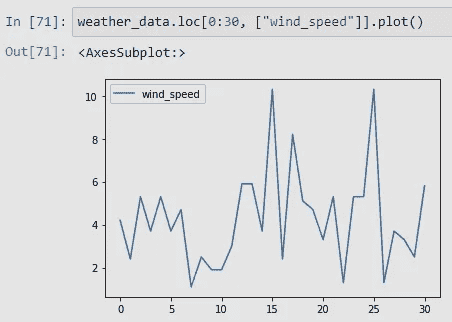

作者图片

我们也可以绘制多个列，现在让我们看看 2018 年的夏天有多暖(或冷)。

作者图片

值得一提的是，那些情节，可以通过其他方式选择数据，你能想到任何吗？自己试试吧。

降水量大多被绘制成柱状图。因为对于这个位置，秋天在大多数情况下都是多雨的，让我们通过将 9 月和 10 月的降雨量绘制成柱状图来看看 2018 年的降雨量。

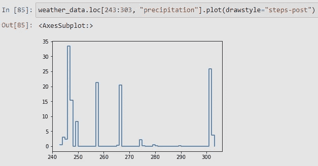

作者图片

我们并没有绘制成条形图，但是“step”参数是一个很好的变通方法，可以得到像条形图一样的图形，而不会弄乱标签。🙂

# 结论

今天我们学习了一些基本的熊猫函数，这些函数在处理类似电子表格的数据时是必要的。我再怎么强调也不为过，还有几十个函数和方法，所有这些都无法涵盖和展示，但是你可以在官方的熊猫文档中找到它们。此外，当您使用自己的数据时，您将会遇到许多自己的数据。

但是作为第一步，为了熟悉我们的朋友熊猫，你一定会发现上面的建议很有用。

对于这篇文章或我在[媒体](https://medium.com/@Karlo_Leskovar)上的其他文章有任何问题或建议，欢迎通过 [LinkedIn](https://www.linkedin.com/mwlite/in/karlo-leskovar-a8612b105) 联系我。

感谢您抽出时间，干杯！🙂