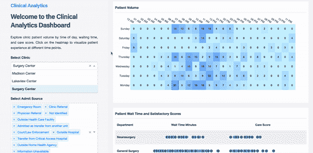
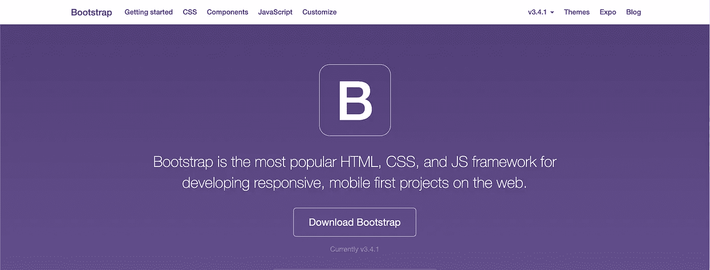
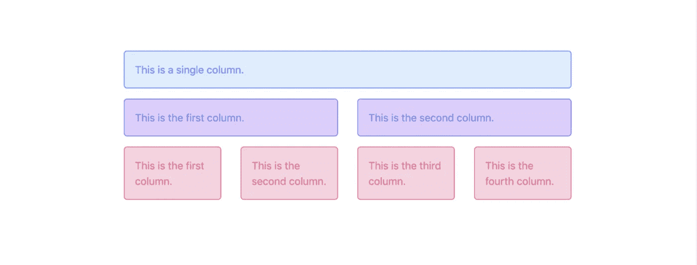
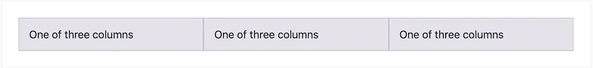
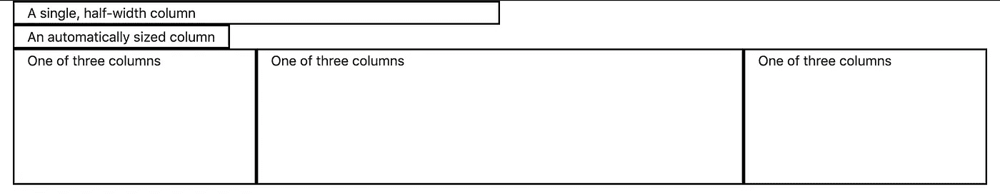
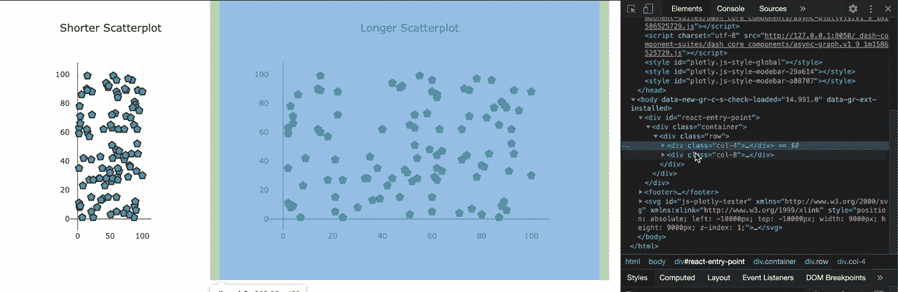
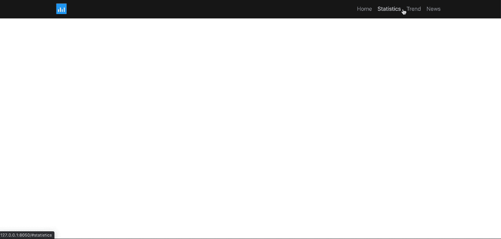
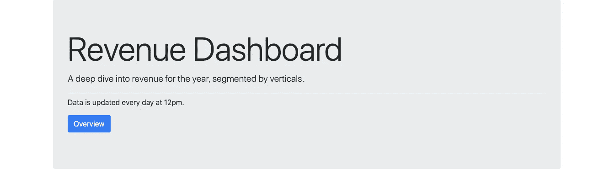

# 用于数据科学的 Python 用于 Plotly Dash 交互式可视化的引导程序

> 原文：<https://towardsdatascience.com/python-for-data-science-bootstrap-for-plotly-dash-interactive-visualizations-c294464e3e0e?source=collection_archive---------14----------------------->

## 将引导程序添加到您的交互式仪表盘


威廉·艾文在 [Unsplash](https://unsplash.com?utm_source=medium&utm_medium=referral) 上的照片

问候数据从业者。

欢迎来到 2021 年，这里的新趋势是围绕着**机器学习**。大多数雇主，甚至是数据科学家自己，都沉浸在部署新的**机器学习模型**的想法中，这种模型可以为他们预测几乎所有的事情。

Gif by [**师叔运气**](https://giphy.com/channel/abbeyluck)

如果你曾经在这个领域工作过，你会理解现在的大多数组织**甚至没有足够的基础**去冒险进入机器学习，但是他们仍然想要。

他们甚至没有抓挠—

*   正确的**数据仓库**实践
*   完全**了解**所拥有的数据
*   **利用云工具**进行机器学习

也就是说，**数据可视化**将永远是数据探索阶段的必需品。没有可视化的帮助，没有人能正确理解数据。谢天谢地，今天我们有许多图书馆来帮助我们。这里有几个。

[](/python-for-data-science-a-guide-to-data-visualization-with-plotly-969a59997d0c) [## 面向数据科学的 python——Plotly 数据可视化指南

### 现在是 2020 年，是时候停止使用 Matplotlib 和 Seaborn 了

towardsdatascience.com](/python-for-data-science-a-guide-to-data-visualization-with-plotly-969a59997d0c) [](/python-for-data-science-advance-guide-to-data-visualization-with-plotly-8dbeaedb9724) [## 用于数据科学的 Python 使用 Plotly 进行数据可视化的高级指南

### 如何在 Plotly 中添加和自定义滑块、下拉菜单和按钮

towardsdatascience.com](/python-for-data-science-advance-guide-to-data-visualization-with-plotly-8dbeaedb9724) 

因此，作为一名数据科学家，你能够通过**干净**和**漂亮** **的可视化**来传达你的发现是非常重要的。毫无疑问，它会让你鹤立鸡群。

# 破折号



纽约石油天然气由 [Dash App 图库](https://dash-gallery.plotly.host/dash-oil-and-gas/)

你听说过**剧情破折号**吗？

达什是这个街区的新成员。我在这里写了一下。

[](/python-for-data-science-a-guide-to-plotly-dash-interactive-visualizations-66a5a6ecd93e) [## 面向数据科学的 python——Plotly Dash 交互式可视化指南

### 构建您的第一个 web 应用程序！

towardsdatascience.com](/python-for-data-science-a-guide-to-plotly-dash-interactive-visualizations-66a5a6ecd93e) 

**Dash** 是新的开源 **Python 库**，让你无需了解任何 **HTML、CSS 或 Javascript** 就能构建令人惊叹的数据可视化应用。

一切都在 Python 中，给已经了解 Python 的数据科学家带来了真正的美好时光。最重要的是，**快**，**美**，**好学**。

**Dash 还可以通过编程实时更新其仪表盘，无需任何交互。**

它真正处于部署和自动化您的仪表板的最前沿，没有需要管理部署、移动响应和 SRE(站点可靠性工程)带来的其他东西的麻烦。

**那么你还在等什么，现在就开始行动吧！**

Gif 来自 [**Reddit**](https://www.reddit.com/r/reactiongifs/comments/40iek9/mrw_im_walking_my_dog_in_5_degree_weather_and_he/)

在本文中，我们将深入探讨如何通过在 Dash 中实现 **Bootstrap** 来美化 Dash 应用。它提供了非常有用的工具，如**导航条**、**按钮**、**表单**，以及更多。

但是首先，对于那些不知道的人来说，到底什么是' **Bootstrap** '？

# 引导程序



[getbootstrap.com](https://getbootstrap.com/docs/3.4/)

对于那些没有网络开发知识的人来说，HTML 和 CSS 构成了网页的基本前端框架。我肯定你以前在什么地方听说过他们。

每个网站都需要 HTML 和 CSS，它们是构建网站的基础。

当谈到为桌面**和移动**优化网站时，事情变得很混乱。根据谷歌的数据，超过一半的网络流量来自手机。这种情况催生了一个时代，网络开发者开始更加重视移动网站和应用。

**这就是 Bootstrap 的用武之地。**

Bootstrap 是目前开发移动响应网站最流行的 CSS 框架。

根据 [BuiltWith](https://www.ostraining.com/blog/webdesign/bootstrap-popular/#:~:text=Overall%2C%20BuiltWith%20shows%20around%2018,52%25%20share%20amongst%20web%20frameworks.) 和 [w3tech](https://w3techs.com/technologies/details/js-bootstrap) , **Bootstrap** 在 CSS 框架领域排名第一，占全球所有网站的大约 **26.8%** ，其中包括网飞和 Udemy 等热门网站。

它使前端开发更快更容易，节省了您在优化所有形状的设备时的工作。

bootstrap 的惊人特性之一是**网格系统**。默认情况下，Bootstrap 将您的布局分成 12 列，可随您使用的任何设备进行扩展，使其成为一个移动响应框架。



[freecodecamp.org](https://www.freecodecamp.org/news/learn-the-bootstrap-4-grid-system-in-10-minutes-e83bfae115da/)

它还有[预定义的类](https://getbootstrap.com/docs/3.4/css/#grid)，允许你轻松开发有用的特性，比如按钮、导航条和表单。

这会节省你几个小时的工作时间。

现在，我们回到 Dash。

# 先决条件

Dash 可视化基于 Plotly。如果你已经和[](/python-for-data-science-a-guide-to-plotly-dash-interactive-visualizations-66a5a6ecd93e)**相处得很好，那会有很大帮助。**

**要做到这一点，你还需要在使用**熊猫**进行**数据转换**方面有坚实的基础。我已经写了许多关于以上所有主题的指南，在继续之前，请随意修改它们。**

**[](/python-for-data-science-basics-of-pandas-5f8d9680617e) [## 用于数据科学的 Python 熊猫指南

### 10 分钟内完成数据探索指南

towardsdatascience.com](/python-for-data-science-basics-of-pandas-5f8d9680617e) 

## 破折号

你也了解基本的**破折号**破折号**概念**比如—

*   Dash 的布局由核心组件和 HTML 组件组成
*   基本的 HTML 概念，如 Div 和容器** 

# **进口**

****安装****

```
pip install dash
pip install dash-bootstrap-components
```

**使用 Jupyter 笔记本**

```
import dash
import dash_core_components as dcc
import dash_html_components as html
import plotly.graph_objs as go
import pandas as pd
import dash_bootstrap_components as dbc
from dash.dependencies import Input, Output
```

# **组织的引导**

**无论出于什么原因，如果您正在构建一个仪表板，以适合用户的方式设计和组织它是很重要的。Dash 本身并没有为了组织的目的而优化，我们可以使用**引导**来实现。**

****网格系统** 欢迎来到网格。**

**Gif by [乐高](https://giphy.com/gifs/lego-tron-outta-here-lego-EQBjgEGBnu0jD5Tgn5/media)**

**Bootstrap 使用**网格系统**来组织你网站上的元素。
在 Bootstrap 中，你的网站是由行和列组成的。
**您可以根据需要将每行拆分或组合成不同数量的列**。**

****

**截图来自[getbootstrap.com](https://getbootstrap.com/docs/4.0/layout/grid/)**

**在纯 HTML+ CSS 中是什么样子的:**

```
<div class="container">
  <div class="row">
    <div class="col-sm">
      One of three columns
    </div>
    <div class="col-sm">
      One of three columns
    </div>
    <div class="col-sm">
      One of three columns
    </div>
  </div>
</div>
```

**Dash bootstrap 中是什么样子的:**

```
row = html.Div(
    [
        dbc.Row(
            [
                dbc.Col(html.Div("One of three columns")),
                dbc.Col(html.Div("One of three columns")),
                dbc.Col(html.Div("One of three columns")),
            ],no_gutters=True,
        ),
    ]
)
```

**上面的两个代码块产生相同的东西，即**一行**，默认高度为**分成 3 列**，列之间没有任何间隔。**

**然后，您可以向这些列中添加任何元素，如破折号图表、破折号按钮和导航条，以便正确地组织它们。**

****调整高度和宽度的重要提示—**
您可以调整行高和列宽**

**让我们试试那个。**

****

**作者图片**

```
app.layout = html.Div(
    [
        dbc.Row(dbc.Col(html.Div("A single, half-width column"), width=6,style={"border":"2px black solid"})), dbc.Row(
            dbc.Col(html.Div("An automatically sized column"), width="auto",style={"border":"2px black solid"})
        ), dbc.Row(
            [
                dbc.Col(html.Div("One of three columns"), width=3,style={"border":"2px black solid"}),
                dbc.Col(html.Div("One of three columns"),style={"border":"2px black solid"}),
                dbc.Col(html.Div("One of three columns"), width=3,style={"border":"2px black solid",'height':'10rem'}),
            ]
        ),],className = 'container')
```

**通过在列中设置**宽度**和**高度**参数，我们可以完全控制如何组织页面上的元素。**

**通过使用 dash bootstrap，您还可以使用 **className** 参数将**类**分配给所有组件。注意我是如何将容器类分配给主 Div 的，只需在最后一行指定它。**

**什么是类？
类是你给元素起的名字，用来**给它们分配某些设计元素**。您可以在单独的 CSS 文件中定义这些类。**

**假设您创建了一个名为“BIG”的类，并为其分配了 size =“2px”。现在你可以通过声明 className = 'BIG '来轻松地将这个类分配给你想要的任意多个元素。在设计你的元素时，这是一种更有效的方式。**

**有了这个，让我们在实际的可视化上尝试一下。**

****

**作者录音**

```
app.layout = html.Div([
                    dbc.Row([
                        dbc.Col(scatterplot1, width=4),
                        dbc.Col(scatterplot2, width=8),
                    ])
                ],className = 'container'
            )
```

**使用上面的代码块，我们已经预先定义了 2 个散点图。
第一个散点图被设置为第二个散点图宽度的一半。**

**这对于正确规划和显示图表非常有用。从我的经验来看，如果用户觉得看起来不干净，你的图表往往会被忽视。**

> **人们忽视那些忽视人的设计。—弗兰克·奇梅罗，设计师**

# **导航栏**

**既然我们已经了解了基础知识，让我们来看看更有趣的东西。在你的仪表盘上设置一个功能齐全的导航条怎么样？**

## **导航条**

**让我们建立一个简单的导航栏，让我们能够轻松地导航到特定的页面。导航条反应灵敏，持续停留在页面顶部，功能齐全。**

****

**作者录音**

```
PLOTLY_LOGO = "[https://images.plot.ly/logo/new-branding/plotly-logomark.png](https://images.plot.ly/logo/new-branding/plotly-logomark.png)"
# defining navbar items
home_button = dbc.NavItem(dbc.NavLink('Home',href="#home", external_link=True,className='navlinks'))
statistic_button = dbc.NavItem(dbc.NavLink('Statistics',href="#statistics", external_link=True,className='navlinks'))
trend_button = dbc.NavItem(dbc.NavLink('Trend',href="#trend", external_link=True,className='navlinks'))
news_button = dbc.NavItem(dbc.NavLink('News',href="#news", external_link=True,className='navlinks'))navbar = dbc.Navbar(
    dbc.Container(
    [
        html.A(
            dbc.Row(
                [
                    dbc.Col(html.Img(src=PLOTLY_LOGO,className = 'logo',height="30px")),
                ],
                align="center",
                no_gutters=True,
            ),
            href="#home",
        ),
        dbc.NavbarToggler(id="navbar-toggler"),
        dbc.Collapse(dbc.Nav([home_button,statistic_button,trend_button,news_button],className='ml-auto work-sans', navbar=True), id="navbar-collapse", navbar=True),
    ],
    ),
    color="rgb(42,62,66)",
    dark=True,
    style = {'background-color':'#191919'},
    className = 'navbar-change',
    expand= 'lg'
)
```

**首先，我们定义放置在导航栏上的所有按钮。这些按钮是在 **NavLink** 中定义的，同时将它与我们希望它带我们去的任何页面名称相关联。例如，**统计**按钮上有 href = '# **统计**'。
然后我们可以设置 **HTML。Header(id= 'Statistics')** 在页面的标题上，点击那个按钮会把我们带到这里。**

**当我们点击按钮时，您可以在屏幕的左下角清楚地看到这种情况。**

**所有的设计都是通过**颜色**、**样式**和**类名**参数完成的。
现在剩下要做的就是简单地将所有按钮作为列表**传入 dbc.NavBar。****

**你可以在这里阅读所有关于 dash 引导组件[的信息。](https://dash-bootstrap-components.opensource.faculty.ai/docs/components/alert/)**

# **（电视机的）超大屏幕**

****

**截图自 unbounce.com**

**如今大屏幕经常被用来把你的注意力吸引到特色内容。你肯定会无意中发现它。在本节中，我们将尝试使用 Dash Bootstrap 生成一个超大屏幕。**

**大屏幕是登陆页面的完美选择。**

**登录页面是用户访问您的仪表板/网站时登录的页面。这是他们看到的第一个东西，所以一定要留下好印象。**

**让我们试一试。**

****

**作者截图**

```
jumbotron = dbc.Jumbotron(
    [
        html.H1("Revenue Dashboard", className="display-3"),
        html.P(
            "A deep dive into revenue for the year, segmented by verticals.",
            className="lead",
        ),
        html.Hr(className="my-2"),
        html.P(
            "Data is updated every day at 12pm."
        ),
        html.P(dbc.Button("Overview", color="primary"), className="lead"),
    ]
)
```

**一个相对简单的着陆大屏幕，包括一个标题、描述和一个将用户带到页面主要内容的按钮。注意我们是如何使用 **className** 来设计这里的许多元素的。**

**我在这里只使用了默认的类名。你可以在官方 CSS 类名[这里](https://www.w3schools.com/bootstrap/bootstrap_ref_all_classes.asp)找到它们。**

**我希望这已经阐明了 dash bootstrap 有多有用。
有了这个，你完全可以用 **Python** 设计你的仪表盘，同时用**熊猫**和**plottly**绘制你的图形。**

**文章的完整代码:**

# **结论**

****

**[Icons8 团队](https://unsplash.com/@icons8?utm_source=medium&utm_medium=referral)在 [Unsplash](https://unsplash.com?utm_source=medium&utm_medium=referral) 上的照片**

****恭喜你，** 你现在可以完全用 **Python** 高效地设计自己的仪表盘了。**

**在本文中，**您已经了解了**:**

*   **网格系统**
*   **使用 Bootstrap 组织/设计**
*   **导航栏**
*   **（电视机的）超大屏幕**

**你还有很多工作要做。
现在去数据从业者，
建立一些东西并与我分享，
与世界分享。**

**如果你遇到困难，请随时联系我。
你可以在下面找到我的信息。**

# **在你走之前**

**我们的数据之旅还没有结束。我正在撰写更多关于数据行业的故事、文章和指南。你绝对可以期待更多这样的帖子。与此同时，请随意查看我的其他[文章](https://medium.com/@nickmydata)，暂时填补您对数据的渴望。**

**像往常一样，我引用一句话作为结束。**

> **目标是将数据转化为信息，将信息转化为洞察力。
> —卡莉·菲奥莉娜**

# **订阅我的时事通讯，保持联系。**

**也可以通过 [**我的链接**](https://nickefy.medium.com/membership) 注册一个中等会员来支持我。你将能够从我和其他不可思议的作家那里读到无限量的故事！**

**我正在撰写更多关于数据行业的故事、文章和指南。你绝对可以期待更多这样的帖子。与此同时，可以随时查看我的其他 [**文章**](https://medium.com/@nickmydata) 来暂时填补你对数据的饥渴。**

*****感谢*** *的阅读！如果你想与我取得联系，请随时联系我在 nickmydata@gmail.com 或我的* [*领英简介*](https://www.linkedin.com/in/nickefy/) *。也可以在我的*[*Github*](https://github.com/nickefy)*中查看之前写的代码。***