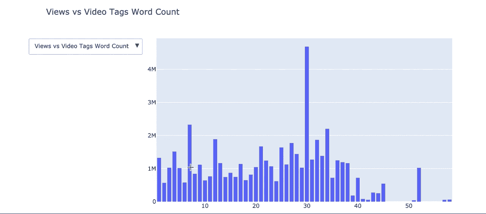

# 用于数据科学的 Python 如何在 Youtube 上获得更多的浏览

> 原文：<https://towardsdatascience.com/python-for-data-science-how-to-get-more-views-on-youtube-5c5a268cf1f6?source=collection_archive---------25----------------------->

## 用数据科学解决 YouTube 的攀升


亚历山大·沙托夫在 [Unsplash](https://unsplash.com?utm_source=medium&utm_medium=referral) 上拍摄的照片

问候数据从业者，
欢迎回到每周阅读的**用数据科学解决现实世界的问题**。就在队列中，当今千禧一代面临的第一世界最优先的问题之一是—

*不知道怎么在 Youtube 上炸。*

不用担心，数据可以解决一切，
而且我们要解决 YouTube 的问题。今天。

# 油管（国外视频网站）

世界著名的视频分享网站。YouTube 在 YouTube 上发布视频赚了大钱，这不是什么秘密。如果你生活在岩石下，大型 YouTubers 每年可以赚几百万，而每周只需要上传一个视频。

这进一步导致每个人都想分一杯羹。

gif 由 [andersonpaak](https://giphy.com/channel/andersonpaak) 提供

每个人和他们的狗现在都是优步，希望赚很多钱。
然而，这些人在游戏中姗姗来迟，由于平台已经饱和，他们正在努力为自己的视频增加流量。

在 YouTube 上，更多的浏览量意味着更多的钱。因此，人们开始问这样的问题—

*   什么样的视频标题吸引更多的观看？
*   哪个视频类别吸引更多的观看？
*   如何优化我的视频标签来吸引更多的浏览量？

你很幸运，我们今天会回答你的问题。
在这篇文章中，我们将对来自美国的一些 **YouTube 视频数据**进行一些**探索性数据分析**，提取我们能得到的任何见解。

# 先决条件

我们今天要表演的 EDA 主要使用了 **Plotly** 。理解构建简单的 **Plotly 图**的基础很重要。我在这里 **，**写了关于构建基本 Plotly 图的内容，涵盖了构建任何类型的图时需要理解的概念。

</python-for-data-science-a-guide-to-data-visualization-with-plotly-969a59997d0c>  

为了使用 Plotly，您经常需要使用 **Pandas 来转换数据。我会保护你的。我碰巧也写了一本关于熊猫** 的指南[。](/python-for-data-science-basics-of-pandas-5f8d9680617e)

</python-for-data-science-basics-of-pandas-5f8d9680617e>  

一旦你理解了**和**和**熊猫**，你就为执行几乎任何类型的探索性数据分析做好了充分准备。我会把这两个库称为我的数据分析和可视化的面包和黄油。

# 进口

使用 Jupyter 笔记本电脑…

```
# To manipulate data, NLP and visualizations
import pandas as pd
import numpy as np
import seaborn as sns
import matplotlib.pyplot as plt
import os
from subprocess import check_output# Standard plotly imports
import plotly as py
import plotly.tools as tls
from plotly.offline import iplot, init_notebook_mode
import plotly.graph_objs as go
import cufflinks# Using plotly + cufflinks in offline mode
init_notebook_mode(connected=True)
cufflinks.go_offline(connected=True)# To interactive buttons
import ipywidgets as widgets
from ipywidgets import interact, interact_manualimport warnings
warnings.filterwarnings("ignore")#nlp
import string
import re    #for regex
import nltk
from nltk.corpus import stopwords
import spacy
from nltk import pos_tag
from nltk.stem.wordnet import WordNetLemmatizer 
from nltk.tokenize import word_tokenize
from nltk.tokenize import TweetTokenizerfrom wordcloud import WordCloud, STOPWORDS
```

现在这是一个很大的进口，但我保证他们是必要的。

# 数据集源


作者截图

数据集从[**Kaggle.com**](https://www.kaggle.com/datasnaek/youtube-new)**导入。**它被命名为**趋势 YouTube 视频统计**，它拥有来自许多国家的数据。为了这个宠物项目的目的，我们将只分析来自美国的数据。

*注意:数据是通过 YouTube API 提取的。因此，您可以提取特定国家和不同时间段的数据。来源中的所有信息。*

# 导入数据集

```
df = pd.read_csv(filepath)
```

在这个探索性数据分析中，我们的目标是—

*   更好地理解数据集
*   了解视图是否因视频类别而异
*   了解视频标题的质量是否影响其观看

让我们从理解数据中的变量开始。

```
#Looking for Null values and the types of our data
df.info()
df.head()
```


作者图片


作者图片

查看这些列，我们将重点关注这个项目中的视图。让我们找出视图的分布。

```
df[['views']].iplot(kind="histogram", 
                bins=50, theme="white", 
                histnorm='probability', 
                title="Distribuition of Views",
                xTitle='Distribution',
                yTitle='Probability')
```


作者录音

单纯从这张图表上，我们可以看出大多数视频的浏览量都不到**500 万次。也有很多离群值，这些可能是病毒式传播的视频。让我们看看没有异常值的分布。**

```
def RemoveOutliers(df_num): 
    # calculating mean and std of the array
    data_mean, data_std = np.mean(df_num), np.std(df_num)
    # setting the threshold value
    threshold = data_std * 3
    #setting lower and upper limit
    lower, upper = data_mean - threshold, data_mean + threshold
    # array without outlier values
    outliers_removed = [x for x in df_num if x > lower and x < upper]
    return outliers_removeddf['removed_views_outliers'] = RemoveOutliers(df['views'])
df['removed_views_outliers'].iplot(kind="histogram", 
                        bins=100, theme="white", 
                        histnorm='probability', 
                 title= "Distribution of Views Without Outliers",
                        xTitle='Distribution',
                        yTitle='Probability')
```


作者录音

几乎有 40%的视频浏览量不到 20 万次，超过 20 万次之后，获得浏览量只会越来越难。

# 视频类别

众所周知，某些类别会比其他类别获得更多的浏览量。让我们探索一下可用的视频类别，以及每个类别中发布视频的频率。

```
rename_channels = {1:'Film/Animation', 2:'Cars/Vehicles', 10:'Music', 15:'Pets/Animals',
                   17:'Sport',19:'Travel/Events',20: 'Gaming',22:'People/Blogs',23:'Comedy',
                   24:'Entertainment',25:'News/Politics',26:'How to/Style',27:'Education',
                   28:'Science/Technology',29:'Non Profits/Activism'}
df['category_name'] = np.nan
df['category_name'] = df['category_id'].map(rename_channels)percent_category = round(df["category_name"].value_counts(), 2)
categories = round(df["category_name"].value_counts() / len(df["category_name"]) * 100,2)labels = list(categories.index)
values = list(categories.values)trace1 = go.Pie(labels=labels, 
                values=values, 
                marker=dict(colors=['red']), 
                text=(percent_category.index.map(str)),
                hovertext=(percent_category.values.astype(str)))layout = go.Layout(title="Views by Category", 
                   legend=dict(orientation="h"));fig = go.Figure(data=[trace1], layout=layout)
iplot(fig)
```


作者录音

看起来拥有最多视频的前三个类别是—

*   娱乐
*   音乐
*   如何/风格

如果我们要发布这些类别中的任何一个，这对我们了解我们的竞争对手是很重要的。在音乐和娱乐类别中，大多数视频是由名人或 T2 娱乐公司发布的，而不是 YouTubers。因此，他们视频输出的质量和数量超过我们任何人都是有道理的。

我们知道这些类别拥有最多的视频，但它们拥有最多的浏览量吗？

```
trace1 = go.Bar(x=df.groupby(['category_name'])['views'].sum().index,
                y=df.groupby(['category_name'])['views'].sum().values,
                name='Total Views by Category', visible=True)trace2 = go.Bar(x=df.groupby(['category_name'])['channel_title'].nunique().index,
                y=df.groupby(['category_name'])['channel_title'].nunique().values, 
                name='Unique Channels by Category', visible=False)data = [trace1, trace2]updatemenus = list([
    dict(active=-1,
         showactive=True,
         buttons=list([  
            dict(
                label = 'Total Views by Category',
                 method = 'update',
                 args = [{'visible': [True, False, False]}, 
                     {'title': 'Sum of views by Category'}]),

             dict(
                  label = 'Total Channels by Category',
                 method = 'update',
                 args = [{'visible': [False, True, False]},
                     {'title': 'Total Channels by Category'}]),]),
    )
])layout = dict(title='Different Metrics by each category <br> Sum of views by Category', 
              showlegend=False,
              updatemenus=updatemenus)fig = dict(data=data, layout=layout)iplot(fig)
```


作者录音

音乐和娱乐类别确实拥有最多的视图和频道。一个有趣的事实是，即使音乐类别中发布的视频越来越多，娱乐类别中的频道也比音乐更多。这意味着娱乐品类比音乐略饱和。

关于饱和度这个话题，我们再深入探讨一下。

```
#saturation metrics by category
views_list = np.array(df.groupby(['category_name'])['views'].sum().tolist())
channels_list = np.array(df.groupby(['category_name'])['channel_title'].nunique().tolist())
videos_list = np.array(df.groupby(['category_name'])['title'].nunique().tolist())views_by_videos = views_list/videos_list
views_by_channels = views_list/channels_list
```

我们创造新的衡量标准—

*   **浏览量 _by_videos**
*   **浏览频道**

按类别查看每个视频和频道的浏览量。通过这样做，我们可以大致判断某个类别的饱和程度。

当我们以 YouTuber 起家时，我们不想进入一个饱和的视频类别。除非你有极不公平的优势，否则进入更欢迎新手的类别将是明智的。想象一下在音乐上和‘Justin Bieber’这样的人竞争，不是什么好结局。

让我们在图上显示饱和度指标。

```
trace1 = go.Bar(x=df.groupby(['category_name'])['title'].nunique().index,
                y=views_by_videos,
                name='Saturation - Views per Video', visible=True)trace2 = go.Bar(x=df.groupby(['category_name'])['title'].nunique().index,
                y=views_by_channels,
                name='Saturation - Views per Channel', visible=True)data = [trace1,trace2]updatemenus = list([
    dict(active=-1,
         showactive=True,
         buttons=list([  
            dict(
                label = 'Saturation - Views per Video',
                 method = 'update',
                 args = [{'visible': [True, False]}, 
                     {'title': 'Saturation - Views per Video'}]),

             dict(
                  label = 'Saturation - Views per Channel',
                 method = 'update',
                 args = [{'visible': [False, True]},
                     {'title': 'Saturation - Views per Channel'}]),
        ]),
    )
])layout = dict(title='*(Select from Dropdown)* Saturation Metrics by Category', 
              showlegend=False,
              updatemenus=updatemenus)fig = dict(data=data, layout=layout)
iplot(fig)
```


作者录音

从剧情可以看出，音乐依然是每视频浏览量和每频道浏览量的领头羊。然而，排在第二位的是**非盈利/行动主义**类别，该类别在每视频浏览量和每频道浏览量上都位居第二。看前面的图表，非盈利/行动主义中的视频和频道数量都是最低的。

**这意味着该类别的视频和频道最少，但每个视频和频道的浏览量最高。**因此，这将是一个理想的参赛类别。

如果让我选一个，我会选电影/动画类别。从数据来看，它没有太多的视频和频道，但每个视频的浏览量和每个频道的浏览量都非常高。此外，动画是我感兴趣的领域，所以这是一个优势。

# 视频标题

现在我们已经选择了一个类别，是时候探索视频标题了。正如许多 YouTubers 用户提到的，视频标题和缩略图很重要。

> 你可以有一个非常好的视频。没有一个好的视频标题和缩略图，没有人会点击它——包括所有的 YouTuber

因此，让我们确保我们的视频标题得到优化，以获得更多的意见。
让我们先来看看标题和标签中的字数，
以及它是如何影响我们的观点的。

```
#Unique word count
df['count_unique_word']=df["title"].apply(lambda x: len(set(str(x).split())))
df['count_unique_word_tags']=df["tags"].apply(lambda x: len(set(str(x).split())))df[['count_unique_word_tags','count_unique_word']].iplot(kind="histogram",bins=50, theme="white", histnorm='probability', title="Distribuitions of Word Count in Title and Tags",
xTitle='Distribuition',
yTitle='Probability')
```


作者录音

看字数的分布。对于视频标题，看起来大多数视频标题都有 5 到 10 个单词。对于视频标签来说，大部分视频标签都少于 30 个字。

我们可以以此为参考。让我们看看它是如何影响视图的。

```
# Dataframe for unique word count for video titles
df3 = df[['count_unique_word','views']]
df3 = df3.groupby('count_unique_word').mean().reset_index()# Dataframe for unique word count for video tags
df4 = df[['count_unique_word_tags','views']]
df4 = df4.groupby('count_unique_word_tags').mean().reset_index()trace1 = go.Bar(x=df3['count_unique_word'],y=df3['views'],name = 'Views vs Video Title Word Count',visible = True)
trace2 = go.Bar(x=df4['count_unique_word_tags'],y=df4['views'],name = 'Views vs Video Tags Word Count',visible = True)data=[trace1,trace2]updatemenus = list([
    dict(active=-1,
         showactive=True,
         buttons=list([  
            dict(
                label = 'Views vs Video Title Word Count',
                 method = 'update',
                 args = [{'visible': [True, False]}, 
                     {'title': 'Views vs Video Title Word Count'}]),

             dict(
                  label = 'Views vs Video Tags Word Count',
                 method = 'update',
                 args = [{'visible': [False, True]},
                     {'title': 'Views vs Video Tags Word Count'}]),
        ]),
    )
])layout = dict(title="*(Select from Dropdown)* Views vs Word Count", 
              showlegend=False,
              updatemenus=updatemenus)
fig = dict(data=data, layout=layout)
iplot(fig)
```



作者录音

有意思。对于视频标题字数，包含 **2 个单词的标题获得最多的浏览量**，之后，每增加一个单词，浏览量也会增加，直到 11 个单词，浏览量开始持平。这将建议我们的视频标题长度为 2 个单词，或介于 5 至 10 个单词之间。

对于视频标签字数来说，25 个或更少的视频有着几乎相同的浏览量。浏览量在 26 到 34 个单词标签之间开始达到峰值，之后浏览量开始下降。

相当有趣的东西。

# 视频标题/标签内容

现在我们已经大致知道了视频标题和标签的长度，我们想知道应该在里面放什么样的文字。通过探索文字内容，我们可以大致看出其他 Youtubers 在他们的视频中放了什么样的文字。我们可以用词云图把这些词清晰地形象化。

```
plt.rcParams['font.size']= 15              
plt.rcParams['savefig.dpi']= 100         
plt.rcParams['figure.subplot.bottom']= .1 
stopwords = set(stopwords.words("english"))plt.figure(figsize = (15,15))
wordcloud = WordCloud(
                          background_color='black',
                          stopwords=stopwords,
                          max_words=1000,
                          max_font_size=120, 
                          random_state=42
                         ).generate(str(df['title']))print(wordcloud)
fig = plt.figure(1)
plt.imshow(wordcloud)
plt.title("WORD CLOUD - VIDEO TITLE")
plt.axis('off')
plt.show()
```


作者截图

```
plt.figure(figsize = (15,15))
wordcloud = WordCloud(
                          background_color='black',
                          stopwords=stopwords,
                          max_words=1000,
                          max_font_size=120, 
                          random_state=42
                         ).generate(str(df['tags']))print(wordcloud)
fig = plt.figure(1)
plt.imshow(wordcloud)
plt.title("WORD CLOUD - TAGS")
plt.axis('off')
plt.show()
```


作者截图

对于视频标题，我们可以看到被提到最多的词是' **WANT** '和' **TALK** '。这些词出现得最多是有原因的，我们将不得不进一步探索以更好地理解这些数据。

对于视频标签，我们可以看到提到最多的词是'**惊艳**'、**末世**'、**一生**'、**周**'。这些都是很普通的词。同样，为了理解这些数据，我们必须进行更深入的分析。

# 项目的代码

作者要点

# 结论


马修·斯特恩在 [Unsplash](https://unsplash.com?utm_source=medium&utm_medium=referral) 上的照片

如果你已经读到这里，你一定很想得到 T21 在 Youtube 上的钱。如果是这样的话，你只需要在你的 Youtube 之旅中遵循这些指示，你就可以开始生活了。

*   在**电影/动画**类别中创建视频
*   视频标题为 2 个字或 5 到 10 个字
*   有 26 到 34 个视频标签
*   视频标题中包含最多的是“想要”和“说”——找出原因
*   神奇，最后，生活和一周是视频标签中包含最多的-找出原因

如果你们还没有达成共识，这些数据显然只是作为参考，并不能证明能给你带来更多的浏览量。这是对来自美国的一小部分 YouTube 数据的探索性分析，这意味着它不会准确地显示包括美国在内的任何地方的观看行为。

我希望这对你和我来说至少是有趣的。
下期再见！

# [订阅我的时事通讯，保持联系。](https://www.nicholas-leong.com/sign-up-here)

我们的数据之旅还没有结束。我正在撰写更多关于数据行业的故事、文章和指南。你绝对可以期待更多这样的帖子。与此同时，你可以随时查看我的其他 [**文章**](https://medium.com/@nickmydata) 来暂时填补你对数据的渴望。

像往常一样，我引用一句话作为结束。

> 数据是新的科学。大数据掌握着答案。~ VMware 首席执行官帕特·基尔辛格

***感谢*** *阅读！如果你想与我取得联系，请随时通过 nickmydata@gmail.com 或我的* [*LinkedIn 个人资料*](https://www.linkedin.com/in/nickefy/) *联系我。您也可以在我的*[*Github*](https://github.com/nickefy)*中查看之前的撰写代码。*