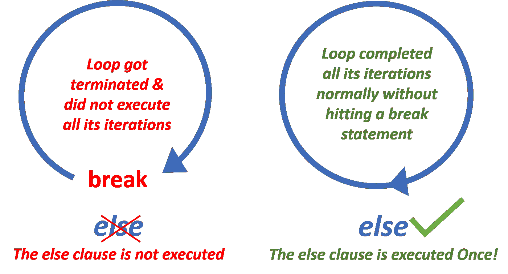

# Python For-Else 和 While-Else 用 4 个真实的例子清楚地解释了

> 原文：<https://towardsdatascience.com/python-for-else-and-while-else-clearly-explained-with-4-real-world-examples-2b23ca6f6a51?source=collection_archive---------19----------------------->

## 编程，PYTHON

## 获得清晰的理解，并学习 4 个可以使用它的用例！


图片由来自 [Pixabay](https://pixabay.com/?utm_source=link-attribution&amp;utm_medium=referral&amp;utm_campaign=image&amp;utm_content=61171) 的 [Dwi Rizki Tirtasujana](https://pixabay.com/users/ikinitip-10578/?utm_source=link-attribution&amp;utm_medium=referral&amp;utm_campaign=image&amp;utm_content=61171) 提供，作者修改

你知道在 Python 中`for` 和`while` 循环有一个`else` 子句吗？为什么我们会有它？这是什么意思？它是如何工作的？在你的日常工作中，你可以在哪里使用它？来，让我们一起探索！

# **理解 For-Else 和 While-Else**

对于我们许多人来说，`**else**` 这个术语会造成混淆，因为`if-else`语句中的`else`有意义，但是`else`表示循环？奇怪！有那么一会儿，不要试图去理解`else`这个词。试想 Python 通过其循环为您提供了一个额外的特性。让我们看看它是如何工作的。

## 句法

带有可选`else`子句的`for`循环:

```
**for** *variable_name* **in** *iterable***:**
    #stmts in the loop
        .
        .
        .
**else**:
    #stmts in else clause
        .
        .
        .
```

带有可选`else`子句的`while`循环:

```
**while** *condition:*
    #stmts in the loop
        .
        .
        .
**else**:
    #stmts in else clause
        .
        .
        .
```

*   如果循环被`break` 语句终止，则`else` 子句不会被执行。
*   如果循环没有命中`break` 语句，那么`else` 子句将在循环完成所有迭代后执行一次**(也就是说，在循环正常完成**后**)。**



Python 中按作者排序的图像-For-Else 和 While-Else

> [Raymond Hettinger](https://www.youtube.com/watch?v=OSGv2VnC0go) ，Python 先驱在他的一个[演讲](https://www.youtube.com/watch?v=OSGv2VnC0go)中提到，在 Python 中，总是在循环的`*else*` 子句旁边注释`*#no break*`。如果循环的`*else*`被称为 **nobreak** ，那么就不会有混淆。

# 简化的真实世界示例

你在想，这有什么意义？这对我有什么用？来，让我们探索一些对你有用的有趣的应用。

## a)搜索

**传统方法**

传统上，在搜索程序中使用标志来标记是否找到了某个值。如果您必须搜索更多的值，那么维护许多标志变量会增加复杂性。

```
#*************************Traditionally*************************
#set flag = 0
#loop the items in the data
#if the item was found in the loop then set flag = 1
#display search result by verifying the flag value
#***************************************************************
```

**Python 中更好的方法**

但是使用 Python，您可以轻松地编写一个搜索程序，而不必使用任何标志。您可以使用一个`break` 语句和循环的`else` 子句来轻松完成这项工作。下面给出了一个简单的搜索示例。

作者代码:使用 for-else Python 进行搜索

## b)检查限值

**传统方法**

传统上，标志变量用于检查数据是否突破了给定的限制。

```
#*************************Traditionally*************************
#set flag = 1
#loop the items in the data
#if any item breaches the given limits then set flag = 0
#display the validation result by verifying the flag value
#***************************************************************
```

**Python 中更好的方法**

但是使用 Python，您可以使用`break` 语句和循环的`else` 子句轻松验证这一点。不需要标志。看看下面的例子。

作者代码:使用 for-else Python 检查限制

## c)嵌套循环

**传统方法**

更古老的语言有`**GOTO**` 语句来改变程序中的执行行。这种方法很棘手，因此更容易犯人为错误。如果你有嵌套循环和一些`GOTO`语句，那么只会增加更多的复杂性和风险。

```
#************************Older Languages************************
#outer_label: outer loop
#     inner loop
#         if a condition was met, GOTO outer_label
#***************************************************************
```

**Python 中更好的方法**

但是在 Python 中，没有`GOTO`语句，这是一件好事。事实上，这也是 Python 引入`break`和 loop 的`else` 语句的原因之一——取代`GOTO`语句。因此，让程序员更容易和更安全地使用它们。

*   当我们不得不管理嵌套循环时，我们可以很容易地使用一个`break` 语句从一个内部循环中脱离出来，并获得到外部循环的执行行。
*   如果您需要检查内部循环是否正常完成了所有的迭代而没有遇到 break 语句，您可以使用循环的`else` 子句。

> 请记住，在 Python 中，您不能使用单个`break` 语句来中断多个嵌套循环。一个`break` 语句只能中断包含它的一个循环。

为了清楚地理解这一点，请看下面的例子。

作者编写的代码:带有 Else 子句的嵌套循环示例 Python

## d)与异常处理一起使用

如果您想在循环引发异常时终止它，那么您可以在`except`块中使用`break`语句。此外，如果你想在循环正常完成**(也就是说，完成了所有的迭代而没有中断)的情况下执行一些语句，那么你可以在循环的`else` 子句中编写这些语句。通过下面的例子可以更好地理解它。**

**作者编写的代码:带有异常处理的循环 Else 子句示例**

# **外卖:**

1.  **循环的`else`子句(`for` / `while`)只有在循环完全完成执行而没有命中 break 语句时才会执行(换句话说，循环已经正常完成)。**
2.  **循环的 else 子句中的语句将在循环正常完成后执行一次**。****
3.  **如何让困惑远离？把循环的 else 子句想象成**不中断**。总是在循环的`else` 子句旁边注释`#no break`，**这是 Python 先驱 [Raymond Hettinger](https://www.youtube.com/watch?v=OSGv2VnC0go) 建议的提高代码可读性的最佳实践**。**

**4 **。你能在哪里使用它？****

*   **进行搜索(不使用标志，而是使用`break` 和循环的`else`)。**
*   **检查限制/边界(不使用标志，使用`break` 和循环的`else`)。**
*   **管理嵌套循环(当您需要根据内部循环是正常执行还是命中 break 语句来采取行动时)。**
*   **您可以将它与异常处理一起使用(当您需要`break` on exception 并仅在循环正常完成时执行某些语句时)。**

****5。一个警告:**总是验证循环的`else` 子句的缩进，检查它是否与循环关键字(`for` / `while`)正确对齐(缩进)。错误地，如果一个循环的`else` 子句与一个`if`语句对齐(缩进),那么代码将会中断。**

**有了这些，我希望你对 Python 中的 **for-else** 和 **while-else** 有信心。您还熟悉了它的一些应用程序。跟我重复一遍“不再迷茫:)”！**

**如果您遇到了**在-else** 和 **while-else** 中的任何其他应用(使用),请在下面评论。**

***最初发布于 2021 年 2 月 12 日*[***python 简化***](https://pythonsimplified.com/python-for-else-and-while-else-clearly-explained-with-real-world-examples/) *。***

***阅读更多关于 Python 和数据科学的有趣文章，* [***订阅***](https://pythonsimplified.com/home/) *到我的博客*[***pythonsimplified.com***](http://www.pythonsimplified.com/)***。*** 你也可以通过[**LinkedIn**](https://www.linkedin.com/in/swathi-ambi/)**联系我。****

# **参考**

**[](https://stackoverflow.com/questions/9979970/why-does-python-use-else-after-for-and-while-loops) [## 为什么 python 在 for 和 while 循环后要用‘else’？

### 我知道这是一个老话题，但我现在正在研究同一个问题，我不确定是否有人抓住了…

stackoverflow.com](https://stackoverflow.com/questions/9979970/why-does-python-use-else-after-for-and-while-loops) [](https://www.udemy.com/course/python-3-deep-dive-part-1/) [## Python 3:深潜(第 1 部分-功能)

### 你好！这是一系列课程的第一部分，旨在深入研究…的内部机制和更复杂的方面

www.udemy.com](https://www.udemy.com/course/python-3-deep-dive-part-1/)**