# 面向 Excel 用户的 Python 第 1 部分

> 原文：<https://towardsdatascience.com/python-for-excel-users-part-1-c44bacff4adc?source=collection_archive---------19----------------------->

## 开始使用 pandas 处理数据


这是一个教程系列的第一部分，面向所有想开始使用 python 而不是 Excel 的人，例如，自动化任务或提高速度和可伸缩性。或者只是出于好奇。

当出现以下情况时，您处于正确的位置:

*   您可以使用 Excel 合并各种工作表或表格(使用诸如 Index、Match、VLookup
*   使用简单的数学运算，如求和与平均
*   使用条件聚合函数(例如，每个类别的交易总和)或数据透视表

这篇博文不会涵盖您需要了解的关于转储 Excel 的所有内容，这也不是本系列的目标。第 1 部分旨在帮助您从 Excel 转向 Python/Pandas。

虽然 Excel 有它自己的位置，而且非常快速和方便，但我希望这个博客文章系列能够帮助您探索除 Excel 之外的其他数据处理方式。

你可以在 Jupyter 笔记本上找到这篇博文，以及我们在 [HOSD 指导 GitHub repo](https://github.com/HOSD-Mentoring/presentations/tree/main/From%20Excel%20to%20Python%20-%20Part%201) 中使用的数据。

## 本教程的目标

我们将像在 Excel 中一样探索和组合不同的销售数据表。这些表格是:

*   命令
*   订单 _ 行
*   制品

一会儿会有更多关于数据的细节。

## 要求

虽然 Python 的一些基本经验会有所帮助，但你不必成为一名程序员或数据科学家来遵循本教程。理想情况下，你应该听说过熊猫，并亲自花了一些时间与 python 打交道。只要能让自己感到舒适，不气馁就行了。试着跟上并阅读我们没有涉及的内容。你可以随时回到这里。

# 1.形势


来源:pix abay[https://pix abay . com/photos/office-startup-business-home-office-594132/](https://pixabay.com/photos/office-startup-business-home-office-594132/)

想象一下，你刚开始在一家大型巴西在线零售商的销售部门工作。这是你的第一天。你设置好你的电脑，从你公司的咖啡师那里得到一杯很棒的双份浓缩咖啡。休息室里的旧咖啡机，你已经准备好开始了！

不幸的是，现在是夏天，你团队中的每个人都在度假。这让你有很多问题和时间**自己探索公司数据**。太好了！

## 你脑中的一些问题是:

*   🏬以交易数量衡量，这家公司实际上有多大？
*   💵按年收入计算的公司规模？
*   👗每个类别我们提供多少产品？
*   📦我们的交付有多成功？

您知道您可以简单地通过使用标准公式和一个数据透视表来使用和组合 Excel 中的三个表 Orders、Order_lines 和 Products 来回答这些问题。

但是因为没有人在你身边，你开始一份新工作标志着你职业生涯的一个新时代，所以这次你想做得不同。为什么不试试 LinkedIn 上人人都在谈论的这个叫做 python 的很酷的东西呢？好啊，我们走吧！

# 2.开始—数据

本教程中使用的数据是 Olist 的[巴西电子商务公共数据集的改编和简化版本。](https://www.kaggle.com/olistbr/brazilian-ecommerce)

在 Excel 中，你可以做类似于打开一个新的 Excel 文档，进入数据>获取数据>从文本，然后搜索。csv 文件，并单击文本导入向导(选择分隔符、文件编码、数据格式等。)或者您只需双击。csv 文件，希望 Excel 会自己正确地解决所有问题(哎哟！).

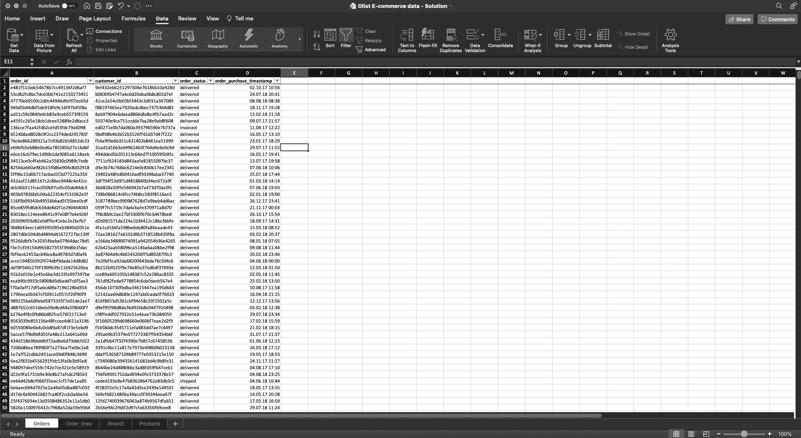

但是现在我们在 python 的土地上，事情有点不同(但是不会更难！).

使用。csv 文件，我们将使用包[熊猫](https://pandas.pydata.org/docs/)将其作为 dataframe(表格的别称)读取。我们将导入的表保存在具有适当名称的变量中。数据帧名称通常以 df 结尾。

```
# setup notebook and load tables
import pandas as pd

orders_df = pd.read_csv("data/Orders.csv")
order_lines_df = pd.read_csv("data/Order_lines.csv")
products_df = pd.read_csv("data/Products.csv")
```

太好了！我们刚刚将三个表加载到我们的 python 程序中。

我们有吗？

与 Excel 不同，导入的数据不会立即显示。如果你不明确说出你想看什么，Python 是相当沉默的。

在您使用 pandas 的 read_csv()方法导入 csv 文件并将其保存为 something_df 之后，我们可以使用 **something_df.head(5)** 显示前 5 行。

这样，我们可以简单地看到表的样子以及我们正在处理哪些列。让我们为我们的三张桌子做那件事。

**订单**将陈述所有交易、交易发生的时间以及订单是否已成功履行。每个订单都有一个 order_id(每个订单唯一)、customer_id(每个客户唯一)、order_status 和购买日期。

```
# Preview of the Orders table
orders_df.head(5)
```

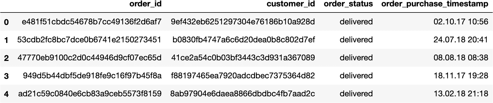

但是，orders_df 不包含单个订单的内容。为此，我们需要查看一下 **Order_lines** 表，并使用订单 id 连接这两个表。在 order_lines_df 中，每一行指一个交易项目，包括数量、价格和运费值。

```
# Preview of Order_lines table
order_lines_df.head(5)
```

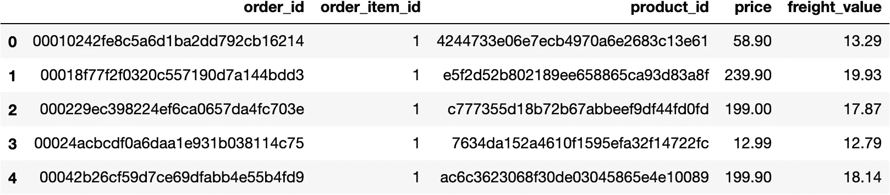

产品类别还不是这个表的一部分，所以我们需要将**产品**表(products_df)与 order_lines_df 结合起来，以防我们想要分析类别级别的数据。目前，products_df 中只有两列，产品 id 和相关的产品类别。

```
# Preview of Products table
products_df.head(5)
```

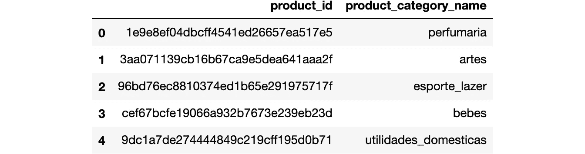

# 3.用数据回答我们的问题


来源:pix abay[https://pix abay . com/photos/audit-chart-graph-hand-writing-3229739/](https://pixabay.com/photos/audit-chart-graph-hand-writing-3229739/)

现在我们已经把所有的东西都载入了笔记本，我们可以开始用数据来回答我们的问题了。

## 3.1 🏬以交易数量衡量，这家公司实际上有多大？

因为我们在销售部门工作，所以当我们在这里谈论公司规模时，我们指的是**交易数量**。为此，我们可以从使用 python 的 len()方法计算 order_df 中的行数开始。这类似于单击 Excel 中的列并在屏幕底部读取计数。

```
len(orders_df)99441
```

或者，我们可以对 order_id 列使用 pandas pd.unique()方法，该方法将返回 order_id 的唯一值。在这种情况下，应该没有什么不同，因为订单 id 本质上是唯一的。

但是，如果我们对有重复项的列(如 customer_id)使用这种方法，那么我们对整个表使用 len()的结果将是不正确的。因此，让我们正确地使用 pd.unique()来获取唯一的订单 id，然后对其使用 len()。

注意:可以使用 table_df["column_name"]来访问表中的列

```
len(pd.unique(orders_df["order_id"]))99441
```

起初，我们对大量的交易感到惊讶，但随后我们注意到两件事:

*   **并非所有订单都已交付**。我们应该只查看使用 order_status 成功交付的订单。
*   这些交易发生在 2016–2018 的三个**年。我们应该看看每年的交易数量。**

我们先把所有没有发货成功的订单过滤掉。为了找出有多少 order_status 选项，我们将在 Excel 中单击该列的过滤器。

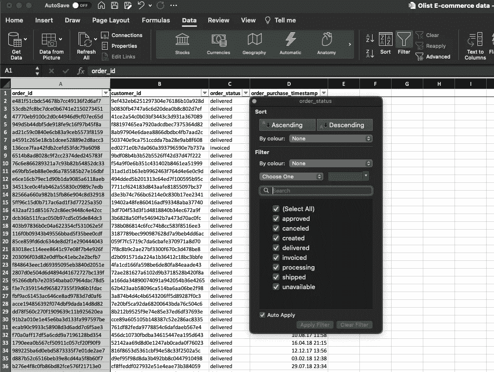

Excel 只向我们显示唯一的值，这很方便，但是正如我们刚刚了解到的，我们可以通过在 order_status 列上使用 pd.unique()来达到同样的目的。

```
pd.unique(orders_df["order_status"])array(['delivered', 'invoiced', 'shipped', 'processing', 'unavailable',
       'canceled', 'created', 'approved'], dtype=object)
```

在 Excel 中，我们只需取消选择除“已交付”之外的所有选项来过滤我们的表格。Excel 将检查每一行，只显示 order_status 等于“已交付”的行。

我们可以告诉 python 也这样做。如果我们的计算机是一个人，我们会告诉她:请以 order_df 表为例，只显示 order_df 表中“order_status”列等于“delivered”的行。幸运的是，我们的计算机不是人，需要更少的文本来做同样的事情。

翻译成 python 就是:

```
orders_df[orders_df["order_status"]=="delivered"]
```

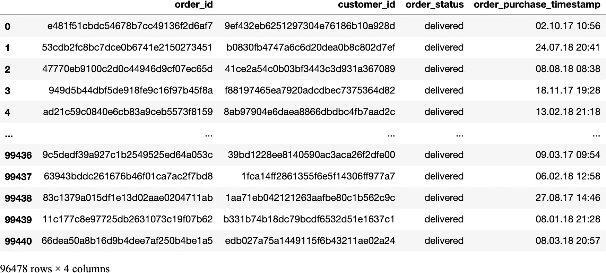

我们应该将过滤后的结果保存到另一个数据帧中，以便进一步使用该表。

```
delivered_orders_df = orders_df[orders_df["order_status"]=="delivered"]
```

接下来，我们希望对每年的交易进行细分。我们将把 order_purchase_timestamp 列转换成一个日期时间列。然后我们将**从中提取年份**，并保存到一个名为“year”的**新列中。**

这类似于使用 Excel 的 Year()公式。

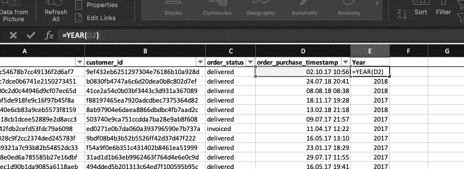

```
# the data type of this column is not yet datetime
delivered_orders_df["order_purchase_timestamp"].dtypesdtype('O')# convert to datetime
delivered_orders_df["order_purchase_timestamp"] = pd.to_datetime(delivered_orders_df["order_purchase_timestamp"])
delivered_orders_df["order_purchase_timestamp"].dtypesdtype('<M8[ns]')# extract the year from datetime and save to new column
delivered_orders_df["order_year"] = delivered_orders_df["order_purchase_timestamp"].dt.year# show the new table
delivered_orders_df.head(5)
```

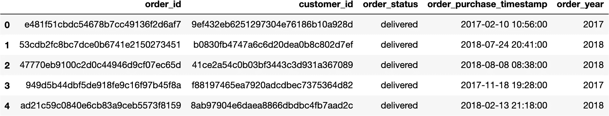

太好了！现在，我们拥有了统计每年交付订单所需的一切。在 Excel 中，我们会按年份过滤，对每一行进行计数，并将其写入一个新的汇总表。

更高级的 Excel 用户可以跳过这一手动任务，使用以年份为列的数据透视表，并计算 order_id 的值。

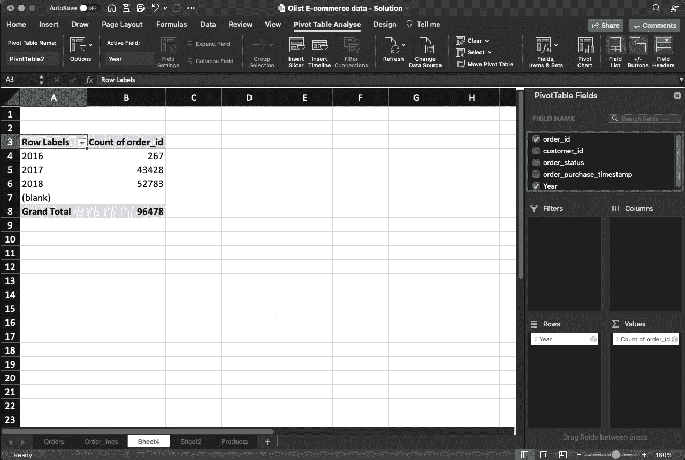

我们可以通过使用 pandas **groupby** 和 **agg** 函数来实现同样的功能。对于这样一个简单的任务来说，语法可能看起来令人生畏，但是这个函数是非常通用和强大的，这是 Excel 的 pivot 梦寐以求的。

首先，我们选择要聚合的表(what)，然后定义要聚合的列(where)，接着定义聚合函数(how)。

```
delivered_orders_df.groupby(by=["order_year"], as_index=False).agg({'order_id':'count'})
```


## 3.2 💵按年收入计算的公司规模？

在交易数量旁边，我们还想找出收入。如上所述，我们需要通过 order_id 作为键将 delivered_order_df 与 order_lines_df 结合起来。此外，我们注意到 order_lines 表有关于订单商品数量和价格的信息，但还没有收入的信息。

因此，这是我们需要做的:

*   用 order_item * price 的值在 order_lines_df 中创建一个列“line_revenue”
*   创建一个汇总表，将每个订单的 line_revenue 汇总为 order_revenue
*   将聚合表与 delivered_orders_df 合并，并合计每年的 order_revenue

在 Excel 中，我们会创建一个新列，使用一个数据透视表，使用类似 VLOOKUP 的东西将数据透视表与其他过滤表合并，在结果表上构建另一个数据透视表…

我们不要那样做。这不是一个复杂的任务，但是我们已经明白为什么我们应该切换到 Python 来完成这样的任务。一旦你习惯了语法和过程，一切都会变得更容易和更容易实现。

```
order_lines_df.head()
```


```
# create new column and save the result of order_item_id * price
order_lines_df["line_revenue"] = order_lines_df["order_item_id"] * order_lines_df["price"]
order_lines_df.head()
```

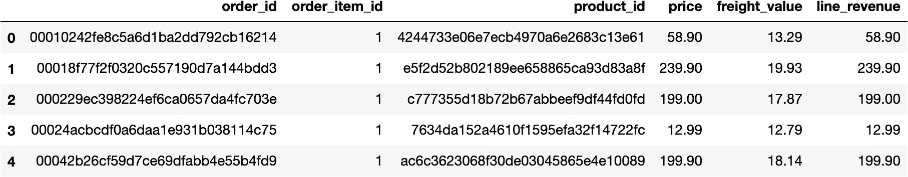

```
# aggregate table and sum up line_revenue to get the total order value per order id
order_lines_agg_df = order_lines_df.groupby(by=["order_id"], as_index=False).agg({"line_revenue":"sum"})
order_lines_agg_df.head(5)
```

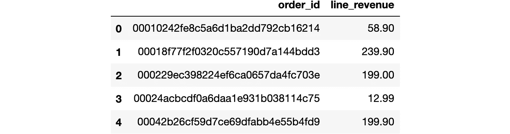

```
delivered_orders_df.head(5)
```


现在我们想合并上面的两个表，order_lines_agg_df 和 delivered_orders_df。就结果而言，我们所做的类似于 Excel 的 VLOOKUP()公式，但是我们**使用 order_id 作为键**来合并两个表。python 代码非常简单，几乎像散文一样。

之后，我们重复上面在计算每年的交易数量时所做的事情，但这次我们对 order_revenue 求和。

```
# merge the two tables to get revenue per order
delivered_orders_merged_df = pd.merge(left=delivered_orders_df, right=order_lines_agg_df, how="left", on="order_id")
delivered_orders_merged_df.head(5)
```

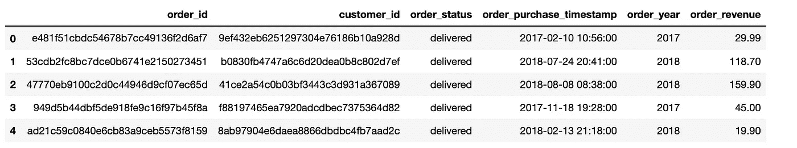

```
revenue_per_year_df = delivered_orders_merged_df.groupby(by=["order_year"], as_index=False).agg({"order_revenue":"sum"})
revenue_per_year_df.columns = ["order_year", "total_revenue"]
revenue_per_year_df
```


这看起来不对，对吧？不完全是。这被称为**科学记数法**，其中非常大或非常小的数字显示为计算结果。

4.649029e+4 表示 4.649029 * 10⁴表示 4.649029 * 10000 表示 46490.29。您可以使用以下代码片段更改 Jupyter 笔记本显示数字的方式。

```
pd.set_option('display.float_format', lambda x: '%.2f' % x)# display float numbers up to second decimal point
revenue_per_year_df
```


太好了！看起来我们公司很有活力。使用这种方法，我们可以计算各种各样的东西。比如每年的客户数量和平均订单价值。交易与客户的比率可能也很有意思，因为当一家公司的收入仅基于少数高价值客户时，该公司可能会面临风险。如果他们转向我们的竞争对手呢？

一旦你完成本教程，这些都是很好的调查问题。但首先让我们回到我们的其他问题。

## 3.3 👗每个类别我们提供多少产品？

既然您已经知道了如何计算一个列的唯一值，现在这将变得非常容易。上面，我们计算了 orders_df 中唯一 order _ ids 的数量。现在，我们必须计算 products_df 中的 product_id，以大致了解我们的产品范围，即**我们提供多少不同的产品**。

```
products_df.head()
```


```
# count unique products in our database
len(pd.unique(products_df["product_id"]))32951
```

由于我们还想知道每个类别的**产品数量，我们复制上面的方法，计算每年的交易数量。我们现在将使用“产品类别名称”而不是“订单年份”,并且使用“产品标识”而不是“订单标识”来计数。**

```
# count products per category
products_per_category_df = products_df.groupby(by=["product_category_name"], as_index=False).agg({"product_id":"count"})
products_per_category_df.columns = ["product_category_name", "product_id_count"]
products_per_category_df.head(5)
```

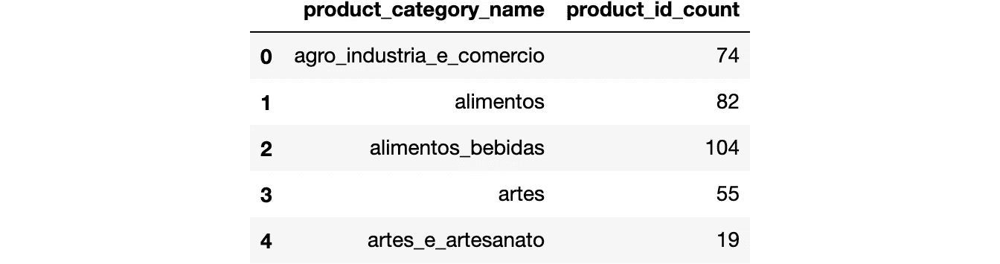

```
# number of categories
len(products_per_category_df)73
```

哇，我们提供 73 个类别的近 33，000 种产品？就产品数量而言，前 5 大类别是什么？

像在 Excel 中一样，我们只需按 product_id_count 对表进行排序。

```
# sort by product_id_count descending
products_per_category_df.sort_values(by=["product_id_count"], ascending=False).head(5)
```

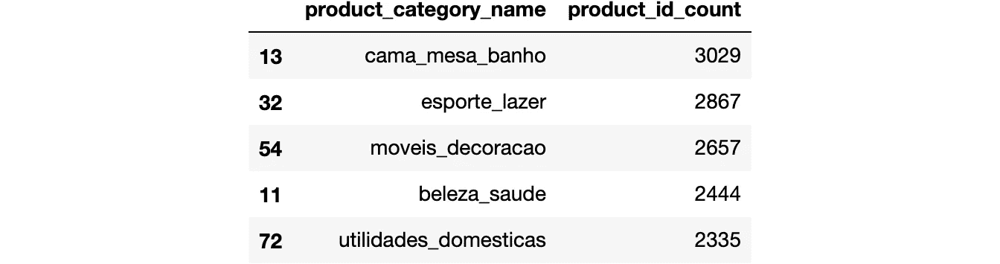

这可能是你发现在巴西公司工作时懂葡萄牙语很有帮助的地方…

## 3.4 📦我们的交付有多成功？

在 3.1 中，我们创建了一个只包含成功交付订单的新表。如果我们计算该表的唯一订单 id 数，并将该数除以未过滤的 orders_df 表中的唯一订单 id 数，那么我们就可以得到成功交付的百分比。

```
unique_orderids_total = len(pd.unique(orders_df["order_id"]))
unique_orderids_delivered = len(pd.unique(delivered_orders_df["order_id"]))

# calculate ratio and round to second decimal point
round(unique_orderids_delivered/unique_orderids_total,2)0.97
```

97%的交付成功率是我们公司值得骄傲的事情。

# 4.摘要

现在，由于 pandas，我们了解到使用 python 是 Excel 的真正替代方法，我们有点忘乎所以，根据来自三个原始表的聚合数据计算了各种 KPI。快速看一下手表就能知道我们的胃已经知道了什么:该吃午饭了！

但是在我们去公司之前。文鼎机器，我们想保存我们所做的，并将其发送给我们的同事。我们如何做到这一点？

我们可以简单地**将数据帧导出为 csv 文件**，并将它们发送给那些喜欢使用 Excel 的人。

```
# Export dataframe as csv for Excel
products_per_category_df.to_csv("output/products_per_category_df.csv", index=False)
```

今天，我们学习了一些基本但强大的函数，这些函数允许我们用 Python 代替 Excel 工作。这里有一个总结。

*   *pd.read_csv()* 可以用来导入。作为数据帧的 csv 文件
*   *table_df.head()* 向我们展示了该表的预览输出
*   为了访问 table_df 的一列，我们键入*table _ df[" column _ name "]*
*   *len(PD . unique(table _ df[" column _ name "])*给出该列中唯一值的数量
*   我们可以将两列相乘，并使用*table _ df[" new "]= table _ df[" col 1 "]* table _ df[" col 2 "]*将结果保存在新列中
*   除了 Excel 的数据透视表，我们还可以汇总每个类别的值，例如，使用*table _ df . group by(by =[" category "]，as_index=False)计算每年的交易次数或合计每个订单的收入。agg({"col3":"sum"})*
*   除了在 Excel 中使用 VLOOKUP()，我们还可以使用 *pd.merge(left=table_1_df，right=table_2_df，how="left "，on="key_column")*

我建议你继续下去，进一步研究这个数据集或你自己的数据集。每当你不知道如何做某件事时，最好的方法是查看熊猫文档或谷歌你的特定问题(“来自字符串的 python 日期时间”或“python 数据透视表”)，看看其他人是如何做的。只是不要气馁，继续学习！


开始总是艰难的，但坚持下去，你会比任何 Excel 专业人员更有效、更快。如果你需要一些关于数据分析和数据科学是否可以成为你的职业道路的一般性指导，我们 [HOSD 辅导公司提供免费的一对一辅导](http://www.hosd-mentoring.com)。

只需在我们的网站上点击一下，您就可以预约我们的导师。不要害羞:)

此外，我们想宣布，本教程和许多其他教程将在会议结束时变成一个带有问答环节的在线研讨会。要了解更多关于我们的产品或与我们联系，请务必前往我们的 [HOSD LinkedIn 页面](https://www.linkedin.com/company/hosd-mentoring/)。

坚持学习！

乔纳斯

HOSD 创始人兼数据分析师导师