# 面向 Excel 用户的 Python 第 2 部分

> 原文：<https://towardsdatascience.com/python-for-excel-users-part-2-2a85721560cd?source=collection_archive---------27----------------------->

## 修改和操作 Excel 文件(更新销售报告)


图片由作者提供。来自 Unsplash 的背景图片。

本教程系列面向所有想开始使用 python 而不是 Excel 的人，例如，自动化任务或提高速度和可伸缩性。或者只是出于好奇。

这个博客文章系列是为你准备的，当:

*   您可以使用 Excel 合并各种工作表或表格(使用诸如 Index、Match、VLookup
*   使用简单的数学运算，如求和与平均
*   使用条件聚合函数(例如，每个类别的交易总和)或数据透视表

它不会涵盖您需要了解的转储 Excel 的所有内容，也不是本系列的目标。[第 1 部分](/python-for-excel-users-part-1-c44bacff4adc)意在让你开始并改变你的思维模式，从 Excel 到 Python/Pandas。第 2 部分将介绍如何通过 python 更新给定的 Excel 报表。

虽然 Excel 有它自己的位置，而且非常快速和方便，但我希望这个博客文章系列能够帮助您探索除 Excel 之外的其他数据处理方式。

你可以在 Jupyter 笔记本上找到这篇博文，以及我们在 [HOSD 指导 GitHub repo](https://github.com/HOSD-Mentoring/presentations/tree/main/From%20Excel%20to%20Python%20-%20Part%201) 中使用的数据。

## 目标:

在这一部分中，我们面临的任务是用新数据更新某个 Excel 文件，即销售报告。我们将看到两种方法，其中一种是有意义的，我们将在笔记本的最后讨论进一步使用第二种方法的原因和动机。

## 要求:

虽然 python 的一些基本经验会有所帮助，但你不必成为一名程序员或数据科学家来遵循本教程。理想情况下，您应该听说过熊猫和 jupyter notebook，并亲自花了一些时间使用 python。

但是不要气馁。试着跟上并阅读我们没有涉及的内容。你可以随时回到这里或者重访其他地方。如果你需要一些个人指导，我们在 www.hosd-mentoring.com[的 HOSD 辅导公司提供免费的一对一数据辅导](http://www.hosd-mentoring.com)

# 1.形势

在第一部分中，我们假设你刚开始是一家大型在线零售商销售部门的数据分析师。在过去的几周里，你深入研究了企业产生的各种数据。当然，你还要负责制作定期的销售报告。

该公司以 Excel 模板的形式提供了这些报告的一般结构。最重要的报告之一是**月度销售报告**。许多企业领导人喜欢这种一站式报告，因为它以数字和视觉的方式展示了企业的健康和发展。

作为一名新员工，你发现这种报告已经过时。您与您的老板交谈，建议使用直接连接到数据源的报告和可视化工具，如 PowerBI 或 Tableau。然而，在这一点上，由于一些奇怪的业务原因，这个选项是不可行的，所以我们被迫尽我们所能处理给定的 Excel 报告。

这就是报告的样子。

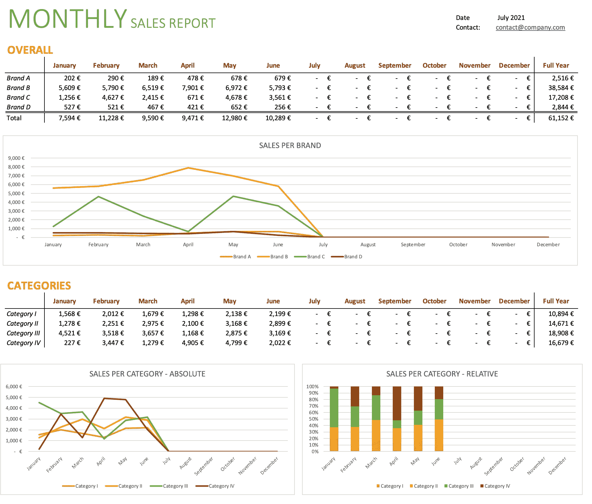

作者图片

虽然本教程不是关于做分析，而是关于更新和维护一个给定的 Excel 报表的过程，但是会出现一些策略问题，这些问题可能会导致当前报表的有用扩展。

**几个战略问题:**

*   随着时间的推移，某些品牌是如何发展的(绝对和相对)？
*   产品类别的发展(绝对和相对)
*   5 大增长和亏损产品

由于现在是 8 月，公司要求我们用下面显示的 7 月数据更新报告。

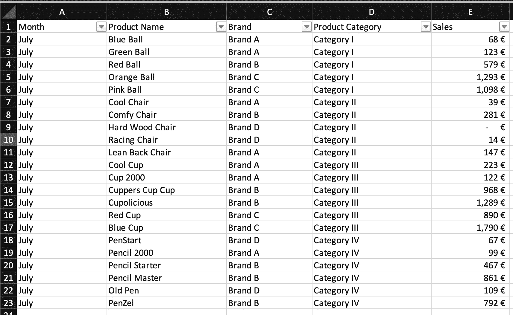

作者图片

我们可以在 Excel 中完全做到这一点，例如通过创建数据透视表，一个用于品牌，一个用于类别，然后将汇总的销售数字复制到七月份的汇总表中。

然而，虽然这种只有四个品牌和类别以及不到 20 种产品的手工工作是可行的，但该公司预计将在未来几个月内大幅增加其产品。因此，开始建立一个更加可扩展和自动化的过程是合理的。

# 2.使用 Python 更新 Excel 报表

我们已经知道如何使用 pandas 通过 pd.read_csv 方法读取 csv 文件。幸运的是，熊猫也有读取 Excel 文件的方法: [pd.read_excel()](https://pandas.pydata.org/pandas-docs/stable/reference/api/pandas.read_excel.html) 。

让我们看看它看起来怎么样。

```
import pandas as pd

# Read sales for july
sales_july = pd.read_csv("data/sales_july_export.csv")
sales_july.head()
```

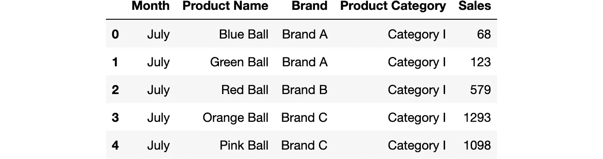

作者图片

```
# Read excel file with pandas
monthly_sales_report = pd.read_excel("data/Monthly Sales Report.xlsx")
monthly_sales_report
```

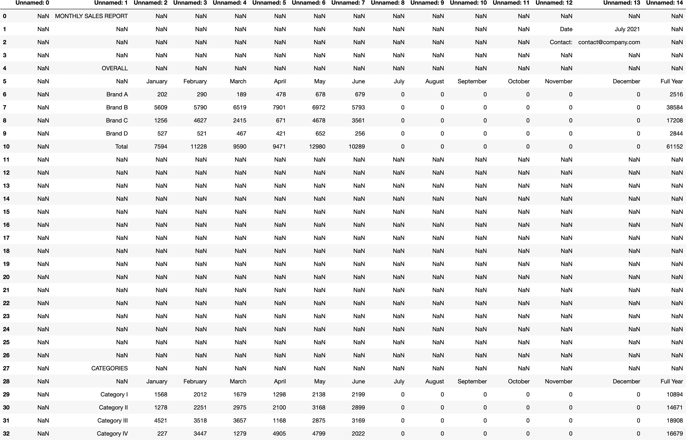

作者图片

呃！这看起来很奇怪，一点也不像我们在 Excel 中打开的报告。

原因是 pandas 只是试图将每个单元格的内容显示为数据帧中的一个值。因此，格式以及合并和组合的单元格都会被忽略。曾经漂亮的视觉效果不再是有 nan 的空牢房。

通常，在 pandas 中使用 Excel 数据需要清理数据框架，例如删除所有不必要的行和列(如标题)。这个过程被称为切片，你可以在熊猫官方文档[中读到更多关于索引和选择数据的信息。](https://pandas.pydata.org/pandas-docs/stable/user_guide/indexing.html)

例如，这是品牌表的样子。

```
# create copy of full report df to slice
monthly_brand_df = monthly_sales_report.copy()

# use first row as header (alternative: set header parameter when reading excel file)
monthly_brand_df.columns = monthly_brand_df.iloc[5]

# only keep relevant rows with data for brand sales
monthly_brand_df = monthly_brand_df[6:11]

# first column is always empty as it exists purely for formatting reasons; drop it
monthly_brand_df = monthly_brand_df.iloc[:,1:]

# reset index after slicing
monthly_brand_df.reset_index(drop=True, inplace=True)

# change column names
monthly_brand_df.columns = ['Brand', 'January', 'February', 'March', 'April',
                            'May', 'June', 'July', 'August', 'September',
                            'October', 'November',  'December', 'Full Year']

monthly_brand_df
```

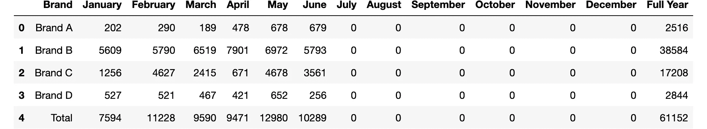

作者图片

然而，在这个场景中，我们感兴趣的不是仅仅处理数据，而是用新数据更新报告。事实上，我们只需要接触几个单元格，即对应于七月的单元格。

因此，假设报表的结构保持不变，我们正在寻找一种用指定值填充指定单元格的方法。

因此，我们的方法是:

*   步骤 1:在品牌和产品类别级别上计算七月份的销售额(两个汇总表)
*   步骤 2:将数据写入 Excel 报表，并保存新的更新版本

## **第一步:计算 7 月份汇总表**

本质上，我们将做与使用 excel 中的数据透视表相同的事情，在 excel 中，我们使用*品牌*作为一行来合计*销售额*。

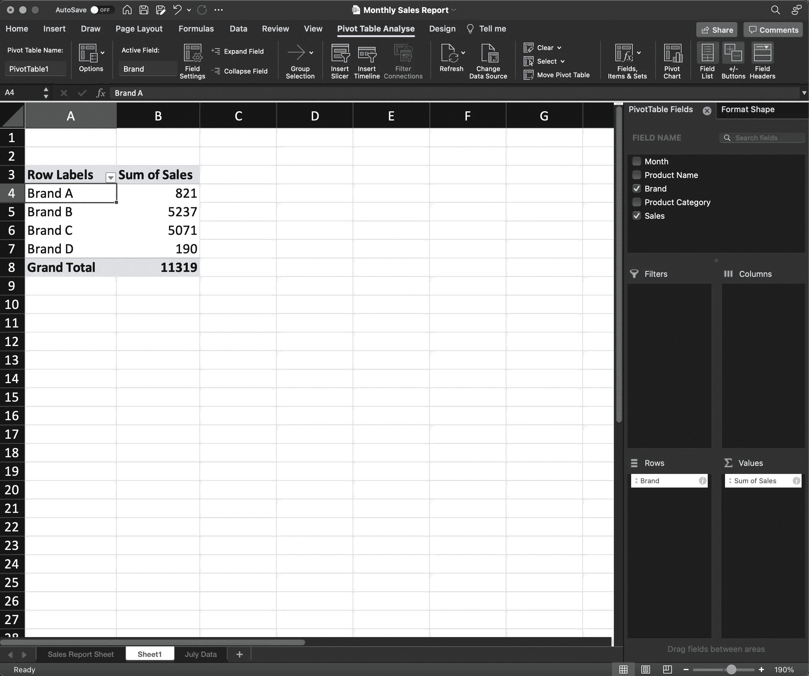

作者图片

接下来，我们使用*产品类别*而不是*销售*做同样的事情。这就是我们如何使用熊猫在 python 中实现的。

```
sales_july.head(5)
```


作者图片

```
# sales by brand
sales_july_by_brand = sales_july.groupby(["Brand"], as_index=False).agg({"Sales":"sum"})
sales_july_by_brand
```


作者图片

```
# sales by category
sales_july_by_category = sales_july.groupby(["Product Category"], as_index=False).agg({"Sales":"sum"})
sales_july_by_category
```


作者图片

## 第 2 步:将数据写入 Excel 报表

好了，现在我们已经计算了我们的小例子中需要的所有销售数字，我们可以更新 Excel 文件了。

例如，我们知道我们需要用品牌 a 的七月销售数字更新第**行第 6** 和第**列未命名:8** 中的单元格。

```
# helper functions to color certain cells green
def highlight_cell(x):
    df = x.copy() 
    df.loc[:,:] = '' 
    df.at[6,"Unnamed: 8"] = 'background-color: lightgreen'
    return df 

def highlight_cells(x):
    df = x.copy() 
    df.loc[:,:] = '' 
    df.at[6,"Unnamed: 8"] = 'background-color: lightgreen'
    df.at[7,"Unnamed: 8"] = 'background-color: lightgreen'
    df.at[8,"Unnamed: 8"] = 'background-color: lightgreen'
    df.at[9,"Unnamed: 8"] = 'background-color: lightgreen'
    return df 

def highlight_grandtotal(x):
    df = x.copy() 
    df.loc[:,:] = '' 
    df.at[10,"Unnamed: 8"] = 'background-color: yellow'
    return df# ugly imported excel file
monthly_sales_report.head(15).style.apply(highlight_cell, axis=None)
```


作者图片

```
# take sales for Brand A from sales_july_by_brand and write to monthly_sales_report to a specified cell
monthly_sales_report.at[6, "Unnamed: 8"] = sales_july_by_brand.at[0, "Sales"]

# see updates
monthly_sales_report.head(15).style.apply(highlight_cell, axis=None)
```

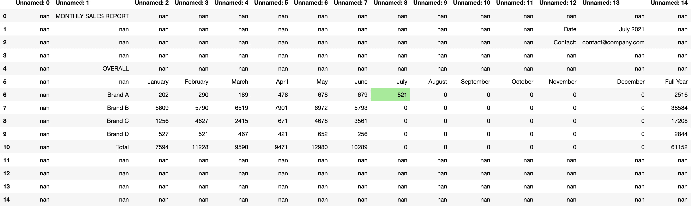

作者图片

我们可以通过循环遍历这些行四次来更新其他品牌，并重复上面的操作。

```
# update July sales for all brand
for i in range(4):
    monthly_sales_report.at[i+6, "Unnamed: 8"] = sales_july_by_brand.at[i, "Sales"]

# see updates
monthly_sales_report.head(15).style.apply(highlight_cells, axis=None)
```

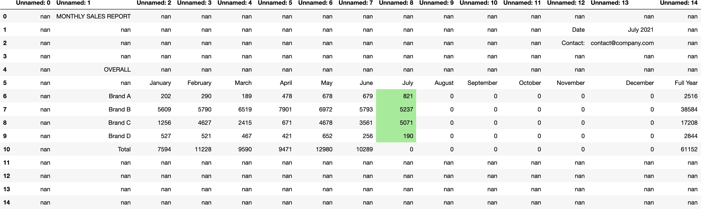

作者图片

要更新所有品牌的总销售额，我们需要对所有品牌求和，并将结果写入单元格 monthly_sales_report.at[10，" named: 8"]

```
monthly_sales_report.head(15).style.apply(highlight_grandtotal, axis=None)
```

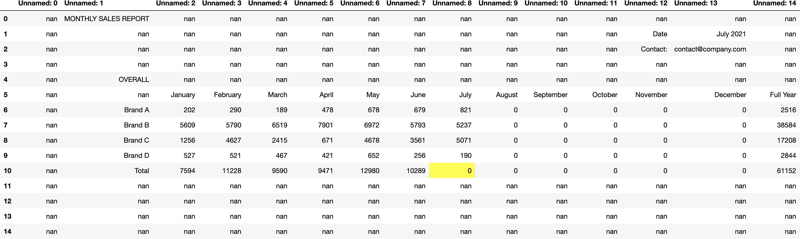

作者图片

```
# calculate sum over all brands for July
total_sum = sum(sales_july_by_brand["Sales"])
print(total_sum)

# write total sum to table
monthly_sales_report.at[10, "Unnamed: 8"] = total_sum

# show updates
monthly_sales_report.head(15).style.apply(highlight_grandtotal, axis=None)11319
```


作者图片

```
# Same approach for updating sales per category
for i in range(4):
    monthly_sales_report.at[i+29, "Unnamed: 8"] = sales_july_by_category.at[i, "Sales"]

# see updates
monthly_sales_report
```

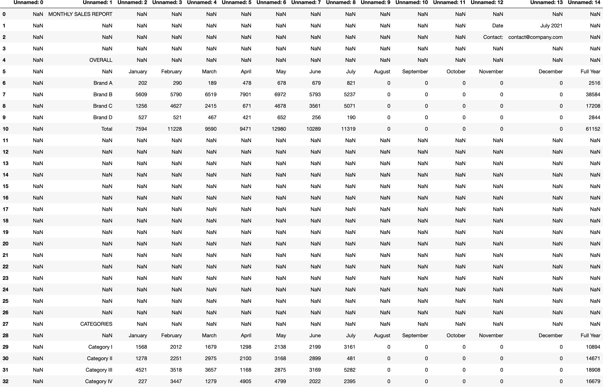

作者图片

```
# save excel file
monthly_sales_report.to_excel("monthly_sales_report_updated_1.xlsx")
```

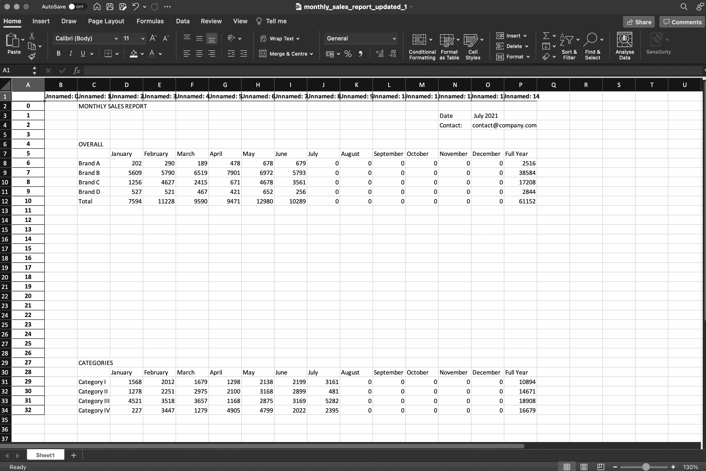

作者图片

## 替代方案:将数据直接写入 Excel 报表(目前是真的)

当你在阅读最后一节时翻了翻白眼，问自己为什么要用 python 来更新如此复杂的简单 Excel 文件时，我为你提供了另一个选择，而不是使用 pandas。

上面的方法有两个缺点。首先，它太复杂了。第二，从 Excel 加载数据，在数据框架中操作数据，并将其保存回 Excel，这将删除所有格式设置和图形等非数据内容。上面的截图显示。


或者，我们希望找到一种方法，不将报告数据作为数据帧导入，而是将数据直接写入 Excel 报告中的指定单元格。包装 [xlwings](https://www.xlwings.org) 可用于此目的。

```
import xlwings as xw

excel_app = xw.App(visible=False)
excel_book = excel_app.books.open("data/Monthly Sales Report.xlsx")
sheet = excel_book.sheets[0]

# Directly write July sales for Brand A to corresponding cell in Excel
sheet.range("I8").value = sales_july_by_brand.at[0, "Sales"]
excel_book.save()

#excel_book.close()
#excel_app.quit()
```

当我们切换到 Excel 时，我们可以看到单元格 I8 不再是空的。

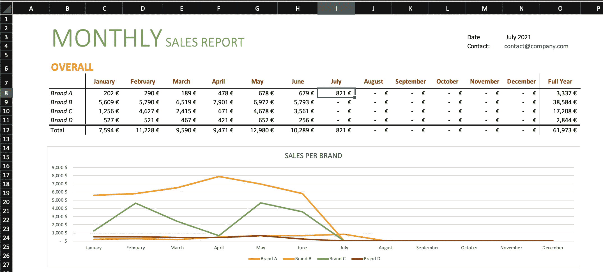

作者图片

我们可以使用这种方法将计算出的七月份品牌级别和类别级别的销售额写入相应的单元格。

为此，我们定义了单元格的范围，例如品牌级销售的 I8:I11，并使用了转置选项。否则，数据将从左向右写入一行，而不是一列。

```
# update a list of cells with a list of values (brand-level and category-level sales) caluclated above
sheet.range('I8:I11').options(transpose=True).value = sales_july_by_brand["Sales"].values
sheet.range('I31:I34').options(transpose=True).value = sales_july_by_category["Sales"].values
```

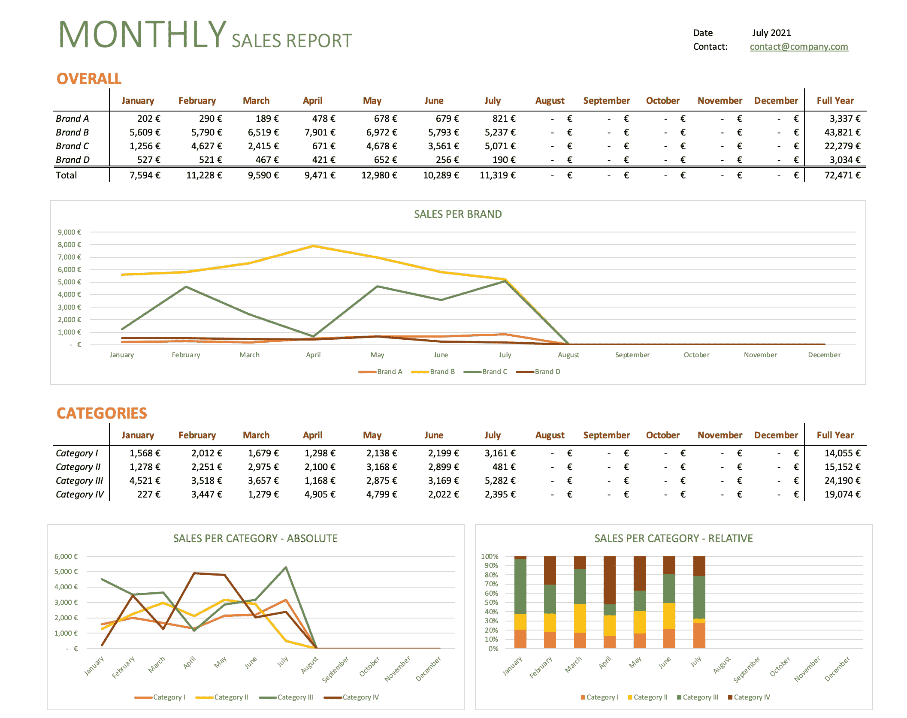

作者图片

请注意，与之前的方法不同，我们不需要再次计算总和，因为 **Excel 公式仍然保持不变**。

此外，**图会自动更新**，因为它们是基于单元格值的。

因此，这种使用 xlwings 更新 Excel 报表的方法应该是首选方法。

# 3.但是为什么不继续使用 Excel 呢？

如果完全在 Excel 中完成，你可能会快得多——明白了。我之所以在这里使用这个简单的例子，是为了说明由于 xlwings，使用 Python 向 Excel 中指定的单元格写入值是多么容易，所有的公式和连通图都保持不变。

现在，你为什么想用 python 向 Excel 写值呢？

比方说，你必须更新销售数据，不是每月，而是每天(频率)，不是四个品牌，而是数百个其他子类别(数据量)。

更新的**频率会使手工工作不是一个非常有吸引力的选择，而运行预定义的灵活脚本可以在几秒钟内处理更新过程。**

子类别的**数量**，您需要单独的数据透视表或更复杂的条件公式，只支持这一点。与 Excel 相比，Python 在处理更大的数据集时表现更好，因此外包数据处理是有意义的。

此外，Excel 本身无法完成的计算类型怎么办？

假设您想要写入 Excel 文件的输出值不是简单的条件聚合的结果(例如品牌 1 在 7 月的销售额)，而是复杂的机器学习模型的**结果(例如使用神经网络预测的销售额)。**

当然，您可以导出模型结果并将 Excel 文件连接到输出文件，但是不难想象，将结果直接写入 Excel 表格可能是更好的方式。

## Python 作为 Excel 的插件

另一种方法是[使用 xlwings 插件](https://docs.xlwings.org/en/stable/addin.html)在 Excel 中使用 python。我对这个选项不是很熟悉，但是对于一些必须尽可能多地在 Excel 中工作的人来说，这似乎是一个很好的工作流程，例如，对于那些向不能或不愿意使用 jupyter 笔记本或普通 python 脚本的客户交付数据产品的顾问来说。

如果您对此感兴趣，并且希望进一步了解 xlwings 的功能，这里有几篇文章可供跟进:

*   [Python Excel 与 Xlwings 的集成](/python-excel-integration-with-xlwings-f9bf9d1332ea)
*   [如何用 Python 为 Excel 增压](/how-to-supercharge-excel-with-python-726b0f8e22c2)
*   [用 Python 桥接 Excel:XL wings](https://ernest-huang.medium.com/bridging-excel-with-python-xlwings-2e3f47cf4ac5)

在这一点上，我还想指出，xlwings 的创始人 Fleix Zumstein 在 2021 年 3 月出版了一本 O'Reilly 的书 [Python for Excel](https://www.amazon.de/Python-Excel-Environment-Automation-Analysis/dp/1492081000/ref=sr_1_3?__mk_de_DE=%C3%85M%C3%85%C5%BD%C3%95%C3%91&dchild=1&keywords=python+for+excel&qid=1628227423&sr=8-3) 。

他在这段 YouTube 视频中描述了他的书的内容。


图片来自 https://www.xlwings.org/book

虽然我个人对此没有任何经验，但使用 xlwings 作为 Excel 中的插件来直接运行 python 脚本而不是复制输出，从而为客户端提供或多或少自包含的 Excel 解决方案的可能性对于某些用例来说可能是一种很大的可能性，因此值得探索。

# 4.摘要

我们试图通过 pandas 使用我们在第 1 部分中学到的方法更新一个给定的 Excel 报表。然而，**导入和导出 Excel 文件会改变格式，删除公式和图表**。

python 包 **xlwings 允许我们直接在指定的 Excel 单元格**中编写输出，因此只在我们希望的地方更改文件，同时保持公式和连接图的完整性。

在这样一个简单的用例中，将数据处理外包给 python 可能没有必要。然而，假设品牌和产品的数量以及更新频率显著增加，这证明我们已经在考虑自动更新报告的**方法**。

此外，一旦我们离开 Excel 的舒适环境，我们使用 python 的能力将是无穷无尽的。我们可以或多或少地使用机器学习模型的输出来扩展报告，而不需要手动导入它们。这些复杂的定制模型中有许多不能仅仅在 Excel 中定义和计算。

因此，这里概述的方法将是我们数据分析师工具箱中的一项好技能。

我再次鼓励你考虑一下你在工作中的情况或者你的个人数据项目，像 xlwings 这样的工具可以帮助你，然后尝试一下。开始总是艰难的，但坚持下去，你会比任何 Excel 专业人员更有效、更快。

如果你需要一些关于数据分析和数据科学是否可以成为你的职业道路的一般性指导，我们 [HOSD 辅导提供免费的一对一辅导](http://www.hosd-mentoring.com)。只需在我们的网站上点击一下，您就可以预约我们的导师。

不要害羞:)