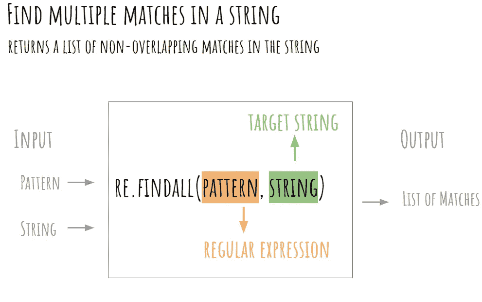

# Python 从 A 到 Z (1)

> 原文：<https://towardsdatascience.com/python-from-a-to-z-8a37e0573773?source=collection_archive---------22----------------------->

## 你应该知道的 26 个概念——第一部分:从 A 到 J

图片由[亚历山大·奈特](https://unsplash.com/@agk42)在 Unsplash 拍摄

Python 是全球领先的编程语言之一。它被用在从数据科学、机器人、网络开发到游戏和快速原型制作的许多环境中。其简单的语法使 Python 程序非常容易阅读和编写，确保了快速的学习曲线。此外，Python 有“电池包”——多个库(标准库和第三方库)，这将极大地方便程序员的工作。虽然与其他编程语言相比，可以更快地达到基本编程水平，但掌握 Python 肯定需要一些时间。在这一系列文章中，我们将**详细解释 Python 的 26 个特性**，帮助您发现 Python 拥有的巨大能力范围。

# 蟒蛇

Anaconda 是一个用 Python 管理包和环境的程序。它广泛用于数据科学领域，因为在安装 Anaconda 时，默认情况下会安装数据科学中最常用的包。

如果需要，Anaconda 还允许您通过在 anaconda 提示符下键入命令`conda install package_name`来安装任何包。安装包时，**也可以一次安装多个包**，比如命令`conda install pandas numpy`会同时安装 pandas 和 NumPy。Anacondas 安装最新版本的软件包；但是，如果您的项目需要以前的版本，您可以通过添加版本号来指定它，如下所示:`conda install pandas=0.22`。

通过分别使用命令`conda remove package_name`和`conda update package_name`，Anaconda 还可以用于在您的环境中卸载和更新软件包。

除了包管理器之外，Anaconda 还可以用来创建隔离项目的环境。虚拟环境允许在特定项目的隔离目录中本地安装包。当我们需要在不同的 Python 版本和安装包版本之间切换时，这种方法特别有用。

用 Anaconda 创建虚拟环境非常简单。您只需要在 Anaconda 提示符下键入`conda create -n environment_name [python==X.X] [list_of_packages]`(括号中提供的参数是可选的)。例如，您可以基于 Python 版轻松创建一个名为`myenv`的虚拟环境，如下所示:`conda create -n myenv python==3.6`。在这种特殊情况下，我们在创建环境时没有指定要安装的软件包列表。一旦环境被激活，也可以在以后安装附加的软件包。

创建新环境后，您需要通过键入`conda activate environment_name`来激活它。最后，要离开当前的活动环境，在提示符下键入`conda deactivate`命令。重要的是要记住，这只是介绍如何将 Anaconda 用作包和环境管理器。由于篇幅有限，还有许多操作和命令没有在本简介中详细说明。

# 美味的汤

**互联网**是**最重要的信息资源**之一；然而，在大多数情况下，很难从网页中获取数据，因为信息是嵌入在 HTML 代码中的。这不像下载一个 CSV 文件那么简单。因此， **Python 提供了各种各样的工具来简化从互联网上提取数据的过程**。

**美汤**是一个广泛使用的**第三方库，用于从一个 HTML 文档**中提取任何数据。它允许您轻松地交互和浏览 HTML 代码，并获得您需要的特定信息(例如页面上的所有图像)。该库提供了不同的方法和属性来从网页中识别和提取所需的信息——使用 Python 字符串方法将是一项非常复杂和耗时的任务(但却是可能的)。

**创建一个漂亮的汤对象**是任何漂亮的汤项目的第一步。可以用`BeautifulSoup`构造函数创建一个漂亮的 Soup 对象，传递一个字符串(HTML 代码)作为参数。在下面的例子中，我们使用请求库获得网页(【https://en.wikipedia.org/wiki/Madrid】)的 **HTML 代码**(作为字符串)。然后，我们用`BeautifulSoup`解析 HTML 代码，使其更易于获取信息。

提取的 HTML 代码看起来相当混乱，但是`BeautifulSoup`将这些代码转换成易于解析的树形结构。如上所述， **Beautiful Soup 包含了一些从代码中提取信息**的简便方法。例如，您可以通过使用`find_all('a')`方法获得文档中的所有锚标记。此外，您还可以通过在查询中添加关键字参数`id`或`class_`来根据 ID 或类名查找 HTML 元素。

您可以使用更多的函数和属性从 HTML 文档中提取信息(在文档中有详细的解释)。

<https://beautiful-soup-4.readthedocs.io/en/latest/>  

需要指出的是，为了从代码中提取特定的信息，您总是可以使用浏览器的开发工具**来交互式地浏览 HTML 代码并找到信息所在的位置，然后您可以编写最佳的漂亮的 Soup 查询来检索这个特定的信息。**

# **类**

**面向对象编程**允许将变量和函数组合成一种数据类型，称为**类**。对于大型程序， **OOP 给你的代码增加了组织性**，把你的程序分解成更小的部分，更容易理解和调试。

Python 中的**类是创建对象**的蓝图，由方法和属性组成。要定义一个类，您将使用`class`关键字，后跟类名(使用 CapWords 约定)。下面的代码定义了由两个属性和一个方法组成的`Circle`类。

班级圈(图片由作者创作)

**属性描述了对象**的特征(在本例中是颜色和半径)，并在`__init__`函数中定义。该函数放在类的开头，在类启动时自动执行。

**方法是一个类可以采取的动作**(例如计算圆的面积)。它们与函数非常相似(都使用`def`关键字)，不同之处在于**方法是在类**内部定义的，而不是在类外部定义的。

定义了类之后，您可以**创建一个对象**。创建对象的过程称为**实例化**。在这种情况下，对象将是一个特定的圆，例如，一个半径为 5 的红色圆。

不同的圆形对象(图片由作者创建)

随后，我们可以再次使用`Circle`类来创建该类的更多实例。所有对象都有相同数量的属性和方法，基本上是因为它们来自同一个蓝图——`Circle`类。

一旦`red_circle`对象被创建，你可以使用点符号访问它的**属性**。同样使用点符号，您可以调用一个类的**方法**，但是在这种情况下，您必须在括号内指定输入参数。

# 

一个`defaultdict`工作起来非常像一个 Python **字典**，意味着两个类共享方法和操作。`defaultdict`功能在模块`collections`中定义。这个模块是 **Python 标准库**的一部分，意味着不需要额外安装。要访问该功能，我们必须在程序的开头包含`from collections import defaultdict`。

在**字典**中，当我们试图访问一个尚未定义的键(不存在的键)时，会引发`KeyError`异常。

然而，当使用`defaultdict`时，将创建一个新的键(使用提供给`defaultdict`构造函数的参数),而不会引发任何异常。该参数必须是一个可调用的对象或无。

在下面的代码中，当试图访问一个不存在的键时，调用函数`int`。该函数返回的值，在本例中为 0，将被分配给丢失的键。

提供给`defautdict`构造函数的参数也可以是用户定义的函数(在本例中是 lambda 函数)，如下所示。

# 编码(字符)

一个**字符编码**提供了计算机中的**字节**(原始零和一)和**真实字符**之间的映射(翻译)。

编码(图片由作者创建)

多年来，编程语言使用 **ASCII** 作为字符的内部表示。本标准包括 **128 个字符**使用 7 位信息。它涵盖所有英文字符(它最初是为美国的电子通信开发的)；但是，它未能涵盖出现在其他世界语言中的字符，如带有口音的字符。由于这个原因，在过去的几年中，出现了向 Unicode 编码的转变。该标准包含更广泛的字符和符号，根据编码类型使用 8、16 或 32 位信息，与 ASCII 相比自然需要更多的空间。

除了 ASCII 和 Unicode，Python 还支持多种编码。Python 中可用编码的完整列表可以在`codecs`模块的 Python 标准文档中查阅。

  

在处理文本数据时，编码是必须考虑的因素。重要的是要记住，Python 用于需要编码的操作(比如读取文件)的默认编码是 UTF-8。**处理文件时，由于编码不一致而导致字符显示不正确或异常是一个常见问题。**因此，在读取文件时，您需要通过在`open`函数中包含参数`encoding`来指定所使用的编码(当它与默认编码不匹配时)。

# **Findall (re 模块)**

使用正则表达式通常可以简化文本处理。正则表达式是用于匹配字符串中字符组合的模式。它们在测试操作中非常有用，这就是为什么 Python 标准库有一个专门处理正则表达式模式的模块——re 模块。这个模块提供了各种各样的函数，在处理文本数据时您肯定会遇到的一个函数是`findall`函数。

`re.findall(pattern, string)`函数从字符串(`string`)中提取正则表达式(`pattern`)的所有非重叠匹配。函数的第一个参数是一个正则表达式，而第二个参数是我们要搜索的字符串。该函数返回一个字符串列表，其中每个元素都是非重叠匹配的。

Findall 函数(图片由作者创建)

下面的代码从字符串中提取所有数字(包括十进制数字)。我们不打算深入讨论正则表达式如何工作的细节。为此，我们需要再写一篇文章😛。你会盲目地相信这个模式可以提取数字。

如上所示，`findall`函数返回一个字符串列表，包含所有不重叠的匹配。提取数据后，我们可以很容易地使用 list comprehensions 将列表中的每个字符串转换为 float。

在这种情况下，使用的模式非常简单；然而，正则表达式可以变得更加复杂。它们可以方便地从文档中提取网页、电子邮件、密码或电话号码，是从文本数据中获取信息的一个非常强大的工具。

# Get(字典法)

在 Python 中使用字典时，`KeyError`异常是**常见的异常。当用户试图访问一个不在字典中的`key`时，就会引发这个异常。**

在下面的代码示例中，当试图访问字典中不存在的`key`时，会引发一个`KeyError`异常。

为了处理这个问题，除了使用`try except`模块，一个常见的解决方案是采用`get`方法。该方法返回在指定的`key`找到的值(如果`key`可用)。相反，如果`key`在字典中不可用，`get`方法返回`None`或一个自定义值，从不引发异常。

永远记住，为了避免使用字典时出现`KeyError`异常，您可以从直接访问字典的`key`切换到使用`get`方法。这将防止在代码执行过程中出现意外异常。

# 帮助

在 Python 中工作时，记住每个函数的语法有时是一个挑战，尤其是那些你很少使用的函数。Python `help`函数提供了对特定函数文档的访问，显示了该函数的功能及其语法。

以下代码总结了`hasattr`功能。如下所示，`help`函数打印关于该函数如何工作及其定义的基本信息。

除了`help`功能之外，Python 还提供了更详细的文档，可以在线查阅。

# 索引错误

Python 中的有序容器(例如列表或元组)通过位置(索引)来标识它们的元素。 **Python 遵循一种称为从零开始的索引**的约定，这意味着有序容器中的第一个元素位于索引 0 处。

要访问列表中的元素，可以使用一个**索引操作符**，它由一对方括号(`[]`)和一个**索引**(从 0 开始)组成，指定要检索的元素。

访问列表元素(由作者创建的图像)

如果您试图访问列表中超出可用元素范围的项目，您将得到一个`IndexError`异常，如下所示。

出现这种错误是很常见的，尤其是如果您刚刚开始学习 Python 的话。如果您来自 R，错误的索引是您将面临的常见错误，因为 R 与 Python 不同，它使用基于一的索引。

# Join(字符串方法)

`join`方法用于**将包含在 iterable 中的字符串连接成一个字符串**。该方法的语法如下所示，其中`string`表示插入 iterable 的每个元素之间的**分隔符**，而`iterable`是我们想要连接的字符串的**序列(必需参数)。该序列可以是例如列表、元组、字典、集合或生成器。**

> string.join(iterable)

下面的代码块展示了我们如何使用 Python 中的`join`方法来连接字符串。正如您所看到的，`join`方法**返回一个字符串，该字符串由 iterable** 中的字符串串联而成(在本例中是一个列表)。

iterable 的所有元素都应该是字符串类型的。如果没有，将引发一个`TypeError`异常，如下所示。要连接一个包含数字的迭代器，我们应该先用`str()`函数将它们转换成字符串，因为 Python 不做隐式字符串转换。

重要的是要记住`join`是一个**字符串方法**，而不是一个列表方法，因为**我们称它为字符串**而不是可迭代的(列表)。然而，字符串序列(iterable)是`join`方法的主要参数。

您可能知道，我们还可以使用`+`操作符连接字符串；但是，这不是连接大量字符串的有效方式。主要是因为`+`操作符需要在每次使用时创建一个新的对象，导致性能下降。如果您想更多地了解为什么`join`方法优于`+`操作符，请阅读下面的文章💚

</do-not-use-to-join-strings-in-python-f89908307273>  

字符串对象有更多的方法。要了解有关字符串方法的更多信息，可以参考官方 Python 文档，网址为:

  

这个简短的介绍展示了使用 Python 编程时可能会遇到的一些主要功能和问题。它的可读性、一致性和丰富的库使 Python 成为世界上最重要的编程语言之一，是任何数据科学家都应该拥有的基本资产。

阿曼达·伊格莱西亚斯