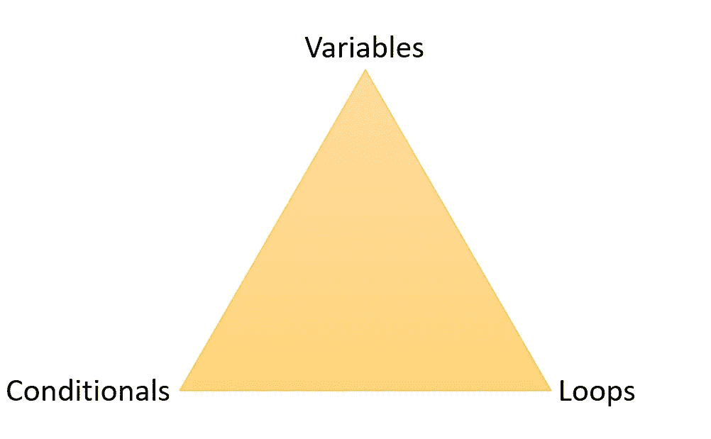
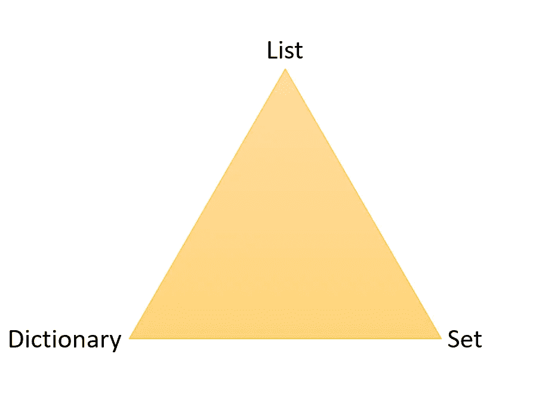

# Python:从菜鸟到摇滚明星

> 原文：<https://towardsdatascience.com/python-go-from-rookie-to-rockstar-d03fa07a32e8?source=collection_archive---------4----------------------->

## 数据科学

## 你还在等什么？

图片由 [**安德里亚·皮亚卡迪奥**](https://www.pexels.com/@olly?utm_content=attributionCopyText&utm_medium=referral&utm_source=pexels) 来自 [**像素**](https://www.pexels.com/photo/happy-ethnic-woman-sitting-at-table-with-laptop-3769021/?utm_content=attributionCopyText&utm_medium=referral&utm_source=pexels)

# Python 是什么？

Python 是一种[解释的](https://en.wikipedia.org/wiki/Interpreter_(computing))(逐行运行代码)[高级](https://www.webopedia.com/definitions/high-level-language/)(隐语表示不那么痛苦)[通用](https://en.wikipedia.org/wiki/General-purpose_programming_language)(尽情发挥你的想象力)编程语言。

Python 是由吉多·范·罗苏姆在 20 世纪 80 年代末创建的，现在它无处不在。数据科学(pandas、matplotlib 等)、机器学习(Tensorflow、PyTorch 等)、网络应用(Django、Flask 等)、Linux(OS 安装程序)、GUI(PyQT)、视频游戏(PyGame)、3D 动画(作为 Maya、3DSMax 等的脚本语言)以及你能想到的每一个角落。

它受欢迎的原因是它的易用性和全面的标准库。这导致大多数用例的大多数库都是用 Python 编写的，因此，Python 成为进入这些领域(尤其是人工智能和数据科学)的第一扇门。

# 基础知识

对于任何编程语言来说，一开始都会遇到变量、条件和循环这三种情况。

来源:作者

那我们继续吧。

## 变量

变量用来在程序内部存储信息，做一些有用的事情(或者有趣的事情)。就像其他语言一样，=用来给变量赋值。最有用的变量类型有:数字、浮点数(带小数的数字)、字符串和布尔值(真或假)。

## 条件式

条件帮助代码根据条件决定做什么。就像在我们的生活中，如果我们心情好，我们就开心，否则，我们就脾气暴躁。对于 Python，它应该是这样的:

但是，如果我们想在代码中容纳更多的条件呢？别担心，有办法的。延伸我们之前的例子，我们可以说，如果心情好，我们就快乐；如果心情不好，我们脾气暴躁，否则，我们正好处于中间状态。让我们看看 Python 是如何做到这一点的:

对于条件句，你只需要记住大部分的时候，if-else，有时候，if-elif-else。

PS: ==是比较运算符，用于在左侧和右侧的人之间进行比较。

## 环

循环用于一次又一次地重复相同的任务。如果我让你把数字从 1 加到 10 亿会怎么样？在 Python 中，如果没有循环，它看起来会像这样:

这将是一项真正令人痛苦和沮丧的任务。这就是为什么需要循环的确切原因。这是用 Python 实现上述操作的方法(简单快捷的方法):

`range`是一个 Python 函数，用于创建一个范围内的值(在我们的例子中，从 1 到 10 亿)。`+=`表示先求和后赋值，表示`*answer += i*`也可以写成`answer = answer + i`。

`for`循环将会是你经常使用的一个。除此之外，我们还有`while`循环，它也可以用来解决从 1 到 10 亿以上的数字相加问题，就像这样:

`for`和`while`回路可以互换使用。一般来说，`for`循环用于遍历一列数字或一些数据，而`while`循环用于等待一个条件。

现在，基本的东西都不碍事了。如果我们能有一些东西允许我们一次存储多个值，那将是非常有用的。假设您正在考虑自动邀请参加聚会，您需要将所有这些姓名和电子邮件地址存储在某个地方。

# 数据结构

瞧，我向您介绍了数据结构的世界(存储和组织数据的技术)。我们还有另外三样东西:列表、字典和集合。

来源:作者

## 目录

List 就像日常生活中的任何列表一样，处理以直线方式收集的数据。在 Python 中，一个班级的学生名字、一家公司的股票价格、购物清单以及生活中出现的许多其他清单都可以很好地放在[]中。这里有一个例子:

我们能够把所有这些值存储在漂亮的小盒子里，这很好，但是我们如何把它们取出来呢？重温我们的学生时代，我们都有点名号码(或类似的东西),我们回答那个号码。这里也一样。只有一点小小的不同，这里的编号从 0 开始。

让我们看一个例子:

正如我们所看到的，杂货清单中的第一个元素(“苹果”)对应于点名 0，以此类推。

在 Python 中，每个数据结构都有一些特性。让我们看看下面的例子。

这里有三个突出的新东西:`append`、`len`和`pop`。

`append`是一种用于在列表末尾添加元素的方法。

`len`是获取列表长度的方法。

`pop`用于抛出列表中的 nᵗʰ元素。(我们给 n = 0，所以第一个元素被抛出)。

## 字典

字典用于存储相互之间有关系的数据。比如国家及其首都，家庭关系或者一个人的信息。举个例子，

在上面的例子中，我们用{}括号来表示这是一个字典，并且在括号之间有一对括号来表示信息。但是，我们如何称呼这些信息呢？

接着是字典名，在两个方括号之间，你放上键名，就这样。

让我们看看如何在字典中添加键值对。

使用同样的方法，我们使用访问值和赋值操作符(' = ')，我们可以很容易地将新值添加到字典中。

让我们看看如何从字典中删除一个键值对。

为了删除键-值对，我们将键传递给 *pop* 函数(同名的方法也用于从列表中删除值)。

## 设置

集合对于存储唯一的项目非常有用。他们有你在高中读过的所有东西。有时，您可能希望检查某个值是否重复，或者只保留唯一的项目(一个大列表中唯一城市的数量)，set 就是您想要的。让我们看一个例子。

首先，set 也使用{}括号但是没有 key:value 对，这对 Python 理解发生了什么没有任何问题。接下来，由于`a = {}`将被 Python 当作一个空字典，我们使用`a = set()`创建一个新的空集。

从上面的第 1 行到第 4 行，我们看到即使在第一个语句中，我们已经放置了重复的元素，但是仍然只保留了唯一的值。

从第 6 行开始，我们看到在一个空集里，即使我们把相同的值放两次，也只能保留 1。

上面，我们还学习了如何在集合中添加元素。现在，让我们看看如何删除它们。

为了从集合中删除一个元素，只需给 *remove* 方法一个值。

现在，正如我所承诺的，让我们来看一个高中的例子。

快速复习:

*   两个集合的并集获取两个集合中的所有唯一元素。
*   两个集合的交集得到集合之间的公共元素。
*   两个集合的差得到第一个集合中不在第二个集合中的元素。
*   两个集合的对称差在两个集合中都得到唯一的元素，除了在两个集合中共同的元素。

因此对于 Python 中的集合:

*   | =联合
*   & =交集
*   - =差异
*   ^ =对称差

## 遍历数据结构

有必要遍历我们创建的数据结构。Python 的好处在于，对于上面的任何一种数据结构，我们的做法都没有太大的不同。让我们来看看。

一个简单的 *for* 循环可以用来遍历任何数据结构。*我*是在浏览数据结构时的代表。

相同的 *for* 循环可用于遍历字典键，我们已经知道如何获取字典中某个键的值，因此也可以访问它。

最后，不做任何修改，同样的循环的*也可以用于集合中的值。*

利用我们上面学到的，你可以用 Python 做任何事情。我们将在前面学到的东西会让我们减少这样做的努力。这也将有助于在将来我们不得不做更改时维护我们的代码。

# 功能

在 Python 中，函数非常有用，可以帮助我们一次又一次地重复同一套指令。就在上面我们已经看到了同样的一组指令可以用来查看列表、字典和集合中的值。当你继续用 Python 构思时，事情会变得复杂，一遍又一遍地写同样的代码不是对你的时间和动机的最好利用。这就是函数有用的地方。让我们看一个例子。

在上面第 4 行的例子中，我们看到函数*显示。*

每个函数都以关键字 *def* 开头，后跟函数名，在我们的例子中是 *show* ，在后面的括号中，参数用逗号分隔。在我们的例子中，我们只有一个自变量*数据。*

在随后的几行中，我们编写了一组我们不想再重复编写的重复指令。在函数中，我们对函数的参数进行操作。

以前，我们必须编写 *example_list* 或 *example_set* 来遍历它，但是现在，我们使用*数据*来做同样的事情。*数据*在我们的函数中充当*示例 _ 列表*或*示例 _ 集合*的占位符。这允许我们通过将 *example_list* 和 *example_set* 视为相同来避免再次编写相同的代码。

还有更复杂的函数，需要更多的代码行来完成它们的工作，这就是你将真正意识到函数的用途的地方。除此之外，在未来，如果你想改变你的代码，你只需要在一个地方进行修改。

但是，随着系统变得越来越大，这些代码的大小也在增长。一个人再也无法处理这件事了。此时此刻需要更多的结构。除了结构的需要，一个大的代码必然会有一部分代码具有相似的功能和相似的数据。为了适应这一点，类的概念出现了。

# 班级

我们举个例子。假设您有一些数字数据，对于这些数据，您需要计算它的平均值(所有数字的平均值)和方差(整个数据与平均值相差多少)。我们要做的计算会变成函数，是的，我们可以把数字数据列表传给他们，我们就能得到答案。但是，如果它们可以打包在一起就好了，因为它们是相关的。

如果需要这些函数，我们可以在类中找到。否则，他们可能会迷失在代码的海洋中。作为人类，我们渴望混乱中的结构。现在，让我们看看我们的数值数据类是什么样子的。

**PS:** 类是一个对象的蓝图。正是通过对象，我们使用类中的功能。

sum()是 Python 中的一个函数，用于计算列表的总和

上面我们有一个类的例子。创建一个类首先需要的是关键字 *class* ，正如我们在第 1 行中看到的。在第 2 行，我们看到了 *__init__* 函数，它不是创建一个类所必需的，但是我在这里展示它是为了演示它的用途。 *__init__* 函数允许存储将由该类的所有方法共享的内容。在我们的例子中，这就是我们要计算平均值和方差的数组。

下一个突出的是*自我。* Self 代表从类中创建的对象。因此*，self.data* 是一个属于 *self* 的变量，并且由于 *self* 被提供给类中的每个函数，我们可以很容易地使用该数据，而不用将其作为参数传递。

在第 16 行，我们看到对象 *num。*为了创建它，我们首先编写类名，然后在括号中加上 *arr* 。它实际上是在调用我们在类定义中编写的 *__init__* 函数。 *__init__* 也称为构造函数，因为它有助于对象的构造。因此，传递给类以创建对象的内容由 *__init__* 函数或构造函数决定。

类允许您在代码上编织一个全局结构，并使其易于导航未来的变化。

# 结论

有了上面的知识，你现在可以认为自己是 Python 中的摇滚明星了。实践上面展示的所有内容，阅读更多关于 Python 的功能。这是一个伟大的美丽和奇妙的世界，给你无限的可能性。

探索愉快！