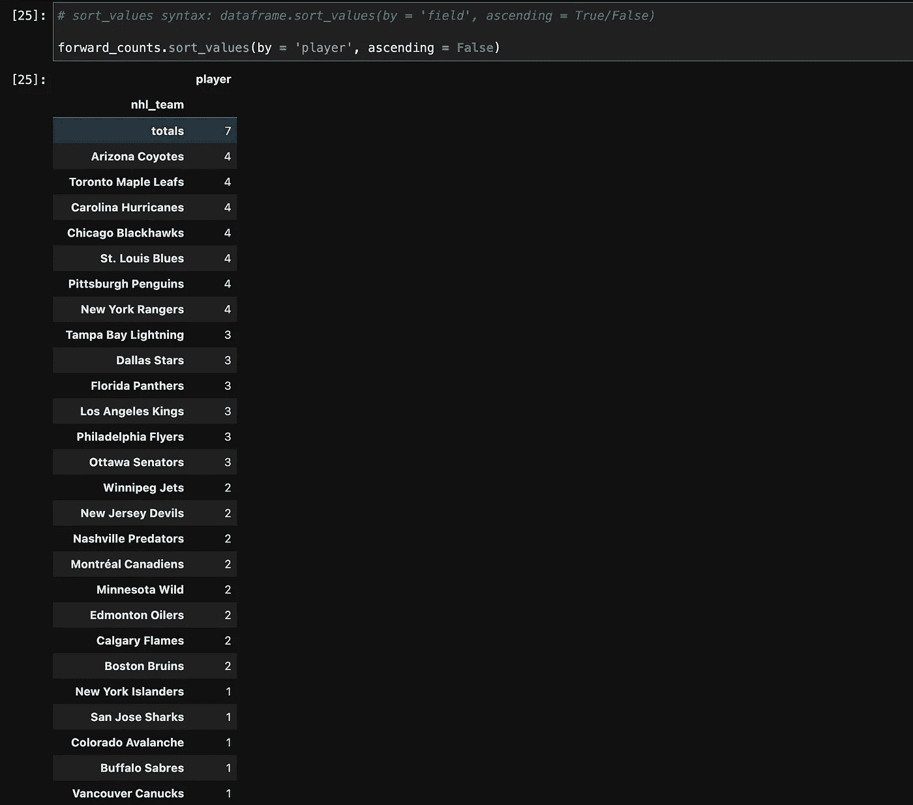

# Python 曲棍球初学者分析教程

> 原文：<https://towardsdatascience.com/python-hockey-analytics-tutorial-b0883085938a?source=collection_archive---------7----------------------->

## 快速掌握 Python 的基础知识。


作为教程的一部分，您将构建此图表。

# **目录**

*   [什么是 Python？](#81ab)
*   [要求](#9dba)
*   [安装 Python](#55d4)
*   [安装和升级 Pip](#82b5)
*   [安装上下曲棍球刮刀](#adf0)
*   [安装 Jupyter Lab](#2538)
*   [打开 Jupyter 实验室](#de20)
*   [开始教程](#ee0a)
*   [导入我们的包](#ced8)
*   [刮数据](#aa9e)
*   [清理数据](#d11e)
*   [让数据好看](#5a4a)
*   [准备用于分析的数据](#b5d1)
*   [分析数据](#7b41)
*   [可视化数据](#f11f)
*   [进行更深入的分析](#5705)

# Python 是什么？

Python 是一种开源编程语言，可用于各种应用，如数据分析、数据科学和数据可视化、软件和 web 开发，以及为系统编写脚本。Python 如此强大，以至于 MacOS 的某些部分实际上依赖于它，这种强大的功能与 Python 直观、用户友好的语法相结合，使它成为世界上最流行的编程语言之一。

如果这听起来像是你想学的东西——尤其是在分析曲棍球统计数据的背景下——那你来对地方了。在本教程结束时，您不仅将对 Python 作为一种编程语言有一个基本的了解，而且您将能够熟练地使用 Python 来自己执行小范围的数据分析。

本教程相当全面，应该需要几个小时才能完成。完成其中的一部分，休息一下，然后在不同的时间完成剩下的部分，这完全没问题；你不是在比赛。

# 要求

为了完成本教程，您需要以下内容:

*   能够运行 Python 3.6 或更高版本的工作计算机。
*   使用曲棍球分析学 Python 的愿望。

就是这样！其他的一切都将通过本教程提供给你。本教程将引导您完成安装 Python 的过程和您将要编码的环境，并且假设您没有 Python 或任何其他编程语言的知识。

# 安装 Python

这是我最不喜欢的部分。到目前为止。老实说，这可能是最难的。但是它需要被完成。

本教程利用了一个需要 Python 版的包。即使您安装了 Python，在确认您的版本足够之前，也不要跳过这一步。

不管你的操作系统是什么，你都需要在安装过程中进入你的终端/命令提示符。对于不熟悉在 terminal 中工作的人来说，这可能是非常令人畏惧的，但是一旦你投入进去，事情就不会太糟糕。

**如果你在这个过程中遇到任何问题，或者你正在使用 Linux，我建议你看看来自 Real Python 的** [**Python 3 安装指南**](https://realpython.com/installing-python/) **。**此外，如果您使用的是 Windows，您可能会发现这个视频很有帮助: [Python + JupyterLab 安装&路径集指南](https://youtu.be/FZoDIwe1_YM) — Windows

根据您的操作系统，请按照以下步骤开始操作:

## Windows 操作系统

按下键盘左下角的 windows 键，键入 cmd，然后打开命令提示符。进入后，输入以下命令查看您安装的 Python 版本:

```
python --version
```

如果您还没有安装 Python，或者您已经安装了 Python，但是您没有版本 3.9.4(本文撰写时的最新版本)或更高版本，您将需要打开 Microsoft store 并通过它安装最新版本。(如果您安装了 3.9.4 或更高版本，请跳到下一步。)

使用键盘左下方的 Windows 键打开 Microsoft Store，并进行搜索。然后，进入商店后，在应用商店的搜索栏中搜索 Python，并选择最新版本。点按屏幕右上角的“安装”来下载应用程序。下载完成后，在终端中输入以下内容:

```
python --version
```

你应该看到 Python 3.9.4。如果是的话，那么恭喜你，你已经安装了 Python！您现在可以前进到[安装和升级 pip](#82b5) 。如果没有，你可能在某个地方走错了。如果您仍然看到 3.6 或更高的版本，您可能会没事。如果不是，你需要重新追踪你的步骤…

## 马科斯

如果你有一台 Mac，你可能已经安装了 Python，但是你使用哪个版本的 Python 将取决于你的操作系统。为了确定哪个版本，请通过按 command + space 打开 spotlight search，键入 Terminal，然后按 enter。打开终端后，通过分别输入以下命令来检查 Python 版本、Python 2 版本和 Python 3 版本:

```
python --versionpython2 --versionpython3 --version
```

这里唯一真正重要的是 Python 3 版本的输出。您将需要使用最新版本的 Python(本文发布时是 3.9.4)，所以如果您的 Python 3 版本不是这个版本，或者您根本没有 Python 3，您将需要安装它。(如果没有 Python 3，可能一输入就提示安装。请忽略此提示，并按照这些步骤进行操作。)只需几个步骤就可以安装 Python 3:

1)导航至 Mac OS X 的官方 [Python 下载页面。](https://www.python.org/downloads/mac-osx/)

2)点击最新的 Python 3 版本。


3)点击适合您的 macOS 版本的 macOS 安装程序。(这很可能是 macOS 64 位 Intel 安装程序。)这样做会下载官方的安装向导。官方安装程序非常简单，会指导你完成剩下的过程。


恭喜你！你刚刚安装了 Python。现在，您可以关闭安装窗口，并将安装包移到垃圾箱中。

# 安装和升级 pip

Pip 是 Python 的一个包管理工具。根据您的操作系统，您可能已经有了 pip，但是我们不想在这里讨论任何可能，所以在终端/命令提示符下运行以下命令来确定您拥有的是哪个版本:

```
**Windows** python -m pip --version**macOS** python3 -m pip --version
```

**如果您已经安装了 pip**，您可以通过运行以下命令来升级它:

```
**Windows** python -m pip install --upgrade pip**macOS** python3 -m pip install --upgrade pip
```

如果你能做到这一点，继续前进[安装顶部向下曲棍球刮刀](#adf0)。**如果您没有安装 pip**，您需要遵循以下步骤:

1) [点击此链接](https://bootstrap.pypa.io/get-pip.py)，在另一个选项卡中打开一个巨大的 Python 文件。


2)右键单击选项卡并选择另存为。将文件保存为名为 get-pip 的 Python 文件。**确保将 get-pip 保存在您将从中运行命令的用户目录中。**


3)返回到您的终端，输入以下命令:

```
**Windows** python get-pip.py**macOS**
python3 get-pip.py
```

这会运行您刚刚下载的 Python 脚本，并安装一个名为 pip 的模块。Pip 是一个软件包安装程序，它将使你今后的生活更加轻松。

# 安装自上而下曲棍球刮刀

现在有趣的部分来了:安装 TopDownHockey 刮刀。在您的终端中，只需输入以下命令:

```
**Windows**
python -m pip install TopDownHockey_Scraper**macOS**
python3 -m pip install TopDownHockey_Scraper
```

这不仅会安装最新版本的 scraper(在撰写本文时是 1.0.6)，还会安装其他必需的包，如 bs4、numpy 和 requests，前提是您还没有安装它们。如果您在安装时看到警告，请记下它们，但现在先把它们放在一边，然后进入下一步。

# 安装 Jupyter 实验室

Jupyter Lab 是一个集成开发环境(IDE)。对于那些不熟悉这个术语的人来说，你基本上可以把 IDE 想象成一个运行代码的地方。Jupyter 实验室特别为运行 Python 提供了一个非常用户友好的界面，我已经将本教程的后半部分打包成了一个 Jupyter 笔记本，您可以在 Jupyter 实验室访问它。下载它有一点痛苦，但是环境本身会比最初的下载给你带来更多的麻烦。

要下载这款出色的 IDE，请进入终端并输入以下命令:

```
**Windows**
python -m pip install jupyterlab**macOS**
python3 -m pip install jupyterlab
```

如果你能够毫无问题地安装它，你可以前进到[打开 Jupyter Lab](#de20) 并忽略接下来的步骤。但是，如果在安装过程中，您收到如下消息:

```
WARNING: The scripts jlpm.exe, jupyter-lab.exe, jupyter-labextension.exe and jupyter-labhub.exe are installed in 'C:\Users\YourName\AppData\Local\Packages\PythonSoftwareFoundation.Python.3.9_qbz5n2kfra8p0\LocalCache\local-packages\Python39\Scripts' which is not on PATH
```

您需要更新您的路径。这个过程将取决于您的操作系统。

## Windows 操作系统

1.  通过在搜索栏中键入控制面板并打开它来打开控制面板。
2.  选择用户帐户，然后在用户帐户中，再次选择用户帐户。
3.  选择更改我的环境变量。
4.  在用户的环境变量中，突出显示“Path”变量并选择 edit。
5.  在编辑环境变量屏幕中，选择“New”并逐个输入三个新路径:

```
C:\Users\YourName\AppData\Local\Packages\PythonSoftwareFoundation.Python.3.9_qbz5n2kfra8p0\LocalCache\local-packages\Python39\ScriptsC:\Users\YourName\AppData\Local\Programs\Python\Python39\C:\Users\YourName\AppData\Local\Programs\Python\Python39\Scripts\
```

(一定要把你的名字改成你的用户名！)

完成这些步骤后，请确保单击确定以确认您的更改，然后离开控制面板。(如果你对这个过程有疑问，[我制作了这个视频](https://youtu.be/FZoDIwe1_YM?t=86)，可能也会有所帮助。)

**macOS**

我没有苹果电脑作为我的个人电脑，所以我不能在这里建立一个视频或验证过程。但是，[根据 JupyterLab 文档](https://jupyterlab.readthedocs.io/en/stable/getting_started/installation.html)，这是修复路径的方法:

> 如果使用`pip install --user`安装，您必须将用户级`bin`目录添加到您的`PATH`环境变量中，以便启动`jupyter lab`。如果你使用的是 Unix 的衍生版本(FreeBSD，GNU / Linux，OS X)，你可以通过使用`export PATH="$HOME/.local/bin:$PATH"`命令来实现。

尝试在终端中输入导出路径命令。

# 开放 Jupyter 实验室

一旦您安装了 Jupyter Lab 并准备打开它，请打开一个新的终端窗口并在其中运行以下命令:

```
**Windows**
python -m jupyter lab**macOS**
python3 -m jupyter lab
```

如果你成功打开了 Jupyter 实验室，你现在可以[开始教程](#ee0a)。

**如果您仍然无法让 Jupyter Lab 在路径上运行，**但是您已经安装了 Python，请尝试以下两个命令:

```
**Windows** python -m pip install jupyter notebook
python -m notebook**macOS** python3 -m pip install jupyter notebook
python3 -m notebook
```

这应该会打开一个 Jupyter 笔记本浏览器，和 Jupyter 实验室很像。它没有一些相同的功能，但在最坏的情况下，它仍然足以完成本教程。

# 开始教程

如果您已经成功打开 Jupyter Lab(或 Jupyter Notebook),“终端”将在您当前使用的窗口中打开一个新标签。它应该看起来像这样。


这是 Jupyter 实验室的主屏幕。如果你在这里成功了，你基本上就自由了。如果你只是设法打开 Jupyter 笔记本，你会看到更多这样的东西:


如果您看到以下内容:


进入你的终端，从命令提示符下复制并粘贴两个 URL 中最上面的一个到你的浏览器中。


本教程的其余部分对您来说应该相对容易。现在你已经进入了，是时候为这个教程下载[交互式 Python 笔记本(ipynb)了。](https://drive.google.com/file/d/1CQ_ISjSVoji0mgPY0dKWgglnVcsrYuyI/view?usp=sharing)

然后在 Jupyter Lab 中，单击屏幕左上角的文件夹选项卡，导航到下载它的目录，双击打开它。如果在 Jupyter Notebook 中，默认情况下会列出您的目录，您可以简单地通过这种方式导航到那里。

无论哪种方式，一旦您打开教程，您应该会看到类似这样的内容:


如果你和我一样，这对你来说太亮了。在做任何其他事情之前，对自己好一点，将鼠标悬停在设置、JupyterLab 主题上，然后切换到 JupyterLab 黑暗模式，将事情更改为黑暗模式:


那好多了。也可能不是，在这种情况下，您可以随意切换回光照模式。不管怎样，我们开始吧。

这是一个交互式 Python 笔记本。它使运行代码变得容易一百万倍。在 Jupyter Lab 中，您可以同时打开多个笔记本。继续操作，再次点击左上角的文件夹图标将其最小化，因为我们不再需要它，同时关闭启动器选项卡。下面屏幕截图中可见的单元格是 markdown 单元格，构建这些单元格是为了直观地显示文本，而不是为了执行代码:


您可以通过查看选项卡正下方(Jupyter 实验室内)并看到该单元格类型被列为减价单元格来确认这一点。如果您按 shift + enter，Python 将有效地“执行”markdown 单元格(在本例中不做任何事情)并移动到下一个单元格。现在你在下一个包含代码的单元格中，Jupyter 实验室将它列为代码单元格。


现在，关于 Jupyter Lab，您真正需要知道的是使用 shift + enter 运行命令。然而，如果你有兴趣了解更多关于这个接口的信息或者你有问题，我建议你参考官方文档。

从现在开始，我将在这篇中型文章中提供一个演示，它基本上与 Jupyter 实验室中的演示相同，只是提供了一些截图来显示您的输出应该是什么样子。如果你愿意，你可以随意关闭这个浏览器，把 Jupyter 实验室切换到全屏，在那里完成这个教程；只需记住使用 shift+enter 来运行单元格，如果您对输出的外观感到困惑，请参考本教程。或者，如果您执意要在 Jupyter Lab 之外的不同环境中运行您的代码，您可以在该环境中键入屏幕截图中的所有命令。

事不宜迟，让我们开始吧。

# 导入我们的包

这些包中的每一个都已经被放到了 TopDownHockey_Scraper 中，所以你已经把它们安装到了你的电脑中。以下代码行将它们导入到您当前的 Python 会话中。


您实际上是在运行五个独立的大型 Python 代码库，每个代码库在您的会话中存储各种函数和变量。特别是 TopDownHockey Scraper 在其代码末尾有几个 prints 语句，它写下了您所看到的消息。

# 搜集数据

我们将使用`TopDownHockey_Scraper`包中的`TopDownHockey_EliteProspects_Scraper` `module`从精英潜在客户那里收集数据。

*   一个[模块](https://docs.python.org/3/tutorial/modules.html)是一个包含 Python 语句和定义的文件。它也可以被认为是一个代码库。Python 包是模块的集合。

请注意，我们将每个模块都作为全名的缩写导入。这是因为为了从一个模块中调用一个函数，我们每次都需要在函数前面键入模块的名称，而键入这些较短的名称要容易得多。例如，当我们稍后从`TopDownHockey_EliteProspects_Scraper`模型中调用`get_skaters`函数时，我们将键入`tdhepscrape.get_skaters`。这比敲`TopDownHockey_EliteProspects_Scraper.get_skaters`更有效率。

`get_skaters`函数有两个参数:一个或多个赛季和一个或多个联赛。在这种情况下，我们将收集过去两个赛季的 AHL 和 NHL 数据，这意味着我们将构建两个`lists`，然后将它们提供给我们的函数。

*   列表是以一定顺序存在的一组可变元素。在这种情况下，我们的列表将由两个字符串组成。

我们的函数将抓取我们提供的联赛和赛季的所有数据，并返回一个`dataframe`。

*   [数据帧](https://pandas.pydata.org/pandas-docs/stable/reference/api/pandas.DataFrame.html)是包含行和列的二维数据结构。

我们将把这个数据帧分配给一个名为`ahl_nhl_skaters_1719`的对象。

下一个单元格顶部的“时间魔法”功能会告诉你刮花了多长时间。它应该需要大约一分钟。


# 清理数据

数据清理不是任何人的最爱，但它是数据分析的关键部分。您在分析开始时花在清理数据上的每一分钟都是对最终产品的投资，大多数情况下，您将获得正的投资回报。在早期识别和解决问题要容易得多。

在清理数据之前，我们想做的第一件事是查看一下数据。我们之前的命令将函数的输出存储为一个名为 ahl_nhl_skaters_1719 的数据帧，其中包含了我们需要的所有数据。让我们从看看这个对象开始这个过程。


我们打印的数据帧的左下角告诉我们，我们正在处理 4，088 行和 14 列。当我们查看我们的专栏时，我们会看到一个链接、一些识别信息和一些 boxcar 统计数据(对于那些不熟悉这个术语的人来说，这只是一个术语，指的是通过加号/减号进行的游戏的统计数据)。

Ou 播放器和 playername 专栏其实差不多，可以去掉一个；理想情况下，丑陋的球员列包含冗余的位置数据。为了做到这一点，我们将使用`drop`。

*   [Drop](https://pandas.pydata.org/pandas-docs/stable/reference/api/pandas.DataFrame.drop.html) 允许您指定要从列或行中删除的标签。

如果你对事物是全新的，下面的线可能看起来令人生畏，但是它实际上是非常简单的。以下是指挥系统的工作方式:

*   我们的代码行以`ahl_nhl_skaters_1719 =`开始，这意味着在此之后的输出将被分配给一个同名的对象。
*   我们已经创建的对象(也称为 ahl_nhl_skaters_1719)是我们将要应用函数的对象。(本质上，我们将覆盖它。)
*   `ahl_nhl_skaters_1719.drop`中的句点告诉我们，我们将在该对象上使用 drop。
*   在括号中，我们指定了将要删除的内容:名为 player 的列。


如您所见，没有输出被打印出来，因为我们将命令的输出赋给了一个新变量，而不是只打印它。让我们通过打印来再次检查我们是否做对了:


好吧，我们做了我们想做的。这个新的数据框架更好，但还远远不够理想。我们有我们的球队，然后是我们的 boxcar 统计，然后是一个大的丑陋的链接，只有在这之后我们才能真正看到赛季，联赛，球员和位置。理想情况下，这个关键标识符信息应该在开始，我们的 boxcar 统计数据应该在后面，只有这样我们才能看到链接。

为什么我们要看到链接栏呢？又大又丑，好像也没加什么东西。理想的布局难道不是没有这一列吗？

在完美的世界里，是的。但在这个不完美的世界里，我们偶尔会把两个完全不同的同名玩家搞混。为了演示，我们将使用`loc`只过滤出名字与 Sebastian Aho 相同的玩家。

*   [loc](https://pandas.pydata.org/docs/reference/api/pandas.DataFrame.loc.html) 允许我们根据一组行和列的标签是否满足某个标准来定位它们。(官方文档没有确认 loc 是否代表任何东西，但我喜欢认为它代表 locate，它可能会帮助你这样想。)

在我们运行它并查看我们的 Sebastian Ahos 之前，让我们回顾一下这行代码的命令链:

*   `ahl_nhl_skaters_1719.loc`中的句号告诉我们，我们将在这个对象上使用`loc`函数。
*   在括号中的`loc`函数中，`ahl_nhl_skaters_1719.playername`中的句点告诉我们，我们正在从该数据帧中选择 playername 列。这将返回一个`series`。(A [系列](https://pandas.pydata.org/pandas-docs/stable/reference/api/pandas.Series.html)是带轴标签的一维数组)。
*   然后我们设置`playername`系列等于 Sebastian Aho(使用两个等号。在 Python 中，我们一般用一个等号来给对象赋值，用两个来判断对象是否相等。
*   本质上，这仅定位我们选择的系列中的值——`playername`列中的值——正好等于 Sebastian Aho 的行和列。


等等，什么？为什么在我们的数据框架中没有一个球员的名字和塞巴斯蒂安·阿霍一模一样？岛民组织中的防守队员可能是一个狂热的梦想，但绝对有一个塞巴斯蒂安·阿霍在卡罗莱纳飓风队中担任中锋。他在 2018-2019 赛季场均得分超过 1 分！这里没有叫塞巴斯蒂安·阿霍的人，这不对吧？

从技术上来说，它是可以的，事实上也的确如此。不幸的是，我们的数据带有一些空白。为了演示这一点，我们将使用`iloc`。

*   [iloc](https://pandas.pydata.org/docs/reference/api/pandas.DataFrame.iloc.html) 非常类似于 loc，除了它允许我们根据一个整数值(在这个例子中是行号)是否满足某个标准来定位一组行和列。(同样，官方文档没有确认这是否代表什么，但我喜欢认为它代表整数定位。)

这里，我们将使用 iloc 来定位轴标签为 0 的行。(在 Python 中，索引以 0 而不是 1 开始。)下面是这段代码的命令链的运行方式:

*   就其本身而言，`ahl_nhl_skaters_1719.playername`返回一个包含数据帧中每个球员名字的序列，其顺序与他们在数据帧中的顺序相同。
*   在这个列表中，`iloc`函数将定位我们的系列中所有轴标签为 0 的值。


嗯，你看看这个:在特里的 y 和表示名字结尾的单引号之间有一个空格。克里斯·特里显然存在于数据库中，但如果我们过滤名字完全是克里斯·特里的球员，我们将一无所获。亲自尝试一下:


有几种方法可以处理这个问题，但最简单的方法是清除 playername 字段中的空白。为了做到这一点，我们将使用`str.strip()`。

*   [str.strip](https://pandas.pydata.org/docs/reference/api/pandas.Series.str.strip.html) 删除序列或索引中的所有前导和尾随字符。

让我们分解下一个单元格中的命令链:

*   我们没有将语句的输出分配给 ahl_nhl_skaters_1719 数据帧，而是将其分配给`ahl_nhl_skaters_1719.playername`列。
*   我们在原来的列上使用`.str.strip()`来删除这个字符串两端的空白。
*   完成后，我们只想看看我们的塞巴斯蒂安·阿霍斯和克里斯·特里。我们不是只传递一个语句给`loc`，而是传递两个，并使用`|`来定位满足第一个或第二个标准的情况。(`|`在这种情况下可以解释为或。我希望 Python 能让我输入 or，但是乞丐不能挑肥拣瘦。)


这证实了两件事:

1.  我们的 str.strip()函数起作用了，我们成功地去掉了克里斯·特里名字周围的空格。
2.  有两个塞巴斯蒂安·阿霍。

理论上，我们可以通过使用名称和位置作为标识符，或者使用包含 playername 旁边的位置数据的原始 player 列来解决 Aho 问题。因为一个塞巴斯蒂安·阿霍是前锋，一个是防守队员，这将允许我们区分他们两个。

这种方法的问题是同名球员并不总是踢不同的位置。每一对塞巴斯蒂安·阿霍斯和科林·怀特打两个不同的位置，就有一对埃里克·古斯塔夫松或埃里克·卡尔松打相同的位置。(另一个叫埃里克·卡尔松的防守队员从未在 NHL 打过球，但他确实存在，他*毁了我的 NHL 模型。)虽然这个项目的范围很小，但是您最终可能会过渡到范围更大的项目，并且需要一个适当的过程来处理这些问题。*

值得庆幸的是，每个玩家都有自己独特的精英前景页面，因此也有自己独特的链接。再看看我们的塞巴斯蒂安·阿霍斯；布里奇波特的防守队员和卡罗莱纳的前锋有着不同的联系。他们并不都在这里，但两个埃里克·古斯塔夫森也是如此。这就是我们保持联系的原因。因为我们已经有了联系，我们不需要再担心像塞巴斯蒂安·阿霍这样的搭档。我们一开始并不真的需要清理我们的数据，但这是一个很好的实践，可以确保在继续前进之前做到这一点。

# 让数据看起来不错

我们陷入了塞巴斯蒂安·阿霍斯的兔子洞，完全偏离了主题，但请记住我之前为我们的数据设定的理想顺序:球员、赛季、球队、联赛和位置，然后我们的 boxcar 统计数据按照它们出现的顺序排列，最后是那个可怕但有用的链接。我们将使用 loc 告诉 Python 要保留哪些列，并实际上按照我们想要的顺序传递所有列。我们还将`rename`那个丑陋的 playername 专栏。

*   [重命名](https://pandas.pydata.org/pandas-docs/stable/reference/api/pandas.DataFrame.rename.html)改变轴标签。

让我们在下面几行代码中分解命令链:

*   我们在数据帧上使用了`loc`功能。
*   我们使用两组支架，而不是一组支架。在外层括号中，我们简单地从`:,` 开始。这通知 Python 我们将处理列而不是行。
*   在第二组括号中，我们传递一个我们希望保留的列名列表。在这种情况下，我们实际上保留了所有内容，只是顺序与之前不同。
*   一旦第一行完成，ahl_nhl_skaters_1719 现在已经被覆盖，以反映我们的变化。在下一行中，我们使用 rename 语句。这类似于我们之前使用的 drop 语句，只是我们输入列的原始名称，一个冒号，然后输入您希望该列更改的名称。


这看起来棒极了！我们的数据是干净的，我们准备向前迈出一步。

# 为分析准备数据

还记得我们过去是如何用 loc 过滤掉名字叫克里斯·特里或者塞巴斯蒂安·阿霍的球员的吗？现在我们将使用 loc 构建两个独立的数据框架:一个用于 2017-2018 AHL 赛季，一个用于 2018-2019 NHL 赛季。


既然我们已经设置了两个独立的数据帧，我们将`merge`这两个数据帧并创建一个名为 ahl_1718_nhl_1819 的新数据帧。

*   [merge](https://pandas.pydata.org/pandas-docs/stable/reference/api/pandas.DataFrame.merge.html) 将共享公共列或索引的两个数据帧放在一起。

在我们运行下一行命令之前，让我们用一幅有用的图像来分解命令链:

*   我们在 ahl_skaters_1718 上执行`merge`函数，并将我们的 nhl_skaters_1819 作为第一个参数传递给我们的函数。这意味着我们将合并 2017-2018 款阿勒和 2018-2019 款 NHLers。
*   我们在链接上合并，这意味着我们使用玩家链接作为公共字段。本质上，我们添加了 2018-2019 年的 NHL 数据，用于与 2017-2018 年的 AHL 选手有相同联系的选手。
*   我们将使用的合并类型是`inner`合并。下面的文氏图显示了不同类型的合并。(在这种情况下，合并和连接是可以互换的。)
*   我们内部的合并意味着我们将只保留 2017-2018 年的 AHL 球员，他们也在 2018-2019 年出现在 NHL。


呀！我们的合并是成功的，我们得到了一个相当于 302 名球员的可靠样本，他们这一年在 AHL 打球，下一年在 NHL 打球，但是我们得到了一堆难看的列，上面有 x 和 y。

当我们合并两个具有相同名称的列的数据帧时，如果我们不在这些列上连接，就会发生这种情况:具有相同名称的列会重复。

这不是世界末日。其实挺好办的。我们知道新数据框的左侧(其列名附有 x)包含 2017-2018 年的 AHL 数据，我们知道右侧包含 2018-2019 年的 NHL 数据。(如果我们忘记了，我们的数据帧的名称实际上是一个提醒。)我们还知道，这些球员在不同的赛季不会改变名字或位置，所以我们可以只保留数据左侧的球员和位置，而删除右侧的球员和位置。

所以我们有 6 列要删除。让我们先做那件事。


看起来已经好多了，但还是有点乱。在我们做任何事情之前，我们应该将我们的链接字段移动到数据帧的最右侧，尽可能地远离我们的视线和头脑。不过，我们不是按照我们想要的顺序输入所有 19 个列名，而是要加快这个过程，并且用列表和附加到列表上的函数来获得一点乐趣。

*   [列表](https://docs.python.org/3/tutorial/datastructures.html)可以用许多不同的方式操作。

让我们具体分析下一个单元格中的内容:

*   我们首先创建一个列表，它只是我们的数据框架中的列的名称。
*   我们在列表中使用基于列表的`remove`方法来删除列表中的第一个项目“link”。
*   请注意，与将更改分配给其他对象(如数据帧)不同，列表不需要使用等号进行严格的分配，而是会被自动覆盖。简单地在这里输入第二行代码将会永久地改变列表。
*   然后，我们使用基于列表的`append`方法将“link”添加到列表的末尾。
*   然后我们打印清单，以确保我们做对了事情。


现在我们已经得到了一个按照我们想要的顺序排列的列列表。下一步是在我们之前使用的方法中使用 loc 函数，首先给它提供`:,`来表明我们对列而不是行感兴趣，然后传递我们想要的列的列表。完成后，我们将重命名这些列，使它们更容易理解，然后打印新的 dataframe，以确保一切看起来都是正确的。


嘿，这开始看起来像是我们可以实际工作的东西了！我们在一边清楚地展示了 AHL 的数据，在另一边清楚地展示了 NHL 的数据。虽然我们已经取得了很大的进步，但我们还有一些地方需要改进。为了确定这些变化是什么，让我们使用`dtypes`。

*   [dtypes](https://pandas.pydata.org/pandas-docs/stable/reference/api/pandas.DataFrame.dtypes.html) 返回数据帧中每一列的类型。


我们的数据框架中的每一列目前都是一个`object`类型。为了对它们执行数学函数，我们需要将它们转换成`float`类型。

*   [float](https://docs.python.org/3/library/functions.html#float) 类型是浮点数。整数在很多情况下是可以的，但是如果你像我们一样使用小数，你需要把它们转换成浮点数。

让我们用一个专栏来测试一下，只用 AHL 每场比赛的积分。这里的命令链非常简单:

*   我们使用`ahl_1718_nhl_1819.ahl_ppg`对该列进行操作，将其视为一个系列。
*   我们使用`astype`函数并传递`float`作为参数，将其改为浮点类型。
*   [astype](https://pandas.pydata.org/docs/reference/api/pandas.DataFrame.astype.html) 将数据帧中的对象转换为特定类型。

不要把它分配给一个新对象，让我们打印它…


啊哦！看起来我们在这个列中有一些值仅仅是`-`，Python 不能将它们转换成浮点类型，这是有意义的，因为它们不包含数字数据。

让我们看一下具有该值的每一行，以确认情况确实如此:


好吧，所以在我们做其他事情之前我们需要先处理这个。我们还会在某个时候使用我们的“已玩游戏”列，因此我们还应该确保我们也清理了该列，以防其中也存在一些讨厌的值。

为了进行这种清理，我们将使用`numpy`模块中的`where`函数来将所有值从-更改为 0，并将所有其他值保持不变。请记住，我们将 numpy 作为 np 导入，因此当我们调用该模块的 where 函数时，我们只需键入 np.where 而不是 numpy.where。

*   [numpy.where](https://numpy.org/doc/stable/reference/generated/numpy.where.html?highlight=where#numpy.where) 如果满足条件则返回一个值，否则返回另一个值。

在这种情况下，以下是这些行的命令链:

*   我们根据`np.where`语句的结果为 4 个不同的列分配新值。
*   在我们的 np.where 语句中，如果当前值是`-`，我们将赋值 0。如果当前值不等于-，我们简单地返回之前的值。
*   我们对四个字段重复这个过程——打了 NHL/AHL 的比赛和每场比赛的 NHL/AHL 积分——然后打印 ahl_ppg 值等于的行，以确保这是有效的。(我们应该看不到。)


酷，这很有效。现在我们可以把这些都改成浮点类型。然后，在我们新的浮动类型栏中，我们可以只过滤出在两个联赛中至少打了 20 场比赛的球员，并查看他们。


我们的数据现在处于可以真正开始工作的位置，这太棒了。

不幸的是，我们的样本量受到了很大的冲击；数据框中的行数告诉我们只剩下 113 名选手了。为了确定这是多大的问题，让我们通过构建两个独立的数据帧来看看我们有多少前锋和防守队员:一个只包含前锋，另一个只包含防守队员，然后使用`len`来确定这些数据帧的长度。

*   [len](https://docs.python.org/3/library/functions.html#len) 返回一个对象中的项数(长度)。


前锋和防守队员的数量目前被存储为两个独立的变量。我们不只是打印它们，而是使用 Python 的`print`函数来打印这些带有消息的值。

*   [打印](https://docs.python.org/3/library/functions.html#print)打印输出。

在我们这样做之前，我们必须创建变量的新版本，现在是整数，也就是字符串。我们通过使用`str`来做到这一点。

*   [str](https://docs.python.org/3/library/stdtypes.html#str) 将一个对象转换成一个字符串。

将字符串相互添加并打印出来非常容易，但是必须小心确保传递给打印函数的所有内容都是字符串。


所以我们有 77 名前锋和 36 名后卫。这不是很好，但对于一些基本的分析来说已经足够了。

# 分析数据

我们要做的第一件事是确定哪些球队在 2018-2019 年拥有最多的 NHL 前锋，他们在前一年从 AHL 跳了出来。

(展望未来，我将把进行这次跳跃的滑冰运动员称为“过渡球员”，他们在 2017-2018 年参加了至少 20 场 AHL 比赛，在 2018-2019 年参加了 20 场 NHL 比赛如果我特别提到进行这种跳跃的前锋或防守队员，我会称他们为“过渡前锋”或“过渡防守队员”)

为了做到这一点，我们将使用`groupby`按团队对我们的前锋数据帧进行分组，并计算每个团队的球员人数。

*   [groupby](https://pandas.pydata.org/pandas-docs/stable/reference/api/pandas.DataFrame.groupby.html) 以某种方式对一个对象进行分组，并在组合结果之前对该组应用某种函数。

让我们看看下一行代码的命令链:

*   我们将 nhl_team 作为参数传递给 groupby 这一组由 NHL 队列。
*   我们从我们的组中提取玩家系列。
*   我们用`count()`来统计每支队伍在这个系列赛中的人数。Count 是一个可以应用于组的函数。


现在我们有一个系列来告诉我们每支球队有多少球员。这太棒了！但是我们更希望有一个数据框架。它更容易使用和处理。我们将使用来自我们的`pandas`模块的`DataFrame`函数(我们将其作为`pd`导入)将它转换成一个数据帧。


现在，我们将使用`sort_values`函数来查看哪支球队拥有最多的球员。

*   [sort_values](https://pandas.pydata.org/pandas-docs/stable/reference/api/pandas.DataFrame.sort_values.html) 沿任一轴按值排序。默认设置是 x 轴或行。

我们还想从大到小排序，所以我们将 ascending 设置为 False。(默认情况下，它被设置为 true。)



最常见的团队是“totals”，可以更容易地解释为“multiple teams”。这是有道理的。在那之后，为每支球队效力的转换前锋的数量似乎相当均匀地分布在 1、2、3 和 4 之间。

但是还有一些东西很突出。还记得我们构建的每一个其他数据帧都有一个从 0 到最左边的值的索引吗？你可能没有注意到它，但是如果你向上翻，你会发现它是为他们每一个人准备的。这个没有那个。保存索引是一个很好的做法。为了添加一个，我们简单地使用`reset_index`。

*   [reset_index](https://pandas.pydata.org/pandas-docs/stable/reference/api/pandas.DataFrame.reset_index.html) 重置索引或其级别。

我们不仅要重置索引，还要再次对值进行排序，因为我们实际上并没有将带有排序值的数据帧赋给一个新变量。

对于初学编程的人来说，一行一行地写完全没问题，但是如果可能的话，用更少的行将多个语句链接在一起会更有效。对于这一个，只是做一点练习，我们将在一行中做所有的事情:首先按我们的 player 列中的值排序，然后重置其值被排序的新数据帧的索引。一旦我们完成了这个，让我们把它打印出来，以确保我们做对了。


现在我们已经有了一个索引，是时候仔细看看它了。它从 0 到 29，这意味着这里只有 30 个不同的值。totals 实际上也不是一支 NHL 球队，这意味着我们这里只有 29 支球队。NHL 有 31 支球队，所以肯定有两支球队在 2018-2019 年没有打过一场过渡前锋。

如果我们想知道这些团队是谁呢？我们可以去 NHL.com，一个接一个地寻找名单上的每支球队，找到我们遗漏的两支球队。会有用的。但这也是完全低效的，而且容易出错。

有一个更好的方法。让我们从使用 NHL 选手的完整数据框架中的团队栏上的`set`开始，以获得每个 NHL 团队的集合，然后看一看它。

*   [set](https://docs.python.org/3/library/stdtypes.html#set) 返回对象中的每个唯一值。


好的，我们已经召集了所有国家冰球联盟的队伍。下一步是确定这个集合中的哪些值没有出现在我们的向前转换中。我们将使用`isin`来完成这项工作。

*   [isin](https://pandas.pydata.org/docs/reference/api/pandas.DataFrame.isin.html) 确定数据帧中的元素是否包含在其他值中。

请注意 isin 是如何具体确定数据帧中的元素是否存在于其他值中的？我们不是在处理一个数据框架，我们是在处理一个集合。我们需要遵守规则，将此集合更改为数据帧。让我们这样做，看看它:


这看起来不错。我们的指数上升到 31，这意味着我们有 32 个值，但最后一个是“总数”，它实际上不是一个团队，所以我们实际上有 31 个团队。

但是，有一个问题:列名。是 0。当您构建一个没有列名的 dataframe 时，就会发生这种情况。

让我们用之前用过的 rename 函数来快速改变一下，只是这一次，我们不是以字符串的形式传递要重命名的列名，而是以整数的形式传递，因为这就是 0。(因此，我们的 0 周围没有引号。)


现在我们的专栏命名为 nhl_team，可以进入正题了。请记住，我们的最终目标是这个数据框架的一个版本，它只包含在我们向前过渡中不存在的球队。我们的最终目标是在我们的过渡前锋数据框架中建立一个球队列表，然后过滤我们的 NHL 球队数据框架，只包括没有出现在该列表中的球队。

不过，在我们这样做之前，我们实际上只是要看看在我们的过渡前锋名单中*是*的球队，只是为了熟悉 isin 功能。下面是命令链的工作方式:

*   第一行将 forward_counts.nhl_team 系列转化为一个名为`teams_in_transitioning_forwards`的列表。
*   第二行使用带有条件的典型 loc 语句。我们首先指定我们将使用来自团队系列的值作为指标。然后我们对过滤器应用`isin`,并将我们新的 teams _ in _ transitioning _ forwards 列表传递给 isin。


该指数最高为 31，这不太合理。如果原始数据帧中有 2 个值不满足这个条件，它不应该在 29 处达到顶点吗？

技术上来说，没必要。在打印出来的数据帧中*必须有*30 个不同的值(包括讨厌的“总计”值)，但实际上有；索引没有从原始位置重新设置。如果你仔细看索引，你会设法找到一些遗漏的队伍。不相信我？看看我们数据帧的长度。


所以，过滤器确实起作用了。现在是时候找到不符合这个条件的队伍了。这只需要一个简单的步骤:将`~`操作符添加到我们的 filter 语句的开头。该过滤器返回不符合条件的内容，而不是符合条件的内容。


这就对了。两支拥有零过渡前锋的球队是哥伦布蓝夹克队和底特律红翼队。我不会把它解读成一个小问题的答案，但是当这些问题出现时，培养回答这些问题的技巧是很重要的。

早些时候我说过，每支球队的转换前锋人数看起来相当均匀，在 1 到 4 人之间。这显然是不正确的，因为有两个值为 0 的团队我没有考虑。在我们进一步仔细检查最初的声明之前，我们应该修复我们已经知道完全错误的部分，并将这些团队及其零值添加到我们的原始数据框架中。

不过，很快地，让我们回忆一下原始数据帧的样子。我们不打印全部内容，我们只打印`head`,因为我们只想看到它的结构。

*   [head](https://pandas.pydata.org/docs/reference/api/pandas.DataFrame.head.html) 返回数据帧的前 n 行。如果没有向 n 传递参数，默认情况下，它将返回 5 行。


这和我们的失踪队数据框有相同的结构，只是多了一个球员栏。我们知道，在缺失球队的数据帧中，每个球队的球员值都是 0，所以我们可以使用`assign`在另一个数据帧中创建一个新列，然后向球员列提供值 0。

*   [分配](https://pandas.pydata.org/docs/reference/api/pandas.DataFrame.assign.html)给数据帧分配新列或覆盖旧列。


我们丢失的团队数据帧现在具有与原始数据帧完全相同的结构。我们将通过使用来自`pandas`的`concat`函数来组合它们。

*   [concat](https://pandas.pydata.org/docs/reference/api/pandas.concat.html) 连接特定访问中的对象。


这看起来几乎完美，但我们的指数有点偏离。注意它是如何从 1 到 29，然后到 12，再到 17 的？我们需要重置索引，但与之前不同的是，这有点复杂，因为这个数据帧已经有了一个索引。为了显示这种复杂性，我们将只打印该数据帧的头部，并重置其索引:


在已经有索引的数据帧上重新设置索引会创建一个新的“索引”列，这很难看，而且对任何人都没有帮助，因为它不是实际的索引。在继续前进之前，我们会想要摆脱它。


好了，我们的数据框架准备好了。

# 将数据可视化

现在是时候可视化我们的数据了。为了做到这一点，我们将使用前面作为`sns`导入的`seaborn`模块中的`countplot`函数。

*   [计数图](https://seaborn.pydata.org/generated/seaborn.countplot.html)使用条形显示分类箱中的观察数量。


所以，至少有一名前锋的队伍实际上*相当平均地分布在 1 到 4 名前锋之间，但是没有前锋的两个队伍有点偏离。*

现在让我们来玩一点数据可视化。在所有转型的球员中，不仅仅是前锋，在 AHL 的得分预测在 NHL 的得分有多准确？我喜欢通过确定两个变量的相关性来回答这样的问题。我们可以使用来自`numpy`(我们导入为`np`)的`corrcoef`函数来计算这两者之间的相关系数。

*   [corrcoef](https://numpy.org/doc/stable/reference/generated/numpy.corrcoef.html) 返回两组类似数组的值之间的 Pearson R 相关系数矩阵。


是的，那是一种丑陋的输出。我们并不真的需要这整个相关系数矩阵；我们只需要第一个和第二个值之间的相关性，我们可以通过在命令的末尾添加`[0, 1]`来提取它。这将告诉 Python 输入两个数组中的第一个(索引为 0 的那个)并提取第二个项目(索引为 1)。请看下面:


好多了。这是两个变量之间的相关系数。但我更喜欢 R，它告诉我们一个变量的方差有多少可以用另一个来解释。为了提取 R，给定相关系数，简单地将初始值乘以它本身。这可以通过在数字的末尾加上`**2`来实现。


这里我们真的不需要超过两位小数点，所以让我们把这个输出赋值给一个叫做 RSQ 的变量，然后把它四舍五入到两位小数。


酷，我们已经得到了 R。现在是时候构建另一个数据可视化了，只需要比我们在计数图中投入更多一点努力。这一次，我们将使用`regplot`。

*   [regplot](https://seaborn.pydata.org/generated/seaborn.regplot.html) 绘制数据和线性回归模型拟合。

我们将把我们的第一列——x 变量——作为 x 输入 regplot，然后对 y 做同样的处理，然后选择指定蓝绿色，因为我喜欢它。


厉害！正如我们所看到的，这些值并没有在我们的线上紧密地组合在一起，但是有一个可靠的相关性。这已经很有用了，但是我们还可以做更多来改进它。我想到的第一件事是添加标签，通过添加更容易解释的列名来清楚地说明这里发生了什么。

为了添加这些信息，我们首先写出同一行代码。这让 Python 知道我们将打印这个图。然后，我们使用 matplotlib.pyplot(我们导入为 plt)中的 xlabel 和 ylabel 函数来更改我们要打印的绘图的 x 标签。


那看起来好多了！不过，在左上角有很多空白的地方；plt.text 函数允许我们在绘图的选定位置打印文本。我们将重复这个单元格，只是底部有 plt.text。


干得好！这是一个非常可靠的数据可视化。没什么太花哨的，但也不一定。

# 进行更深入的数据分析

现在是时候使用 Gabriel Desjardins 在[联赛等效性](http://hockeyanalytics.com/Research_files/League_Equivalencies.pdf)中提出的方法建立一个非常基本的 NHL 等效性模型了。这是他的公式:

*   联赛 x 的质量=(第 2 年 NHL 的平均 PPG)/(第 1 年联赛 x 的平均 PPG)

这是一个非常简单的公式，但它足够好，可以开始使用，而且效果惊人。我们将通过使用 numpy 的均值函数来计算每个联盟每场比赛的平均得分，然后将它们除以另一个。


因此，AHL 的一个点相当于 NHL 的 0.45 个点，这与 Desjardins 在他的论文中使用旧数据得出的值相同。有趣的是这是怎么回事。

本教程非常接近完成。只剩下一件事要做:定义我们自己的函数，为一个在 AHL 打过球的球员获取一个 NHLe 值。

您已经对函数有些熟悉了，因为在本教程中您已经使用了一些函数。给你一个正式的定义，函数是一段代码，只在你调用它的时候运行。我们将构建一个函数，用户输入每场比赛的 AHL 积分值，该函数获取该值并自动给出 NHLe 分数。下面是定义函数的工作方式:

*   在第 1 行中，我们定义了函数的名称，并在括号中输入函数接受的每个参数。我们用冒号结束第一行。
*   函数中第 1 行之后的每一行都缩进。通知 Python 该行是函数的一部分。
*   在函数中，我们编写代码。


我们的功能被定义了。什么都没发生，因为我们只是存储了函数，还没有调用它。现在是时候结束了。

简单来说，我们说的是一个在 AHL 的 40 场比赛中得了 40 分的球员，因此他的 AHL 场均得分为 1。如果我们将他每场比赛的 AHL 点数作为参数传递给我们的函数，我们会收到他的 NHLe:


因此，根据我们建立的非常基本的 NHLe 模型，每场比赛 1 分的 AHL 分数就有每 82 场比赛 37 分的 NHLe。在我看来很合理。

# 祝贺您完成 Python 曲棍球分析教程！

如果您现在参加一个 Python 测验，其中只包含我们在本教程中介绍的内容，您可能仍然不会取得非常好的成绩。没关系！计算机编程最酷的地方在于，你不一定需要记住任何东西。这很有帮助，但是除非你在面试，否则你总是可以回头看看你以前的工作，想想你是怎么做的。

虽然这标志着我们教程的结束，但我希望它只是标志着你进入曲棍球分析和计算机编程之旅的开始。社区需要更多聪明的人来提问和寻找答案，如果你有能力完成本教程，我们可以使用你。

如果你对改进本教程有任何其他意见、问题、顾虑或建议，请不要犹豫，通过 Twitter @TopDownHockey 联系我，或者直接发电子邮件到[patrick.s.bacon@gmail.com](mailto:patrick.s.bacon@gmail.com)给我。