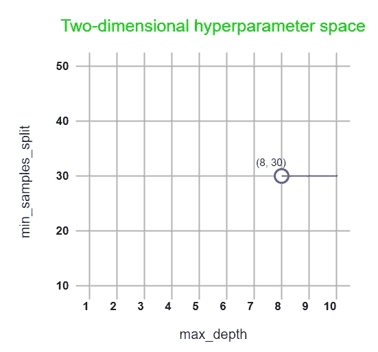
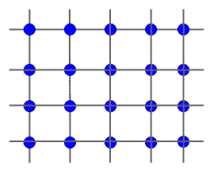
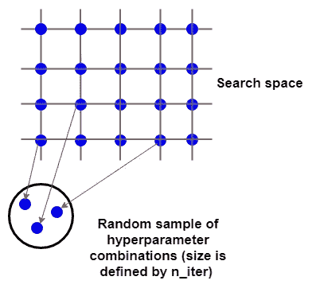
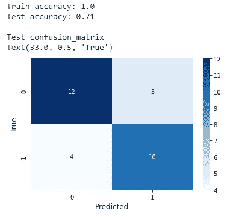
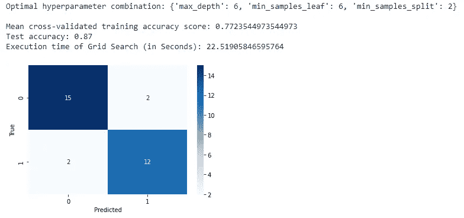
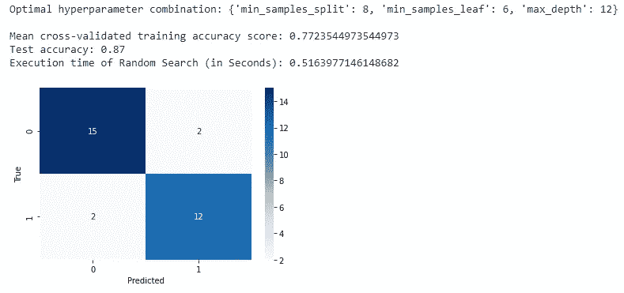

# 超参数优化的网格搜索和随机搜索的 Python 实现

> 原文：<https://towardsdatascience.com/python-implementation-of-grid-search-and-random-search-for-hyperparameter-optimization-2d6a82ebf75c?source=collection_archive---------11----------------------->

## 使用 Scikit-learn GridSearchCV 和 RandomizedSearchCV 函数进行超参数优化的指南


照片由[迪查茨](https://unsplash.com/@dichatz?utm_source=unsplash&utm_medium=referral&utm_content=creditCopyText)在 [Unsplash](https://unsplash.com/?utm_source=unsplash&utm_medium=referral&utm_content=creditCopyText) 上拍摄

如果不进行任何超参数优化(调整)，就无法从机器学习模型中获得最佳效果。默认的超参数值并不是您的数据的最佳模型。sikit-learn-Python 机器学习库为超参数优化提供了两个特殊函数:

*   **GridSearchCV —** 进行网格搜索
*   **RandomizedSearchCV —** 进行随机搜索

如果你是数据科学和机器学习领域的新手，你可能不熟悉这些词。在这篇文章中，我将重点介绍网格搜索和随机搜索的 Python 实现，并解释它们之间的区别。读完这篇文章后，您将能够获得使用 Scikit-learn 实现网格搜索和随机搜索的实践经验。

## 先决条件

强烈建议对***k*-折叠交叉验证**有良好的了解。我们也推荐构建**决策树模型**的知识，因为我们在这里使用这样的模型来实现网格搜索和随机搜索。如果你不熟悉这些东西，不要担心。我也为他们写了内容。首先，阅读它们，然后继续阅读这一个。以下是链接:

**对于*k*-折叠交叉验证:**

</k-fold-cross-validation-explained-in-plain-english-659e33c0bc0>  

**对于决策树:**

</train-a-regression-model-using-a-decision-tree-70012c22bcc1>  

首先，我们将区分模型 ***参数*** 和 ***超参数*** 。

# 模型参数与超参数

***模型参数*** 在训练过程中学习它们的值。我们不手动设置这些值。他们从我们提供的数据中学习。例如，线性回归模型的模型系数可以被认为是模型参数。

相反， ***模型超参数*** 不从数据中学习它们的值。所以，我们必须手动设置它们。我们总是在创建特定模型时(即在训练过程之前)设置超参数的值。例如，我们可以通过为 ***规格化*** 超参数设置一个布尔值来指定是否规格化线性回归模型的输入特征(X):

```
from sklearn.linear_model import LinearRegressionlr_1 = LinearRegression(*normalize=False*) # No any normalization
lr_2 = LinearRegression(*normalize=True*) # Normalization applied
```

**lr_1** 和 **lr_2** 模型给出两种不同的输出，因为它们具有不同的 ***归一化*** 超参数值。模型超参数可以控制模型参数。这意味着模型超参数会影响模型的性能。因此，我们有责任设置模型超参数值，以便它们给出模型的最优或最佳可能输出。

在大多数情况下，即使简单的模型也有两个或更多的超参数。因此，我们必须同时考虑所有这些超参数，以找到每个超参数的最佳值。寻找模型超参数最优组合的过程称为 ***超参数优化(调优)*** 。我们不能手动这样做，因为有许多超参数，每个超参数有许多不同的值。幸运的是，Scikit-learn 提供了 **GridSearchCV** 和 **RandomizedSearchCV** 函数来自动化优化(调整)过程。

# 超参数搜索空间

这是超参数调整过程中一个非常重要的概念。搜索空间包含用户定义的超参数值的所有不同组合。下图显示了两个不同超参数的二维搜索空间— **最大深度**和**最小样本分割**。



(图片由作者提供)

如果有 3 个不同的超参数，则搜索空间是三维的。同样，随着超参数数量的增加，搜索空间可以是高维的。你应该知道的一般事情是:

*   搜索空间中的维数定义了超参数的数量。(例如 2 维-2 个超参数)
*   搜索空间中的每个点定义了超参数值的每个组合。点 **(8，30)** 定义了**最大 _ 深度**的值 8 和**最小 _ 样本 _ 分割**的值 30。

我们可以将搜索空间定义为一个 Python 字典，其中包含作为关键字的超参数名称和作为值列表的这些超参数的值。这种字典的一般格式是:

```
search_space = {'param_1':[val_1, val_2],
                'param_2':[val_1, val_2],
                'param_3':['str_val_1', 'str_val_2']}
```

现在，我们区分网格搜索和随机搜索。

# 网格搜索与随机搜索

***网格搜索*** 在搜索空间中搜索用户定义的所有不同的超参数组合。这将耗费大量的计算资源，并且当搜索空间是高维的并且包含许多值的组合时，通常具有高的执行时间。当有少量超参数和有限(固定)数量的超参数值时，这种方法是理想的。



网格搜索(作者图片)

相比之下，随机搜索在寻找最优组合时不会检查所有不同的超参数组合。相反，它检查在 **RandomizedSearchCV** 函数的 **n_iter** 中指定的随机选择的固定数量的组合。随机搜索在随机选择的组合中找到最佳超参数组合的概率非常高。当搜索空间是高维的并且包含许多值的组合时，该方法对于快速有效地找到最优超参数组合是非常有用的。



随机搜索(图片由作者提供)

# 构建基础模型

现在，我们在[“heart _ disease”数据集](https://drive.google.com/file/d/1zQ3GzQrhtR4_cwlSbs7pAA34ekGkwz_c/view?usp=sharing)上构建决策树分类模型，而不做任何超参数调整。在整篇文章中，我们将使用这个模型作为 ***基础模型*** ，以便可以与使用网格搜索和随机搜索调优的其他模型进行比较。看看下面的 Python 代码，它构建了我们的基本模型。

基本模型(等到加载 Python 代码！)



(图片由作者提供)

正如您从输出中看到的，我们的基本模型不是很好。它已经很好地学习了训练数据，但它无法对新的输入数据(测试集)进行归纳。用技术术语来说，我们的基本模型显然是过度拟合的。决策树模型通常倾向于过度拟合。

我们现在可以使用网格搜索和随机搜索方法来提高我们模型的性能(测试准确度分数)。

首先，我们将尝试网格搜索。

# 网格搜索的 Python 实现

网格搜索的 Python 实现可以使用 Scikit-learn**GridSearchCV**函数来完成。它具有以下重要参数:

*   **estimator —** (第一个参数)一个 Scikit-learn 机器学习模型。换句话说，这是我们的基本模型。
*   **param_grid —** 如前所述的搜索空间的 Python 字典。我们的搜索空间是三维的，包含 576 种不同的组合。这意味着我们用网格搜索训练 576 个不同的模型！
*   **评分—** 用于衡量模型性能的评分方法。对于分类，我们一般用‘准确度’或‘roc _ AUC’。对于回归，首选“r2”或“负均方误差”。由于我们的基础模型是一个分类模型(决策树分类器)，我们使用“准确性”作为评分方法。要查看可用评分方法的完整列表，请点击[此处](https://scikit-learn.org/stable/modules/model_evaluation.html)。
*   **n_jobs —** 指定执行网格搜索时要运行的并行作业的数量。如果您的计算机处理器有许多内核，请为此设置一个较高的值。 **-1** 值使用所有可用的内核。这将加快执行过程。
*   **cv —** 交叉验证的折叠数。标准数字是 5，10。当 cv 为 10 时，每个超参数组合重复 10 次。因此，总迭代次数为 5760 (576 x 10)。

看看下面的 Python 代码，它在我们的基本模型上执行网格搜索。

网格搜索(等到加载 Python 代码！)



(图片由作者提供)

这是一个用几个 **print()** 函数格式化的很好的输出。您可以将这个输出与我们基本模型的先前输出进行比较。该模型的性能现已得到明显改善。这一次，模型并没有过度拟合。它在训练集和测试集上都表现良好。除此之外，调整超参数后，假阳性和假阴性都显著减少。

现在，让我们来关注一下这种情况下网格搜索的执行时间。大约只有 22.5 秒。运行 5760 次迭代在处理器所有内核都启用的情况下只需要 22.5 秒( **n_jobs=-1** )！

接下来，我们尝试随机搜索。

# 随机搜索的 Python 实现

随机搜索的 Python 实现可以使用 Scikit-learn 的 **RandomizedSearchCV** 函数来完成。大多数参数与 **GridSearchCV** 函数中的参数相同。这里，搜索空间由**参数 _ 分布**而不是**参数 _ 网格**定义。除此之外，

*   **n_iter —** 指定随机选择的超参数组合的数量。这是因为随机搜索不会检查搜索空间中定义的所有超参数组合。相反，它只考虑组合的随机样本。这里，n_iter=10 意味着它执行大小为 10 的随机样本任务，该样本包含 10 个不同的超参数组合。所以随机搜索只训练 10 个不同的模型(之前是 576 个带网格搜索的模型)。
*   **random_state —** 控制每次不同执行时获取超参数组合样本的随机化。我们可以使用任何整数。

这里，总迭代次数是 100 (10 x 10)，这比前一种情况(5760 次迭代)少得多。

现在，看看下面的 Python 代码，它在我们的基本模型上执行随机搜索。

随机搜索(等到加载 Python 代码！)



(图片由作者提供)

模型性能与网格搜索完全相同。然而，最佳超参数值是不同的。现在，执行时间仅为 0.51 秒，比前一个版本(22.5 秒)少得多。在这种情况下，随机搜索比网格搜索快 44 倍(22.5 / 0.51)。这是因为随机搜索只少执行 57.6 倍(5760 / 100)的迭代！

# 结论

在我们的例子中，您可以尝试网格搜索和随机搜索，因为这两种方法只需要不到半分钟的时间。然而，请记住，随机搜索的力量。在我们的例子中，它快了 44 倍(22.5 / 0.51)。这意味着如果随机搜索将花费 1 分钟的执行时间，网格搜索将花费大约 44 分钟！所以，当搜索空间是高维的，包含很多不同的超参数组合时，我强烈推荐你使用随机搜索。

运行网格搜索或随机搜索后，您将获得最佳超参数组合。例如，我们在网格搜索中得到以下最优超参数组合:

```
{'max_depth': 6, 'min_samples_leaf': 6, 'min_samples_split': 2}
```

因此，我们可以将最优模型定义如下:

```
from sklearn.tree import DecisionTreeClassifierdtclf_optimal = DecisionTreeClassifier(**max_depth=6**,
                                       **min_samples_leaf=6**,
                                       **min_samples_split=2**,
                                       random_state=42)
```

然而，我们不需要这样写代码。 **GridSearchCV** 和**randomzedsearchcv**函数都有一个名为 **best_estimator_** 的属性，用来获得具有最优超参数的模型。因此，

```
gs.best_estimator_ 
```

会给出同样的 **dtclf_optimal** 模型。这里， ***gs*** 是拟合的 GridSearchCV 模型。

此外，请注意，网格搜索和随机搜索一次考虑所有超参数，而不是一个接一个。这就是为什么网格搜索和随机搜索得到的不同超参数值给出了相同的准确率分数。如果您想查看单个超参数的影响，我建议您使用**验证曲线** —一种图形技术。我写的下面这篇文章解释了我们如何使用它。

</validation-curve-explained-plot-the-influence-of-a-single-hyperparameter-1ac4864deaf8>  

我的读者可以通过下面的链接注册成为会员，以获得我写的每个故事的全部信息，我将收到你的一部分会员费。

**报名链接:**[https://rukshanpramoditha.medium.com/membership](https://rukshanpramoditha.medium.com/membership)

非常感谢你一直以来的支持！下一个故事再见。祝大家学习愉快！

除封面图片、代码样本、其他内容链接和文字内容外的所有图片均归作者版权所有。特别要感谢 Unsplash 上的**迪查茨**，他是封面图片的所有者。非常感谢，**迪查茨**，为我在本帖中提供了一张出色的封面图片！

[**鲁克山普拉莫迪塔**](https://medium.com/u/f90a3bb1d400?source=post_page-----2d6a82ebf75c--------------------------------) **2021–06–07**