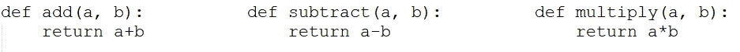
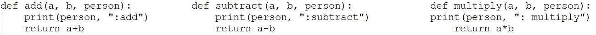

# Python 一个简单应用程序中的重要概念

> 原文：<https://towardsdatascience.com/python-important-concepts-in-one-application-classes-staticmethod-classmethod-decorators-c44a0d588da5?source=collection_archive---------19----------------------->

## 类，staticmethod，classmethod，自定义装饰器


澳门图片社在 [Unsplash](https://unsplash.com/?utm_source=unsplash&utm_medium=referral&utm_content=creditCopyText) 上拍摄的照片:装饰让一切看起来都很美，甚至你的代码...

从前..不，不，只是几天前，我的一个朋友让我解释一些 python 的概念。其中一些是类、装饰器、classmethod、staticmethod。

我在网上搜索，给她发一些好的链接来理解这些概念，但是我找不到一个地方能以简明易懂的方式解释这些概念。我找不到一个简单的方法来解释这些，对于那些对 OOPS 概念不是很有效率的人来说。

所以，我花了一些时间创建了一个小应用程序来主要解释使用这些的*为什么*。然后我想为什么不分享一下呢？

现在，让我们直接去理解这些概念。我正在创建一个名为计算器的应用程序。有三个用户想要访问计算器并使用该计算器执行不同的操作。

# 计算器应用

这是应用程序，有加，减，乘操作，不同的用户应该能够与应用程序交互和执行操作。

## 无类别方式(未创建类别):

所以，让我们从构建一个名为 Calculator 的类开始。但是等等..它的蟒蛇..我们真的需要上课吗？难道我就不能创建四个函数，名为加、减、乘、除，让人们使用吗？当然，我可以，但是请记住，您可以按照您想要的任何方式编码，但是构建一个定义上下文的代码并在其中分离操作(封装)是创建一个可读且可维护的代码的方法。

首先，让我们采用非类的方式:创建四个方法:



计算器应用程序的加、减、乘方法

**现在，假设有三个用户想要访问它:Aron、Ben 和 Cathy** 。

Aron 调用 add(2，3)并得到结果。但是如果你想追踪是谁打来的呢？在这种情况下，您可能希望将函数修改为:



加，减，乘的方法来记录谁打电话

***以人为输入的运算符方法！！这是正确的方法吗？***

这里，我们更新了方法，在“person”变量中传递人名，我们可以知道哪个人调用了特定的方法。Aron 调用这个方法为:add(2，3，“Aron”)并得到结果。它成功了，我们完成了！！

不，还没有。想一想，用人名作为输入来执行计算的方法好吗？不对，对！！为什么不将打印姓名与执行这些操作分开呢？

救援来了...类别和对象:

## 优雅的方式:

类是封装内部功能的一种方式，因此可以创建特定的对象。对象是为特定的实例创建的，可以重用这些实例对对象的现有状态执行不同的操作。哼！！太啰嗦了。如果我刚才说的你一个字也没听懂，就忽略它，继续前进。我们通过例子来了解一下。

```
class Calculator():
    def __init__(self, person_name):
        self.per_name = person_name

    def add(self, a, b):
        print("Operation called by", self.per_name)
        return a+b

    def subtract(self, a, b):
        print("Operation called by", self.per_name)        
        return a-b

    def multiply(self, a, b):
        print("Operation called by", self.per_name)
        return a*b
```

在这里，我创建了一个名为 calculator 的类，加、减、乘方法只有它们特定的功能。 **__init__** 方法是一个构造函数，将用于为特定的人创建对象。让我们为 Aron 创建它:

```
if __name__ == '__main__':
    aron_calculator = Calculator('Aron')
    ben_calculator = Calculator('Ben')
    cathy_calculator = Calculator('Cathy')
    print(aron_calculator.add(6, 5))
    print(aron_calculator.subtract(6, 5))
    print(ben_calculator.subtract(6, 5))
    print(cathy_calculator.multiply(12, 3))**Output:**
Operation called by Aron
11
Operation called by Aron
1
Operation called by Ben
1
Operation called by Cathy
36
```

***到底是什么意思？***

在这里，您可以想象 Aron 登录到 Calculator 应用程序，并收到一个 aron_calculator 对象作为响应。这将设置 Aron 的对象，并传递人名。现在，他可以使用该对象来执行任何计算，我们将知道 Aron 正在执行这些操作。**“self”**包含与 Aron 和 **self.per_name** 相关的详细信息，提供 Aron(因为我们在为他创建对象时已经在 __init__ 中设置了它。)

这些方法被称为实例方法。现在你知道了类和实例方法(需要 self)以及我们为什么需要它们。先说 classmethod 和 staticmethod。

# **@静态方法:**

静态方法是那些不附属于任何对象或类的方法。这些都是独立的方法(就像 python 函数一样),它们被保留在类中的原因是只有其他类方法使用它们。让我们创建一个方法作为 staticmethod，并看看如何以及何时使用它:

```
class Calculator():
    def __init__(self, person_name):
        self.per_name = person_name

    def add(self, a, b):
        print_operator_name(self.per_name)
        return a+b

    def subtract(self, a, b):
        print_operator_name(self.per_name)        
        return a-b

    def multiply(self, a, b):
        print_operator_name(self.per_name)
        return a*b **@staticmethod    
    def print_operator_name(person_name):
        print("Operation called by", person_name)**
```

这里，正如您所看到的，我们没有在方法中使用 print 语句，而是创建了一个 static method print _ operator _ name，它负责打印细节。实例方法可以调用这个 staticmethod(它不需要 self，和类外的 python 函数一样好)来打印操作符名称。

# **@classmethods:**

这是 python 提供的内置 decorator(我稍后会谈到 decorator ),它影响类，而不仅仅是特定的对象。因此，通过 classmethod 更新的任何东西都可以更新类级别的变量，然后所有的对象都可以看到这些变量被更新了。让我们看一个例子:

```
class Calculator:
    **status = False**

    def __init__(self, person_name):
        **if not self.status:
            raise ValueError("Calculator is not running. Please update status.")**
        self.per_name = person_name

    def add(self, a, b):
        self.print_operator_name(self.per_name)
        return a+b

    def subtract(self, a, b):
        self.print_operator_name(self.per_name)
        return a-b

    def multiply(self, a, b):
        self.print_operator_name(self.per_name)
        return a*b

    @staticmethod    
    def print_operator_name(person_name):
        print("Operation called by", person_name)
 **@classmethod
    def set_status(cls):
        cls.status = True

    @classmethod
    def reset_status(cls):
        cls.status = False

    @classmethod
    def getStatus(cls):
        return cls.status**
```

这里，我在计算器类级别创建了一个状态:

```
class Calculator():
    status = False
```

***状态=假！！这是什么意思？***

这决定了我们计算器的*状态。*最初，是假的。你可以想象你需要通过设置它为真来启动你的计算器。然后 Aron，Ben，Cathy 可以通过创建它们的对象来操作它们。否则，即使在创建对象时，他们也会得到一个异常，如果没有对象，他们就不能操作计算器。

为此，由于 status 是一个类级别的变量，我们需要 classmethod。set_status 将其设置为 True，reset_status 将其设置为 False，get_status 返回状态。**“cls”**是一个类作用域变量，用来访问类的变量(就像 self 可以访问 per_name 这样的对象级变量一样)。 **cls，self** 只是标准，你可以用任何你想要的字符串替换它，但是这是推荐的，因为它有助于保持代码的一致性。

*让我们运行它:*

```
if __name__ == '__main__':
 **Calculator.reset_status()**    print(Calculator.getStatus())
    aron_calculator = Calculator('Aron')
    ben_calculator = Calculator('Ben')
    cathy_calculator = Calculator('Cathy')
    print(aron_calculator.add(5, 6))
    print(aron_calculator.subtract(4, 2))
    print(cathy_calculator.subtract(3, 1))
    print(cathy_calculator.multiply(4, 5))
```

我们得到一个异常，声明状态不为真，因为构造函数不允许状态为假，因此不会创建对象。这意味着，没有人可以访问计算器，因为它是关闭的(状态为假):

```
Output:
False
Traceback (most recent call last):
  File "C:\Users\tushar_seth\PycharmProjects\calculator_medium\Calculator.py", line 49, in <module>
    aron_calculator = Calculator('Aron')
  File "C:\Users\tushar_seth\PycharmProjects\calculator_medium\Calculator.py", line 13, in __init__
    raise ValueError("Calculator is not running. Please update status.")
ValueError: Calculator is not running. Please update status.
```

***想运行计算器？*使状态为真**

```
if __name__ == '__main__':
 **Calculator.set_status()**    print(Calculator.getStatus())
    Calculator.set_status()
    aron_calculator = Calculator('Aron')
    ben_calculator = Calculator('Ben')
    cathy_calculator = Calculator('Cathy')
    print(aron_calculator.add(5, 6))
    print(aron_calculator.subtract(4, 2))
    print(cathy_calculator.subtract(3, 1))
    print(cathy_calculator.multiply(4, 5))
```

我们得到适当的输出:

```
Output:
True
Operation called by Aron
11
Operation called by Aron
2
Operation called by Cathy
2
Operation called by Cathy
20
```

这显示了 staticmethod 和 classmethod 的能力。

# 装修工

现在，让我们进入下一个主要概念:装饰者。您看到了@staticmethod 和@classmethod，它们是内置的 python 装饰器。如果你想用自己的功能创建自己的装饰器呢？

但是首先，你为什么要创造自己的装饰者呢？

装饰器在很多编程语言中使用，主要是为了使代码简洁，并用几个词隐藏样板代码。如果您想在每次调用某个方法时都以特定的方式运行该方法，那么您可以只应用装饰器，甚至不用接触实际的方法。

继续我们之前的计算器课程。您是否注意到，我们需要记录操作符和操作细节，为此，我们创建了一个 staticmethod，并从每个方法中一次又一次地调用。如果我们不想接触那些方法，假设我们已经构建了复杂的方法，并且我们不想弄乱它们的功能，该怎么办？在这种情况下，我们可以用公共方法的方法名来修饰操作符方法。

***别拿理论烦我，给我看看例子！！***

让我们直接跳到例子来理解这一点，我们在类外创建一个方法(这是最简单的方法。理想情况下，我们应该创建一个内部类，并在其中定义 decorator。但是我的范围是让你理解功能。要查看在类中创建 decorator 的内部类方法，请查看以下链接:[https://medium . com/@ vadimpushtaev/decorator-inside-python-class-1e 74d 23107 F6](https://medium.com/@vadimpushtaev/decorator-inside-python-class-1e74d23107f6)

```
**def logging_decorator(incoming_function):
    def inner_function(self, a, b):
        print('Operation called by', self.per_name)
        return incoming_function(self, a, b)
    return inner_function**
```

在这里，logging_decorator 接受一个函数，这个函数本来就是要有这个 decorator 的。然后 inner_function 接受(加、减、乘)方法得到的参数。然后我们可以改变调用该函数的行为，首先打印我们的日志，然后将实际的方法调用返回给被调用者。

现在，我们可以使用 decorator 用这个函数来修饰我们的方法，这很简单，只需在方法上写@logging_decorator，因此我们的最终代码如下:

```
def logging_decorator(incoming_function):
    def inner_function(self, a, b):
        print('Operation called by', self.per_name)
        return incoming_function(self, a, b)
    return inner_function

class Calculator:
    status = False

    def __init__(self, person_name):
        if not self.status:
            raise ValueError("Calculator is not running. Please update status.")
        self.per_name = person_name

    @logging_decorator
    def add(self, a, b):
        return a+b

    @logging_decorator
    def subtract(self, a, b):
        return a-b

    @logging_decorator
    def multiply(self, a, b):
        return a*b

    @staticmethod    
    def print_operator_name(person_name):
        print("Operation called by", person_name)

    @classmethod
    def set_status(cls):
        cls.status = True

    @classmethod
    def reset_status(cls):
        cls.status = False

    @classmethod
    def getStatus(cls):
        return cls.status

if __name__ == '__main__':
    Calculator.set_status()
    print(Calculator.getStatus())
    aron_calculator = Calculator('Aron')
    ben_calculator = Calculator('Ben')
    cathy_calculator = Calculator('Cathy')
    print(aron_calculator.add(5, 6))
    print(aron_calculator.subtract(4, 2))
    print(cathy_calculator.subtract(3, 1))
    print(cathy_calculator.multiply(4, 5))
```

它的输出将与前一个完全相同:

```
True
Operation called by Aron
11
Operation called by Aron
2
Operation called by Cathy
2
Operation called by Cathy
20
```

因此，我们改变了方法调用的行为方式，甚至没有触及方法(corona time！！不要碰它)(是的是的我们移除了之前对静态方法的调用..我戴着面具做那个！！).

如果我有一个接受 3 个参数的方法呢？这个会失败吧？

是的，这肯定会失败。为了克服这一点，我们可以创建一个通用参数方法:

```
**def logging_decorator(incoming_function):
    def inner_function(*args, **kwargs):
        print('Operation called by', args[0].per_name)
        return incoming_function(*args, **kwargs)
    return inner_function**
```

有了这个，我们甚至可以有多变量方法:

```
**@logging_decorator
def add3(self, a, b, c):
    return a + b + c**print(cathy_calculator.add3(4, 5, 8))Output:
Operation called by Cathy
17
```

下面，我们用一个简单的例子来解释 Python 的基本概念，这些概念非常重要，但人们发现它们很难掌握。这些都是棘手的概念，但并不难。一旦你学会了这一点，你将会在你的 python 生涯中用到很多。我非常喜欢装修工，希望在这之后，你也会喜欢。上面讨论的代码的 GitHub 链接在这里:

 [## tseth 92/python-基础-概念

### 这个存储库包含中等出版物的代码- tseth92/python-basic-concepts

github.com](https://github.com/tseth92/python-basic-concepts.git) 

感谢阅读！！。对于任何建议，疑问或讨论，在评论区拍摄。如果你喜欢这个代码，请在 Github 上投票。

在 medium 和 GitHub 上关注我，获取即将发布的文章；到那时，**快乐的蟒蛇**和好运:)