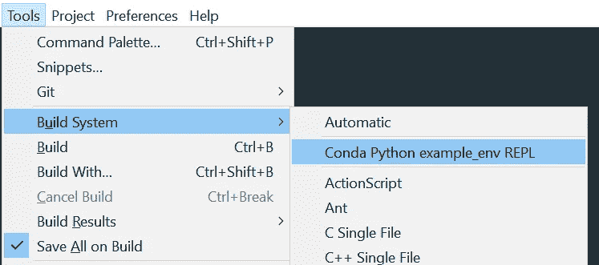

# 崇高文本 3 中的蟒蛇与崇高的 REPL 和蟒蛇

> 原文：<https://towardsdatascience.com/python-in-sublime-text-3-with-sublime-repl-and-anaconda-744ca0da91e3?source=collection_archive---------41----------------------->

## 灵活的、以项目为中心的设置

只需一个按键就可以在项目之间切换，而不必担心构建系统的切换。借助这种以项目为中心的设置，加快您的数据科学工作流程。

在本教程中，您将学习如何将 Sublime Text 3 链接到 Anaconda/Miniconda 环境中，并使用 Sublime REPL 执行 Python。当您在 Sublime 中切换项目时，构建系统也会切换到与之相关联的 conda 环境。

您可能已经有了不同虚拟环境的现有项目——不用担心。这种设置可以很容易地应用到您已经拥有的任何项目。**注意:**本指南是为 *Windows 10 编写的。*


*照片由 Pexels 的凯拉·伯顿拍摄*

# TL；速度三角形定位法(dead reckoning)

看起来可能需要很多步骤，但是如果你手头有一切，你可以在 1 分钟内完成。这是*你需要*去做的:崇高文本 3，包控制，项目经理，Anaconda/Miniconda 和 conda 虚拟环境。比如我这里用 *example_env* 。

1.  打开崇高文本 3，并确保你有包控制，崇高 REPL 和项目经理。用命令面板安装快捷键:CTRL+SHIFT+p，键入*安装* > *包控制:安装包* > *【包名】*
2.  记下 conda env 的名称或创建一个新的名称`conda create --name **example_env** python=3.8 -y`
3.  将`C:\Program Files\Sublime Text 3\`(或者`subl.exe`所在的任何地方)添加到你的系统环境变量中，打开项目目录中的`cmd`，用`subl .`打开 Sublime
4.  使用命令面板通过 CTRL+SHIFT+p > `Project Manager: Add new project`向项目管理器添加一个新项目
5.  CTRL+SHIFT+p 键入`browse`，选择`Preferences: Browse packages`。浏览器在`C:\Users\[YOURNAME]\AppData\Roaming\Sublime Text 3\Packages\`中打开。导航至`SublimeREPL/config/Python`，复制文件`Main.sublime-menu`并返回`C:\Users\[YOURNAME]\AppData\Roaming\Sublime Text 3\Packages\`。
6.  打开`User`文件夹，创建目录`SublimeREPL\config\Python`，将`Main.sublime-menu`粘贴到刚刚创建的目录下(`C:\Users\[YOURNAME]\AppData\Roaming\Sublime Text 3\Packages\User\SublimeREPL\config\Python`)。将`Main.sublime-menu`改名为`**example_env**.sublime-menu`，用 Sublime 打开。
7.  搜索`"id": "repl_python_run",`所在的块，找到`"cmd": ["python", "-u", "$file_basename"],`。我们将`"python"`替换为我们想要链接到项目的 conda env 的路径，然后**保存**。比如:`"cmd": ["C:\\Users\\philipp\\miniconda3\\envs\\**example_env**\\python.exe", "-u", "$file_basename"],`。
8.  CTRL+SHIFT+p 查找`Project: edit project`。插入下面的代码片段来定义项目的构建系统。**用你想要的 conda env 替换** *example_env* 。

```
{ 
"build_systems": [ 
{ 
"name": "Conda Python **example_env** REPL", 
"target": "run_existing_window_command", "id": "repl_python_run", "file": "config/Python/**example_env**.sublime-menu", 
} 
], 
... }
```

厉害！用 CTRL+ ALT + p 在项目之间轻松切换，不用担心 conda 环境。该设置是项目特定的。我希望这能加快你的工作流程。祝你未来的项目愉快！

如果您遇到任何问题，请参考下面更详细的指南。如果你还有问题，有不清楚的地方或者你只是想打个招呼，请告诉我。非常感谢任何形式的反馈。

> *这篇文章的灵感来自于社区在*[*stack overflow*](https://stackoverflow.com/questions/38214656/using-different-conda-envs-with-sublime-repl)*上的努力。我的方法避免了崇高的建筑系统菜单将充满每一个你链接到 REPL 的虚拟环境。此外，这里的解决方案是以项目或环境为中心的，而不是全局设置。*

# 问题

项目越多，创建的虚拟环境就越多，特定于项目的设置就变得越重要。最近，当三个项目并行运行，我不得不频繁地在它们之间切换时，我就经历了这种情况。切换项目和构建系统打乱了我的工作流程。我需要一种快速的方法来切换和改变每个构建系统。我的工作流程依赖于 Sublime Text 3、Anaconda 和 Sublime REPL，所以我需要一个针对这些工具的解决方案。本文提出了一种平稳地集成它们的方法，以实现快速而稳定的项目设置。

对于一个轻量级和快速的 Python 设置，我们需要什么？

*   使用轻量级文本编辑器快速加载文件→升华文本 3
*   在项目之间轻松切换→提升项目经理
*   处理与为每个项目定义的虚拟环境的依赖关系→ Anaconda/Miniconda
*   使用交互式命令行构建系统→升华 REPL

这里提供的设置允许您使用 CTRL+ALT+p 在项目和它们相关的虚拟环境之间切换。选择另一个项目后，构建系统也会切换到您在项目设置中定义的项目。有几个步骤是必须遵循的，但这是值得的。希望这也对你有用。

# 开始之前

如果您还没有，请安装以下软件:

1.  崇高的文本 3:【https://www.sublimetext.com/3 
2.  崇高包控:【https://packagecontrol.io/installation 
3.  项目经理:[https://packagecontrol.io/packages/ProjectManager](https://packagecontrol.io/packages/ProjectManager)
4.  崇高的 https://packagecontrol.io/packages/SublimeREPL[REPL](https://packagecontrol.io/packages/SublimeREPL)
5.  anaconda/Miniconda:[https://docs.conda.io/en/latest/miniconda.html](https://docs.conda.io/en/latest/miniconda.html)答:整个教程(`conda create --name **example_env** python=3.8 -y`)我都用 *example_env*

本教程假设 *Windows 10* ，但应该同样适用于 Linux。我推荐使用 Miniconda，在 Reddit 上看看为什么

# 解决办法


*来自 Pexels 的 Andrea Piacquadio 的照片*

我们安装了上面列表中的所有东西，并且有一个 conda 环境。我使用 *example_env* 作为 conda 环境。第一步是将 Sublime 放在项目根文件夹的中心。这样，所有像用 CTRL+p 跳转到一个文件这样的快捷方式都与项目根`./`相关。然后我们初始化项目管理器。

让我们像`C:\Users\[YOURNAME]\[PATH-TO-PROJECT]\[PROJECTNAME]`一样在项目根打开 Sublime 的一个新实例。我已经将 Sublime 添加到我的环境变量中(下面有一个简短的操作方法),并在项目根目录中打开一个终端`C:\Users\philipp\projects\Sublime project setup`。用 CTRL+l 进入地址栏，键入`cmd`打开命令，
回车。运行`subl .`(仅当您将`subl.exe`添加到您的 Windows 环境变量中时才有效——在下面的附录中找到一个简短的方法)。一扇空荡的窗户打开了。这就对了。

现在我们转向项目经理。使用命令面板通过 CTRL+SHIFT+p > `Project Manager: Add new project`向项目管理器添加一个新项目。用 CTRL+SHIFT+p > `Project Manger: Edit project`检出项目设置文件。Sublime 在这里存储您的项目设置，包括项目`name`和`path`:

```
{ 
"folders": [ 
{ "binary_file_patterns": [ ], 
"file_exclude_patterns": [ ], 
"folder_exclude_patterns": [ ], 
"name": "Sublime project setup", 
"path": "C:\\Users\\philipp\\projects\\Sublime project setup" 
} 
] 
}
```

接下来，我们定义一个构建系统，它采用 conda env 项目的`python.exe`， *example_env* 。记下 conda 环境的名称。例如，在本教程中，我用`conda create --name **example_env** python=3.8 -y`创建了一个环境。所以，我在这里使用 *example_env* 作为环境。

1.  CTRL+SHIFT+p 键入`browse`并选择`Preferences: Browse packages`。浏览器在`C:\Users\[YOURNAME]\AppData\Roaming\Sublime Text 3\Packages\`中打开。
2.  从这里，导航到`SublimeREPL/config/Python`并复制文件`Main.sublime-menu`
3.  回到`C:\Users\[YOURNAME]\AppData\Roaming\Sublime Text 3\Packages\`，打开`User`，创建以下文件夹:`SublimeREPL\config\Python`。
4.  现在你在`C:\Users\[YOURNAME]\AppData\Roaming\Sublime Text 3\Packages\User\SublimeREPL\config\Python`中，将`Main.sublime-menu`粘贴到目录中。
5.  将`Main.sublime-menu`改名为`example_env.sublime-menu`，用 Sublime 打开
6.  **重要步骤**:搜索`"id": "repl_python_run",`所在的区块，用`"cmd": ["C:\\Users\\[YOURNAME]\\[PATHTOCONDA]\\envs\\**example_env**\\python.exe", "-u", "$file_basename"],`替换`"cmd": ["python", "-u", "$file_basename"],`并保存。*注意:*用任何通向您的 conda 环境的`python.exe`的路径替换该路径。对我来说，这是`C:\\Users\\philipp\\Miniconda3\\envs\\**example_env**\\python.exe`。
7.  用 CTRL+SHIFT+p find `Project: edit project`打开命令面板，选择项目名称。现在我们定义使用我们的 conda 环境的 Python 的构建系统，`**example_env**`。复制粘贴下面的代码片段，并用您的环境名称替换 `**example_env**`。**重要提示:**共有 *2 处*替换**粗体**。

```
{ "build_systems": [ 
{ "name": "Conda Python **example_env** REPL", 
"target": "run_existing_window_command", 
"id": "repl_python_run", 
"file": "config/Python/**example_env**.sublime-menu", } 
], "folders": 
[ 
{ "binary_file_patterns": [ ], 
"file_exclude_patterns": [ ], 
"folder_exclude_patterns": [ ], 
"name": "example project", 
"path": "C:\\Users\\[YOURNAME]\\Projects\\example_project" } 
] }
```



为了简单地测试设置，创建一个像`test.py`一样的新文件并插入

用我们的构建系统运行这个文件(这里:*Conda Python example _ env REPL*):


我希望它一直工作到现在。如果没有，请给我留言或留下评论！

# 使用

当您并行处理几个项目时，这种设置显示了它的优势。您可以(I)使用 CTRL+ ALT + p 在项目之间切换,( ii)在您的构建系统之间拥有相关的虚拟环境。

要设置一个新项目，从命令行的`subl .`开始，重复**解决方案**部分的所有步骤。这样做两次左右，1 分钟后就会自然了。

我确信还有其他我还没有弄清楚的方法和项目设置。因此，我很欣赏任何关于崇高，REPL 和蟒蛇项目设置的技巧和最佳实践。

> 如果有人想自动化这个过程，并为 Sublime REPL 实现一个基于项目的构建系统，我将不胜感激！我认为许多其他人将从中受益。它将连接来自崇高的阿纳康达和 REPL 世界的最好的工具。

# 结论

在本教程中，您学习了如何设置崇高的 REPL 和链接到您的康达环境。通过这种方式，您可以跨项目拥有多个环境，并使用 Sublime 的项目管理器及其快捷键 CTRL+ ALT+p 轻松切换。享受您的新设置，享受您的项目！

如果你觉得这很有帮助，或者在安装过程中遇到了一些问题，请给我留言。非常感谢您的反馈！

进一步寻找中级提示和技巧来开发您的数据科学工作流？敬请关注下一篇关于数据科学工具 2021 的帖子。

# 附录

# 如何将 subl.exe 添加到环境变量

Windows 用户的快捷方式:点击 *Windows 键*，输入`env`，从搜索结果中选择`Edit environment variables for your account`。

然后点击`Path`>`Edit`>`New`>`C:\Program Files\Sublime Text 3\`>`OK`。用找到`subl.exe`的目录替换`C:\Program Files\Sublime Text 3\`。另见[本教程](https://scotch.io/tutorials/open-sublime-text-from-the-command-line-using-subl-exe-windows#:~:text=A%20nice%20shortcut%20to%20do,folder%20of%20your%20Sublime%20installation.)。

# 资源

[](https://stackoverflow.com/questions/38214656/using-different-conda-envs-with-sublime-repl) [## 使用不同的康达 env 和 Sublime REPL

### 我正在尝试将 Sublime Text 3 设置为一个用于数据科学的多语言编辑器。为此，我使用崇高的 REPL…

stackoverflow.com](https://stackoverflow.com/questions/38214656/using-different-conda-envs-with-sublime-repl)  [## 正确配置 Anaconda:damnwidget.github.io/anaconda/

### Anaconda 开箱即可正常工作(总是在您的路径中配置了一个 Python 解释器，并且二进制文件是…

damnwidget.github.io](http://damnwidget.github.io/anaconda/anaconda_settings/) 

*最初发布于*[*https://philippschmalen . github . io*](https://philippschmalen.github.io/posts/python-in-sublime-text-3-with-sublime-repl-and-anaconda/)*。*