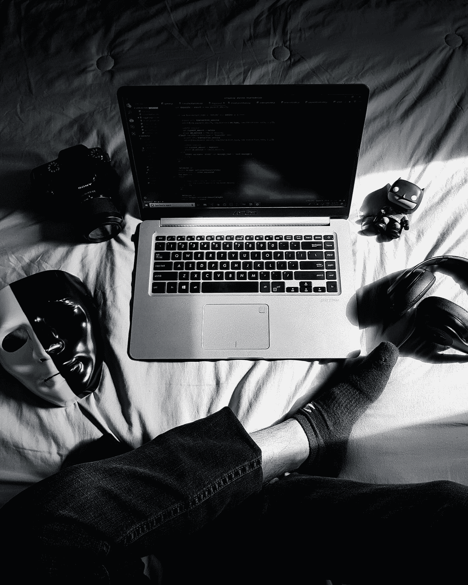
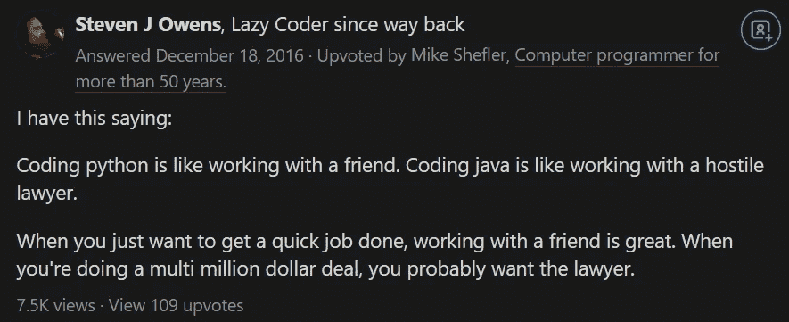

# Python 是完美的——为什么反 Python 开发者不会放弃

> 原文：<https://towardsdatascience.com/python-is-perfect-why-anti-python-developers-wont-give-up-326ae1a09e7f?source=collection_archive---------3----------------------->

## 编程；编排

## 如何让讨厌 Python 的人闭嘴？

费尔南多·埃尔南德斯在 [Unsplash](https://unsplash.com?utm_source=medium&utm_medium=referral) 上的照片

软件开发长期以来一直有点像雷区。

一般人会觉得用传统的编程语言(如 C 和 JAVA)进入软件领域是很可怕的。

但是一旦 Python 加入游戏，这种情况很快就改变了。Python 因其革命性的编程方法而成为软件开发的一大飞跃。

人们爱上 Python 是因为它的简单性、广泛的库支持和表达能力。就这样，像 C 和 JAVA 这样的语言的统治结束了。

# 没有什么是完美的。等等，真的吗？

如果你是一名软件开发人员，你可能很熟悉术语**权衡。**

每当出现关于编程语言的问题时，人们期望得到的传统答案是:“视情况而定。”

普遍认为没有完美的编程语言。等等，是真的吗？

对我来说，不是。我开始意识到 Python 是编程语言的银弹。

到目前为止，我用过 Python C，C++，MATLAB，JAVA。Python 是最后的，也是最好的。到目前为止。

为了测试 Python，我做了一个实验，将我的大部分非 Python 程序转换成 Python。最终的 Python 版本要好得多。

现在，据我所知，Python 在两个主要问题上一直受到严厉批评。

*   动态打字
*   速度

虽然我同意这些问题在某种程度上对软件开发有重大影响，但我可以肯定这是在 Python 还处于婴儿期的时候。

然而，由于其坚如磐石的社区，Python 已经发展到了几乎可以与所有编程语言相提并论的地步。动态类型和速度不再对编码实践有重大影响。

Python 兼容所有问题。

如果是这样的话，为什么 Python 还没有被广泛采用呢？

如果我现在回答这个问题，我的话将没有任何争论的分量。因此，有必要解释一下为什么动态类型和性能问题是容易被忽略的小问题。

# 动态打字

要理解动态类型，最好一直拖着对立面——静态类型。

静态类型语言是 C、JAVA 等。这些语言和它们的动态类型对应物之间的主要区别在于类型检查。静态类型是在编译时执行类型检查，而在动态类型中，类型检查是在运行时执行的。

> 名词（noun 的缩写）b:这是动态和静态类型的一个平淡无奇的定义。细节和技术细节超出了这篇文章的范围。

由于 Python 的调试问题，以及这种语言如何使跟踪 bug 的过程变得更加复杂，一些开发人员对 Python 怨声载道。

这种抱怨源于这样一个事实，即作为一种动态类型语言，Python 在运行时会标记错误，这使得它比像 JAVA 这样的静态类型语言更容易出错。

从理论上讲，考虑到众所周知的谚语— *人非圣贤，孰能无过，这是一种威胁。但是实际上，我怀疑类型错误就像他们声称的那样严重。*

说真的，现在谁会犯打字错误？

静态类型语言远不是一个没有麻烦的调试避风港。除了类型错误之外，大多数静态类型语言都无法捕捉到您可能认为可以检测到的细微错误。这些错误同样发生在静态类型和动态类型中。

此外，我们可以同意，几乎没有代码是在没有单元测试的情况下部署的。单元测试为防止类型错误提供了一个很好的保护层。只有极少数情况下，类型错误会绕过单元测试，从而搞乱代码。

编程语言在调试方面的另一个特性是安全和不安全的类型。众所周知，允许用户重写系统类型的语言具有不安全的类型，例如 C。虽然不安全的类型赋予了用户对类型的控制权，但是它的误用会导致程序任意崩溃。

大多数静态类型语言都是不安全的类型系统。然而，JAVA 是一种安全的类型。Python 和我所知道的其他动态类型编程语言也是如此。

最后，我更愿意用像 Python 这样方便和高级的语言编写一百万次代码，而不是陷入像 JAVA 这样的低级语言的细节中。

# 速度

可怜的蟒蛇一直微笑着接受性能批评。如果你正在进行编程语言的辩论，我几乎可以保证，一旦你开始吹捧 Python，你的性能就会大打折扣。这是真的。嗯，在某种程度上。

我不会争论原始或标准 Python 比 C 或 JAVA 慢的事实。但是正如我之前所说的，有了像 Python 这样勤奋和创新的社区，不用担心。

在过去的几年里，Python 和它的静态竞争对手之间的性能差距已经大大缩小了。JIT 编译和并行计算的进步让 Python 赶上了它的竞争对手。

为了解决 Python 的性能问题，开发了许多变通方法。例如:

*   将实现从 [CPython](https://github.com/python/cpython) 改为 [PyPy](https://doc.pypy.org/en/latest/release-1.2.0.html) 显著提高了执行速度。偶尔，PyPy 甚至可以[跑赢](/run-your-python-code-as-fast-as-c-4ae49935a826) C

> 名词（noun 的缩写）B: CPython 是你从[Python.org](https://www.python.org/)下载的实现

*   抑制 [GIL](https://cython.readthedocs.io/en/latest/src/userguide/parallelism.html?highlight=gil#cython.parallel.parallel) 使 Python 能够并行执行序列，从而提高计算速度。
*   JIT 编译器 [Numba](http://numba.pydata.org/) 。把 Numba 装饰器放在你的函数上，看着它以光速运行就足够了。
*   很多 Python 库像 Numpy 和 Scipy 都是用 C/C++写的。

如您所见，性能在某种程度上是反对 Python 的过时论点。有了所有这些解决方案，除了称赞 Python 充满活力的社区之外，别无他法。

但是为什么有些人仍然不喜欢 Python，而更喜欢老式的 JAVA 之类的东西呢？

# 为什么不向 Python 投降？

首先，这里有一个 quora 帖子让我忍俊不禁。

来源: [Quora](https://www.quora.com/Is-it-just-me-or-is-Python-actually-a-more-difficult-language-than-Java)

显然，有些人没有也不会把 Python 当回事。有意思！

无论如何，我个人认为，阻碍 Python 被大规模采用的是人们对待编程的心态。换句话说，问题不在于语言，而在于人。

你看，Python 的出现是为了让编程变得更容易，更重要的是，为了节省时间。

您可能会想，“我用 JAVA 编码很舒服。我为什么需要 Python？”你当然不知道，但是你知道如果你投资 Python，你将能够释放你的全部编码潜力，而不是停留在 JAVA 的低级混乱中。

Python 是开源的、干净的、用户友好的。有了一个好的文本编辑器，你甚至可以让你的代码比英文文本更漂亮。Python 不期待什么回报，只是一点点欣赏。

Python 可能好得令人难以置信。我个人认为是。

而人们仍在使用 C 和 JAVA 的原因是一个古老的信念——*努力就会有回报*。我不会撒谎说这个信念是错误的，因为它不是。但是，我想传达的是“*努力就会有回报”*只是被放在了错误的属性上。相反，它应该放在 Python 中。

事实上，在一头扎进 Python 之前，JAVA 之类的东西是[的一个很好的热身](https://betterprogramming.pub/dont-start-coding-with-python-begin-with-c-8567ae65948d)。他们很可能让你在 Python 上获得成功。

此外，在顽固的程序员眼中，向 Python 的过渡并不是一个选项，例如，他们协助推出了 C 语言，并从那以后就陷入了困境。一个真正与语言一起成长并在其起伏中支持它的开发人员不太可能放弃它。

我确信这些值得尊敬的开发人员即使在极端情况下也不会改变主意——例如，发布一种可以自己编写代码的编程语言。

事实是**“适应”说起来容易做起来难。**

# **最后的想法**

**软件开发是一个迷人的领域。它总是让你保持警觉。**

**因此，你应该随时准备好武器来反击任何对你最亲爱的编程语言的批评。否则，你只能看着它被射杀。知识和经验是你最好的武器。**

**编程曾经是一个很难触及的领域，但是现在由于 Python 的出现，它对每个人都是一个开放的世界。**

> **“Python 可以教给孩子”——Guido Van Rossum**

**我个人认为 Python 是一种完美的编程语言。Python 在可读性方面胜过所有人。当然，一个糟糕的 Python 程序员会产生杂乱的代码。然而，我希望混乱的代码没有那个家伙用另一种语言写同样的代码那么混乱。**

**坦率地说，我从未遇到过 Python 与另一种编程语言相比相形见绌的情况。也许将来我会的。如果我知道，我会重新忏悔。**

**同时，如果你有 Python 失去了你的尊重的经历，欢迎在评论中分享。**

**如果 Python 不是开源的，人们会指责我为 Python 做广告。**

**很高兴是这样！**

# **参考**

**文章灵感来自《计算机的进步》一书和作者的经历。**