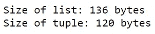
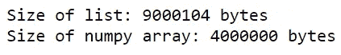
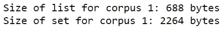

# Python 列表被高估了

> 原文：<https://towardsdatascience.com/python-lists-are-overrated-776e87cda3e5?source=collection_archive---------27----------------------->

## 考虑这些潜在的更好的选择

照片由来自[佩克斯](https://www.pexels.com/photo/woman-programming-on-a-notebook-1181359/?utm_content=attributionCopyText&utm_medium=referral&utm_source=pexels)的[克里斯蒂娜·莫里洛](https://www.pexels.com/@divinetechygirl?utm_content=attributionCopyText&utm_medium=referral&utm_source=pexels)拍摄

如果您使用 Python 已经有一段时间了，那么您应该非常熟悉列表；它们无处不在。

列表可以说是 Python 中最流行的数据结构，很容易理解为什么。它们具有巨大的实用性和多功能性。

不幸的是，随着对列表的严重依赖，忽略了其他有能力的数据结构，这些数据结构可以说比列表执行得更好。

你可能会想:这有什么关系呢？如果列表能完成工作，为什么还要用其他工具呢？

如果您满足于处理少量数据，这种推理是合理的。然而，如果你打算利用你的技能为其他公司服务，你应该明白，你不能对如何存储和处理你的数据如此松懈。

经常被数十亿字节的数据所累的公司强调开发在时间和内存消耗方面优化的高效程序的重要性。

效率和功能一样重要！

您需要理解，即使有多种工具可以完成工作，但有些工具就是比其他工具优越。了解哪种数据结构对于特定场景是理想的，对于提高代码质量来说是一个巨大的进步。

虽然列表确实是一种可靠的数据结构，但它们并不适合所有情况。以下是几个值得考虑的替代方案。

# 1.元组

元组与列表有许多相似之处。这两种数据结构都存储不同的数据类型，并为它们的元素分配特定的顺序。

两者之间的主要区别在于，与列表不同，元组是**不可变的**。它们的赋值不能以任何方式改变。

考虑到程序员经常需要修改他们存储的数据，这使得列表看起来更有吸引力。然而，出于这个原因完全省略元组是错误的。

尽管元组不允许你改变它的值，但它仍然比列表有一个主要的优势:**内存使用**。元组比列表需要更少的空间来存储相同数量的数据。

让我们用一个简单的例子来说明这一点。

这里，我们创建一个存储相同值的列表和元组，并使用 *sys* 模块来确定两个对象的大小。

由作者创建

代码输出(由作者创建)

如上所示，元组需要更少的内存来存储与列表相同的数据。

创建内存高效的程序是必须的，这就是为什么有必要将这种数据结构保存在您的武库中。

由于元组是不可变的，所以只能用来存储值和查找值。因此，使用元组的理想场景是当您知道元组中的值并且不需要修改它们时。

# 2.Numpy 数组

与列表不同，numpy 数组不是内置的数据结构。它们来自 numpy 模块，专门进行数学运算。

与列表不同，numpy 数组只存储同质值(即数组的元素必须是同一类型)。

幸运的是，它们弥补了这个缺点，允许您以更少的内存使用和更快的运行时间来执行各种计算。

下面的例子展示了 numpy 数组的快速运行时间。

假设我们希望创建 2 个包含 1，000，000 个值的列表，范围从 0 到 999，999，然后将每个列表的元素相加，形成第三组值。让我们来看看用列表和 numpy 数组实现这一点需要多少时间。

*注意:运行时间将通过使用“%%timeit”神奇函数*得出

运行时间:148 毫秒(由作者创建)

运行时间:3.8 毫秒(由作者创建)

运行时间的差异证明了 numpy 数组的可用性。

除了运行时间更短之外，numpy 数组的内存效率也更高。让我们使用 *sys* 模块来比较包含 1，000，000 个值的列表和包含 1，000，000 个值的 numpy 数组的大小。

由作者创建

代码输出(由作者创建)

当存储 1，000，000 个值时，numpy 数组使用的内存不到列表的一半。

总的来说，numpy 数组在运行时间和内存使用上都超过了 lists。虽然使用列表进行简单的计算是完全可以的，但是当涉及到计算密集型的计算时，numpy 数组是您最好的选择。

# 3.设置

在我看来，集合是 Python 中最容易被忽视的数据结构。

根据定义，集合存储不同值的可变集合。鉴于集合不允许重复，人们可能会选择坚持使用列表，因为他们已经习惯使用后者。

然而，忽略集合意味着抛弃所有伴随它们而来的功能。

在执行搜索时，集合是非凡的。

举个例子，让我们把这些文本语料库(可以通过这个[链接](https://www.shawlocal.com/2017/04/06/what-is-your-opinion-on-social-media/ajmj3gi/)访问)拆分成一个单词集合。这些单词将存储在列表和集合中。

由作者创建

在比较在列表和第一个语料库的集合中搜索单词“believe”所花费的时间之前，为了公平比较，我将从列表中删除重复值。

删除重复项(由作者创建)

下面是两种搜索的比较:

运行时间:313ns(由作者创建)

运行时间:53.5ns(由作者创建)

运行时间的差别是白天和黑夜。

此外，集合提供了许多功能，使搜索变得更加容易。

例如，如何找到在两个文本语料库中都存在的所有单词？下面是如何使用列表来实现的。

运行时间:37.3 秒(由作者创建)

这是使用集合时的样子。

运行时间:586ns(由作者创建)

set 不仅用更少的时间完成了任务，还用更少的代码行完成了任务。集合提供了许多有用的功能，如“交集”,使程序员能够从不同的集合中提取所需的数据。

因此，在执行搜索时，设置很容易胜过列表。然而，当使用集合时，有一个必须考虑的**速度-内存权衡**。虽然集合可以缩短运行时间，但它们也需要更多内存。

由作者创建

代码输出(由作者创建)

是否应该使用集合取决于项目的目标和限制。如果您的首要任务是最小化运行时间，那么集合就是理想的数据结构。

# 结论

照片由来自[佩克斯](https://www.pexels.com/photo/black-and-white-laptop-2740956/?utm_content=attributionCopyText&utm_medium=referral&utm_source=pexels)的[普拉蒂克·卡蒂亚尔](https://www.pexels.com/@prateekkatyal?utm_content=attributionCopyText&utm_medium=referral&utm_source=pexels)拍摄

总的来说，列表是非常通用的，但是仅仅依靠它们来存储数据是错误的。为了编写有效的代码，熟悉使用不同数据结构的优点和缺点是很重要的。

如果你限制自己只使用列表(即使它们足够了)，你就限制了自己作为程序员的能力，并且限制了代码的效率。

希望您现在已经学会了在执行数据操作时总是考虑可选的数据结构。

我祝你在编码工作中好运！