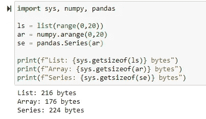

# Python 列表、Numpy 数组和 Pandas 系列

> 原文：<https://towardsdatascience.com/python-lists-numpy-arrays-and-pandas-series-72c4829242bf?source=collection_archive---------18----------------------->


由 [Jyotirmoy Gupta](https://unsplash.com/@jyotirmoy?utm_source=medium&utm_medium=referral) 在 [Unsplash](https://unsplash.com?utm_source=medium&utm_medium=referral) 上拍摄的照片

## 不同数据结构的便利性

假设你有 1 到 20 之间的奇数，你用以下方式存储它们:

```
# Python list
my_odd_nums = [1, 3, 5, 7, 9, 11, 13, 15, 17, 19]# Numpy array
my_odd_nums = numpy.array([1, 3, 5, 7, 9, 11, 13, 15, 17, 19])# Pandas series
my_series = pandas.Series(my_odd_nums)>>
0     1
1     3
2     5
3     7
4     9
5    11
6    13
7    15
8    17
9    19
dtype: int64
```

列表、数组和熊猫系列乍一看非常相似，所以人们经常会问——为什么我们需要不同的数据结构？有哪些利弊和用例？这篇简短文章的目的就是要澄清一些困惑。

## **1。Python 列表**

列表是 Python 中存储多项的 4 种内置数据类型之一(另外 3 种数据类型是字典、元组和集合)。一个列表可以同时存储多种数据类型——整数、浮点、字符串。一个列表甚至可以存储其他列表、元组和字典。

使用列表的相关方法如下:`append(), extend(), insert(), remove(), pop(), clear(), index(), count(), sort(), reverse(), copy()`

例如，`append()`方法用于将一个条目添加到一个已有的列表中:

```
mylist = [10, 12, 8, 6, 14]
mylist.append(99)>> [10, 12, 8, 6, 14, 99]
```

关于如何应用这些方法和函数的更多细节，请查看本文:[使用 Python 列表:备忘单](/working-with-python-lists-a-cheatsheet-4e8c2858c324)。

## 2.Numpy 数组

另一方面，Numpy 是用于科学计算的核心 Python 库(因此得名“数字 Python”或 Numpy)。该库提供了创建和处理多维对象(称为数组)的方法和函数。数组是值的网格，与 Python 列表不同，它们具有相同的数据类型:

```
# 1-dimesional array
array([1, 2, 3])# 2-dimensional array
array([[1, 2],
       [3, 4],
       [5, 6]])
```

常用方法的一个例子是随机数生成器:

```
# generate random integers
ran = np.random.randint(0,20,5) # low, high, size
print(ran)>> array([1, 3, 5])
```

由于 Numpy 数组都是数字数据类型，因此可以应用一系列统计操作:

```
# to add all values in an array
my_array = array([1,2,3])my_array.sum()>> 6
```

Numpy 是一个强大的库，具有全面的数学函数和线性代数例程，因此它是许多数据科学/机器学习/深度学习库中的基础。

## 3.熊猫系列

Pandas 系列是一个一维数值列表(可以是混合数据类型——整数、浮点、文本),存储有一个带标签的索引。而如果多个序列组合成一个单一的指标，则称为“数据框”。换句话说，数据帧是具有相同索引的系列的集合。Pandas 是数据科学中最受欢迎的数据辩论库。

可以从现有的 Pythion 列表或 Numpy 数组创建系列:

```
# index
countries = ["US", "BD", "CA"]
# data
data = [100, 200, 300]
# series
myseries = pd.Series(data, index = countries)>>
US    100
BD    200
CA    300
dtype: int64
```

回到原来的问题:列表、数组、数列的区别和优势是什么？

一个关键的区别是存储数据所需的空间。假设我们有 0 到 20 之间的数字，存储在 3 个数据结构中。看储物空间的差异。Numpy 数组显然是赢家。



另一个区别是 Numpy 数组在向量和矩阵运算中的显著高性能。

尽管存在一些差异，但每种数据类型在数据科学中都有特定的应用案例——例如，用于存储包括文本数据在内的复杂数据类型的 Python 列表；用于高性能数值计算的 Numpy 阵列:和 Pandas 系列，用于操纵表格数据以进行可视化、统计建模以及过滤和汇总。

希望这是一次有益的讨论，如果你有意见，请随时写在下面，或者通过[媒体](https://mab-datasc.medium.com/)、[推特](https://twitter.com/DataEnthus)或 [LinkedIn](https://www.linkedin.com/in/mab-alam/) 与我联系。