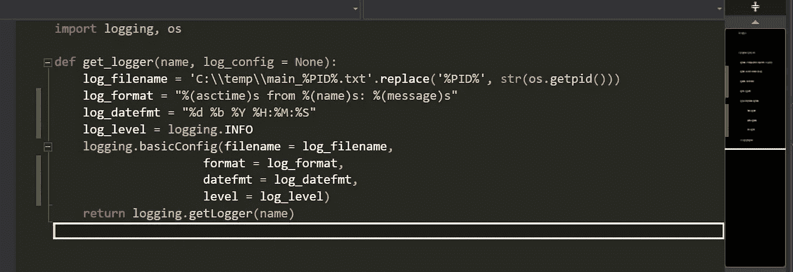

# Python 日志记录

> 原文：<https://towardsdatascience.com/python-logging-from-nothing-to-something-79a7f6a0c1eb?source=collection_archive---------20----------------------->

## 没事->有事

## 跟着练习，为你的编程工作装备这种不性感但重要的日志记录技能



只是一个基本的日志功能！

我们通常打印输出来检查我们的逻辑在编码时是否按预期运行。但是，在生产过程中可能会出现运行时问题，我们无法验证打印输出。这时，日志记录可以帮助我们识别运行时问题。我们开始吧！

## 导入日志模块

创建一个 python 文件`log_utility.py`并编写第一行代码:

```
import logging
```

简单，嗯？日志是软件开发的基本特性之一，所以 Python 拥有这个内置模块来支持严肃的软件开发是很好的。

## 定义 get_logger()函数并初始化日志记录参数

在`log_utility.py`中，我们定义一个函数并初始化所有参数:

```
def get_logger(name, log_config = None):
 log_filename = 'C:\\temp\\main_%PID%.txt'.replace('%PID%', str(os.getpid()))
 log_format = "%(asctime)s from %(name)s: %(message)s"
 log_datefmt = "%d %b %Y %H:%M:%S"
 log_level = logging.INFO
 logging.basicConfig(filename = log_filename,
      format = log_format,
      datefmt = log_datefmt,
      level = log_level)
 return logging.getLogger(name)
```

*   `filename`:存储日志消息的日志文件的文件名。在这种情况下，输出的一个例子是`C:\temp\main_8888.txt`。我们可以使用 PID(进程 ID)作为唯一的标识符，作为文件名的一部分。因此，我们需要包含模块`os`:

```
import logging, os 
```

*   `format`:日志文件中记录的消息格式。输出的一个可能的例子是`14 Aug 2021 00:00:00 from __main__: Hello World!`，其中`asctime`表示日期时间，`name`表示传递给函数的参数`name`，而`message`表示要记录的消息。日期时间的格式由下一个参数定义。
*   `datefmt`:日期时间的格式。这里格式字符串`%d %b %Y %H:%M:%S`被翻译成`14 Aug 2021 00:00:00`。有关更多格式化指令，请参考[时间—时间访问和转换— Python 3.9.6 文档](https://docs.python.org/3/library/time.html#time.strftime)
*   `level`:如果消息的级别高于或等于该参数，将被记录。否则，不会。在这里，水平被设置在`logging.INFO`。

最后，我们通过调用`logging.getLogger(name)`返回一个 Logger 对象

## 记录器的使用

既然我们已经创建了一个基本的日志功能，我们需要将这个功能合并到我们的主应用程序中。

创建一个`main.py`并插入如下代码:

```
from log_utility import get_loggerlogger = get_logger(__name__)def run():
 logger.info('Hello World from main!')if __name__ == '__main__':
 run()
```

运行`main.py`，你将得到一个日志文件`C:\temp\main_%PID%.txt`，其中`%PID%`是一个反映运行进程 PID 的数字序列。日志文件中一个可能的输出是`14 Aug 2021 00:58:46 from __main__: Hello World from main!`。

就是这样！我们已经成功地实现了一个基本的日志功能，可以在项目的任何地方使用。每当我想到对这个日志记录机制的任何改进，我都会用它来更新这个页面。也欢迎分享你的想法。