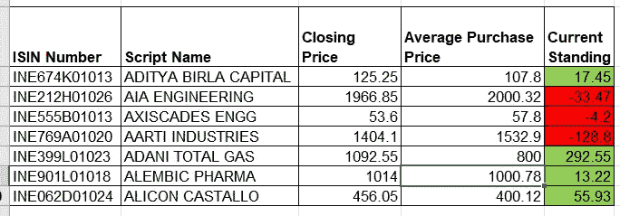
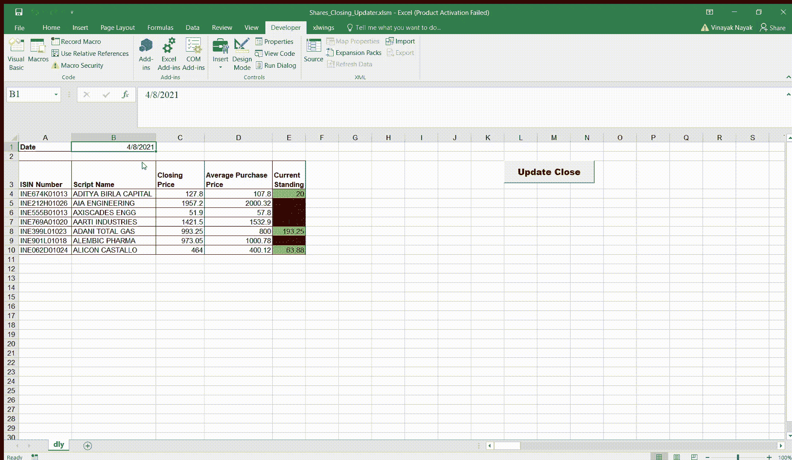
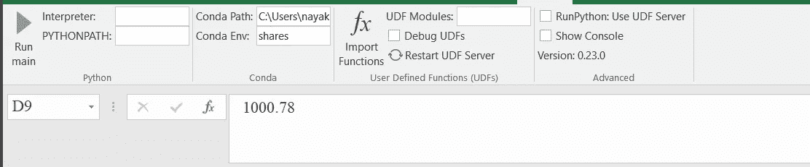
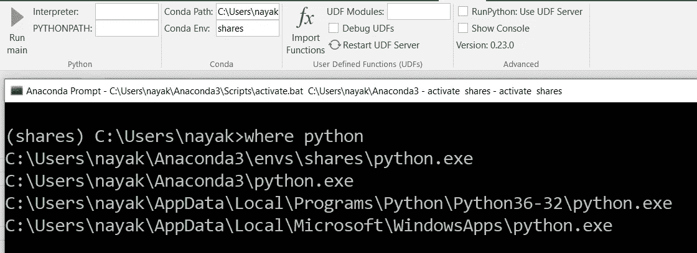
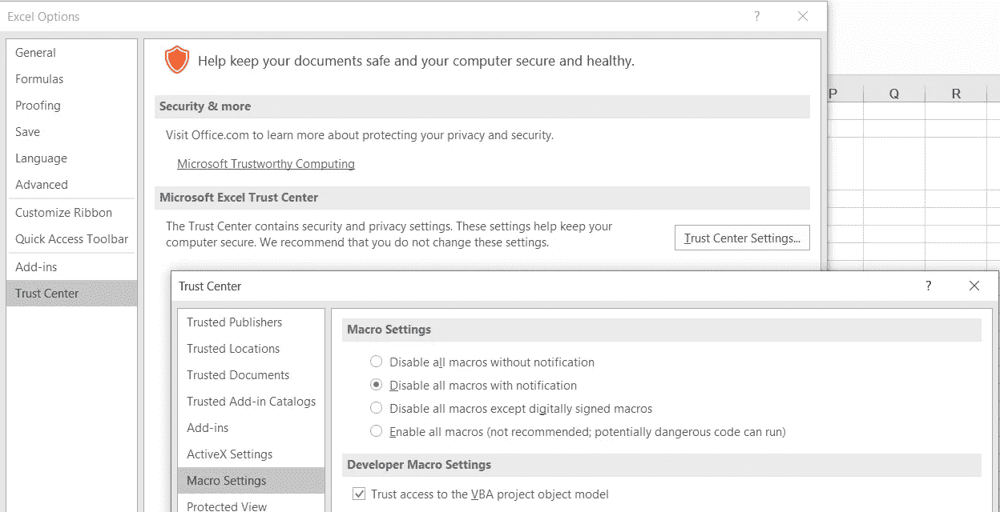

# Python 使电子表格 Excel'lent

> 原文：<https://towardsdatascience.com/python-makes-spreadsheets-excellent-f48ce0c648e3?source=collection_archive---------16----------------------->

## 使用 Python 和 VBA 实现 Microsoft Excel 工作流的自动化


由[卢卡斯·布拉塞克](https://unsplash.com/@goumbik?utm_source=medium&utm_medium=referral)在 [Unsplash](https://unsplash.com?utm_source=medium&utm_medium=referral) 拍摄的照片

在这个数据时代，python 已经成为全球许多开发人员最广泛采用的语言。这意味着有许多潜在的图书馆等着被利用。

虽然 python 最近成为了分析数据的首选，并在许多任务中拥有从低到高的广泛应用；Microsoft Excel 有着悠久的历史，并且在大多数情况下仍然是用于分析/管理/可视化数据的不可或缺的工具。

想象一下，如果我们可以利用 python 中的开源库来自动化我们在 Excel 中的工作流程；这会让我们的生活变得超级方便！站在巨大的开源 python 社区的肩膀上，我们可以在 Excel 中利用他们的功能，这个社区有数千个不同用例的包。

我有一个这样的需求，我想在下面讨论一下，在`xlwings`的帮助下，我能够通过 VBA 将我的 Excel 前端与 python 后端集成在一起，并且只需点击一个按钮，就可以自动完成一个相当繁琐的手动过程！

因此，这篇文章的主要目的是向您展示如何利用这个名为`xlwings`的强大 python 包通过 VBA 与 Excel 通信，并在此过程中自动完成一些任务。python 代码可能有 VBA 的变通办法，但对于我的特殊用例，我无法规避对 python 的需求，因为 VBA 无法完成一些像`nsepy`这样的 python 库能够完成的任务。

# 问题是

我保留了一张表，用来跟踪我的股票以及它们在一天结束时的表现。为此，我需要获取我投资组合中每只股票的收盘价，并每天努力手工输入。任何手动过程都容易出错，我以前就犯过这种错误，我在更新一些股票的收盘价时犯了一个错误，我的计算显示，我的风险比我想象的高得多；但当我反复核对时，情况并非如此，我意识到我在一只股票的十位数字中错误地输入了 9，而不是 6。那些在键盘上使用数字小键盘的人可能会遇到这个问题

现在，我知道了这个名为`nsepy`的库，它由 [Swapnil Jariwala](https://github.com/swapniljariwala) 维护，帮助从 NSE 服务器获取与 NSE 上列出的任何给定股权/期权相关的所有历史数据，但该库完全是用 python 编写的。如果我能在 Excel 中使用 python 的能力，那该多好啊！

这是完全可能的。还有另一个叫做`xlwings`的 python 库，它专门解决了 excel 与 python 的集成问题，瞧！问题解决了！！

为了给你一些关于这个问题的背景，这里有一张我用来保存我的股票账户的表格的一部分。



图片由 Vinayak 提供

我有脚本/股份/股票的 ISIN 编号及其名称，从同一工作簿的其他工作表中引用的平均买入价格，我过去在一天结束时手动输入的收盘价，以及基于每个脚本的我当前的头寸。

最后，您应该能够实际创建如下内容



图片由 Vinayak 提供

# 设置 xlwings

像任何其他包一样，您可以简单地用 python 包安装程序安装“xlwings ”,如下所示

```
pip install xlwings
```

我建议您为这个项目创建一个虚拟环境，以避免您已经存在的包安装中的依赖冲突。这篇文章不会涉及它，但是你可以[看这里](https://uoa-eresearch.github.io/eresearch-cookbook/recipe/2014/11/26/python-virtual-env/)如果你想用 pip 安装一个虚拟环境或者[看这里](https://docs.conda.io/projects/conda/en/latest/user-guide/tasks/manage-environments.html#creating-an-environment-with-commands)如果你像我一样喜欢 conda。

设置管道的一部分，即 python 管道。接下来，您应该安装 excel 与 xlwings 集成所需的部分。为此，**保存并关闭您现在从安装 xlwings 的环境中打开的所有 excel 工作簿**，只需运行以下命令

```
xlwings addin install
```

这应该会无缝地发生，但有时，如果你在 Windows 10 机器上使用 Excel 2016，你可能会遇到如下错误

```
xlwings 0.17.0[Errno 2] No such file or directory: 'C:\\Users\\nayak\\AppData\\Roaming\\Microsoft\\Excel\\XLSTART\\xlwings.xlam'
```

这可以通过使用简单的 mkdir 命令创建丢失的目录来解决

```
mkdir C:\Users\nayak\AppData\Roaming\Microsoft\Excel\XLSTART
```

成功安装 xlwings 后，下次打开 Excel 时，您会看到在顶部的工具栏中为“xlwings”创建了一个选项卡。该选项卡还包含解释器和 python 路径，如果您有不同的虚拟环境要执行 python 函数，则必须指定这些路径。



图片由 Vinayak 提供

因为我使用 anaconda 来维护我的环境，所以我提供了到我的 conda 的路径和我想要使用的相应环境。默认情况下，`xlwings`将检测一个环境(主要是您安装了这个库的环境)，但是如果没有检测到，您就必须手动给出您的 anaconda 发行版的路径和环境名称。

要找到您的 anaconda 发行版在哪里，您可以从 Windows 开始菜单打开 anaconda 提示符，在该提示符下，首先通过运行命令激活您已经安装了`xlwings`的环境

```
conda activate your_env_name
```

并随后运行

```
where python
```

这可能会带来几个结果，但你需要把重点放在第一个；请看下面我的环境“分享”中的第一个结果。



图片由 Vinayak 提供

这里的路径是`C:\\Users\nayak\Anaconda3\env\shares\python.exe`，所以在康达路径框中是`C:\\Users\nayak\Anaconda3`，在康达环境框中是`shares`。这将有助于调用 python 函数的宏理解应该在哪个环境中执行 python 代码。如果您没有使用 anaconda 发行版来管理您的环境，那么您可以使用您的 python 环境做一个等效的练习，您可以给出解释器的路径和 python 的路径，而不是在 conda 中这样做。

接下来，您需要在 Excel 界面中启用`xlwings`的用户自定义函数(UDF)。打开 Excel 后，使用 Alt + L + H 导航到加载项框，然后您将看到一个带有多个复选框的屏幕，询问您需要为此工作簿启用哪些加载项。点击`xlwings`旁边的方框，点击确定。

在这之后需要做的最后一步是授权访问所有想要使用 xlwings 等第三方插件的宏。您可以通过导航到*文件>选项>信任中心设置>宏设置*来完成此操作，并在宏设置中选择*启用所有宏*，然后在开发者宏设置中选择*信任对 VBA 项目对象模型的访问*。



图片由 Vinayak 提供

至此，我们已经准备好再次转向 python 方面了。

# **创建项目**

通过从 cmd 提示符或终端或 shell 运行以下命令，您可以快速开始一个项目

```
xlwings quickstart project_name
```

这将创建一个以 project_name 作为文件夹名称的项目，默认情况下，您将在该文件夹中获得两个文件。

*   `project_name.py`:这是一个 python 文件，应该包含您的宏可以调用来修改工作表的代码。
*   `project_name.xlsm`:这是一个启用宏的 excel 文件，为空，包含两张表，分别是`Sheet1`和`xlwings.config`文件。您可以在此工作簿中创建其他工作表，并向其中添加任意数量的宏。回调的逻辑必须写在上面创建的 python 文件中。

我所做的是我创建了一个项目，并将我的 excel 文件的内容复制到 xlsm 文件中，并根据我的喜好重命名该表。

# **python 后端逻辑**

现在是你自动化你的项目所需要的代码的主要部分。在这种情况下，您可以从上面的“xlsm”工作簿的任何工作表中访问任何单元格。

您可以像在任何其他 python 脚本中一样编写任意数量的自定义函数，并在这里使用它们。我已经在 main 函数中编写了代码，我将用它来更新每日收盘价。为了便于理解，我已经给出了下面的代码。你可以在这里立刻看到完整的代码。

```
import xlwings as xw
wb = xw.Book.caller()
```

因为我是从工作簿内部调用的，所以我可以使用上面的语法并获取工作簿对象。如果您想获取对其他工作簿的引用，您可以

```
wb = xw.book(file_path)
```

这里的 file_path 指的是保存 excel 文件的路径。然后，要访问任何工作表，基本上可以使用 index 或工作表的名称，要访问工作表中某个范围的值，可以在它上面链接 range 命令。

```
# Refer by index
DATE = wb.sheets[0].range("B1").value# Refer by name
SHARE_NAME = wb.sheets["sheet_name"].range("C1").value
```

一旦你得到了一个股票的 ISIN 代码和它的名字，nsepy 就可以帮助你获取在 NSE 上列出的所有股票的 bhavcopy(价格列表),你可以在任何给定的有效 NSE 日期过滤该脚本的收盘价。nsepy 是一个由 Swapnil Jariwala 维护的库，你可以在这里参考它的[文档。](https://nsepy.xyz/)

```
from nsepy.history import get_price_list# Get the pricelist/bhavcopy for a given date and only keep the relevant info
price_list = get_price_list(DATE)
price_list = price_list[["SYMBOL", "CLOSE", "ISIN"]]# An inline function to query the close price given a script name
get_close = lambda x: price_list[price_list.ISIN == x]["CLOSE"]# Read the ISIN Code of our script name
ISIN = wb.sheets[sheet_name].range(f"A1").value
ISIN = ISIN.strip()# Use the inline function above to get the close price of our share
close_price = get_close(ISIN)# Copy the share price value to Excel
wb.sheets["sheet_name"].range(f"C1").value = float(close_price)
```

如果你有多个脚本，你可以循环这个代码来获得所有脚本的收盘价，并根据你的意愿将它们写到 Excel 表中。

这只是实际代码的一部分，可以在我的 [github repo 上找到，这里是这个项目的](https://github.com/ElisonSherton/Shares_Closing_Updater)。

# **Excel 前端逻辑**

现在我们已经定义了 python 逻辑，我们需要将它连接到一个宏，并将其分配给主表单中的一个按钮。为此，您需要首先插入一个按钮。你可以去*开发者>插入>按钮*然后把一个按钮拖到表单中。

然后你可以点击 *Alt + F11* 调出 VBA 界面来定义一个宏。现在，您可以在放置按钮的同一个工作表中定义一个 sub，如下所示。

```
Sub CallUpdate()
    mymodule = "Python_File_Name_Here"
    RunPython ("import " & mymodule & ";" & mymodule & ".main()")
End Sub
```

宏中的这段代码将执行以下操作:

*   查找名为“Python_File_Name_Here”的文件
*   导入该文件中的模块
*   调用指定 python 文件中的 main 函数。

这段代码可以用许多不同的方式进行调整；如果你除了 main 之外还有另一个函数，你想调用它，你可以写

```
RunPython (“import “ & mymodule & “;” & mymodule & “.other_function_name()”)
```

这仍然可以正常工作。您可以在 VBA 中进行一些检查，在 python 中进行一些检查，并在需要时让两个接口自由通信，这不是很好吗？

最后，对于您已经创建的按钮，您可以通过右键单击该按钮并转到分配宏选项来分配该宏，并最终选择该宏`CallUpdate`并单击确定。

现在，每当您单击按钮(我将其命名为 Update Close)，计算将在 conda 环境`shares`中运行，输出将在 excel 表的 c 列中更新。这样，我就不必在网上手动查找每只股票的收盘价，然后将其填入 Excel 中，只需单击一个按钮即可完成！！

你也可以在 python 中定义函数，这些函数可以像 Excel 中的公式一样被调用，还可以做更多的事情，但我会在以后的文章中介绍这些内容…

# **结论**

希望这篇文章能帮助你理解如何借助 python 为你的 excel 工作流插上翅膀:)

# 参考

*   [Github 代码回购帖子中的所有代码](https://github.com/ElisonSherton/Shares_Closing_Updater)
*   [xlwings 官方文档](https://docs.xlwings.org/en/stable/quickstart.html)