# Python 蒙特卡罗模拟:系综被解放

> 原文：<https://towardsdatascience.com/python-monte-carlo-simulations-copulas-unchained-ff29d051c0a0?source=collection_archive---------6----------------------->

## SciPy 中带高斯 Copulas 的相关随机变量

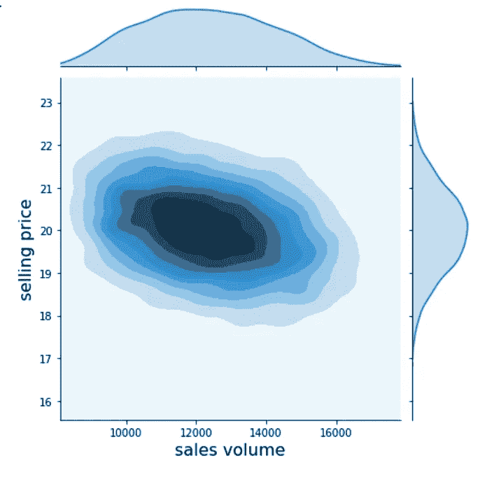

从上周开始，我们已经学习了四个教程，一步一步地解释了蒙特卡罗方法。今天，我们将前往蒙特卡洛的下一站。

最新的文章介绍了*相关*随机变量。我们使用了 *MCerp* 库，它应用了 *Iman-Conover* 方法来生成相关性([在 Python 中使用相关随机变量的蒙特卡罗模拟|走向数据科学](/journey-to-monte-carlo-mc-simulations-with-correlated-variables-in-python-1aef84d5742d))。

文章强调，在任何模拟模型中，反映**相关结构**对于准确的结果至关重要。输入变量可以显示出一前一后移动的趋势。如果不考虑平行运动，模拟模型会对不切实际的结果赋予同等的权重。我们经历了一个例子，其中当忽略相关结构时，模拟输出的标准偏差是两倍。

昨天的文章介绍了在 MCerp 中实现的 Iman-Conover 方法。今天，我们将学习另一种方法，它不需要安装额外的库，只需要 SciPy 和大约十几行代码——高斯连接函数。

几乎所有你能找到的关于高斯连接函数的资料都是用一种“编程”语言编写的，而我们很少有人能完全精通这种语言:数学。对于把数学作为第二或第三语言而非母语的人来说，维基百科的解释不容易理解。

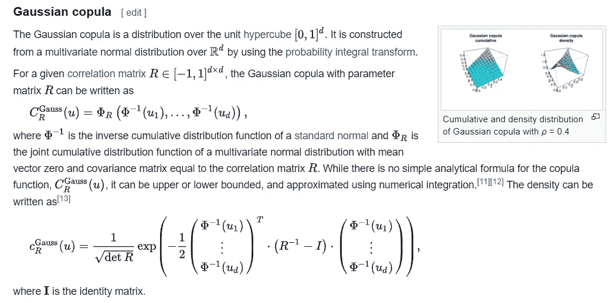

[Copula(概率论)—维基百科](https://en.wikipedia.org/wiki/Copula_(probability_theory)#Gaussian_copula)；右上角的情节:维基百科上的马泰奥·赞迪， [CC BY-SA 3.0](https://creativecommons.org/licenses/by-sa/3.0)

几年前，我遇到了它，想知道高斯系词可能有什么用处——在脑海中把“系词”这个词用一个大大的虚拟问号夹起来。我又把它挖了出来，并着手把“数学”翻译成 Python。除了随机波动之外，Python 脚本的结果与 Iman-Conover 方法的结果相匹配。正如我们将在下面看到的，强加的相关结构等于目标。

让我们来演示一下高斯连接函数在我们的工具箱中会起到什么样的作用。

今天的示例模型将与您在昨天的文章中找到的模型相同([Python 中相关随机变量的蒙特卡罗模拟|走向数据科学](/journey-to-monte-carlo-mc-simulations-with-correlated-variables-in-python-1aef84d5742d))。但是我们将应用 SciPy 和 Gaussian copula 方法，而不是 MCerp 库和它的 Iman-Conover 实现。copula 方法比 Iman-Conover 方法需要更少的代码行。

# 1.属国

我们导入 Seaborn 的图表库，因为它的 *jointplot* 为我们提供了在宏伟的布局中可视化相关结构的方法。

从 SciPy 中，我们导入了一些分发对象。

*   *多元正态*分布对于创建高斯连接函数是不可避免的。
*   我们将使用 SciPy 的 *rv_continuous* 和 beta 分布来定义 PERT 分布。PERT 和正态分布将作为所谓的边际分布。我们将在三个输入变量中将它们联系在一起，copula 将在它们之间建立一个相关结构。

# 2.分 4 步准备高斯连接函数

copula 在 Python 中实现并不困难，这与带有大量数学符号的源代码中出现的情况相反。生成相关随机变量需要四个步骤。

开始时——第 0 步**——我们应该有一个目标矩阵，其中包含我们希望应用于每对输入变量的相关系数。理想情况下，目标相关性可以从历史观察中确定。如果不是，那么计划者应该考虑系数的三点估计。**

在**步骤#1** 中，我们实例化了 SciPy 的*多元正态分布。*

*   我们用一个零向量来设置它，这将作为它的每个列向量的平均值。
*   第二个参数是目标相关矩阵。

在实例化多正态分布之后，我们为它的三个向量绘制 N = 10，000 个随机变量，这些变量将展示目标相关结构。

在**步骤#2** 中，我们将这些随机变量输入到单变量标准正态分布的累积分布函数中。通过这样做，我们获得了列向量——三个输入变量中的每一个都有一个——它保留了多正态分数的相关结构，但被转换为统一分数:它们将位于区间[0；1].

在**步骤#3** 中，我们定义了三个边际分布，此时它们之间仍然没有相关结构。

*   PERT 分布将模拟销售量的不确定性；
*   反映销售价格的正态分布；
*   材料单位成本的第二个正态分布。

在步骤#4 中，我们将在这三个输入分布上强加相关结构。

然而，在我们进行最后一步#4 之前，我们想要检查如果我们在没有应用 copula 的情况下绘制随机变量*，它们将具有哪种相关结构。以下两个笔记本单元格不属于创建高斯连接函数的 4 步序列。*

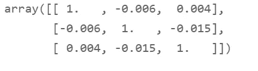

初始相关矩阵显示接近零的系数。我们从 PERT 和两个正态分布中抽取的 10，000 个随机变量的原始向量是独立的，带有一些导致小系数的随机噪声。

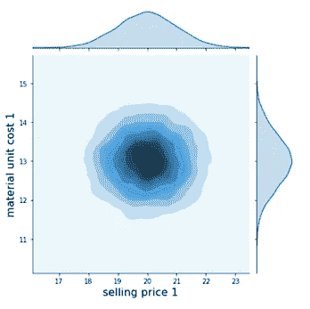

当我们想要绘制每个变量对的相关性图表时，我们可以从 seaborn 调用 *jointplots* 绘制几乎圆形的斑点——上面是销售价格和材料单位成本的例子，它们应该表现出很强的正相关性。如果他们真的展示出来，我们会看到一个从左下角延伸到右上角的椭圆形状:高价格将与高材料单位成本相关联。这里，低价格与*低和高的材料单位成本相关联，这就形成了一个没有方向的形状。*

在确认原始输入变量缺乏相关性后，我们进入最后一步，**步骤#4，**并实施目标结构:

*   在步骤#2 中，我们已经生成了从多元正态分布继承了目标相关结构的*正态分数*。
*   在**步骤#4** 中，我们将这 3x 万个正态分数(数组 *rand_U* )插入到三个输入分布的*百分点函数* *ppf()* 中。每个 ppf()将返回 N = 10，000 个随机变量。具有随机变量的三个数组将展示目标相关结构，它们通过分数(rand_U)从多元正态分布中继承了目标相关结构。这种继承是“高斯连接函数”术语背后的原因。

这就完成了 4 步过程。

让我们想象一下两两相关。我们将为三个输入参数中的每一对调用一个助手函数， *plotcorr()* :

Seaborn 的*关节图*不再呈现圆形或无定形。相反，它们显示出反映它们正相关或负相关的省略号。

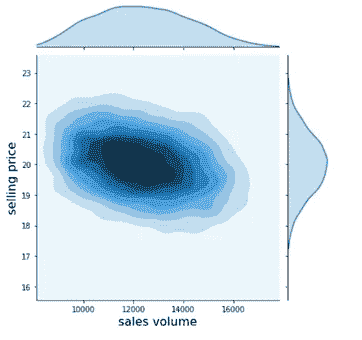

*   销量与售价:负相关——省略号从左上角延伸到右下角。高价格往往伴随着低交易量。

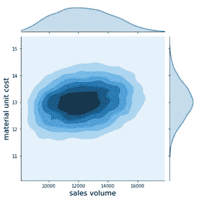

*   数量与材料单位成本:弱正相关——较高的数量将导致供应商给予企业一些数量折扣。

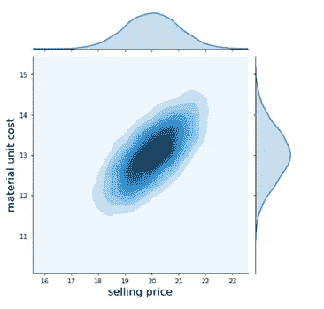

*   销售价格与材料单位成本:强正相关-企业将试图通过更高的销售价格来抵消供应商价格的上涨。省略号很紧凑，反映了 0.7 的强相关性，并且从左下到右上是目标:高材料单位成本伴随着高销售价格。

当我们计算三个耦合输入变量的**相关矩阵时，我们发现它与目标相关矩阵的偏差很小≤ 0.026，本质上是随机波动。**

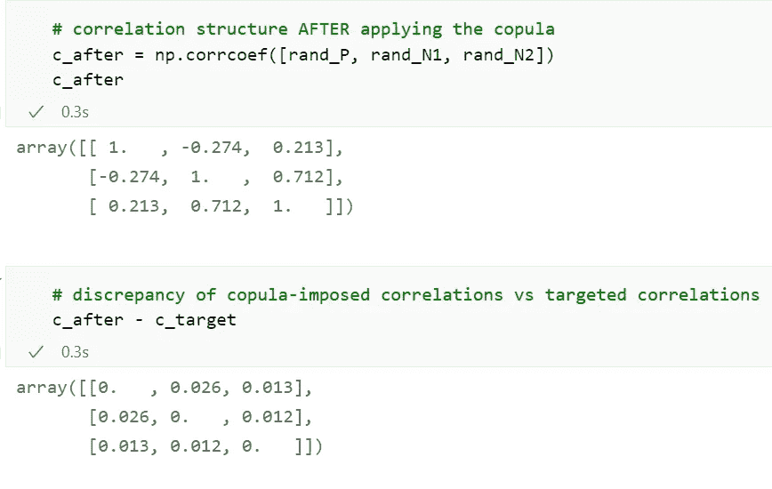

现在，输入数据的准备工作已经完成。相关随机变量的数组——数量、价格和材料单位成本——可以传递给模拟模型。

# 3.准备和运行模拟模型

接下来的步骤与我们在之前的文章中讨论的 MC 模拟过程相同。

我们通过定义尽可能多的想要研究的输出变量来建立模型。每个输出变量只是一个或多个输入变量的和、积或商。任何我们串在一起包含一个或多个输入变量的函数都可以作为输出变量。

我们将毛利 GP 定义为我们要跟踪的主要输出变量，此外还有一些次要输出变量，如收入 r。输出变量是数组(列向量)，其元素是通过将相应的输入元素组合在一个函数中来计算的。

此时，因为输入向量 v、p 和 m 已经在前面的代码行中填充了它们的相关量，所以输出向量已经可用。当代码到达第 13 行时，模拟已经完成。我们可以开始绘制输出。

一个辅助函数将绘制列向量的直方图。

我们对六个输出和输入数组调用了六次绘图函数，从总利润开始。

下面的输出类似于我们在过去几天的蒙特卡罗文章中讨论的内容。

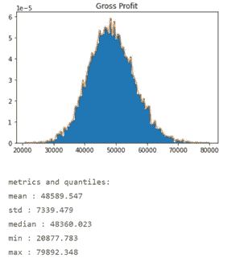

*   企业预期实现的平均毛利达€ 48，589。
*   标准偏差相对较低，为€ 7，339，非常接近我们在昨天的教程中强加的 Iman-Conover 相关性所产生的数量([在 Python 中使用相关随机变量的蒙特卡罗模拟|走向数据科学](/journey-to-monte-carlo-mc-simulations-with-correlated-variables-in-python-1aef84d5742d))。

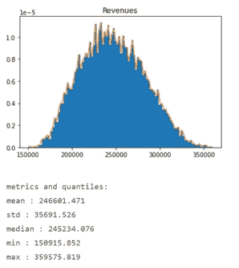

校准相关结构集中了仿真模型将在其 10，000 次迭代中生成的输出。初始模型还必须评估参数元组，这些参数元组难以置信地将极高的价格与极低的材料单位成本(反之亦然)以及巨大的销售量结合在一起

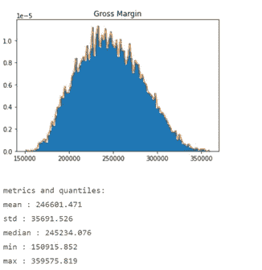

在非常高和非常低的销售价格下，许多这些不切实际的场景通过强加一个相关结构而被归入离群值的状态。在 10，000 次试验中，异常情况出现的次数较少，因此结果更紧密地围绕€ 48，589 的平均结果。

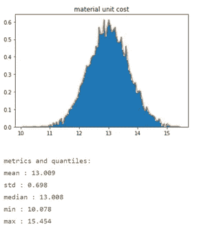

# 4.结论

当我们应用 MCerp 的 Iman-Conover 方法时，我们得到了与昨天文章中几乎相同的结果。

高斯连接函数作为一种继承机制。多元正态分布将目标相关结构传递给正态分数数组。我们使用分数作为输入，为不同类型的单变量分布生成几个随机变量向量，即所谓的*边际，*，它将作为模拟模型*的输入参数。*这些单变量随机变量将保持遗传相关性。

通过将输入值的不可信组合推到背景中，相关结构有助于将模拟输出的标准偏差减半。

*   Jupyter 笔记本可以在 GitHub 上下载: [h3ik0th/MC_copulas:用高斯 copulas 和 SciPy(github.com)进行 Python 蒙特卡罗模拟](https://github.com/h3ik0th/MC_copulas)
*   图片: [Copula(概率论)—维基百科](https://en.wikipedia.org/wiki/Copula_(probability_theory)#Gaussian_copula)截图|右上角情节:维基百科上的马泰奥·赞迪， [CC BY-SA 3.0](https://creativecommons.org/licenses/by-sa/3.0)
*   所有其他图片:作者
*   [https://medium.com/subscribe/@h3ik0.th](https://medium.com/subscribe/@h3ik0.th)