# Python 命名元组:什么、如何以及何时使用

> 原文：<https://towardsdatascience.com/python-named-tuple-what-how-and-when-to-use-4718b0668afd?source=collection_archive---------3----------------------->


图片来自 [Pixabay](https://pixabay.com/?utm_source=link-attribution&utm_medium=referral&utm_campaign=image&utm_content=5960731) 的 [eloiroudaire77](https://pixabay.com/users/eloiroudaire77-19296305/?utm_source=link-attribution&utm_medium=referral&utm_campaign=image&utm_content=5960731)

## Python 命名 Tuple 的配方以及我们为什么要使用它

Python 中有一种“特殊”类型的元组，叫做“命名元组”。对于 Python 学习者来说，对它感到困惑是很常见的，尤其是我们应该何时以及为什么使用它。

命名元组就是元组，所以它做元组能做的一切。然而，它超出了普通的 Python 元组。它更像是 C++等其他编程语言中的“struct”。它是一个元组的特定子类，是根据您的规范以编程方式创建的，具有命名字段和固定长度。

在本文中，我将介绍名为 tuples 的 Python，并尝试演示如何使用它、何时使用它以及为什么我们应该使用它。

# 1.创建命名元组


图片来自 [Pixabay](https://pixabay.com/?utm_source=link-attribution&utm_medium=referral&utm_campaign=image&utm_content=550622) 的 [Dirk Hoenes](https://pixabay.com/users/ptdh-275507/?utm_source=link-attribution&utm_medium=referral&utm_campaign=image&utm_content=550622)

在我们开始之前，这里有一个小提示。从 Python 3.1 开始，有一个重要的名为 tuple 的内置常量来表示我们现在使用的 Python 版本。我们可以如下得到。

```
import sys
sys.version_info
```

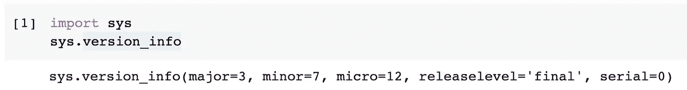

如果我们想在我们的程序中使用它，我们需要从集合模块中导入它。

```
from collections import namedtuple
```

集合模块中的`namedtuple`是一个类工厂。换句话说，它制造类。我们需要提供下面的东西来产生我们想要的类。

*   我们要使用的类名
*   我们要分配的字段名序列，按照元组中元素的顺序。
*   我们需要在代码中将该类赋给一个变量名，这样我们就可以用它来构造实例。

例如，如果我们想要定义一个具有纬度和经度两个属性的`Coords`类，我们可以如下实现它。

```
Coords = namedtuple('Coords', ['latitude', 'longitude'])
```

然后，我们可以使用`Coords`类实例化一个对象，这将是一个命名元组。

```
home = Coords(latitude=-37.8871270826, longitude=144.7558373041)
```

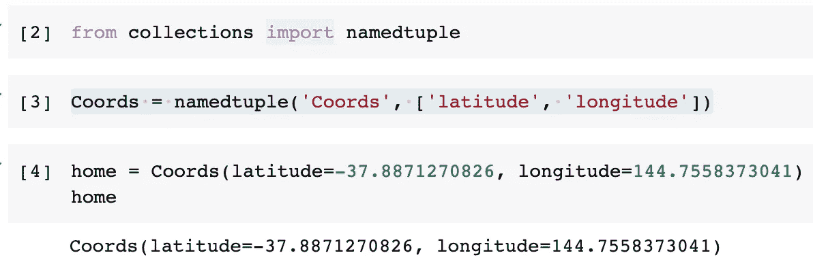

我们可以验证它是一个元组，尽管它有字段名。

```
isinstance(home, tuple)
```

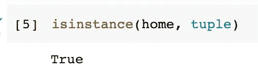

此外，为了从类中实例化一个命名元组，我们不必每次都指定字段名，因为命名元组的顺序和长度是固定的。

```
home = Coords(-37.8871270826, 144.7558373041)
```

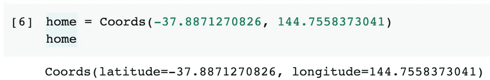

## 1.1 定义命名元组类的简单方法

我们可以很容易地使用字符串来指定字段，而不是使用列表。例如，我们可以使用 common 来分隔字段名称。

```
Coords = namedtuple('Coords', 'latitude, longitude')
```

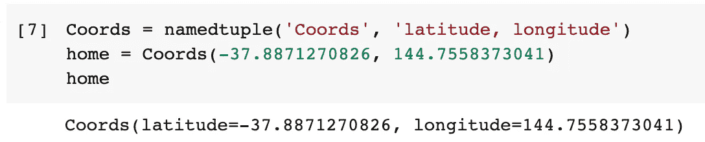

我们甚至可以使用空格作为分隔符，这完全没问题。

```
Triangle = namedtuple('Triangle', 'first_side second_side third_side')
t1 = Triangle(5, 5, 5)
```

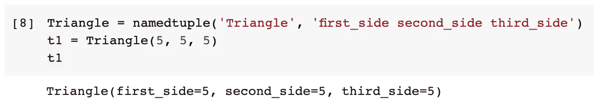

## 1.2 使用类型提示从超类创建

从 Python 3.6 开始，我们还可以更正式地定义一个命名元组类。这也将支持命名字段的类型提示。

```
from typing import NamedTuple  # 3.6+class Coords(NamedTuple):
    """A coordinate consists latitude and longitude"""
    latitude: float
    longitude: floathome = Coords(-37.8871270826, 144.7558373041)
```

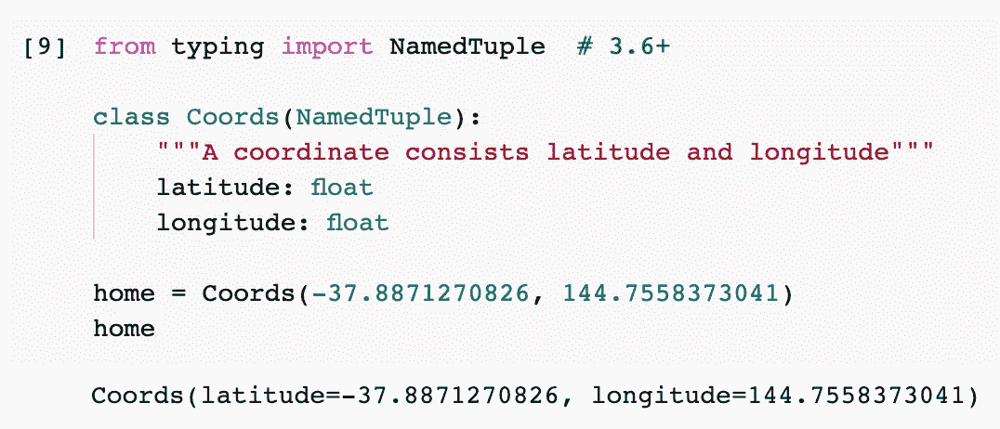

不同之处在于，我们需要使用类型模块中的`NamedTuple`超类。

# 2.字段名称自动重命名


图片来自 [Pixabay](https://pixabay.com/?utm_source=link-attribution&utm_medium=referral&utm_campaign=image&utm_content=2574751)

当我们定义一个命名的元组类时，虽然我们可能使用字符串作为字段名，但它们将被反映为类属性。因此，这些字段名称会有一些限制。

首先，我们不能使用以下划线开头的字段名。

```
MyNamedTuple = namedtuple('MyNamedTuple', ['_attr1', 'attr2'])
```

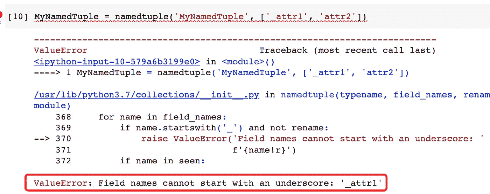

一些保留的关键词也被禁止，比如`def`。

```
MyNamedTuple = namedtuple('MyNamedTuple', ['def', 'attr2'])
```

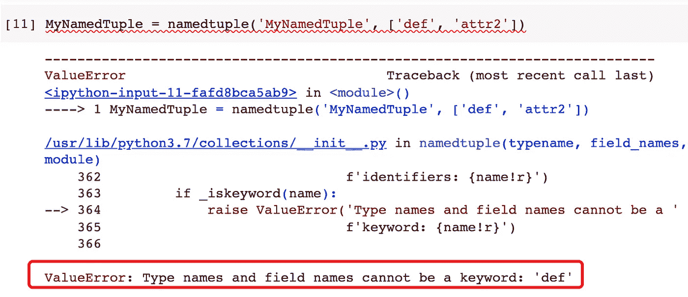

此外，字段名称不能重复，因为一个类不能有两个同名的属性。

```
MyNamedTuple = namedtuple('MyNamedTuple', ['attr1', 'attr1'])
```

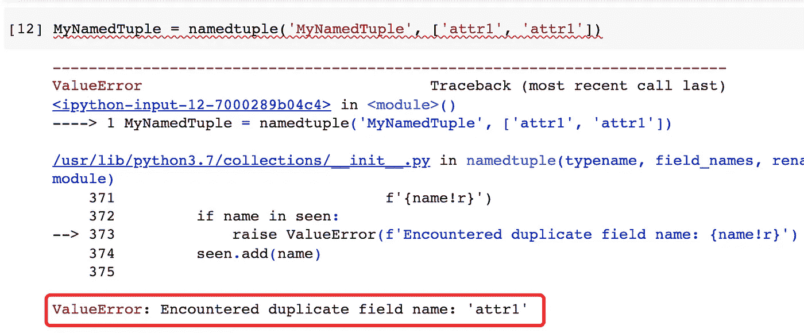

然而，从 Python 3.1 开始，我们可以将标志`rename`设置为 True，这样任何无效的字段名都会被自动重命名，而不会抛出错误。

```
MyNamedTuple = namedtuple(
    'MyNamedTuple', 
    ['_attr1', 'def', 'attr2', 'attr2'], 
    rename=True
)
```

上面代码中的命名元组定义违反了这三条规则，但是因为我们将 rename 标志设置为 true，所以它不会出错。

有一个小技巧来检查一个命名元组类的字段名，这个类使用它的私有属性`_fields`。

```
MyNamedTuple._fields
```

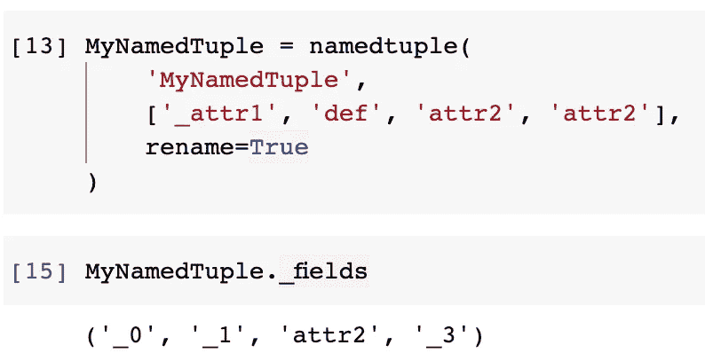

# 3.使用命名元组


图片由 [Gerd Altmann](https://pixabay.com/users/geralt-9301/?utm_source=link-attribution&utm_medium=referral&utm_campaign=image&utm_content=3236285) 来自 [Pixabay](https://pixabay.com/?utm_source=link-attribution&utm_medium=referral&utm_campaign=image&utm_content=3236285)

为了演示如何使用一个命名元组，让我们重复我们在上面几节中使用的例子。我们可以定义`Coords`类并实例化一个命名元组`home`。

```
Coords = namedtuple('Coords', 'latitude, longitude')
home = Coords(-37.8871270826, 144.7558373041)
```

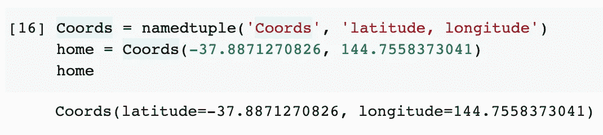

## 3.1 访问值

然后，我们可以访问命名元组中的值。非常直观地，我们可以使用字段名来访问它们对应的值。这是使用命名元组的主要好处之一。它还提高了代码的可读性。

```
print(home.latitude)
print(home.longitude)
```

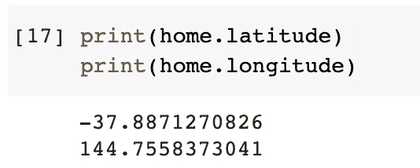

另外，不要忘记命名元组就是元组。因此，我们也可以使用索引来获取值。

```
print(home[0])
print(home[1])
```

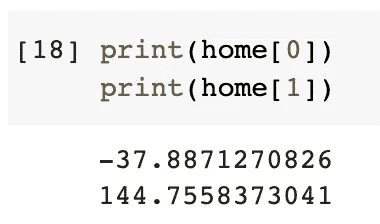

## 3.2 将命名元组转换成字典

就其表现形式而言，命名元组非常类似于字典。字段名可以看作是字典的键，它们都有相应的值。

事实上，一个命名的元组有一个内置的私有方法来将其自身转换为有序字典。

```
home._asdict()
```

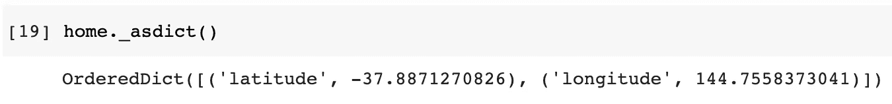

这是有道理的。命名元组和字典之间最重要的区别可能是命名元组中字段的顺序很重要。这意味着命名元组和有序字典可以互换。

然而，如果我们不关心键的顺序，而只想要一本字典，那该怎么办呢？我们可以简单地向有序字典添加一个类型转换，如下所示。

```
dict(home._asdict())
```

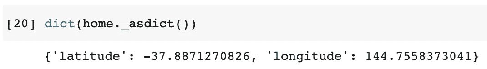

## 3.3 替换字段的值

由于命名元组是元组，并且元组是不可变的，所以不可能改变字段的值。

```
home.latitude = 10
```

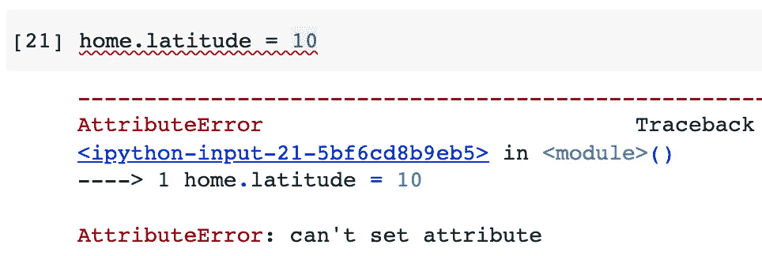

在这种情况下，我们必须使用另一个私有方法`_replace()`来替换字段的值。

```
home1 = home._replace(latitude=10)
```

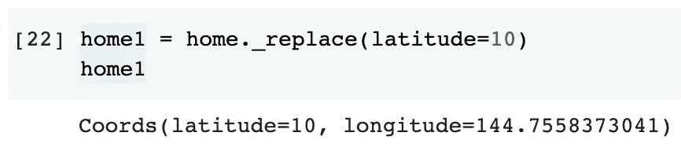

`_replace()`方法将返回一个新的命名元组。这很重要，因为即使使用这种方法，我们仍然不能修改命名元组。

如果我们检查原始的命名元组，它没有改变。

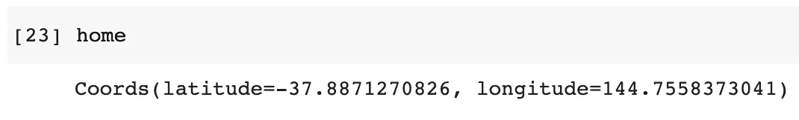

## 3.4 具有默认值的命名元组

就像在一个普通的类中我们可以为属性设置默认值一样，一个命名的元组类也可以设置默认值。然而，由于具有默认值的字段必须在任何没有默认值的字段之后，默认值应用于最右边的**参数。**

例如，让我们再次定义只有一个默认值的`Coords`类。

```
Coords = namedtuple('Coords', 'latitude, longitude', defaults=[100])
home = Coords(-37.8871270826)
```

如果我们实例化只有一个值的命名元组，默认值`100`将用于经度，这是我们定义中最右边的一个。

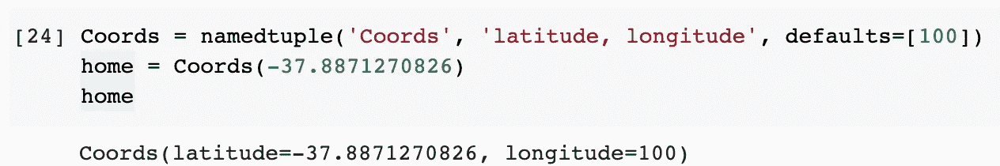

如果我们显式地将字段设置为经度，那么默认值将用于纬度吗？

```
home = Coords(longitude=-37.8871270826)
```

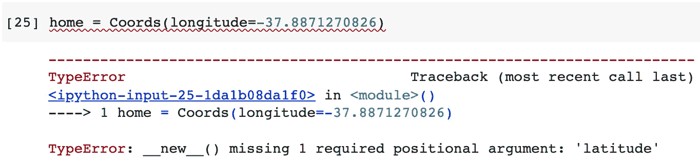

答案当然是否定的。在一个命名元组中，字段的顺序是非常严格的。为了避免混淆和潜在的问题，默认值必须在最右边，即使我们明确地指定了一些东西。

如果我们给所有字段赋予默认值，这意味着所提供的默认值的数量与字段的数量相同，那么当我们实例化一个命名元组时，我们将不必传入任何值。

```
Coords = namedtuple('Coords', 'latitude, longitude', defaults=[-50, 100])
home = Coords()
```

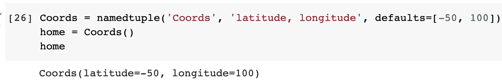

检查命名元组类的默认值的一个技巧是使用它的私有属性`_field_defaults`。

```
Coords._field_defaults
```

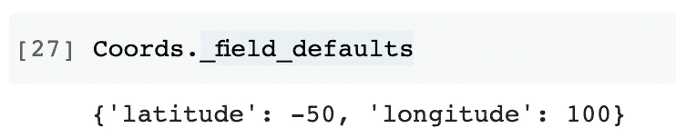

## 3.5 将元组转换为命名元组

如果我们已经准备好了一个普通元组和一个命名元组类，我们可以使用私有方法`_make()`轻松地将元组转换为命名元组。请注意，元组的长度必须与命名元组的长度相同。

```
t1 = (-37.8871270826, 144.7558373041)
home = Coords._make(t1)
```

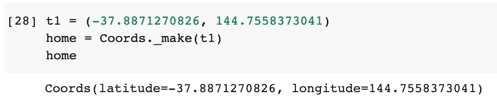

# 4.为什么以及何时使用命名元组？


图片由 [Gerd Altmann](https://pixabay.com/users/geralt-9301/?utm_source=link-attribution&utm_medium=referral&utm_campaign=image&utm_content=2212771) 从 [Pixabay](https://pixabay.com/?utm_source=link-attribution&utm_medium=referral&utm_campaign=image&utm_content=2212771) 拍摄

我们已经介绍了 Python 中关于命名元组的几乎所有内容。Python 为什么会有它，我们应该什么时候使用它？

答案如下:

*   与普通元组相比，使用命名元组可以改进我们的代码，以表达元组元素的语义。
*   与 Python 类相比，使用命名元组可以提高代码可读性，并显著减少代码行数。

第一点很容易理解。对于第二个，让我们考虑下面的例子。假设我们需要定义一个`Student`类。它不一定有任何方法。换句话说，它只是保存一个学生对象的数据。

```
class Student:
    def __init__(self, student_no, first_name, last_name, birth_year, gender):
        self.student_no = student_no
        self.first_name = first_name
        self.last_name = last_name
        self.birth_year = birth_year
        self.gender = gender
```

如果我们使用一个命名元组，定义就像下面这样简单。

```
Student = namedtuple('Student', 'student_no, first_name, last_name, birth_year, gender')
```

因此，对于这种情况，使用命名元组比使用类要简单和整洁得多。然而，如果我们需要任何类方法，命名元组将不再适用。

使用命名元组的另一个好处是它的可迭代性。也就是说，命名元组是可迭代的，因此它可以用于许多场景，如循环和生成器。

让我们使用`Student`类来实例化一个命名元组

```
s1 = Student(123, 'Chris', 'Tao', 1900, 'Male')
```

然后，我们可以循环它的值。

```
for attr in s1:
    print(attr)
```

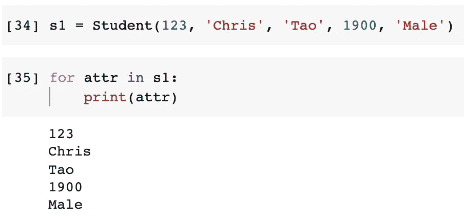

# 摘要


图片来自 [Pixabay](https://pixabay.com/?utm_source=link-attribution&utm_medium=referral&utm_campaign=image&utm_content=6803226)

在本文中，我介绍了 Python 中的命名元组，它是什么，如何创建命名元组类，以及如何将该类实例化为命名元组。然后，我举例说明了什么时候我们应该使用命名元组，什么时候不应该。希望你喜欢阅读！

<https://medium.com/@qiuyujx/membership>  

如果你觉得我的文章有帮助，请考虑加入 Medium 会员来支持我和成千上万的其他作者！(点击上面的链接)