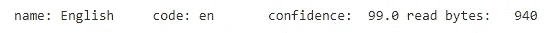
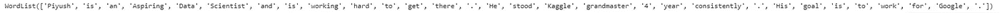
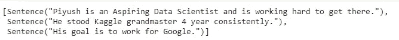
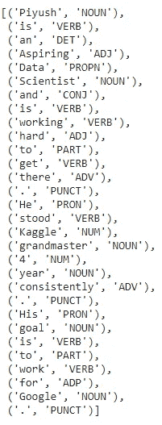
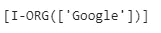
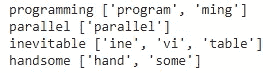
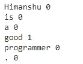
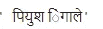

# 用于 NLP 的 Python 包——第 1 部分

> 原文：<https://towardsdatascience.com/python-packages-for-nlp-part-1-2d49126749ef?source=collection_archive---------41----------------------->

## 用于 NLP 操作的 Polyglot- Python 包


米卡·博斯韦尔在 [Unsplash](https://unsplash.com?utm_source=medium&utm_medium=referral) 上的照片

自然语言处理旨在操纵人类/自然语言，使其为机器所理解。它涉及文本分析、文本挖掘、情感分析、极性分析等。有不同的 python 包可以使 NLP 操作变得简单而不费力。

所有的 NLP 软件包都有不同的功能和操作，这使得最终用户更容易执行文本分析和各种 NLP 操作。在这一系列文章中，我们将探索 python 的不同 NLP 包及其所有功能。

在本文中，我们将讨论 Polyglot，这是一个开源 python 包，用于操作文本并从中提取有用的信息。它有几个功能使得它比其他基于 NLP 的库更好更容易使用。这里我们将讨论它的不同功能以及如何实现它们。

让我们开始吧。

# 安装多语言和其他依赖项

为了开始，我们首先需要安装 polyglot 及其所有依赖项。对于本文，我们将使用 Google Colab，下面给出的代码将安装 polyglot 及其依赖项。

```
!pip3 install polyglot
!pip3 install pyicu
!pip3 install pycld2
!pip3 install morfessor
```

安装完这些库之后，我们还需要安装 polyglot 的一些功能，这些功能将在本文中用到。

```
!polyglot download embeddings2.en
!polyglot download pos2.en
!polyglot download ner2.en
!polyglot download morph2.en
!polyglot download sentiment2.en
!polyglot download transliteration2.hi
```

# 导入所需的库

下一步是导入所需的 polyglot 库和功能，我们将在本文中探讨。

```
import polyglot
from polyglot.detect import Detector
from polyglot.text import Text, Word
from polyglot.mapping import Embedding
from polyglot.transliteration import Transliterator
```

# 执行 NLP 操作

让我们从探索 polyglot 提供的一些 NLP 功能开始，但是在此之前，让我们输入一些我们将要处理的样本数据。

```
sample_text = '''Piyush is an Aspiring Data Scientist and is working hard to get there. He stood Kaggle grandmaster 4 year consistently. His goal is to work for Google.'''
```

1.  **语言检测**

Polyglot 的语言检测器可以很容易地识别文字的语言。

```
#Language detection
detector = Detector(sample_text)
print(detector.language)
```



语言(来源:作者)

2.**句子和单词**

为了从文本/语料库中提取句子或单词，我们可以使用多语言功能。

```
#Tokenize
text = Text(sample_text)
text.words
```



单词(来源:作者)

```
text.sentences
```



句子(来源:作者)

3.**位置标记**

词性标注是一项重要的自然语言处理操作，可以帮助我们理解文本及其标注。

```
#POS tagging
text.pos_tags
```



词性标注(来源:作者)

4.**命名实体识别**

NER 用于识别语料库/文本数据集中的人、组织和位置(如果有的话)。

```
#Named entity extraction
text.entities
```



NER(来源作者)

5.**形态分析**

```
#Morphological Analysis
words = ["programming", "parallel", "inevitable", "handsome"]for w in words:
     w = Word(w, language="en")
     print(w, w.morphemes)
```



形态学(来源:作者)

6.**情感分析**

我们可以分析一句话的情绪。

```
#Sentiment analysistext = Text("Himanshu is a good programmer.")
for w in text.words:
   print(w, w.polarity)
```



极性(来源:作者)

7.**翻译**

我们可以把文本翻译成不同的语言。

```
#Transliteration
transliterator = Transliterator(source_lang="en", target_lang="hi")
new_text = ""
for i in "Piyush Ingale".split():
  new_text = new_text + " " + transliterator.transliterate(i)
new_text
```



翻译(来源:作者)

这就是你可以轻松地探索文本数据集的不同属性的方法。

继续尝试不同的文本数据集，如果你发现任何困难，你可以在回复部分发布。

这篇文章是与[皮尤什·英加尔](https://medium.com/u/40808d551f5a?source=post_page-----2d49126749ef--------------------------------)合作的

# 在你走之前

***感谢*** *的阅读！如果你想与我取得联系，请随时在 hmix13@gmail.com 上联系我或我的* [***LinkedIn 个人资料***](http://www.linkedin.com/in/himanshusharmads) *。可以查看我的*[***Github***](https://github.com/hmix13)**简介针对不同的数据科学项目和包教程。还有，随意探索* [***我的简介***](https://medium.com/@hmix13) *，阅读我写过的与数据科学相关的不同文章。**