# 骑着 Python 穿越 Peloton

> 原文：<https://towardsdatascience.com/python-pandas-and-the-peloton-aa024ca74fa5?source=collection_archive---------14----------------------->

## [实践教程](https://towardsdatascience.com/tagged/hands-on-tutorials)

## 使用基础数据分析对环法自行车赛进行分析

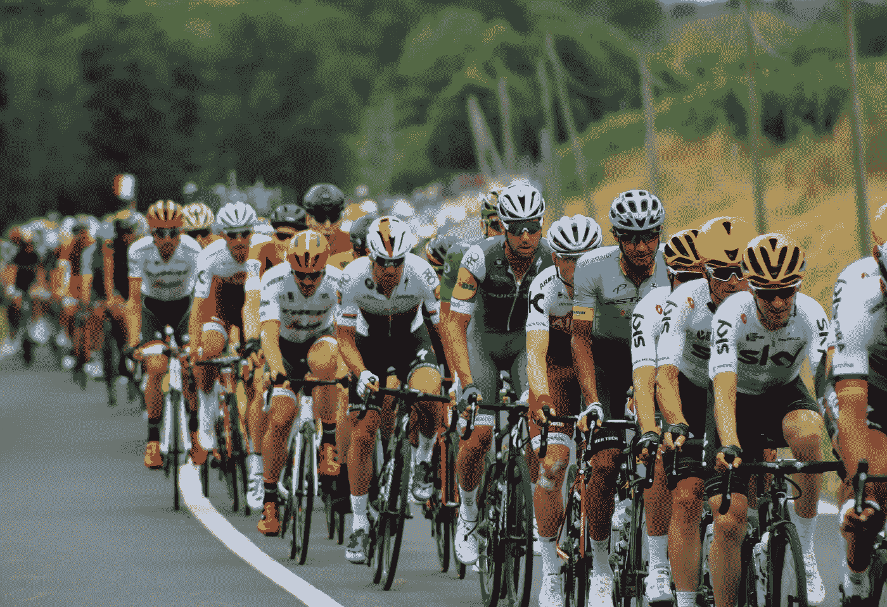

[📸—罗伯·温盖特— Unspalsh](https://unsplash.com/photos/2Qf2_k0Q5T0)

# 第一阶段:介绍

每年夏天，世界顶尖的自行车选手聚集在法国，进行一场激烈的全国比赛。再过几天，2021 年环法自行车赛将在小港口城市布列斯特开始，并像往常一样，在几周后的巴黎结束。鉴于“大数据”和“分析”的趋势正在触及体育世界的每一个部分，[包括自行车](https://www.forbes.com/sites/joshualaw/2020/08/26/moneyball-at-the-tour-de-france-how-ntt-is-bringing-analytics-to-pro-cycling/?sh=62b63a19a3b7)，我想使用 Python 中可用的流行库组合来更深入地了解这个年度赛事。这篇文章旨在构建对历史环法自行车赛数据的现有分析，同时展示 Python 在数据分析和可视化基础方面的强大功能。

# **第二阶段:读入并探索数据**

我们分析使用的主要数据集直接来自环法自行车赛官方网站,其中包含了从 1903 年到 2020 年的每场比赛的骑手信息(感谢杰里米·辛格-万的[数据是多元的](https://www.data-is-plural.com/)时事通讯来呈现数据集！).由于托马斯·坎米纳迪[令人印象深刻的网络搜集——这是一个值得完全独立发布的有用技能组合——这些数据已经被格式化为一个方便的 CSV 文件，详细列出了每个骑手的等级、时间、团队等等。](https://www.camminady.org/)

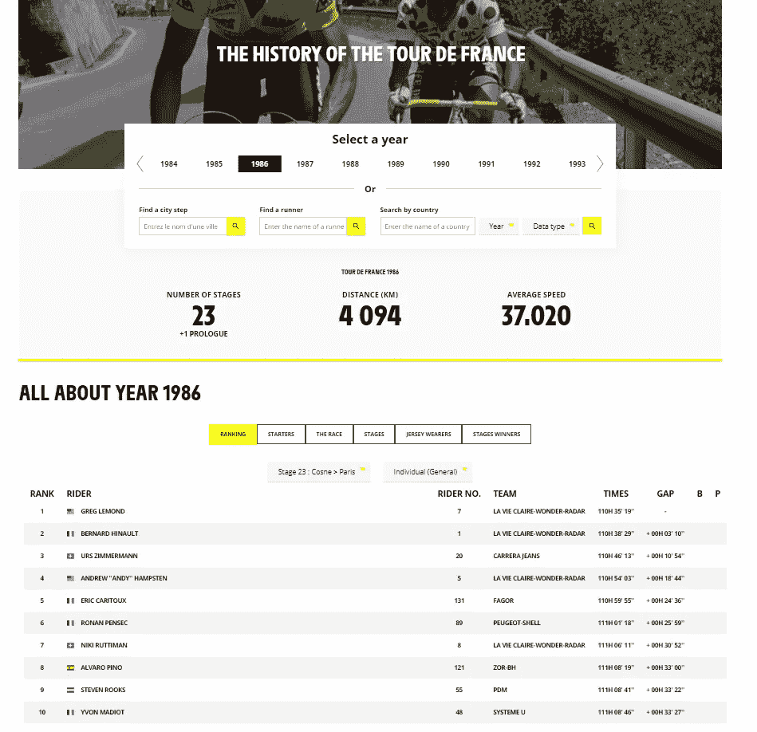

图:数据来源网站([letour.fr/en](https://www.letour.fr/en/history))

我们将从 Python 中导入我们分析所需的特定库，然后使用 read_csv 方法从 Pandas 库中读入数据。

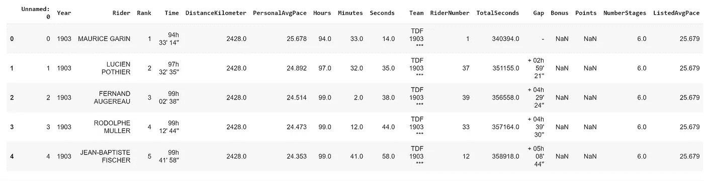

图:我们的数据帧的前五行

的。info 方法不仅详细说明了数据集的大小(9，452 行和 18 列)，还详细说明了每列的数据类型以及每列缺失的数据量。粗略地看一下，我们发现“奖金”和“积分”变量在我们的数据准备阶段很容易被删除或估算，因为每个变量都有大量的缺失值或空值。

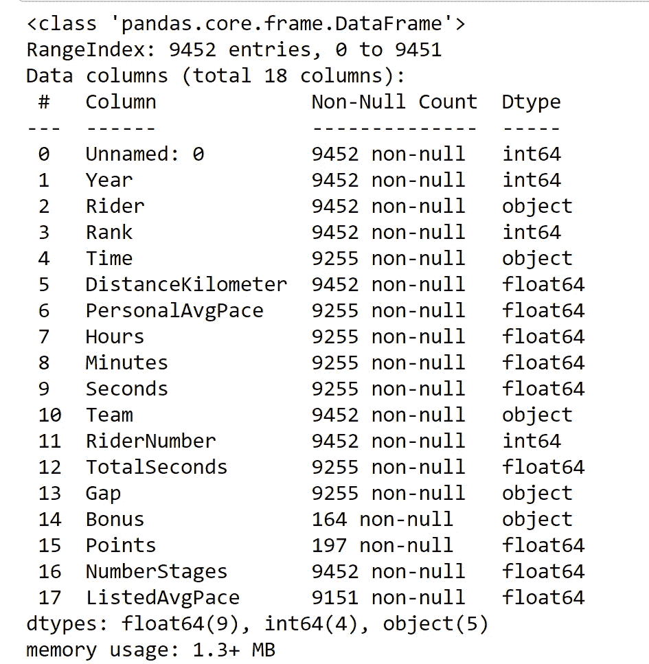

图:我们的列的名称、数据类型和缺失数据计数

最后。describe 方法显示了我们的数字列的快速统计摘要。虽然我们正在处理的数据集不够全面，不足以证明这些步骤，但通过[热图或相关矩阵图](/better-heatmaps-and-correlation-matrix-plots-in-python-41445d0f2bec)以及直方图来可视化您的数据，以了解数据分布，可以作为探索您的数据的初始模式或关系的另一种方式。

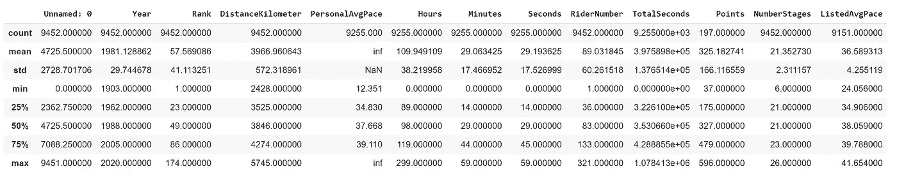

图:我们的整数类型列的一些统计度量

# 第三阶段:**清理和准备数据**

尽管[耗时且平庸](https://www.forbes.com/sites/gilpress/2016/03/23/data-preparation-most-time-consuming-least-enjoyable-data-science-task-survey-says/?sh=277c068f6f63)，**数据清理和准备对于任何适当的数据深度挖掘都是必不可少的一步，因为它创建了一个适当的基础数据集来进行未来的**分析。我们将删除数据集的第一列。drop 方法，因为它不提供任何值。此外，“奖金”和“积分”列似乎没有太大的帮助，因为缺少大量的值，所以让我们也放弃这些。虽然我们不会在这里触及，但[各种数据插补和替换方法](/how-to-deal-with-missing-data-in-python-1f74a9112d93)可用于解决数据缺失部分。将距离从千米转换成英里可以通过在阵列上运行简单的计算来实现；我们还想用。为了清楚起见，重命名方法。

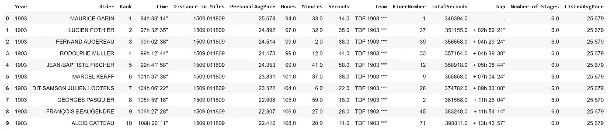

图:我们的“清理”数据集的前十行

除了列名之外，在查看“team”变量时，我们遇到了一个很好的数据清理机会。特殊团队“Touriste-Routiers”(翻译为“公路游客”)与“Touristes Routiers”分开计算。

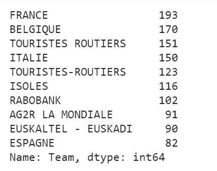

图:初始数据集中的前 10 个团队

虽然这实际上可能是两个独立的团队——关于是否存在连字符的争论很常见——让我们继续假设这只是一个错误，我们可以使用。将方法替换为地址。

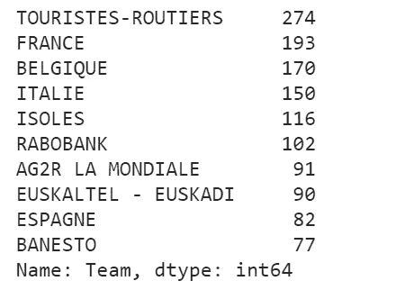

图:10 大团队，使用。替换方法

# 阶段 4:分析数据

在这一点上，我们可以开始问——并希望回答——一些关于环法自行车赛的简单的时间序列问题。除了季节性和变化率之外，总体趋势也是时间序列分析的共同兴趣点。例如，如果我们想了解比赛的规模是如何增长的，我们可以使用。按 and 分组。数数每年乘坐的人数。

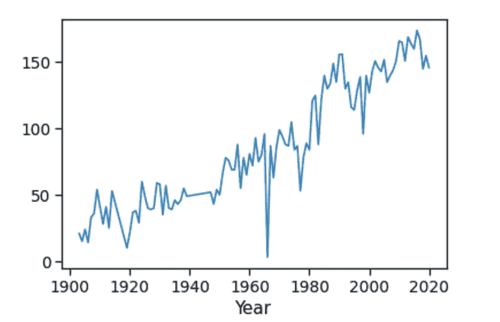

图:每年乘客总数

我们创建的图表看起来非常简单；我们通常认为随着赛事和运动的流行，比赛的规模会随着时间的推移而增加。然而，1966 年骑手数量的大幅下降有点不寻常。那年的[比赛看起来没什么特别的(嗯，除非你考虑到](https://en.wikipedia.org/wiki/1966_Tour_de_France)[引入兴奋剂检测和参赛者的中途抗议](https://www.outsideonline.com/1917326/biggest-scandals-tour-de-france-history))。巡回赛的统计学家放暑假了吗？数据记录是否被一名当年未获得参赛资格的复仇但精通网络的骑手抹去了？撇开阴谋论不谈，这种奇怪的现象确实值得再研究一下。如果我们好奇哪些车手参加了最多的环法自行车赛，环法自行车赛，环法自行车赛？让我们来看看比赛…

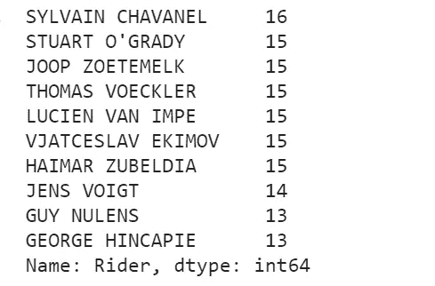

图:数据集中出现频率最高的骑手

看起来法国自行车手[西尔万·查瓦内尔](https://en.wikipedia.org/wiki/Sylvain_Chavanel)以 16 件参赛作品领跑！让我们稍微解开这一行代码…

*   rider_df['rider]从我们的数据帧中选择“Rider”列，生成一个序列
*   。values_counts()是对这个新系列中的值进行计数的方法；这实际上创建了一个新的序列，其中索引是附加项，值是它们出现的频率(从最频繁开始递减)
*   [:10]给出了这个系列中前 10 个最常出现的骑手；最终创建最终系列，如上所示

如果我们想快速查看每年的所有获奖者，该怎么办？我们只需创建一个列表，并在“Rank ”= 1 时进行过滤。通过过滤选择数据子集是回答此类问题或生成新问题的一个好方法。

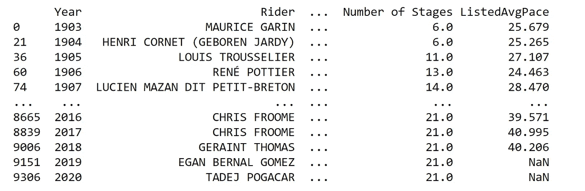

图:显示获胜者的数据子集

换挡(不得不偷偷把至少一个糟糕的骑车双关语放到这篇文章中)，让我们看看光谱的另一端，按速度排序数据，看看历史上最慢的骑手。这可以通过。sort_values 方法应用于适当的列，在我们的例子中是“PersonalAvgPace”。

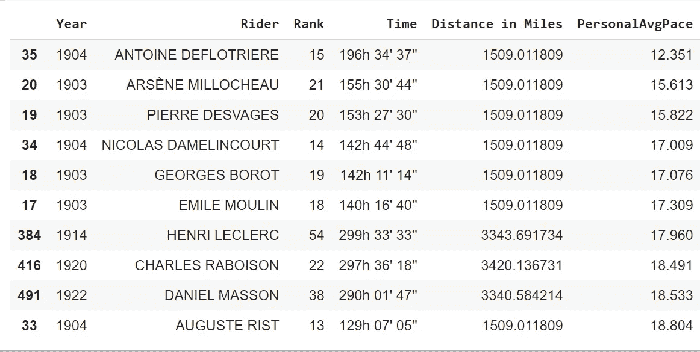

图:基于“个人空间”变量的最慢骑手

不出所料，最慢的车手名单经常出现在一些最早记录的比赛中。

# 阶段 5:将数据与另一个数据集合并

我们的原始数据集是全面的，但当涉及到每个骑手的有趣信息时，就相当有限了。幸运的是，我们在 Github 上看到了一个单独的数据集,列出了每年环法自行车赛的冠军，包括成绩信息以及骑手的身高、体重、年龄、国籍等等。 **Python 让我们能够转换现有的骑手数据框架，并将两个数据集合并在一起。**

我们的原始数据集已被修改为只显示获胜者，并被重命名为 df2 现在，我们将阅读并检查我们遇到的其他赢家数据集。

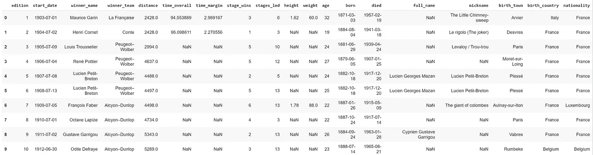

图:我们新数据集的初步观察

我们将在这个新数据集上执行一组类似的数据清理和准备活动，就像我们对原始数据集所做的那样。Year 显然是连接两组数据的主键，但是我们需要确保它们的格式相同。让我们用一个快速切片来修剪“Year”列(当我们使用 quick .str.upper 方法时，用同样的方式来格式化 riders)。确保数据类型相同很重要，因此我们将确保“Year”变量是一个带有。a 类型方法。

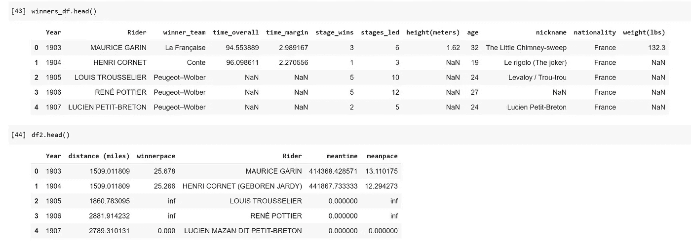

图:我们的两个数据框，准备合并

类似于 SQL 的 JOIN 子句。Pandas 中的 merge 方法允许在一列或多列上连接两个数据帧。默认的合并类型是内部联接，但是可以使用 how 参数覆盖它。我们知道获胜者/骑手的名字是多余的，因为它包含在两个数据集中；在 Python 中，列上的 _x 和 _y 后缀有助于指示列名的来源(x 是左边的数据集，而 _y 是右边的)。我们将删除其中一个，并在最终的合并数据集中有一个单独的“获胜者”列。

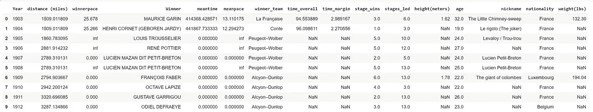

图:我们新合并的数据框架

我们成功合并的数据集为环法自行车赛获胜者开辟了许多新的探索途径。[自行车运动中的“团队”概念](https://slate.com/news-and-politics/2005/07/how-do-cycling-teams-work.html#:~:text=One%20member%20of%20the%20team,of%20winning%20the%20race%20themselves.&text=For%20the%20most%20part%2C%20they,front%20of%20the%20team%20leader.)一直是我感兴趣的，也是我不太了解的东西。一个与团队相关的问题可能是“从一个国家到另一个国家，哪个团队最成功？”为了回答这个问题，我们可以安排我们的数据来看看团队获胜，按国籍分组。

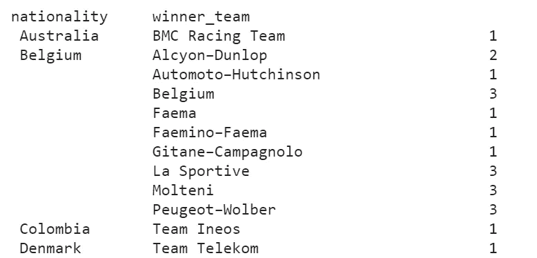

图:我们输出的一个子集，按国家列出了获胜团队的名称

# **阶段 6:用 Matplotlib、Seaborn 和 Plotly 可视化数据**

Python 提供了各种绘图库来帮助你创建清晰、深刻的数据可视化。在这个阶段，我们将展示一些最流行的库的功能，包括 Matplotlib、Plotly 和 Seaborn。让我们用一个简单的线形图来显示获胜者每年的平均速度。我们将添加一些参数，如绘图标题、轴标签和图例。我们还将添加一个注释来记录一段缺失的数据。

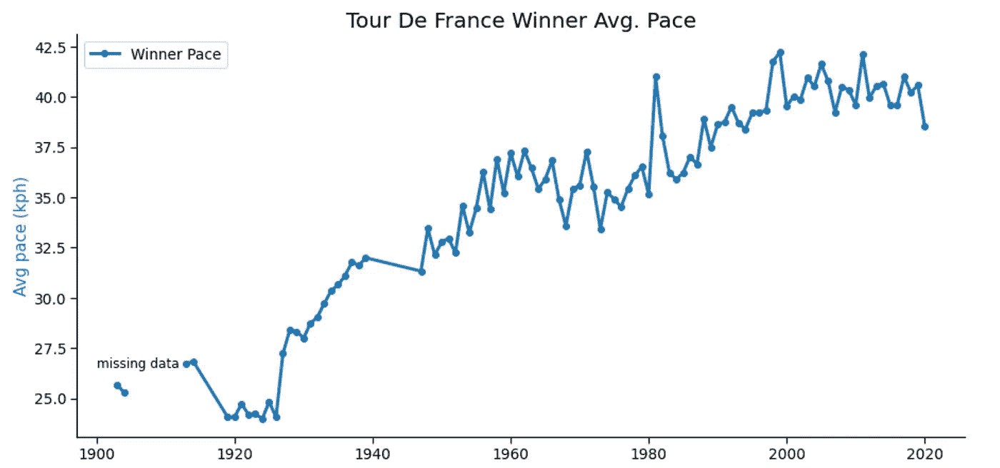

图:显示每年获胜者平均速度的线形图

毫不奇怪，随着时间的推移，比赛获胜者的速度越来越快，近年来的增长略有放缓，这可能是由于近年来对兴奋剂的打击以及骑手和自行车不断达到的身体限制的综合作用。如果我们想将这些信息与另一个不同尺度的变量进行比较，比如距离，会怎么样呢？我们只需用另一个轴创建一个图来容纳我们的新变量。我们还将确保合并标签，这样两行都可以考虑。

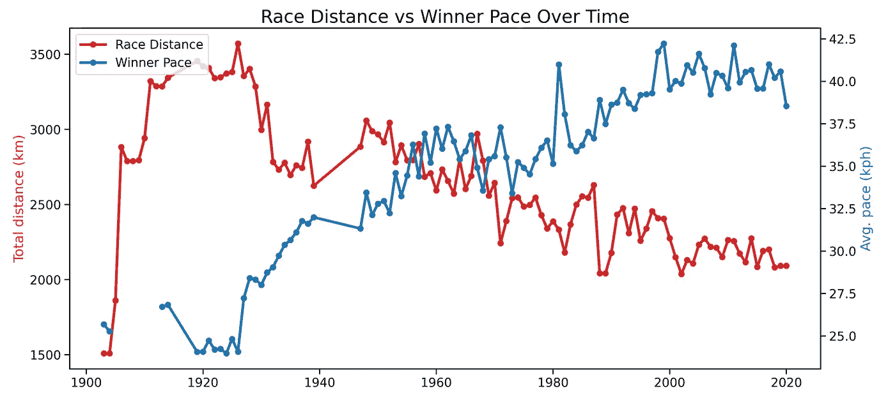

图:比较比赛距离和冠军配速

条形图是 Python 中可视化数据的常用方式。让我们使用此图表类型按获胜次数来比较获胜者。

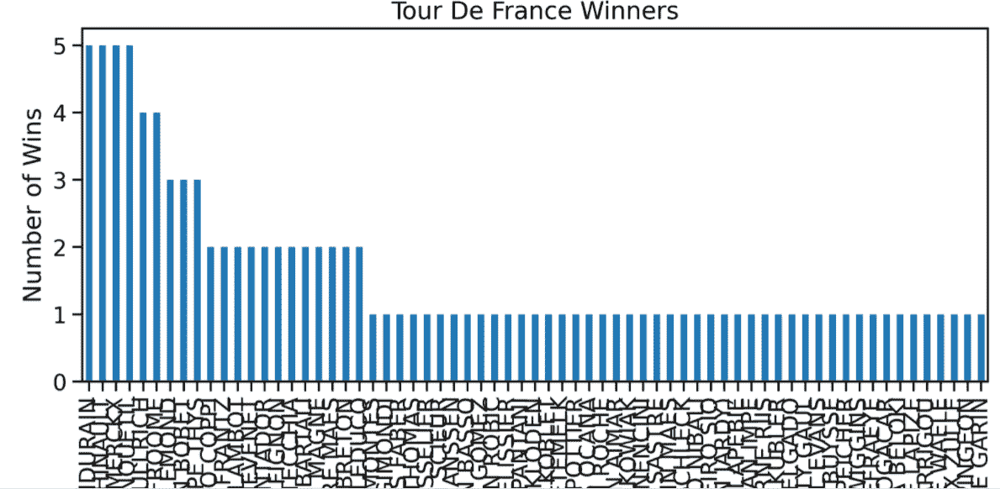

我们已经可以看出这个图表不是最直观或最容易阅读的。无意冒犯许多只赢了一场比赛的车手，但让我们看看是否能把它精简到赢了多次的车手。通过对数据和标签的一些调整，我们应该能够创建一个更容易解释的图表。([点击这里](https://medium.com/compassred-data-blog/10-levels-of-ggplot2-from-basic-to-beautiful-5ce3c4e7624f)查看一篇更详细的帖子，展示了构建更好图表的各个层次)

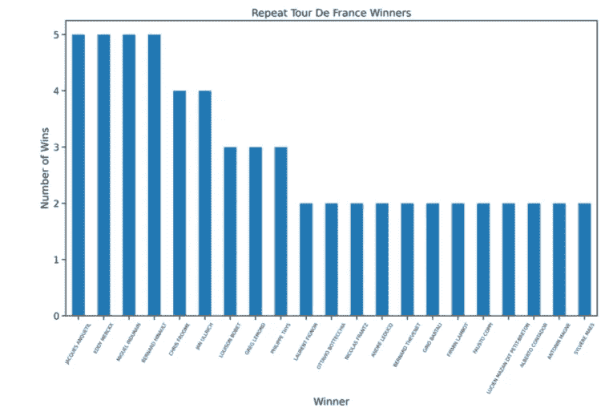

图:显示多个赢家的改进条形图

也许我们想显示一段时间内环法自行车赛“平均”获胜者的数据。创建一些变量并将它们传递到 print 语句中是一个好的开始。

让我们试着用一种更具视觉吸引力的形式来表现“普通”骑手。直方图是查看数据频率分布的有用方式。的。hist()函数有许多选项来改变数据的计算和相应图表的显示。如果我们假设我们的数据是正态分布的，一些直方图将有助于描绘一幅“平均赢家”的图画。Matplotlib 的 subplot 特性允许我们并排比较这些图表。

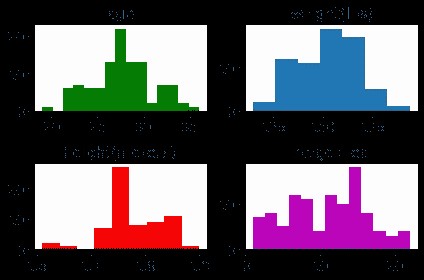

图:环法自行车赛获胜者平均值直方图的子图

简单地说，散点图是展示两个变量之间关系的好方法。也许我们想要一个关于获胜者身高和体重之间相关性的视觉表现。

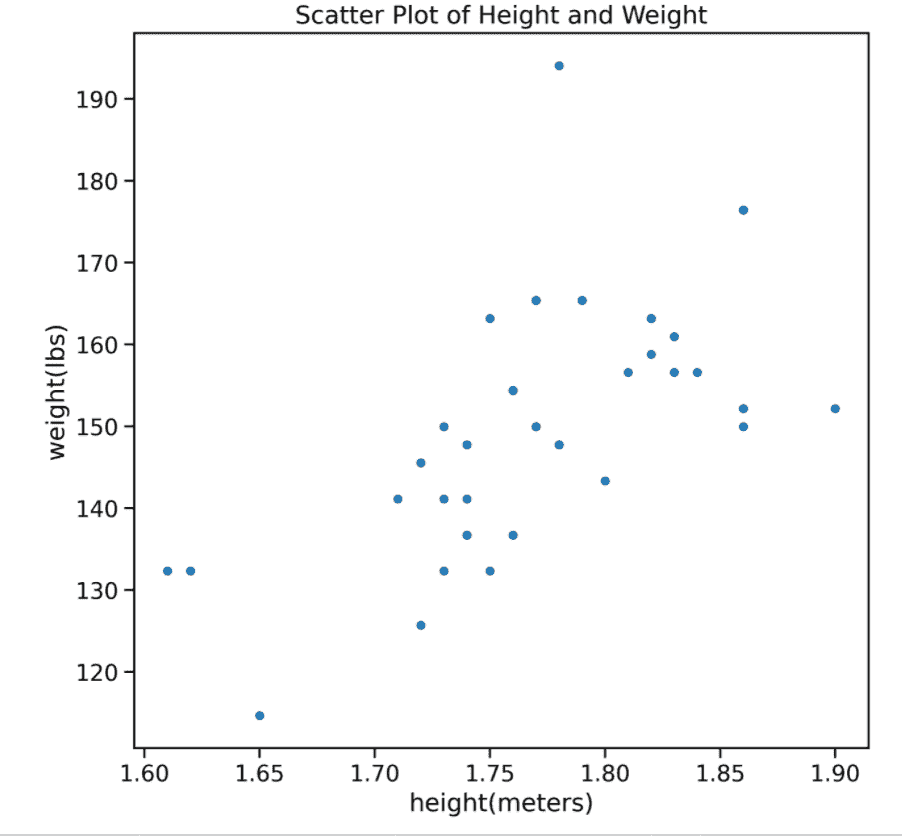

图:身高和体重的散点图

这是一个好的开始，但让我们做一些挖掘来注释上图中的一个异常值，特别是体重最大的骑手。对我们的数据进行一些快速过滤，很快就确定了这个异常值是 1909 年环法自行车赛冠军弗朗索瓦·费伯(Francois Faber)的名字，他被恰当地称为“哥伦布巨人”。让我们对 Francois 在领奖台上穿着 XL 黄色球衣给予应有的认可，并用注释更新我们的散点图。

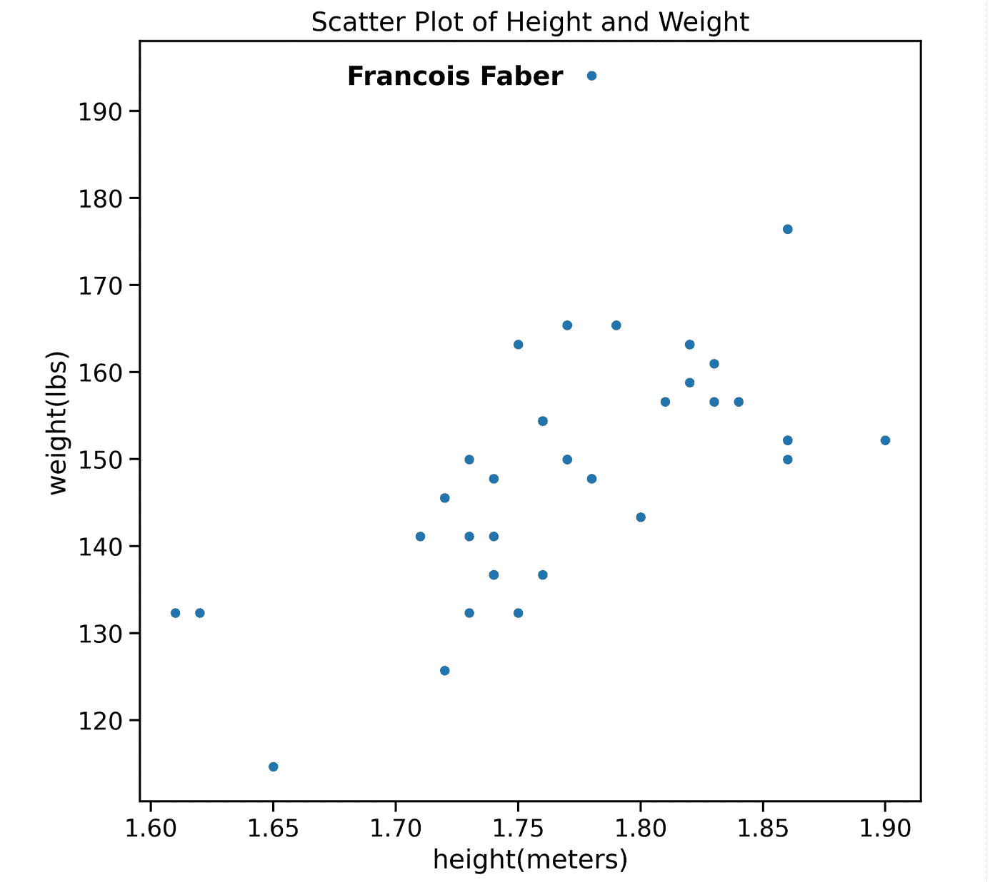

据其[网站](https://seaborn.pydata.org/)，“Seaborn 是一个基于 matplotlib 的 Python 数据可视化库。它提供了一个高级界面，用于绘制有吸引力且信息丰富的统计图形。”虽然 matplotlib 中的一些绘图类型非常令人满意，但 Seaborn 为其他绘图类型提供了轻微的视觉增强，希望能够提高理解能力。我们将使用 boxplots 来展示 Seaborn 的功能，这是一种非常好的异常检测方法。下图显示了 Seaborn 如何对按国籍分组的平均获奖者年龄的箱线图进行细微的视觉改进。

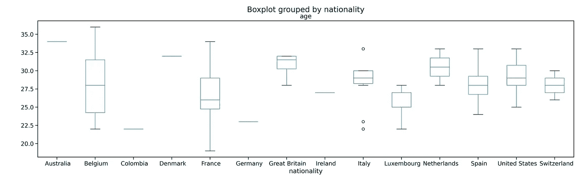

图:使用 matplotlib 的箱线图

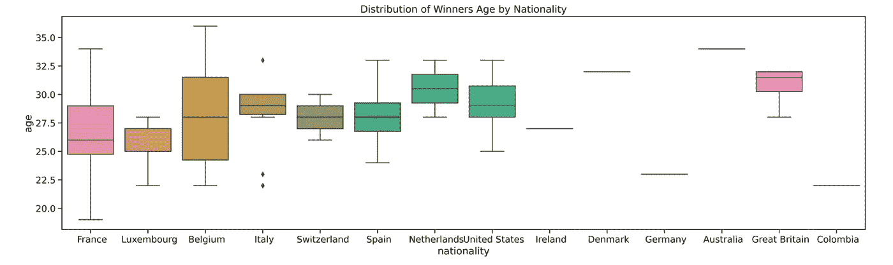

图:使用 seaborn 的箱线图

虽然我们的样本量相对较小，但深入挖掘箱线图中显示的意大利获胜者的异常值会很有意思。最后但同样重要的是， [Plotly](https://plotly.com/python/getting-started/) 是一个图形库，允许用 Python 创建交互式图表。Plotly 在多种格式的可读性方面大放异彩，它为各种类型的情节提供了许多有趣的定制功能，但我们将使用下面的代码创建一个带有交互式悬停状态的简单的 winners age 折线图。

图:显示每年获奖者年龄的图表

# 阶段 7:未来分析

如前所述，这个项目在范围上相当有限，只是触及了可以在这样的数据集上运行的分析的表面。未来分析中涉及的几个有趣的问题或概念包括:

*   **预测**:时间序列分析的首要目标往往是预测；观察未来 15 年的冠军配速或比赛距离等因素可能会很有趣。
*   **回归模型**:建立多元线性回归模型，根据身高、体重、年龄、国籍等因素预测骑行者的步伐。
*   **异常检测**:查看哪些骑手或获胜者在人群中脱颖而出，并找出原因将是扩展我们上面展示的一些异常检测工作的一个好方法。
*   **对比被禁赛车手的表现** : [兴奋剂指控和争议](https://en.wikipedia.org/wiki/Doping_at_the_Tour_de_France)从环法自行车赛开始就一直困扰着它；被指控服用兴奋剂的被取消资格的骑手没有被包括在数据集中，但比较被禁赛的骑手被剥夺冠军头衔的速度和我们数据集中的获胜者的速度等指标会很有趣
*   **雷达图**:绘制多个[雷达(或蜘蛛)图](https://www.mockdraftable.com/player/julio-jones)比较不同国籍的车手在各种不同因素上的表现。

当你加入生物特征数据、天气、海拔和自行车类型等因素时，在未来几年的环法自行车赛中，将会发现大量有趣且有望产生影响的见解。

# 第八阶段:进一步阅读和总结

如上所述，这不是第一次深入研究环法自行车赛的数据，希望不会是最后一次！如果你对这些感兴趣的话，我在研究过程中发现了更多的资源:

*   [数字环法自行车赛简介](https://www.kaggle.com/jaminliu/a-brief-tour-of-tour-de-france-in-numbers)
*   [环法自行车赛数据分析，使用 Jupyter 笔记本中的 Strava 数据以及 Python、Pandas 和 Plotly](https://technology.amis.nl/data-analytics/tour-de-france-data-analysis-using-strava-data-in-jupyter-notebook-with-python-pandas-and-plotly-step-1-single-rider-loading-exploration-wrangling-visualization/)
*   [可视化环法自行车赛](https://imgur.com/gallery/hKDOT5Y)
*   [#tidytuesday:环法自行车赛冠军](http://maiapelletier.rbind.io/post/tidytuesday-tour-de-france-winners/)

希望您喜欢这个高层次的概述，并发现它对展示 Python 及其相关特性的简单方面如何揭示数据集的独特见解有所帮助。点击查看[原始代码。我错过/忘记了什么，或者你会采取什么不同的做法？任何和所有的反馈都欢迎通过下面的评论，或者在 wmc342@gmail.com 给我留言。非常感谢您的阅读，并享受比赛！🚴](https://github.com/wcrowley342/tourdefancedata/blob/main/TourDeFranceAnalysis_JustCode.ipynb)