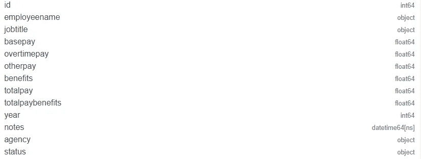
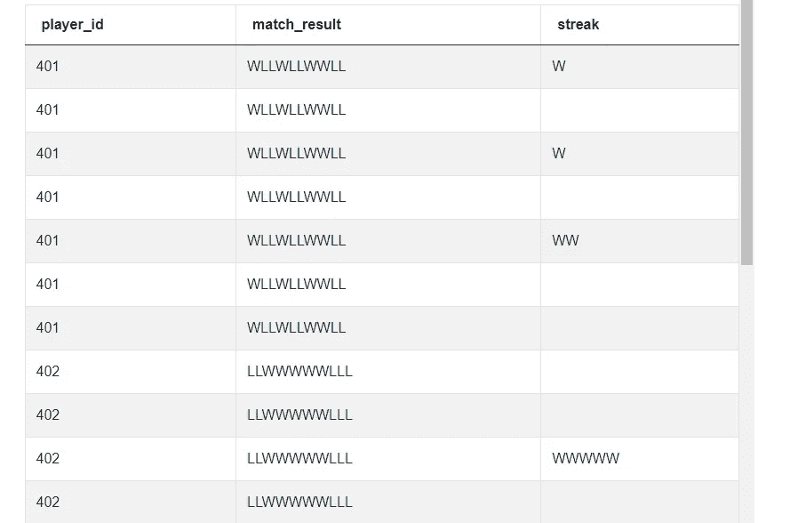

# Python 熊猫面试数据科学的问题

> 原文：<https://towardsdatascience.com/python-pandas-interview-questions-for-data-science-377dfac4a7a1?source=collection_archive---------23----------------------->

## *利用熊猫进行 Python 数据科学面试试题*


在 [Unsplash](https://unsplash.com?utm_source=medium&utm_medium=referral) 上由[Christina @ wocintechchat.com](https://unsplash.com/@wocintechchat?utm_source=medium&utm_medium=referral)拍摄的照片

在上一篇文章 [*Python Pandas 数据科学面试问题第 1 部分*](https://www.stratascratch.com/blog/python-pandas-interview-questions-for-data-science/?utm_source=blog&utm_medium=click&utm_campaign=medium) 中，我们研究了如何将数据导入 Pandas 并执行基本计算，例如

*   排序数据帧
*   处理重复
*   聚集
*   合并数据帧
*   计算字段

在这一部分中，我们将基于这些知识，用它们来解决更复杂的 Python 熊猫面试问题。我们将关注以下领域

*   日期时间操作
*   文本操作
*   应用函数
*   高级聚合
*   偏移数据
*   使用熊猫的统计

如果你不熟悉熊猫图书馆，请浏览那篇文章。让我们开始吧。

# 应用函数

在本系列的前一部分中，我们研究了如何创建额外的字段。我们也可以使用 Python 库中的函数或用户定义的函数来操作值。为此，我们使用 apply()方法。apply()方法使用矢量化，因此与遍历序列中的每一行相比，可以更快地计算值。这里有一个来自 AirBnB 数据科学采访的简单问题。

****

**生活设施最多的城市**

*从 Airbnb 上给定的房产搜索数据集中，找出主人所有房产中设施最多的城市。假设每行代表一个唯一的主机。输出城市名称作为您的解决方案。*


截图来自 [StrataScratch](https://www.stratascratch.com/?utm_source=blog&utm_medium=click&utm_campaign=medium)

你可以在这里解决这个 Python 熊猫面试问题。[https://platform . stratascratch . com/coding/9633-拥有最多便利设施的城市？python=1](https://platform.stratascratch.com/coding/9633-city-with-most-amenities?python=1&utm_source=blog&utm_medium=click&utm_campaign=medium)

该问题使用包含这些字段的 **airbnb_search_details** 数据集


截图来自 [StrataScratch](https://www.stratascratch.com/?utm_source=blog&utm_medium=click&utm_campaign=medium)

以下是数据的显示方式。


截图来自 [StrataScratch](https://www.stratascratch.com/?utm_source=blog&utm_medium=click&utm_campaign=medium)

## 方法和解决方案

让我们把这个问题分解一下。给定酒店的所有便利设施都在便利设施栏中给出。便利设施以逗号分隔的字符串形式列出。我们通过简单地使用逗号分隔符分割字符串并取结果列表的长度来找到便利设施的数量。

```
# Import your libraries
import pandas as pd

# get the number of number of amenities
airbnb_search_details['num_amenities'] = airbnb_search_details
['amenities'].apply(lambda x : len(x.split(",")))
airbnb_search_details[['city', 'id', 'amenities', 'num_amenities']]
```

数据集现在看起来像这样。


截图来自 [StrataScratch](https://www.stratascratch.com/?utm_source=blog&utm_medium=click&utm_campaign=medium)

我们现在可以简单地合计每个城市的设施数量，并输出设施数量最多的城市。我们可以使用方法链接将所有这些方法组合在一行中。

```
# Summarize by city and output the city with the most amenities
airbnb_search_details.groupby(by = ['city'], as_index = False).agg
({'num_amenities' : 'sum'}).sort_values(by = ['num_amenities'], 
ascending = False).reset_index()['city'][0]
```

我们不局限于内置函数。我们可以创建自己的函数，也可以动态创建 lambda 函数。让我们在下面的 Python 熊猫采访问题中尝试一下。这个出现在旧金山数据科学采访中。

**划分业务类型**

将每家企业归类为餐馆、咖啡馆、学校或其他。被归类为餐馆的企业名称中应包含“餐馆”一词。对于咖啡馆，企业名称中应包含“咖啡馆”、“咖啡馆”或“咖啡”。学校会有‘学校’这个词。根据上述规则，如果企业不是餐馆、咖啡馆或学校，则应归类为“其他”


截图来自 [StrataScratch](https://www.stratascratch.com/?utm_source=blog&utm_medium=click&utm_campaign=medium)

你可以在这里解决这个 python 面试问题。[https://platform . stratascratch . com/coding/9726-classify-business-type？python=1](https://platform.stratascratch.com/coding/9726-classify-business-type?python=1&utm_source=blog&utm_medium=click&utm_campaign=medium)

此问题使用具有以下字段的**SF _ restaurant _ health _ violations**数据集。


截图来自 [StrataScratch](https://www.stratascratch.com/?utm_source=blog&utm_medium=click&utm_campaign=medium)

数据是这样的。


截图来自 [StrataScratch](https://www.stratascratch.com/?utm_source=blog&utm_medium=click&utm_campaign=medium)

## 方法和解决方案

这个 Python Pandas 面试问题的唯一相关字段是 business_name 列。我们编写一个 lambda 函数，并使用 apply 方法来检查企业满足了哪些业务规则。一旦我们有了类别，我们就输出问题中所需的相关字段。

```
# Import your libraries
import pandas as pd

# Classify as per the rules
sf_restaurant_health_violations['category'] = sf_restaurant_health_violations
['business_name'].apply(lambda x: \
'school' if x.lower().find('school') >= 0 \
else 'restaurant' if x.lower().find('restaurant') >= 0 \
else 'cafe' if (x.lower().find('cafe') >= 0 or x.lower().find('café') >= 0 \
or  x.lower().find('coffee') >= 0) \
else 'other'
    )
# Output relevant fields    
sf_restaurant_health_violations[['business_name', 'category']].drop_duplicates()
```

正如我们所见，apply 方法是使用用户定义的函数或 Python 库中的函数操作值和创建计算字段的一种非常强大的方法。

# 高级聚合

在上一篇文章中，我们已经看到了使用 groupby 方法的聚合。Pandas 也支持其他聚合，我们还可以创建一个电子表格风格的数据透视表。让我们看看如何在熊猫身上做到这一点。我们从旧金山市的一个数据科学问题开始。

**制作一张数据透视表，找出每位员工每年的最高工资**

*查找从 2011 年到 2014 年每年每位员工的最高薪酬。以表格的形式输出结果，列中是年份，行中是按字母顺序排序的员工姓名。*


截图来自 [StrataScratch](https://www.stratascratch.com/?utm_source=blog&utm_medium=click&utm_campaign=medium)

你可以在这里解决这个 Python 熊猫面试问题。https://platform . stratascratch . com/coding/10145-make-a-pivot-table-to-find-the-high-payment in-year-per-employee？python=1

该问题使用具有以下字段的 **sf_public_salaries** 数据集。



截图来自 [StrataScratch](https://www.stratascratch.com/?utm_source=blog&utm_medium=click&utm_campaign=medium)

数据是这样显示的。


截图来自 [StrataScratch](https://www.stratascratch.com/?utm_source=blog&utm_medium=click&utm_campaign=medium)

## 方法和解决方案

虽然这个问题对于 SQL 来说可能有点困难，但是对于 Pandas 来说，这个问题可以通过使用 [pivot_table()函数](https://pandas.pydata.org/docs/reference/api/pandas.pivot_table.html)在一行代码中解决。我们只需传递正确的参数，并获得想要的输出。

```
# Import your libraries
import pandas as pd

# create the pivot table 
pd.pivot_table(data = sf_public_salaries, columns = ['year'], 
index = 'employeename', values = 'totalpay', aggfunc = 
'max', fill_value = 0).reset_index()
```

pivot_table()方法非常强大，可以帮助快速解决复杂的聚合问题。这是另一个例子。这是来自脸书数据科学的采访。

**两个事件之间的时间**

*报告用户从页面加载到第一次向下滚动的最短时间。输出应该包括用户 id、页面加载时间、第一次向下滚动时间以及两个事件之间的时间间隔(秒)。*


截图来自 [StrataScratch](https://www.stratascratch.com/?utm_source=blog&utm_medium=click&utm_campaign=medium)

你可以在这里解决问题[https://platform . stratascratch . com/coding/9784-time-between-two-events？python=1](https://platform.stratascratch.com/coding/9784-time-between-two-events?python=1&utm_source=blog&utm_medium=click&utm_campaign=medium)

这个问题使用了包含以下各列的 **facebook_web_log** 数据集。


数据是这样显示的。


截图来自 [StrataScratch](https://www.stratascratch.com/?utm_source=blog&utm_medium=click&utm_campaign=medium)

## 方法和解决方案

同样，这个面试问题在 SQL 中可能有点复杂。然而，在熊猫中，使用数据透视表是相对简单的。我们首先创建一个数据透视表，其中包含每个 user_id 的每个动作的最早实例。因为我们只需要 page_load 和 scroll_down 事件，所以我们只在输出中保留那些列。

```
import pandas as pd

# Find the first instance of diffrent actions
summ_df = pd.pivot_table(data = facebook_web_log, index = 'user_id', columns = 
'action', aggfunc = 'min', values = 'timestamp').reset_index()[['user_id', 
'page_load', 'scroll_down']]
```

输出如下所示。


截图来自 [StrataScratch](https://www.stratascratch.com/?utm_source=blog&utm_medium=click&utm_campaign=medium)

现在问题变得很简单。我们可以通过获取 scroll_down 和 page_load 时间戳之间的差值来直接计算持续时间。然后，我们输出持续时间最短的用户的 user_id 和其他必填字段。

```
# Caclulate duration
summ_df['duration'] = summ_df['scroll_down'] - summ_df['page_load']
# Output the user details for the user with the lowest duration
summ_df.sort_values(by = ['duration'])[:1]
```

如您所见，pivot_table()函数允许我们进行多个聚合，而不必像在 SQL 中那样将它们分离和合并。

# 日期时间操作

日期时间操作是最常被问到的[数据科学面试问题](https://www.stratascratch.com/blog/data-science-interview-guide-questions-from-80-different-companies/?utm_source=blog&utm_medium=click&utm_campaign=medium)之一。datetime 数据集的普遍性和一系列可以通过简单的数据实现的复杂性使其成为一个流行的数据科学测试领域。Pandas 有许多日期时间函数，涵盖了广泛的日期时间用例。一旦以日期时间格式将数据加载到 Pandas 中，就可以通过调用。dt 访问器。这为我们提供了对各种日期时间方法的访问，这些方法可以通过[整个熊猫系列](https://pandas.pydata.org/docs/reference/api/pandas.Series.dt.html)来访问。

让我们在一个真实世界的 Python 熊猫面试问题中使用它。这是一个来自 DoorDash 数据科学的采访。

**每个工作日和每个小时的平均收入**

*报告一周中每天每小时的平均收入数。使用 customer_placed_order_datetime 字段计算相关的日期时间值。收益可视为“订单总额”字段的总和。把星期一当作一周的第一天。*


截图来自 [StrataScratch](https://www.stratascratch.com/?utm_source=blog&utm_medium=click&utm_campaign=medium)

你可以在这里解决问题:[https://platform . stratascratch . com/coding/2034-avg-earnings-per-weekday-and-hour？python=1](https://platform.stratascratch.com/coding/2034-avg-earnings-per-weekday-and-hour?python=1&utm_source=blog&utm_medium=click&utm_campaign=medium)

该问题使用了具有以下字段的 **doordash_delivery** 数据集。


截图来自 [StrataScratch](https://www.stratascratch.com/?utm_source=blog&utm_medium=click&utm_campaign=medium)

数据集看起来像这样。


截图来自 [StrataScratch](https://www.stratascratch.com/?utm_source=blog&utm_medium=click&utm_campaign=medium)

## 方法和解决方案

为了解决这个 Python 熊猫采访问题，我们需要从相关的 datetime 字段中提取星期几和小时。如问题中所述，该字段为“客户 _ 已下单 _ 订单 _ 日期时间”。

为了获得星期几，我们使用. dt.weekday 属性。根据[文档](https://pandas.pydata.org/docs/reference/api/pandas.Series.dt.weekday.html)，这将为周一返回 0，为周日返回 6。因为周一我们需要从 1 开始，所以我们在结果上加 1。

```
# Import your libraries
import pandas as pd

# Keep relevant fields
dd_df = doordash_delivery[['customer_placed_order_datetime', 'order_total']]
# Get the day of the week (add 1 to keep have Monday = 1)
dd_df['weekday'] = dd_df['customer_placed_order_datetime'].dt.weekday + 1
```

同样，我们也可以提取一天中的小时。为此，我们使用 datetime 对象的. dt.hour 属性。

```
# Hour of the day
dd_df['hour'] = dd_df['customer_placed_order_datetime'].dt.hour
```

我们现在可以简单地按一周中的某一天和一天中的某个小时进行聚合，并输出相关的列。

```
dd_df.groupby(by = ['weekday', 'hour'], as_index = False).agg
({'order_total': 'mean'})
```

让我们尝试一个稍微难一点的 Python 熊猫面试问题。这一个来自 Salesforce Data Science 访谈，使用日期时间操作和数据透视表。

**用户增长率**

计算每个账户在 2021 年 1 月和 2020 年 12 月的活跃用户增长率。


截图来自 [StrataScratch](https://www.stratascratch.com/?utm_source=blog&utm_medium=click&utm_campaign=medium)

你可以在这里解决问题。[https://platform . stratascratch . com/coding/2052-user-growth-rate？python=1](https://platform.stratascratch.com/coding/2052-user-growth-rate?python=1&utm_source=blog&utm_medium=click&utm_campaign=medium)

该问题使用了包含以下各列的 **sf_events** 数据集。


数据是这样的。


截图来自 [StrataScratch](https://www.stratascratch.com/?utm_source=blog&utm_medium=click&utm_campaign=medium)

## 方法和解决方案

我们需要汇总每个帐户在两个不同时间段的用户数量。这是数据透视表的一个完美案例。但是在我们这样做之前，我们首先从日期中提取年和月，因为我们必须对几个月进行汇总。为此，我们使用。strftime()方法。这扩展了 Python 日期时间库中[可用的 strftime()方法。这非常类似于我们在](https://docs.python.org/3/library/datetime.html) [SQL Datetime 文章](https://www.stratascratch.com/blog/sql-scenario-based-interview-questions-and-answers/?utm_source=blog&utm_medium=click&utm_campaign=medium)中讨论过的 SQL 中的 TO_CHAR()函数。​

```
# Import your libraries
import pandas as pd

# Create the Year - Month indicator
sf_events['month'] = sf_events['date'].dt.strftime('%Y-%m')
```

我们现在可以使用数据透视表对 2020 年 12 月和 2021 年 1 月进行汇总，计算增长率并输出相关列。

```
# Aggregate relevant months
summ_df = sf_events[sf_events['month'].isin(['2020-12', '2021-01'])].
pivot_table(
    index = 'account_id', columns = 'month', values = 'user_id', aggfunc = 
    'nunique').reset_index()
# Calculate growth rate and output relevant columns
summ_df['growth_rate'] = summ_df['2021-01'] / summ_df['2020-12']
summ_df[['account_id', 'growth_rate']]
```

# 文本操作

与 datetime 函数一样，Pandas 提供了一系列字符串函数。就像。对于日期时间函数，我们可以使用。str 访问器在整个系列中使用标准字符串函数。除了标准的字符串库之外，还有一些额外的函数可以派上用场。让我们来看几个 Python 熊猫面试问题的例子。第一个是来自洛杉矶一个城市的数据科学采访。

**“面包店”自有设施**


截图来自 [StrataScratch](https://www.stratascratch.com/?utm_source=blog&utm_medium=click&utm_campaign=medium)

你可以在这里解决问题[https://platform . stratascratch . com/coding/9697-bakery-owned-facilities？python=1](https://platform.stratascratch.com/coding/9697-bakery-owned-facilities?python=1&utm_source=blog&utm_medium=click&utm_campaign=medium)

该问题使用具有以下字段的**洛杉矶餐厅健康检查数据集**。


截图来自 [StrataScratch](https://www.stratascratch.com/?utm_source=blog&utm_medium=click&utm_campaign=medium)

数据如下所示。


截图来自 [StrataScratch](https://www.stratascratch.com/?utm_source=blog&utm_medium=click&utm_campaign=medium)

## 方法和解决方案

虽然数据集中有许多列，但相关的是 owner_name 和 pe_description。我们首先只保留数据集中的相关列，删除重复的列(如果有的话)。

然后，我们在 owner_name 字段中搜索文本 BAKERY，在 pe_description 字段中搜索低风险。为此，我们使用 str.lower()方法将所有值转换为小写，并使用. str.find()方法查找相关文本的实例。 [.str.find()](https://pandas.pydata.org/docs/reference/api/pandas.Series.str.find.html) 是 Python 内置方法 find()对字符串类型变量的扩展。

然后，我们使用布尔掩码输出满足这两个标准的行。

```
# Import your libraries
import pandas as pd

# Keep relevant fields
rel_df = los_angeles_restaurant_health_inspections
[['owner_name', 'pe_description']].drop_duplicates()
# Find the relevant text in the two fields. 
rel_df[(rel_df['owner_name'].str.lower().str.find('bakery') >= 0) &( rel_df
['pe_description'].str.lower().str.find('low risk') >=0)]
```

除了通常的字符串方法之外。str 访问器还有一些额外的方法。一种这样方法是 explode()。

顾名思义，该方法拆分数据帧中的系列或特定列。其他值(如果是数据帧)和索引是重复的。让我们看看这在实践中是如何使用的。我们在本文前面解决的 AirBnB 数据科学面试问题中使用了这一点。

**生活设施最多的城市**

从 Airbnb 上给定的房产搜索数据集中，找出主人所有房产中设施最多的城市。假设每行代表一个唯一的主机。输出城市名称作为您的解决方案。


截图来自 [StrataScratch](https://www.stratascratch.com/?utm_source=blog&utm_medium=click&utm_campaign=medium)

**airbnb_search_details** 数据集中的相关字段是便利设施和城市


截图来自 [StrataScratch](https://www.stratascratch.com/?utm_source=blog&utm_medium=click&utm_campaign=medium)

## 方法和解决方案

我们从保留数据集中的相关字段开始(这在实际解决方案中是不需要的。我们这样做是为了使解决方案更容易理解)。

```
# Import your libraries
import pandas as pd

# Keep Relevant fields
rel_df = airbnb_search_details[['amenities', 'city']]
```

我们通过调用 split 方法将便利设施字符串拆分成一个列表。

```
# Split the amenities string
rel_df['amenities'] = rel_df['amenities'].str.split(",")
```

现在我们调用便利设施列上的 explode()方法。

```
rel_df = rel_df.explode('amenities')
```


截图来自 [StrataScratch](https://www.stratascratch.com/?utm_source=blog&utm_medium=click&utm_campaign=medium)

可以看到，explode 方法为一个 iterable 内部的每个对象创建了一个单独的行，比如 list、set、tuple 等。现在，我们可以聚合城市中的便利设施，并像前面一样输出结果。

```
# Summaroze by city
rel_df.groupby(by = ['city'], as_index = False).agg({'amenities' : 'count'}).
sort_values(by = ['amenities'], ascending = False).reset_index()['city'][0]
```

[explode 是一个非常强大的函数](https://pandas.pydata.org/docs/reference/api/pandas.DataFrame.explode.html)，对于基于文本操作的问题来说非常方便。

# 使用熊猫的统计

考虑到处理表格数据的能力，Pandas 也是统计操作的自然选择。虽然 [NumPy](https://numpy.org/) 被认为是统计操作的首选库，但由于 Pandas 是基于 NumPy 构建的，它继承了相当多的统计度量，可以很容易地调用这些度量来计算这些度量。让我们看几个例子。第一个是来自洛杉矶一个城市的数据科学面试问题。

**求 A 级分数的方差和标准差**


截图来自 [StrataScratch](https://www.stratascratch.com/?utm_source=blog&utm_medium=click&utm_campaign=medium)

你可以在这里解决这个 Python 熊猫面试问题。[https://platform . stratascratch . com/coding/9708-find-the-variance-and-the-standard-deviation-of-scores-that-have a grade？python=1](https://platform.stratascratch.com/coding/9708-find-the-variance-and-the-standard-deviation-of-scores-that-have-grade-a?python=1&utm_source=blog&utm_medium=click&utm_campaign=medium)

这个问题使用了我们之前看到的**洛杉矶餐厅健康检查数据集。该数据集具有以下字段。**


截图来自 [StrataScratch](https://www.stratascratch.com/?utm_source=blog&utm_medium=click&utm_campaign=medium)

数据是这样显示的。


截图来自 [StrataScratch](https://www.stratascratch.com/?utm_source=blog&utm_medium=click&utm_campaign=medium)

## 方法和解决方案

让我们自己通过计算来解决这个问题。然后我们将通过调用内置的 Pandas 方法来解决这个问题。我们首先对相关字段进行子集划分，只保留那些与 a 级相对应的分数。

```
# Import your libraries
import pandas as pd

# Subset relevant rows
la_df = los_angeles_restaurant_health_inspections[los_angeles_restaurant_health_
inspections['grade'] == 'A'][['grade', 'score']]
la_df
```


截图来自 [StrataScratch](https://www.stratascratch.com/?utm_source=blog&utm_medium=click&utm_campaign=medium)

[方差](https://en.wikipedia.org/wiki/Variance)是平均值的均方差。人口方差被定义为


[标准差](https://en.wikipedia.org/wiki/Standard_deviation)是方差的平方根

我们可以通过计算等级平均值的平方差的平均值来计算方差。我们可以通过使用向量化操作一步完成。根据方差，我们可以很容易地计算出标准差。最后以期望的格式输出结果。

```
variance = ((la_df['score'] - la_df['score'].mean())**2).mean()
stdev = variance ** 0.5
output_df = pd.DataFrame({'variance' : [variance], 'stdev' : [stdev]})
```

除了从公式中计算方差，我们还可以调用内置的 Pandas 统计方法。由于我们正在计算人口方差和标准差，我们需要指定熊猫不使用[贝塞尔校正](https://en.wikipedia.org/wiki/Bessel%27s_correction)。我们可以通过在[方差](https://pandas.pydata.org/docs/reference/api/pandas.DataFrame.var.html)和[标准差](https://pandas.pydata.org/docs/reference/api/pandas.Series.std.html)计算中将 ddof 参数设置为 0 来做到这一点。

```
variance = la_df['score'].var(ddof = 0)
stdev = la_df['score'].std(ddof = 0)
output_df = pd.DataFrame({'variance' : [variance], 'stdev' : [stdev]})
```

让我们试试稍微复杂一点的。这是来自谷歌数据科学的采访。

**邮件与活动时间的关联**

*找出一个用户收到的邮件数量和每天总运动量之间的相关性。每天的总运动量就是每天的用户会话数。*


截图来自 [StrataScratch](https://www.stratascratch.com/?utm_source=blog&utm_medium=click&utm_campaign=medium)

你可以在这里解决问题[https://platform . stratascratch . com/coding/10069-correlation-between-e-mail-and-activity-time？python=1](https://platform.stratascratch.com/coding/10069-correlation-between-e-mails-and-activity-time?python=1&utm_source=blog&utm_medium=click&utm_campaign=medium)

这个问题使用了两个数据集


截图来自 [StrataScratch](https://www.stratascratch.com/?utm_source=blog&utm_medium=click&utm_campaign=medium)

数据显示如下:

**google_gmail_emails**


截图来自 [StrataScratch](https://www.stratascratch.com/?utm_source=blog&utm_medium=click&utm_campaign=medium)

**google_fit_location**


截图来自 [StrataScratch](https://www.stratascratch.com/?utm_source=blog&utm_medium=click&utm_campaign=medium)

## 方法和解决方案

我们首先计算每天发送给每个用户的电子邮件数量。我们通过按用户 id 和日期合计电子邮件数量来做到这一点

```
# Import your libraries
import pandas as pd

# Get the number of emails per day
mail_df = google_gmail_emails.groupby(by = ['to_user', 'day'], 
as_index = False).agg({'id' : 'count'}).fillna(0)
mail_df
```

我们得到下面的数据集。


截图来自 [StrataScratch](https://www.stratascratch.com/?utm_source=blog&utm_medium=click&utm_campaign=medium)

我们对其他数据集做同样的事情，计算每天的用户会话数。注意:我们只需要对每个用户会话计数一次。

```
exer_df = google_fit_location.groupby(by = ['user_id', 'day'], as_index = 
False).agg({'session_id' : 'nunique'}).rename(columns = 
{'user_id': 'to_user'}).fillna(0)
exer_df
```

给了我们


截图来自 [StrataScratch](https://www.stratascratch.com/?utm_source=blog&utm_medium=click&utm_campaign=medium)

我们现在合并用户和日期的两个数据集

```
merged_df = pd.merge(mail_df, exer_df, on = ['to_user', 'day'], how = 'inner')
merged_df
```


截图来自 [StrataScratch](https://www.stratascratch.com/?utm_source=blog&utm_medium=click&utm_campaign=medium)

我们现在可以使用内置的协方差函数来计算协方差。协方差输出将提供两个变量的协方差。例如，两个变量 x 和 y 的协方差输出将包含与此类似的内容。


我们可能需要对角线上的值(用绿色突出显示)。因此，我们对相关字段进行子集划分。

```
merged_df[['id', 'session_id']].corr()[:1]['session_id']
```

# 偏移数据

另一个常见的商业案例，尤其是时间序列数据，是找出它们的前一个或后一个值。Pandas 有能力支持这些 SQL 风格的滞后和超前操作。让我们在实践中使用这些方法，解决优步数据科学采访中的一个问题。

***逐年流失***

*计算每年的司机流失率，并报告与前一年相比，人数是增加了还是减少了。*


截图来自 [StrataScratch](https://www.stratascratch.com/?utm_source=blog&utm_medium=click&utm_campaign=medium)

你可以在这里解决所有的问题。[https://platform . stratascratch . com/coding/10017-同比-流失？python=1](https://platform.stratascratch.com/coding/10017-year-over-year-churn?python=1&utm_source=blog&utm_medium=click&utm_campaign=medium)

该问题使用了具有以下字段的 **lyft_drivers** 数据集。


数据集看起来像这样。


截图来自 [StrataScratch](https://www.stratascratch.com/?utm_source=blog&utm_medium=click&utm_campaign=medium)

## 方法和解决方案

我们从计算每年的流失率开始。为此，我们首先从 end_date 字段计算客户流失的年份，然后计算每年的客户流失数量。

```
# Import your libraries
import pandas as pd

# Get the year from exit date
lyft_drivers['year'] = lyft_drivers['end_date'].dt.year

# Get the number of the drivers churned for each year
summ_df = lyft_drivers.groupby(by = ['year'], as_index = False).agg
({'index' : 'count'}).sort_values(by = ['year']).rename
(columns = {'index' : 'churn'}).dropna()
```

这为我们提供了以下汇总数据。


截图来自 [StrataScratch](https://www.stratascratch.com/?utm_source=blog&utm_medium=click&utm_campaign=medium)

检查与前一年相比，该数字是增加了还是减少了。为此，我们需要偏移或下移客户流失数量的值。我们可以通过使用 shift()方法来实现这一点。顾名思义，shift 方法将数据偏移 n 行。也可以传递负数，以便向上移动数值。

```
# Fetch the prev year's churn numbers
summ_df['prev_churn'] = summ_df['churn'].shift(1).fillna(0)
summ_df
```


截图来自 [StrataScratch](https://www.stratascratch.com/?utm_source=blog&utm_medium=click&utm_campaign=medium)

我们可以将该值与前一项进行比较，并确定数字是增加了还是减少了。

```
# Compare the two churn numbers and output the change
summ_df['change'] = (summ_df['churn'] > summ_df['prev_churn']).apply
(lambda x : 'increase' if x == True else 'decrease')
summ_df
```

# 额外的 Python 熊猫面试问题


作者在 [Canva](https://canva.com/) 上创建的图像

我们最后解决了几个问题，这些问题结合了我们所学的所有知识。第一种使用窗口函数。这是来自亚马逊数据科学的采访。

***收入随时间变化***

*求每个月的三个月移动平均线。*


截图来自 [StrataScratch](https://www.stratascratch.com/?utm_source=blog&utm_medium=click&utm_campaign=medium)

你可以在这里解决这个 Python 熊猫面试问题[https://platform . stratascratch . com/coding/10314-收入-时间？python=1](https://platform.stratascratch.com/coding/10314-revenue-over-time?python=1&utm_source=blog&utm_medium=click&utm_campaign=medium)

该问题使用了具有以下字段的 **amazon_purchases** 数据集。


数据是这样的。


截图来自 [StrataScratch](https://www.stratascratch.com/?utm_source=blog&utm_medium=click&utm_campaign=medium)

## 方法和解决方案

我们从相关事务的数据子集开始。我们删除问题中描述的退款交易。我们通过调用 created_date 字段上的 strftime 方法找到所需的月份指示器。我们进一步汇总每个月的购买交易。

```
# Import your libraries
import pandas as pd

# Remove refund transactions
pos_df = amazon_purchases[amazon_purchases['purchase_amt'] > 0]
# Create Month indicator
pos_df['month'] = pos_df['created_at'].dt.strftime("%Y-%m")
# Aggregate the purchases by month
summ_df = pos_df.groupby(by = ['month'], as_index = False).sum()
[['month', 'purchase_amt']].sort_values(by = ['month'])
```


截图来自 [StrataScratch](https://www.stratascratch.com/?utm_source=blog&utm_medium=click&utm_campaign=medium)

为了找到移动平均线，我们使用[滚动函数](https://pandas.pydata.org/docs/reference/api/pandas.Series.rolling.html)。滚动函数创建 n 行的移动窗口。我们可以改变参数来得到我们想要的输出。因为我们不希望前两个观察返回空值，所以我们将 min_periods 参数设置为 1。最后，我们调用 mean()方法来计算三个月的平均值，并返回相关字段。

```
# Calculate the rolling average, ensure that the value is calculated 
  even for the first two months
summ_df['roll_avg'] = summ_df['purchase_amt'].rolling
(3, min_periods = 1).mean()
# Output relevant fields
summ_df[['month', 'roll_avg']]
```

下一个来自亚马逊数据科学访谈，以创新的方式使用了 apply 方法。

***连胜最久的选手***

*连胜是特定玩家赢得的一系列连续比赛。当一名球员输掉下一场比赛时，连胜就结束了。输出具有最长连胜的玩家的 ID 和连胜的长度。*


截图来自 [StrataScratch](https://www.stratascratch.com/?utm_source=blog&utm_medium=click&utm_campaign=medium)

你可以在这里解决这个 Python 熊猫面试问题。[https://platform . stratascratch . com/coding/2059-连胜最长的球员？python=1](https://platform.stratascratch.com/coding/2059-player-with-longest-streak?python=1&utm_source=blog&utm_medium=click&utm_campaign=medium)

这个熊猫面试问题使用带有以下字段的**玩家 _ 结果**数据集。


数据是这样显示的。


截图来自 [StrataScratch](https://www.stratascratch.com/?utm_source=blog&utm_medium=click&utm_campaign=medium)

## 方法和解决方案

为了解决这个问题，我们需要得到一个玩家的结果。假设一个玩家的结果序列是

```
WWLWLWWWLWWWWWWWLLLWLW
```

我们可以简单地通过使用字母“L”作为分隔符来拆分字符串。这将把字符串分成几个列表。类似这样的。

```
[WW] [W] [WWW] [WWWWWWW] [] [] [] [W] [W].
```

最后，我们找到最长列表的长度，我们将能够确定玩家的连胜。为了在熊猫身上做到这一点，我们需要连接结果。为此，我们只需应用 sum()方法。

当传递数字数据时，sum()方法应该给出值的总数。但是当[字符串类型数据被传递时，](https://pandas.pydata.org/docs/reference/api/pandas.core.groupby.GroupBy.sum.html)就会执行加法运算。Python 中的加法运算符将连接字符串，这正是我们需要的！！。

我们从连接结果开始。

```
# Import your libraries
import pandas as pd

# Create the sequence of results
streak_df = players_results.groupby(by = ['player_id'], as_index = False).agg
({'match_result': 'sum'})
```


截图来自 [StrataScratch](https://www.stratascratch.com/?utm_source=blog&utm_medium=click&utm_campaign=medium)

然后，我们继续使用字母 L 作为分隔符来拆分 match_result 字符串。我们还分解了结果，这样每个列表都是单独的一行。

```
# Split the sequence using 'L' as the separator and explode
streak_df['streak'] = streak_df['match_result'].str.split('L')
streak_df = streak_df.explode(column = 'streak')
```



截图来自 [StrataScratch](https://www.stratascratch.com/?utm_source=blog&utm_medium=click&utm_campaign=medium)

现在剩下的问题就简单了。我们只需要合计条纹字符串的最大长度，并输出相关字段。

```
# Find the length of the streak
streak_df['streak_len'] = streak_df['streak'].apply(len)
# Aggregate
streaks_df = streak_df.groupby(by = ['player_id'], as_index = False).agg
({'streak_len' : 'max'})
# Output relevant fields
streaks_df['rank'] = streaks_df['streak_len'].rank(method = 
'dense', ascending = False)
streaks_df[streaks_df['rank'] == 1].drop(columns = ['rank'])
```

# 结论

在这一系列文章中，我们看了如何使用熊猫和如何解决 Python 熊猫面试问题。如果一个人真的想从事以 Python 为主要工具的数据科学领域的工作，那么他应该精通熊猫。使用 Pandas 就像使用 MS-Excel、Google Sheets、Numbers 或 LibreOffice Calc 等电子表格软件一样简单。一个人要精通熊猫只需要一点时间和好奇心。我们在 StrataScratch 平台上有超过 700 个与数据科学面试相关的编码和非编码问题。这些问题来源于优步、网飞、Noom、微软、脸书等顶级公司的实际数据科学面试。查看我们最近关于 [*前 30 名 Python 面试问题和答案*](https://www.stratascratch.com/blog/top-30-python-interview-questions-and-answers/?utm_source=blog&utm_medium=click&utm_campaign=medium) 的帖子。在 StrataScratch 上，您将有机会加入一个由 20，000 多名志同道合的数据科学爱好者组成的团体，获得协作学习体验。今天就在 StrataScratch 上注册，为全球大型科技公司和初创公司最受欢迎的职位做好准备。

*原载于*[*https://www.stratascratch.com*](https://www.stratascratch.com/blog/python-pandas-interview-questions-for-data-science-part-2/?utm_source=blog&utm_medium=click&utm_campaign=medium)*。*