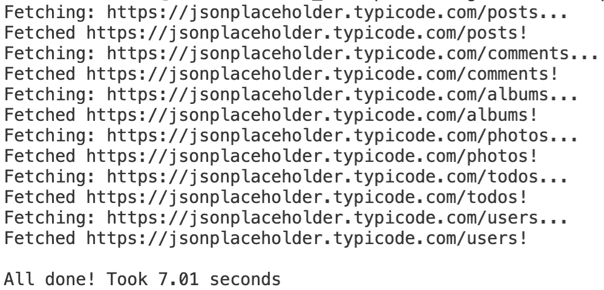
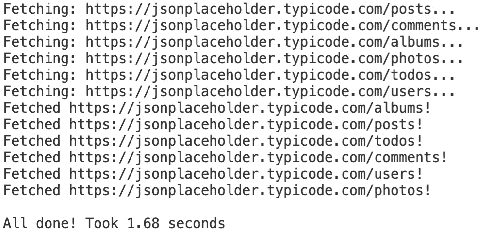

# Python 并行性:几分钟内加速 Python 代码的基本指南

> 原文：<https://towardsdatascience.com/python-parallelism-essential-guide-to-speeding-up-your-python-code-in-minutes-5ec71cbd88e1?source=collection_archive---------18----------------------->

## Python 多重处理基本指南。

照片由 [Wexor Tmg](https://unsplash.com/@wexor?utm_source=unsplash&utm_medium=referral&utm_content=creditCopyText) 在 [Unsplash](https://unsplash.com/?utm_source=unsplash&utm_medium=referral&utm_content=creditCopyText) 拍摄

按顺序执行任务可能不是一个好主意。如果第二个任务的输入不是第一个任务的输出，那么你就在浪费时间和 CPU。

你可能知道，Python 的 [*全局解释器锁*](https://docs.python.org/3/glossary.html#term-global-interpreter-lock) (GIL)机制一次只允许一个线程执行 Python 字节码。这是一个严重的限制，可以通过更改 Python 解释器或实现基于进程的并行技术来避免。

今天，您将学习如何使用 Python 和`concurrent.futures`库并行执行任务。您将通过一个实际例子理解这个概念——从多个 API 端点获取数据。

这篇文章的结构如下:

*   问题描述
*   测试:按顺序运行任务
*   测试:并行运行任务
*   结论

你可以在这里下载这篇文章的源代码。

# 问题描述

目标是连接到[jsonplaceholder.typicode.com](https://jsonplaceholder.typicode.com/)——一个免费的假 REST API。

您将连接到几个端点并获取 JSON 格式的数据。总共会有六个端点。不是很多，Python 很可能在一秒钟左右完成任务。对于演示多处理能力来说不太好，所以我们将增加一些趣味。

除了获取 API 数据，程序还会在发出请求之间休眠一秒钟。由于有六个端点，程序应该在六秒钟内什么都不做——但是只有当调用按顺序执行时。

我们先测试一下没有并行的执行时间。

# 测试:按顺序运行任务

让我们看一下整个脚本，并对其进行分解:

在`URLS`变量中存储了一个 API 端点列表。你将从那里获取数据。在它下面，你会发现`fetch_single()`功能。它向一个特定的 URL 发出 GET 请求，然后休眠一秒钟。当获取开始和完成时，它也打印。

该脚本记下开始和结束时间，并将它们相减以获得总执行时间。在来自`URLS`变量的每个 URL 上调用`fetch_single()`函数。

运行该脚本后，您将在控制台中获得以下输出:

图 1-没有多重处理脚本输出(作者提供的图片)

简而言之，这就是顺序执行。这个脚本在我的机器上花了大约 7 秒钟完成。你可能会得到几乎相同的结果。

接下来让我们看看如何使用并行性来减少执行时间。

# 测试:并行运行任务

让我们看一下脚本，看看有什么变化:

`concurrent.futures`库用于实现基于进程的并行性。`URLS`和`fetch_single()`都是一样的，所以没有必要再重复一遍。

下面才是有趣的地方。你必须使用`ProcessPoolExecutor`类。根据文档，它是一个使用进程池异步执行调用的类[1]。

这里的`with`语句是为了确保在任务完成后所有的东西都被清理干净。

可以使用`submit()`函数来传递想要并行执行的任务。第一个参数是函数名(确保不要调用它)，第二个参数是 URL 参数。

运行该脚本后，您将在控制台中获得以下输出:

图 2 —多重处理脚本输出(图片由作者提供)

执行时间仅用了 1.68 秒，比之前有了显著的提高。这是任务并行运行的具体证明，因为顺序执行无法在 6 秒内完成(睡眠调用)。

# 结论

这就是关于 Python 基于流程的并行性的最基本指南。还有其他基于并发性的方法来加速您的脚本，这些将在下面的文章中介绍。

如果你想看更多高级并行教程，请告诉我。这些将涵盖数据科学和机器学习中的真实用例。

感谢阅读。

*喜欢这篇文章吗？成为* [*中等会员*](https://medium.com/@radecicdario/membership) *继续无限制学习。如果你使用下面的链接，我会收到你的一部分会员费，不需要你额外付费。*

<https://medium.com/@radecicdario/membership>  

## 了解更多信息

*   [每个数据科学家必读的 3 本编程书籍](/3-programming-books-every-data-scientist-must-read-db1d3a1a284c)
*   [如何让 Python 静态类型化——基本指南](/how-to-make-python-statically-typed-the-essential-guide-e087cf4fa400)
*   [用 Python 进行面向对象编程——你需要知道的一切](/object-orientated-programming-with-python-everything-you-need-to-know-cb0ada963756)
*   [Python 字典:你需要知道的一切](/python-dictionaries-everything-you-need-to-know-9c2159e5ea8a)
*   [介绍 f 字符串 Python 中字符串格式化的最佳选项](/introducing-f-strings-the-best-option-for-string-formatting-in-python-b52975b47b84)

# 参考

[1][https://docs.python.org/3/library/concurrent.futures.html](https://docs.python.org/3/library/concurrent.futures.html)

*原载于 2021 年 1 月 16 日 https://betterdatascience.com*<https://betterdatascience.com/python-concurrency/>**。**