# Python 支持的蒙特卡罗模拟

> 原文：<https://towardsdatascience.com/python-powered-monte-carlo-simulations-fc3c71b5b83f?source=collection_archive---------6----------------------->

## 用 SciPy 的概率分布进行情景分析

蒙特卡洛，[图片](https://pixabay.com/photos/architecture-fly-big-city-boats-5072768/)由[卢卡·阮](https://pixabay.com/users/16018388-16018388/?utm_source=link-attribution&utm_medium=referral&utm_campaign=image&utm_content=5072768)来自[皮克斯拜](https://pixabay.com/?utm_source=link-attribution&utm_medium=referral&utm_campaign=image&utm_content=5072768)，免费用于商业用途

本教程将演示如何在 Python 中建立蒙特卡罗模拟模型。我们将:

*   使用 SciPy 的内置分布，具体来说:正态、贝塔、威布尔；
*   为 beta-PERT 分布添加新的分布子类；
*   用拉丁超立方体抽样抽取随机数；
*   并建立三个蒙特卡罗仿真模型。

# 0.属国

除了我们的全天候包 pandas 和 numpy 之外，该脚本还导入了 SciPy 的 *stats* 库。

# 蒙特卡罗模拟的概念

[图片](https://pixabay.com/photos/game-bank-casino-monte-carlo-monaco-188882/)由[汉斯·布拉克斯米尔](https://pixabay.com/users/hans-2/?utm_source=link-attribution&utm_medium=referral&utm_campaign=image&utm_content=188882)从[皮克斯拜](https://pixabay.com/?utm_source=link-attribution&utm_medium=referral&utm_campaign=image&utm_content=188882)获得，免费用于商业用途

**蒙特卡罗(MC)方法**是一种模拟技术，为模型的*输出*变量构建概率分布，其中一些*输入*参数是随机变量。MC 方法有时被称为*多概率模拟*技术，因为它整合了多个随机变量，而这些变量的综合效应很难用封闭形式的方程来描述。

20 世纪 40 年代末，约翰·冯·诺依曼和斯坦尼斯劳·乌姆在洛斯阿拉莫斯实验室工作时发明了 MC 方法。当他们试图应用确定性方法计算中子碰撞时，他们走进了死胡同。乌姆的想法是使用随机抽样，由早期的“超级计算机”ENIAC 支持，以获得近似解。政府保密条例规定了一个代号；冯·诺伊曼和乌姆的一位同事建议把这个地方命名为*蒙特卡洛*，乌姆的叔叔在二战前经常去那里的赌场:他“只是必须去蒙特卡洛”赌博。( [U](https://en.wikipedia.org/wiki/Stanislaw_Ulam) 日[上午)](https://en.wikipedia.org/wiki/Stanislaw_Ulam)

MC 模拟问题的一个例子:一个企业想要模拟一个新产品的未来成功，并建立如下的模拟模型:

*   预期销售量，v，作为一个随机变量，遵循 beta-PERT 分布，从 3 点估计值得出；
*   产品的价格 p 将通过谈判确定——一些客户可能会要求批量折扣或提前付款折扣；计划者决定将公司将实现的平均价格的不确定性建模为平均值为 20、标准差为 2 的正态随机变量；
*   产品的原材料成本 m 将受到即将到来的供应商价格上涨的影响，由另一个正态分布来估计；
*   该模型应该提供多种结果:收入，利润，总成本。

一般来说，模拟模型采用被定义为随机变量的输入参数；然后，它返回每个输出变量的概率分布，每个变量都是其输入参数的函数。该函数可以是简单的和或积、输入的指数运算，或者——我们将在示例中看到——包含嵌套随机变量的高阶函数。目标变量将显示一个密度函数，描述输入变量的分布如何相互作用。

仿真模型通过从输入分布中采样来导出输出分布。1，000 或 100，000 次迭代提供了描述每个输入变量行为的数据点。输出变量的等式将这些输入转换为输出变量的尽可能多的样本。一旦我们获得了这个样本，我们就可以像任何内置的 SciPy 分布一样检查它的模式——它的平均值、分位数和离群值倾向。

# 2.拉丁超立方体采样

NumPy 的 *random* 库提供了用统一随机数填充数组的方法。SciPy 的每个分发对象都带有生成随机变量的 *rvs()* 方法。然而，蒙特卡罗模拟需要大量的随机数，对于这种情况，*分层抽样*方法，如**拉丁超立方体抽样(LHS)** 是更好的方法。

LHS 将样本空间分成不重叠的单元，每个单元具有相等的概率。LHS 确保从样本空间的完整范围内更均匀地抽取随机数。它防止采样随机数的*聚集*，这会扭曲频率曲线。LHS 样本将导致更精确的模拟结果。这将导致更低的标准误差，更少的迭代。

出于演示的目的，我们使用 SciPy 的 LatinHyperCube 采样器创建了一个由 10 个随机数组成的小数组。

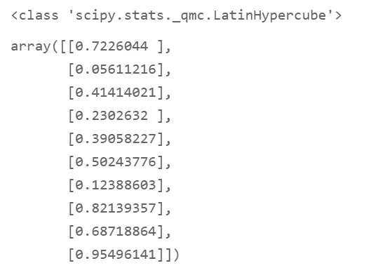

制服(0；1)随机数在生成之后，可以被重新缩放以填充更大的范围，例如在 0 和 100 之间。然而，对于我们的目的，0 到 1 之间的标准随机数满足要求。

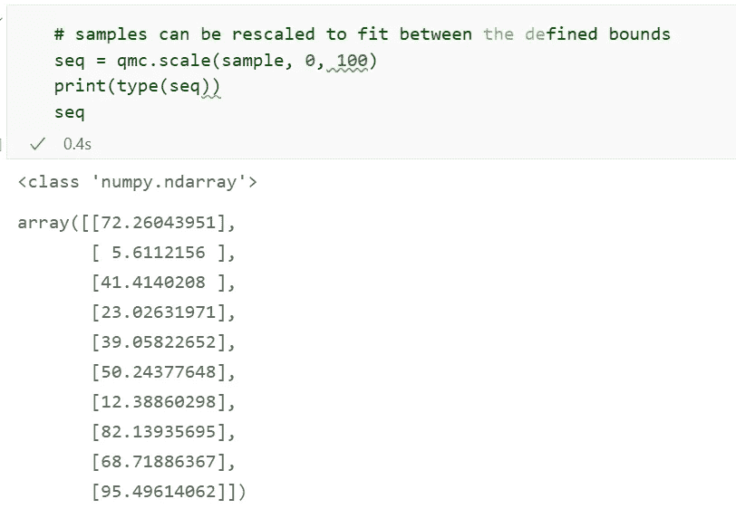

在下一章中，我们将使用 LHS 样本来生成特定分布的随机变量:PERT、正态和威布尔函数。

# 3.模拟中模拟不确定性的概率分布

## 3.1 用于专家评估建模的 PERT 分布

我的上一篇文章“用 beta-PERT 分布对专家评估建模”是一篇教程，解释了 **PERT 分布** ( [Python 场景分析:用 beta-PERT 分布对专家评估建模|走向数据科学](/python-scenario-analysis-modeling-expert-estimates-with-the-beta-pert-distribution-22a5e90cfa79))。

如果一个领域、过程或行业专家可以为一个随机过程提供所谓的*三点估计*([三点估计](https://en.wikipedia.org/wiki/Three-point_estimation)),包括最坏情况、可能情况和最好情况的结果，那么 pert 函数就可以将这些点连接起来，这是非常确切的。它会将这些点转化为概率分布，我们可以将它分配给模拟模型中的随机变量。

SciPy 的 123 个分布目录不包含 PERT 函数。因此，我们将其创建为继承自 SciPy 的 *rv_continuous* 父类的新子类。

对于我们的例子，我们用四个参数来实例化 PERT 子类，这四个参数预测新产品的销售量。

我们选择这个 PERT 分布来模拟预期的销售数量，最有可能的值是 12，000 个单位，最小为 8，000 个单位，最大为 18，000 个单位。

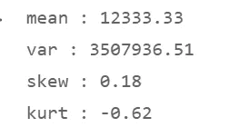

其平均预期值将为 12，333 个销售单位。它有一个小的正偏度，仍然类似于正态分布；和-0.62 的中度负过度峰度，这使其成为一个宽峰或大体积分布，其尾部的异常值比正态分布少。

第 3 行抽取 N=10，000 个均匀随机变量的 LHS 样本。然后第 4 行将该数组作为其输入参数。*百分点* *函数 ppf()* 将 10，000 个标准统一数字解释为概率，并计算 10，000 个 PERT 分位数，用这些分位数填充数组 randP。

直方图显示了模拟的 PERT 分布的形状。

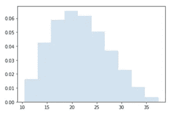

## 3.2 正态分布

我们应用相同的方法(减去创建新的分布子类的需要)从正态分布中抽取 10，000 个 LHS 样本，我们期望这些样本反映销售价格和原材料单位成本中固有的不确定性。平均售价将为€ 20，标准差为€ 2。

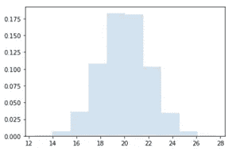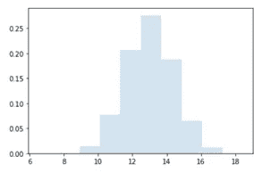

第二个正态分布模拟原材料单位成本，平均值为€ 13，标准偏差为€ 1.40。

## 3.3 模拟 1-模拟随机变量的总和与乘积

我们创建了三个随机变量，代表三个因素的不确定性，这三个因素将决定新产品产生利润的机会或损失的风险:

*   体积 v 的 1x PERT
*   2x 正常——对于销售价格 p 和原材料单位成本 m；

我们假设其他成本，那些与供应商价格无关的成本，可以通过一个确定性变量 o 来反映。

为了计算模拟模型的目标变量——产品的毛利 GP，我们将随机变量联系在一起，如下所示:

*   v =数量，p =价格，m =原材料单位成本，o =其他单位成本
*   GP = v * (p — m — o)

作为第二个产出变量，我们可以模拟与 GP 平行的收入 R。一般来说，一旦我们定义了输入随机变量，我们就可以用任意多的输出变量建立模拟模型。每个输出变量都可以由一个或多个输入随机变量组合而成，并由它自己的 10，000 个变量的数组来描述。

*   R = v * p

这就建立了我们简单的模拟模型。

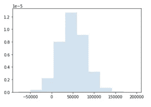

为了查看返回毛利随机变量 GP 的分布的数组的属性，我们编写了一个函数 *dist_properties()* ，该函数将读取数组并返回其矩和选定的分位数。

对于偏度和峰度，我们使用 SciPy 的 *skew()* 和峰度 *()* 函数，其结果需要借助 numpy 的 *asscalar()* 转换方法从数组转换成平面数。我们在字典 *dict_moments* 中收集它们的值，并在其中添加度量的名称。第 14 行中的 list comprehension 逐行打印字典的内容。

然后我们计算第 17ff 行中的分位数，将它们收集到另一个字典中， *dict_quantiles* ，并使用第 27 行中的 list comprehension 将其打印出来。

我们合并两个字典，矩和分位数，形成一个综合字典， *dict_metrics* 。

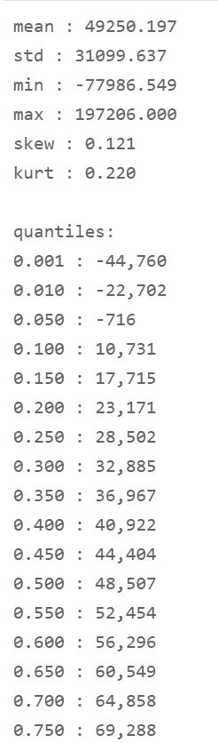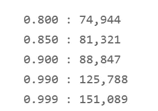

平均利润将达到€ 49，250，接近中位数。

偏度和峰度都相当适中，这意味着与正态分布相比，有适度的离群值倾向。

如果销售价格和原材料单位成本同时趋向于最坏的结果，列表中的分位数揭示了新产品将产生损失的 5%的风险。利润将以 90%的概率超过€ 10，731(10%的分位数)。

在下一章中，我们将更进一步，建立一个高阶仿真模型。虽然第一个模型仅从随机变量的和与积中组装输出变量，但我们现在将开发一个包括*嵌套*随机变量的模拟模型。

## 3.5 模拟 2 —嵌套分布

如果你读过我以前的文章([概率分布介绍和用 Python 的 SciPy](/probability-distributions-with-pythons-scipy-3da89bf60565) 拟合分布)，你会记得我们已经应用了威布尔分布来解决**故障前时间**或**部件寿命**问题。一个部件的寿命通常可以由一个**威布尔**分布来模拟，其形状反映了*故障率*和一个设定所谓的*特征寿命*的比例参数。

第一艘前往火星的宇宙飞船将配备电子电路板，其典型寿命可能为 5 万个工作小时。为了估计船舶设计中需要的冗余度，我们将模拟多少小时后所有电路的哪一部分会烧坏。

让我们假设，非常符合现实，威布尔分布的两个参数——形状和特征寿命——是不确定的。因此，我们将这些分布参数估计为它们自己的随机变量。威布尔形状及其标度可以在由它们的分布模式设定的边界内波动。

*   对于形状参数，工程团队估计它应该正态分布在平均值 1.5 左右，标准偏差为 0.1。
*   对于特征寿命，我们采用工程团队在 45，000、50，000 和 60，000 小时运行时提供的最大、可能和最小值的三点估算值。然后我们推导出一个 PERT 分布来反映不确定性的范围。

两个辅助函数通过拉丁超立方体采样抽取 10，000 个随机变量。

*   *wei_shp()* 返回正态分布的形状参数。
*   *wei_charlife()* 返回特征寿命的 PERT 变量数组。
*   我们将 Weibull 位置参数(也称为等待时间)设置为 0，这意味着产品故障会在生产完成和质量测试开始后立即出现。

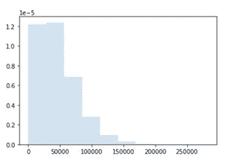

在第 7 行中，我们将随机变量组合成一个威布尔输出变量，表示故障前的时间。威布尔函数调用辅助函数来获取其形状和比例参数。目标变量 *rand_CL* 将保存一个由 10，000 个模拟输出组成的数组，这些输出以小时为单位表示组件的寿命。

有三种嵌套分布的结果:PERT 和正态随机变量充当威布尔分布的参数。我们可以将结果标记为灵活的或随机的威布尔分布，而不是参数为点值的固定分布。

对于如何查看结果的属性，我们可以在两个选项之间进行选择:

*   将它作为一个数组进行分析，就像我们对之前的模拟结果所做的那样
*   应用 SciPy 的 *rv_histogram 类*，它将输出数组打包成一个直方图，并将其转换成一个“真实的”SciPy 概率分布，为此我们可以调用像 pdf 和 ppf 这样的分布函数。

让我们来看看直方图类。

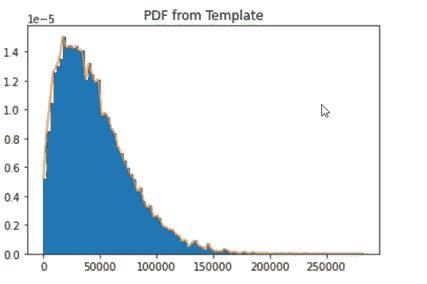

图表用蓝色显示了我们在数组 rand_CL 中模拟的装箱寿命。在 orange 中，它绘制了概率密度函数，这个函数是由 *rv_histogram* 类从数组中得到的。

函数 *histdist_properties()* 计算 *histdist* 概率分布的属性。这个函数在某些方面与我们之前写的函数*distribution _ properties()*不同。 *rv_histogram* 类并不是在所有情况下都提供相同的分布属性。例如，最小值和最大值必须从。*支持()*方法。

我们调用 *histdist_properties()* 函数并获得列表度量。数据帧不仅包含累积分布函数和分位数，还包含一列随机变量。采样功能*。rvs()* 使我们能够从我们的输出分布中抽取一些随机数——或者如果需要的话抽取几千个，尽管没有 LHS 方法的分层抽样。

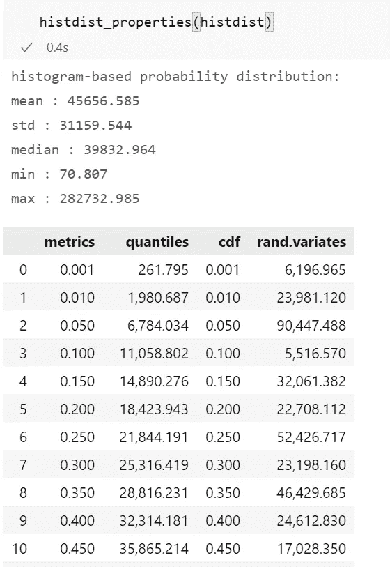

上面，我们分析了 *rv_histogram* 从数组中导出的连续*分布*。如图所示，分布曲线与阵列数据并不完全相同。

下面，我们对 10，000 个输出数字的原始数组调用函数 *dist_properties()* ，并解释矩和分位数。

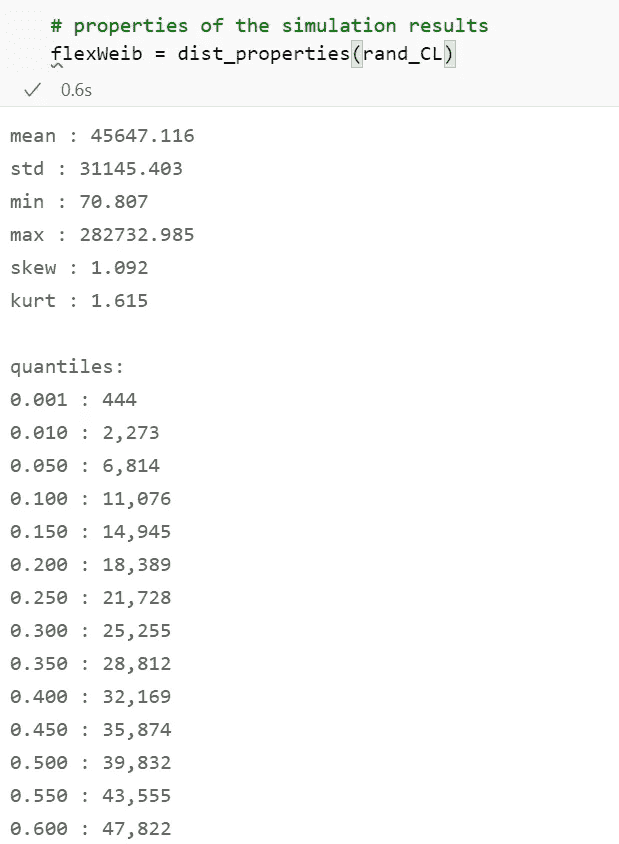

*   部件的平均寿命将达到 45，647 小时；
*   寿命将是右偏的，自然地，异常值将持续超过 100，000 小时；
*   峰度是独特的——分布是薄峰的，其尾部有长期存活成分的倾向；
*   11，076 小时后，10%的部件将会烧坏。

任务控制中心告诉我们 11，000 小时的操作将标志着关键的阈值。在完成这些使用时间后，电路将不再是关键任务。分位数意味着，就电路板而言，飞船在设计时应该考虑到至少 10%的冗余度:增加备用电路板，这些电路板将自动打开，作为那些开始出现故障的电路板的替代品。

所以我们的太空船几乎准备好发射了。

[图片](https://pixabay.com/photos/steel-mill-factory-hall-production-4646843/)作者[彼得 H](https://pixabay.com/users/tama66-1032521/?utm_source=link-attribution&utm_medium=referral&utm_campaign=image&utm_content=4646843) 来自[皮克斯贝](https://pixabay.com/?utm_source=link-attribution&utm_medium=referral&utm_campaign=image&utm_content=4646843)，免费用于商业用途

## 3.6 模型 3:固定参数模拟

作为最后一项练习，让我们检查威布尔模型对其形状和特征寿命的不确定性有多敏感。

我们将使用“固定形式”的威布尔分布进行蒙特卡罗模拟。

*   形状参数将固定为平均值 1.5；
*   特征寿命:PERT 分布的平均值:50，500 小时。

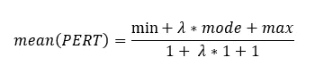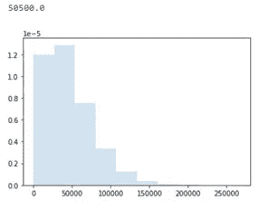

我们再次调用 *dist_properties()* 函数，并将其指标插入到数据帧中，这样我们就可以并排比较固定威布尔和之前嵌套的“灵活”威布尔。

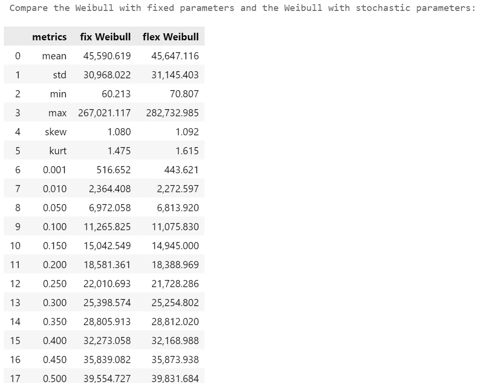

正如预期的那样，我们看到固定威布尔变量的标准偏差较低，这是在形状和比例参数没有不确定性的情况下产生的。但是差别很小。显然，柔性威布尔模型的形状和尺度参数的不确定性非常接近于我们在固定威布尔模型中使用的平均值。较低的偏度和峰度显示出异常值和不对称性的倾向有所降低。

参数具有不同值或不同分布的模拟可能会显示由增加的不确定性引起的较大差异。

# 4.结论

今天的教程到此结束。

我们浏览了三个蒙特卡罗模拟的例子，它们是用 SciPy 库提供的工具箱创建的。

*   第一个模型——利润模拟——展示了随机变量的简单求和与乘积。
*   第二个模拟——威布尔失效时间——解释了嵌套随机变量的概念，即概率分布的参数本身就是随机变量。
*   第三次模拟大胆假设分布的参数是精确已知的。如果我们在模拟模型中忽略不确定性的来源，我们可能会低估可能结果的传播，除非不确定性浓缩为参数的平均值。

Jupyter 笔记本可以从 GitHub 下载:[h3ik0th/montecallosim:用 SciPy(github.com)进行蒙特卡洛模拟](https://github.com/h3ik0th/MonteCarloSim)

*   蒙特卡洛，图片由[卢卡·阮](https://pixabay.com/users/16018388-16018388/?utm_source=link-attribution&utm_medium=referral&utm_campaign=image&utm_content=5072768)来自[皮克斯拜](https://pixabay.com/?utm_source=link-attribution&utm_medium=referral&utm_campaign=image&utm_content=5072768)，免费用于商业用途
*   蒙特卡洛赌场，图片由来自 [Pixabay](https://pixabay.com/?utm_source=link-attribution&utm_medium=referral&utm_campaign=image&utm_content=188882) 的 [Hans Braxmeier](https://pixabay.com/users/hans-2/?utm_source=link-attribution&utm_medium=referral&utm_campaign=image&utm_content=188882) 提供，免费用于商业用途
*   由[彼得·H](https://pixabay.com/users/tama66-1032521/?utm_source=link-attribution&utm_medium=referral&utm_campaign=image&utm_content=4646843)从[皮克斯拜](https://pixabay.com/?utm_source=link-attribution&utm_medium=referral&utm_campaign=image&utm_content=4646843)工厂，免费用于商业用途
*   所有其他图片:作者