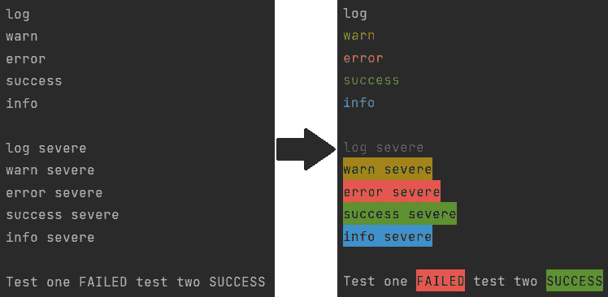
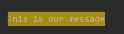
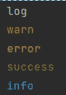
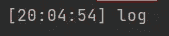
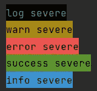
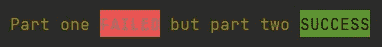

# Python 轻松打印彩色文本

> 原文：<https://towardsdatascience.com/python-printing-colorful-outputs-with-ease-b4e2a183db7c?source=collection_archive---------14----------------------->

## 如何在 Python 中使用 Console.log、console.warn 和 console.error



让我们用一些颜色来增加那些无聊的控制台输出的趣味吧！(图片由作者提供)

上图两张截图哪个更好看？我肯定会选择正确的！这些颜色会立即将你的注意力吸引到重要的事情上，并给你额外的信息，让你一目了然。

本文涉及两个主题:首先，我们将了解如何在终端上打印颜色

*   终端中打印颜色的工作原理
*   py-控制台；一个 Python 包，允许您轻松打印彩色输出

在这篇文章的结尾，你将能够打印彩色输出，那么我们还在等什么呢？我们来编码吧！

# 1.了解打印

首先，我们将检查终端需要什么来打印彩色文本。这将向您展示如何在最底层打印彩色文本。在接下来的部分中，我们将用更容易使用的方法来代替这种方法。

在 Python 中执行`print`功能时，文本出现在 [**终端**](https://mikehuls.medium.com/terminals-consoles-command-line-for-absolute-beginners-de7853c7f5e8) 中。我们的目标是给这个值添加一些数据，以便我们的终端知道在显示文本时添加一些颜色。这些额外数据是`ANSI escape character sequences`，用于控制光标位置、颜色和字体样式，例如在终端中。终端将这些序列解释为命令，而不是仅仅显示的文本。

在下面的例子中，我们使用 Python 告诉终端打印文本“这是我们的消息”，文本为白色，背景为黄色:

```
print('\x1b[0;39;43m' + 'This is our message' + '\x1b[0m')
```



我们控制台中的输出(图片由作者提供)

ANSI 代码的第一段(`\x1b[0;39;43m`)是终端根据指定参数给所有后续文本着色的命令。我们可以在`0;39;43`部分用整数指定样式、文本颜色和背景颜色。结尾的第二段 ANSI 代码(`\x1b[0m`)告诉终端重新设置颜色选项，这样以后的文本就不再是白色和黄色了。

这种方法的问题是，这种方法在每个平台上都不统一；ANSI 代码可以在 Unix 和 MAC 上运行，但在 Windows 上不受支持。我们也不想打出这些具体的、难以理解的代码。让我们找到一种更简单的跨平台方法！

# 2.py-控制台；用 Python 轻松打印颜色

[**Py-console**](https://pypi.org/project/py-console/)**是我创建的一个软件包，它使打印颜色变得超级简单。它模仿 JavaScripts 众所周知的方法，如`console.log`、`console.warn`、`console.error`等。它还增加了一些更多的功能。**

> **想创建自己的 Python 包吗？→查看 [**本文**](https://mikehuls.medium.com/create-and-publish-your-own-python-package-ea45bee41cdc) 获取说明。也可以查看 [**这篇文章**](https://mikehuls.medium.com/create-your-custom-python-package-that-you-can-pip-install-from-your-git-repository-f90465867893) 来创建你自己的**私有**包)**

## **装置**

**首先我们将安装 py-console:**

```
pip install py-console
```

## **记录、警告、错误、成功、信息**

**安装后，我们可以简单地调用 5 个函数之一，以指定的颜色打印文本:**

```
from py_console import consoleconsole.log("log")
console.warn("warn")
console.error("error")
console.success("success")
console.info("info")
```

**这会产生:**

****

**py-console 简单功能的输出(图片由作者提供)**

## **切换时间和设置时间戳**

**我们还可以通过为控制台或 per 方法指定时间戳来为输出添加时间戳:**

```
console.setShowTimeDefault(True)
or
console.log('log', showTime=True)
```

**这将在您要打印的字符串前添加时间:**

****

**带时间戳的日志记录(图片由作者提供)**

**此外，您还可以设置时间格式。点击查看关于此**的更多信息。下面的示例将时间格式设置为包括年、月和日。****

```
console.setTimeFormat('%y-%m-%d %H:%M:%s')
```

## **更严重的警告**

**在方法中，我们可以指定一个“severe”标志，以便我们有更清晰的输出，反转文本颜色和背景颜色:**

```
from py_console import consoleconsole.log("log", severe=True)
console.warn("warn", severe=True)
console.error("error, severe=True")
console.success("success, severe=True")
console.info("info, severe=True")
```

**这将产生以下输出:**

****

**这些消息有点严重(图片由作者提供)**

## **突出**

**最后，我们还可以突出显示字符串的某些部分。看看这个我们使用 console.warn 函数的例子:**

****

**在同一个控制台中使用不同的文本颜色和背景颜色**

# **结论**

**在本文中，我们主要讨论了终端如何打印彩色文本来更清晰地显示重要信息。然后我们看了一下**的 py-console** 以及它如何让彩色输出变得非常容易。**

**我希望我已经阐明了如何指示终端打印颜色，并且我希望我已经为您留下了一个创建漂亮的控制台输出的不错的包。如果你有建议/澄清，请评论，以便我可以改进这篇文章。**

**同时，请查看我的其他关于各种编程相关主题的文章:**

*   **[用 FastAPI 用 5 行代码创建一个快速自动记录、可维护且易于使用的 Python API](https://mikehuls.medium.com/create-a-fast-auto-documented-maintainable-and-easy-to-use-python-api-in-5-lines-of-code-with-4e574c00f70e)**
*   **[从 Python 到 SQL——安全、轻松、快速地升级](https://mikehuls.medium.com/python-to-sql-upsert-safely-easily-and-fast-17a854d4ec5a)**
*   **[创建并发布你自己的 Python 包](https://mikehuls.medium.com/create-and-publish-your-own-python-package-ea45bee41cdc)**
*   **[创建您的定制私有 Python 包，您可以从您的 Git 库 PIP 安装该包](https://mikehuls.medium.com/create-your-custom-python-package-that-you-can-pip-install-from-your-git-repository-f90465867893)**
*   **[面向绝对初学者的虚拟环境——什么是虚拟环境以及如何创建虚拟环境(+示例)](https://mikehuls.medium.com/virtual-environments-for-absolute-beginners-what-is-it-and-how-to-create-one-examples-a48da8982d4b)**
*   **[通过简单升级，显著提高数据库插入速度](https://mikehuls.medium.com/dramatically-improve-your-database-inserts-with-a-simple-upgrade-6dfa672f1424)**
*   **在这里阅读更多关于[**py-console**](https://github.com/mike-huls/py-console)**和更多关于 [**colorama 这里**](https://github.com/tartley/colorama) 。****

****编码快乐！****

****—迈克****

****页（page 的缩写）学生:比如我正在做的事情？跟我来！****