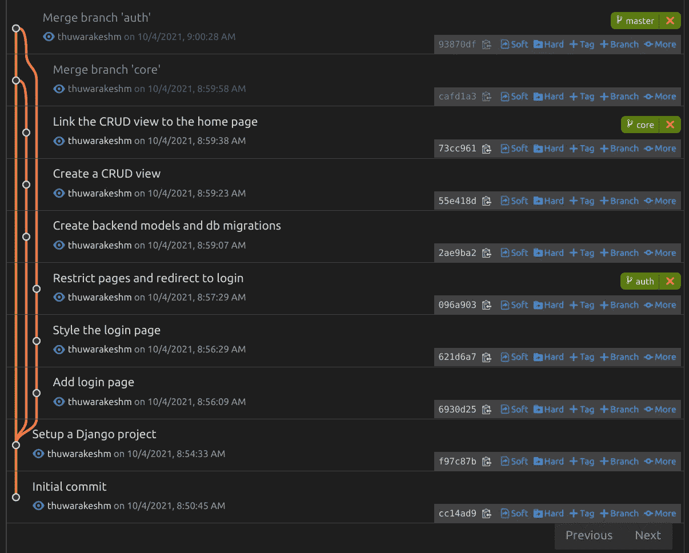

# 让您的 Python 项目结构更优雅的 7 种方法

> 原文：<https://towardsdatascience.com/python-project-structure-best-practices-d9d0b174ad5d?source=collection_archive---------23----------------------->

## 以下是易于管理、可伸缩且易于理解的 python 项目结构的最佳实践


完美 Python 项目结构的蓝图。——照片由来自 [Pexels](https://www.pexels.com/photo/silver-imac-displaying-collage-photos-1779487/?utm_content=attributionCopyText&utm_medium=referral&utm_source=pexels) 的[设计生态学家](https://www.pexels.com/@designecologist?utm_content=attributionCopyText&utm_medium=referral&utm_source=pexels)拍摄

伟大的项目从一个单一的文件脚本开始，并演变成一个社区维护的框架。但是很少有项目能达到这个水平。大多数，不管它们对其他人是否有用，最终都不会被任何人使用。

> *让你的项目对其他人来说方便(或者痛苦)的关键因素是它的结构。*

什么是运行良好的完美 Python 项目结构？

*   伟大的项目总是[](#5269)****。**使用 git(或 mercurial。)**
*   **他们应该有一个 [**依赖管理**](#a8be) 系统。Virtualenv(或康达)不是一个。**
*   **他们有自动化的 [**干净的代码实践**](#d781) 。让丑陋的编码对你的团队成员来说是不可能的。**
*   **伟大的项目总会有一个 [**自述**](#3507) 并给出更多的脉络。**
*   **应该有一个 [**配置文件**](#82ea) (一个 YAML 或者一个 TOML 文件)。将软件参数与硬编码分开。**
*   **秘密应该在一个[的环境里(。env)文件。你不想让世界知道你的秘密。](#b87b)**
*   **他们应该有整洁的 [**文档**](#66ff) (可选。)**

**本文将介绍所有这些，并设置您的 python 项目以获得最大的可维护性。如果这看起来很难，你可以直接使用我为你创建的 [***蓝图***](#cc7b) 。**

# **让每个项目都成为 git 仓库。**

**您可以通过一行命令将项目变成 git 存储库。做这个不会花一分钟。**

```
git init
```

**但是我们不常这样做。在大多数情况下，我们倾向于认为我们为一个简单的问题写了一个简单的脚本。没关系。**

**对你来说简单的对别人来说就复杂了。地球另一端的某人正在解决一个问题，您的简单脚本就是解决方案。**

**此外，你的简单问题可能会吸收其他简单问题，并变得可怕。**

**随着它的增长，维护您的代码变得越来越困难。你不知道你做了什么改变，为什么要做这些改变。如果你是一个团队，那么接下来的问题是谁和什么时候做了这些改变。**

**突然，你开始担心你最初写的剧本，而不是为它感到自豪。**

> **开始每一行代码，就好像它是下一个脸书的开始。你需要一个版本控制系统来做这件事。**

**作为第一步，让您的项目成为一个 git 存储库，并包含一个. gitignore 文件。你可以使用在线工具 [gitignore.io](https://www.toptal.com/developers/gitignore) 生成一个忽略文件。**

```
.
├── .git
│   ├── <Git managed files>
│  
├── .gitignore
```

**随着您的进展，请确保使用说明性消息提交您的更改。提交是不同时间的检查点。它们确实是你的软件的版本，你可以在任何时候检验。**

## **如何写好提交消息？**

**一个好的提交消息应该完成句子，“如果应用，这个提交将……”它们应该是句子的大小写，但是没有尾随的句号。提交消息的最佳长度约为 50 个字符。**

**以下是使用 git CLI 的提交消息示例。**

```
git commit -am 'Print a hello world message'
```

**你也可以创建更多的细节。您可以在没有提交消息的情况下运行`git commit`。**

**此操作将打开一个编辑器，您可以在其中添加多行提交消息。然而，使用上述约定来创建提交消息的标题。您可以使用空行来分隔邮件的标题和正文。**

```
Print a hello <user> message

Print a hello world message and a hello <user> message

The main function was hardcoded with 'hello world' message.
But we need a dynamic message that takes the an argument and greet.

Amend the main function to take an argument and string formating to
print hello <user> message
```

**这些[提交消息约定](https://chris.beams.io/posts/git-commit/)将使浏览 git 日志中您所做的所有更改变得容易。**

****

**用干净的提交消息清理 git 历史——来自[作者的博客](https://www.the-analytics.club)**

# **使用依赖管理工具。**

**大多数开发人员，尤其是新开发人员，没有对项目依赖给予足够的重视。首先什么是依赖管理？**

**您开发的软件可能依赖于其他开发人员创建的包。反过来，它们可能依赖于几个不同的包。这种模块化的方法有助于快速创建软件产品，而不需要一直重新发明轮子。**

**即使在同一个项目中，依赖关系在不同的环境中也会有所不同。您的开发团队可能有一组不属于生产系统的依赖项。**

**一个健全的依赖关系管理系统应该能够区分这些集合。**

**Python 开发人员使用虚拟(或 conda)环境来安装项目依赖项。但是 Virtualenv 不是一个依赖管理工具。它没有上面讨论的好处。这只会有助于将项目环境与您的系统隔离开来。**

**对于 Python 项目来说，诗歌是一个完美的依赖管理工具。它允许你，**

*   **分离开发和生产依赖关系；**
*   **分别为每个项目设置 Python 版本；**
*   **创建软件的入口点；**
*   **帮助您将其打包并发布到诸如 PyPI 之类的存储库中。**

**诗歌不是虚拟的替代品。它使用方便的实用程序命令创建和管理虚拟 env。**

**如果你喜欢这个想法，我发表了一篇关于如何使用诗歌有效管理项目依赖的完整教程。**

# **在您的 Python 项目中自动化干净的代码实践。**

**Python 是最简单的编程语言。它接近自然语言，但在应用上却很强大。**

**但这并不意味着你的代码总是可读的。您可能最终会写出太长的代码，并且其风格对于其他人来说太难理解了。为了解决这个问题，Python 引入了一个叫做 [PEP 8](https://www.python.org/dev/peps/pep-0008/) 的通用标准。**

**PEP 8 是 python 程序员简洁一致地编码的一套指南。它讲述了，**

*   **Python 类、函数和变量的命名约定；**
*   **正确使用空白；**
*   **代码布局，如最佳线路长度，以及；**
*   **关于评论的约定；**

**尽管这一准则为 Python 程序员解决了一个大问题，但在大型项目中手动维护这一点很有挑战性。**

**幸运的是，像 [black](https://black.readthedocs.io/en/stable/) 和 [autopep8](https://github.com/peter-evans/autopep8) 这样的软件包可以很容易地通过一行命令来完成。这一行格式化了 blueprint 文件夹中的每个文件。**

```
black blueprint
```

**Autoflake 是另一个帮助你去除脚本中无用变量的工具。我们声明但不使用的变量给阅读代码带来了不便。下面一行很神奇。**

```
autoflake --in-place --remove-unused-variables blueprint/main.py
```

**最后，我想提一下 [isort](https://github.com/PyCQA/isort) ，这是一个优化导入的 Python 包。**

```
isort blueprint/main.py
```

**所有这些包在一行中清理你的代码。但是，即使这样，每次修改脚本时运行它也比我们想象的更有挑战性。**

**这就是为什么我更喜欢 Git 预提交钩子。**

**使用预提交挂钩，您可以配置为在每次提交更改时运行 black、autoflake 和 isort 来格式化您的代码库。**

**如何配置预提交钩子自动格式化 Python 代码？**

**您可以使用 poems add 或 pip 安装预提交包。您的项目根目录中应该有一个`.pre-commit-config.yaml`文件。您可以配置在每次提交之前运行哪些钩子。然后，您必须将预提交安装到 git 存储库中。可以通过从项目根目录运行预提交安装命令来实现。**

```
poetry add pre-commit
# Create the .pre-commit-config.yaml file
poetry run pre-commit install
```

**下面是您的`.pre-commit-config.yaml`文件应该是什么样子。**

```
repos:
  - repo: local
    hooks:
      - id: autoflake
        name: Remove unused variables and imports
        entry: bash -c 'autoflake "$@"; git add -u' --
        language: python
        args:
          [
            "--in-place",
            "--remove-all-unused-imports",
            "--remove-unused-variables",
            "--expand-star-imports",
            "--ignore-init-module-imports",
          ]
        files: \.py$
      - id: isort
        name: Sorting import statements
        entry: bash -c 'isort "$@"; git add -u' --
        language: python
        args: ["--filter-files"]
        files: \.py$
      - id: black
        name: Black Python code formatting
        entry: bash -c 'black "$@"; git add -u' --
        language: python
        types: [python]
        args: ["--line-length=120"]
```

**就是这样。现在试着对你的代码做一些修改并提交它。你会惊奇地发现它是如何自动纠正你的编码风格问题的。**

# **使用配置文件来分隔项目参数。**

**配置文件就像应用程序的中央控制面板。您的代码的新用户只需更改配置文件就可以运行它。**

**配置文件中包含什么？**

**我们知道硬编码静态变量是一种不好的做法。例如，如果你需要设置一个服务器 URL，你不应该直接把它放在代码中。相反，最合适的方法是将它放在一个单独的文件中并从中读取。如果你或者其他人想改变它，他们只需要做一次，他们知道在哪里做。**

**在早期，我们习惯于从文本文件中读取配置。我甚至还用过 JSONs 和 CSV。但是我们有更先进的替代方法来管理配置。**

**一个完美的配置文件应该易于理解并允许注释。我发现 TOML 文件对这件事来说是不可思议的。poems 已经创建了一个 TOML 文件来管理它的配置。因此，我不必创建一个新的。**

**你可以用`toml` python 包读取一个 TOML 文件。只需要一行命令就可以将配置文件转换成字典。**

**下面是如何读取一个 TOML 配置文件。**

1.  **安装`toml`包。如果你使用诗歌来管理依赖关系，你可以使用`add`命令来安装它。如果不是平原老`pip`作品。**

```
poetry add toml
# If you're still using pip and virtualenv,
# pip install toml
```

**2.创建(或编辑，如果已经存在的话)一个 TOML 文件。你可以用任何名字。如果你使用诗歌，它会创建一个叫做`pyproject.toml`的。**

```
[app]
name='blueprint'
```

**3.将其加载到您的 python 项目中。**

```
import toml
app_config = toml.load('pyproject.toml')# now you can access the configuration parameters
print(app_config)# {'app': {'name': 'blueprint'}}
```

# **将机密存储在环境文件中**

**一组机密项目不应该放在您的代码库中。常见的做法是将它们放在一个. env 文件中，并在运行时读取它们。您也不需要将. env 文件提交到代码库中。**

**您可以使用这个文件来存储 API 密钥和数据库凭证等信息。**

**如果您没有将它提交到您的存储库，那么使用您的配置文件来存储机密是非常好的。此外，您还可以使用。如果没有太多复杂的配置，可以将 env 文件作为项目配置文件。**

**环境文件和配置文件之间的一个关键区别是如何读取它们的值。您可以使用 Python 内置的`os`模块在项目的任何地方访问环境变量。但是配置文件值并不是对项目的每个模块都可见的。你必须要么读取每个模块上的文件，要么只读取一次，然后将它和函数参数一起传递。**

**但是我强烈建议使用两个独立的文件，因为它们有不同的用途。配置文件可以方便地配置您的项目，不需要任何硬编码。env 文件存储机密。**

**您可以使用。gitignore 来阻止您的 env 文件意外地潜入您的存储库。这是你在第 0 天应该做的事情之一。**

****下面是如何用 Python 创建和读取环境文件。****

1.  **在项目根目录下创建一个. env 文件**

```
SECRET_KEY='R9p9BRDshkwzpsooPEmZS86OWjWxQvn7aPunVexFoDw'
```

**2.安装 python-dotenv。**

```
poetry add python-dotenv
# pip install python-dotenv
```

**3.将 env 文件加载到项目中。**

```
from dotenv import load_dotenvload_dotenv()
# If your env file is different from .env you can specify that too,
# load_dotenv('.secrets/.environ')
```

**4.从项目中的任何位置访问环境变量。**

```
import osprint(os.getenv('SECRET_KEY'))
# R9p9BRDshkwzpsooPEmZS86OWjWxQvn7aPunVexFoDw
```

**环境文件是一个古老的约定。因此，大多数技术都预先支持它们。此外，您可以直接在操作系统上设置环境变量。**

# **使用自述文件，并给出额外的背景。**

**如果你总是给阅读你的代码的人一些上下文，这将会有所帮助。它是关于什么的，你为什么要写它？**

**自述文件是项目的简短文档。它应该包括让另一个人在没有你的帮助下在他们的系统上设置你的项目的说明。**

**自述文件通常是降价文件。GitHub、Bit Bucket 和 GitLab 正在使用它在项目存储库上呈现样式化的文档。**

**Markdown 添加了一些约定，使普通文本显得特别。例如，你可以在一行前面加一个`#`标记作为标题，加一个`##`标记作为副标题。这里有一个备忘单，可以了解更多关于减价的信息。**

****

**记下备忘单，写出更好的自述文件——来自[作者的博客。](https://www.the-analytics.club/)**

# **用附带文档帮助读者(可选。)**

**你不必有一个多页的 web 应用程序来记录每个项目。但是有一个是个好主意。因此，我将它设为可选。**

**自述文件用于保存应用程序的基本信息。文档有助于给出项目的具体细节。**

**例如，您可以在自述文件中讨论软件包的安装和配置。但是不推荐谈论应用程序中的 101 API 端点。您可能需要在 HTML 文档中更好地组织它，并单独存放它。**

**Python 有几个创建 HTML 文档的优秀工具。Mkdocs(和它的材料主题)斯芬克斯和 Swagger 是最受欢迎的选择。你如何选择合适的文档工具？**

**如果您的应用程序涉及许多 API 端点，Swagger 是生成文档的最佳方式。如果没有，Mkdocs 工作良好。使用 Mkdocs，您可以创建自定义页面。您也可以使用`mkdocstring`扩展名来转换您的文档字符串。但是在我看来，你很少需要为你的代码创建文档。你的代码本身就是一个文档！**

****下面是如何在 Python 项目中使用 Mkdocs****

**1.您可以将 mkdocs 安装为一个开发依赖项。在生产系统中你不需要它。**

```
poetry add -D mkdocs-material
```

**2.编辑 index.md 文件(这也是一个降价文件。)**

```
mkdocs new docs
cd docs
```

**3.启动 mkdocs 服务器，在浏览器上查看它。**

```
mkdos serve
```

# **你知道你可以用 GitHub 页面免费托管你的文档吗？**

**如果您有 GitHub 帐户，您也可以托管您的文档，并将您的主分支推送到 GitHub 存储库。它需要一个(并且只有一个)命令和几秒钟。**

```
mkdocs gh-deploy
```

**上述命令将构建文档的静态版本，并将其托管在 GitHub 页面上。托管的 URL 通常类似于**

```
https://<Your username>.github.io/<Your repository name/
```

**你也可以让它在你的主站点的自定义域或子域上运行。这里有一个来自 GitHub 的自定义域名的[指南。](https://docs.github.com/en/pages/configuring-a-custom-domain-for-your-github-pages-site)**

**你可以在这里看到项目蓝图的托管文档。**

# **如何使用 Python 项目蓝图？**

**我创建了几个 GitHub 库，您可以将它们作为 Python 项目的起点。第一个是一般 Python 项目的蓝图，另一个是专门针对 Django 应用程序的。**

**[Python 项目蓝图](https://github.com/thuwarakeshm/blueprint)**

**[Django 项目蓝图](https://github.com/The-Analytics-Club/django-blueprint)**

**您可以克隆存储库并开始工作。每当你认为你应该把它放在远程 GitHub(或者 Bitbucket，Gitlab)上的时候，你可以创建一个远程存储库，并把它和你的本地存储库连接起来。下面是怎么做的。**

```
git clone git@github.com:thuwarakeshm/blueprint.git git remote set-url <Your New Repository>
```

**但是有更好的方法。**

**转到我上面给出的 GitHub 链接，你会在右上角看到一个按钮，上面写着“fork”分叉允许您创建您可以拥有的存储库的副本。您可以在完全不影响原始源的情况下进行更改。**

**因此，一定要派生存储库并将新的存储库克隆到您的本地计算机上。**

**这些存储库是用我上面讨论的所有最佳实践构建的。但是你可以随意把它变成你的。你可以改变任何你想改变的东西和你想改变的方式。**

# **最后的想法，**

**Python 是一种优雅的语言。但是我们需要更多的训练来完成优秀的项目。如果我们把大部分都自动化了呢？**

**那是我们刚刚讨论完的。**

**我们讨论了拥有一个 git 存储库对于所有项目的重要性和原因。然后我们讨论了用诗歌管理依赖性。我们还学习了如何使用自述文件、创建文档、管理配置和环境文件。**

**上面提到的每一个练习本身都值得一个 30 天的课程。但是我相信这篇文章已经给出了关于这些技术以及我们为什么使用它们的想法。**

**一旦您意识到这些实践的好处，您就会想要创建支持它们的项目。我已经为你描绘了一幅蓝图，让你不必从头开始。**

**这个指南是基于我的理解和经验。如果你有什么要补充或改正的，我很乐意和你讨论。**

> **感谢阅读，在 [***LinkedIn***](https://www.linkedin.com/in/thuwarakesh/) ，[***Twitter***](https://twitter.com/Thuwarakesh)，[***Medium***](https://thuwarakesh.medium.com/)。**
> 
> **还不是中等会员？请使用此链接 [**成为**](https://thuwarakesh.medium.com/membership) 的会员，因为，不需要你额外付费，我为你引荐赚取一小笔佣金。**