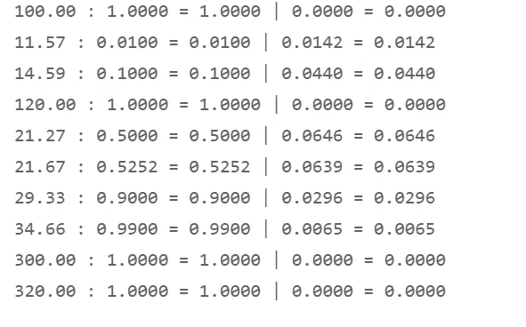

# Python 场景分析:用 beta-PERT 分布模拟专家评估

> 原文：<https://towardsdatascience.com/python-scenario-analysis-modeling-expert-estimates-with-the-beta-pert-distribution-22a5e90cfa79?source=collection_archive---------11----------------------->

## [实践教程](https://towardsdatascience.com/tagged/hands-on-tutorials)

## 以及如何向 SciPy 的目录中添加一个新的、用户自定义的发行版

【https://pixabay.com/images/id-1872665/】由奇莫诺、皮沙贝

关于以下内容的教程:

*   如何在**情景分析中使用概率分布；**
*   如何**对专家评估建模**——如果观察数据很难获得，我们需要从专家那里收集评估，这些专家可以提供关于行业、业务流程或领域的领域知识；或者，如果历史数据可用，但预计不会反映未来的发展，特别是趋势突变，那么我们也需要开发一个基于专家估计的模型；
*   如何在情景分析中使用 **PERT 分布**；并添加 PERT(或其他用户定义的分布)作为一个新的子类来完善 SciPy 库；
*   如何**重新参数化** PERT 或其他分布

我的上一篇文章介绍了 SciPy 的概率分布，以及它们如何应用于随机过程的建模。([用 Python 的 SciPy 介绍概率分布| 2021 年 10 月|走向数据科学](/probability-distributions-with-pythons-scipy-3da89bf60565))

今天的文章将展示我们如何使用概率分布进行**场景分析**。

**情景规划**——在商业、工程或金融领域——通常涉及所谓的**三点评估** : **最佳情况、可能情况、最坏情况。** ( [三分法估算——维基百科](https://en.wikipedia.org/wiki/Three-point_estimation))

三点估计技术有助于避免单点估计的一些缺陷——其中之一是，如果计划者甚至在不知情的情况下过度乐观或悲观，决策者可能会发现相当大的偏差倾向。“**偏向**是一种不成比例的权重*偏向*或*反对*一个想法或事情”([偏向——维基百科](https://en.wikipedia.org/wiki/Bias))。如果一个企业或任何组织的团队成员感到有压力要为成功做计划，但不考虑哪怕是暂时的挫折，因为未来总是看起来更光明，那么他们的计划可能会表现出隐藏的或不太隐藏的对难以置信的好结果的偏好。

三点估计技术试图通过明确询问最坏情况的结果来揭示隐藏的偏差。

*   报告的最差情况可能仍然有正偏差，但它可以作为讨论风险的起点。
*   对最佳情况的隔离表明，所谓的可能情况并没有被置于过于乐观的假设的边缘。

然后可以启动一个调整过程，例如德尔菲法(也称为估计-讨论-估计)，以达成一致的场景。([德尔菲法—维基百科](https://en.wikipedia.org/wiki/Delphi_method))

德尔菲法，维基百科，Czkassa(后 Maurizio Bolognini，*demo copicnia elettronica*，2001)，也可免费用于商业用途

如果没有数据科学家的参与，他们可以提供用概率分布模拟不确定性的专业知识，许多组织倾向于只准备三种情况:预期平均结果、悲观情况和乐观情况。然后，这三个场景将留给决策者，让他们尝试直观地将这些点联系起来。仅仅三个点，运用个人直觉。会出什么问题呢？

数据科学家可以通过概率分布来**连接这些点，该概率分布在整个范围内对涉及的风险、机会和不确定性进行建模。该模型不仅会报告两个极端值(根据定义，最好和最坏的情况必须相对不太可能，有时甚至极不可能发生)，而且科学家还可以报告分位数，这些分位数描述了结果的*连续*谱及其相关概率。**

当我们想要将 3 点情景规划过程建立在更坚实的基础上时，我们应该考虑哪些模型？

**正态分布**，由于其围绕均值和中值的不变对称性，并不总是显示尾部风险倾向的随机过程的最佳模型。

一个风险因素可能会导致巨大的成本或超过技术安全限制，但它是不对称的:如果风险没有*或*实现，就不会有同等的成本降低或超过基线的安全改进。正态分布不能解释许多不对称风险。

我们想要建模的真实世界随机过程也可能表现出过度的峰度:异常值在其两个尾部出现的频率高于正态分布的情况-具有高峰度的真实世界随机过程的中心包含不到 99.7%的在平均值周围三个标准偏差内的所有事件。

如果我们选择正态分布，我们不仅大胆地假设我们模拟了一个既不偏斜也不重尾或轻尾的随机过程。我们还使用了一个双向无界的模型；它的结果可以沿着 x 轴向负无穷大和正无穷大延伸。

我们的结论是，除了正态分布，我们还应该看看其他模型。

三角形分布在三个点之间画出直线。由此产生的概率密度函数是字面上连接三个点并获得简单随机过程模型的最直接的方法。

我们还将回顾**贝塔-珀特分布**，它可以展示出类似正态分布和三角形分布的混合形状。三点估算技术将三角形和 PERT 分布应用于建模。 [PERT 分布—维基百科](https://en.wikipedia.org/wiki/PERT_distribution)

我们通过详细阐述 3 点估计的分布来建模的随机过程可以代表受不确定性影响的任何情况。最初的 3 点估计提供了可能结果边缘的两个极端点，根据定义，这两个极端点发生的概率较低。概率分布将采用这些点，然后显示结果的完整范围及其模式，例如:

*   新产品或现有产品在新市场或现有市场的销售量
*   顾客接受新产品的价格，相对于竞争对手的产品价格进行估计
*   供应商价格，3 个月后
*   新开发技术部件的典型寿命
*   30 天后的外汇汇率
*   拟建海上风力发电场位置的风力

然后，分布特性将使我们能够量化预期结果:

*   新部件的平均或中位故障时间，它告诉我们其未来的保修率、成本和关键安全阈值；
*   分位数，确认某个位置的风力不会超过蒲福风 6 或 27 节，概率为 99%，但它会在至少 80%的时间内以 11 节的速度驱动计划的风力涡轮机，这告诉我们涡轮机需要有多坚固才能承受大风；以及它们预期发电千瓦数的规模，以使投资物有所值；
*   投资组合的风险价值，具有预期的未来回报和估计的波动性。

# 0.属国

从 SciPy 中，我导入了包含 123 个发行版的庞大目录的 *stats* 库。具体来说，我们将在教程中使用正态、三角和贝塔分布。

我还导入了 SciPy 的*优化*模块，并将演示我们如何求解一个非线性方程组，在这种情况下是为了确定一些分布属性。

# 1.模拟专家评估的三角分布

三角形分布的自变量是最坏情况(最小值或位置参数)、可能情况(模式)和最佳情况(比例参数=最大值-最小值)。

三角形分布是建模专家意见的常用选择。它的三角形直观上很容易理解。

但是除了简单性之外，我不认为它是最佳选择。曲线的形状有着尖锐、笔直的边缘，看起来不像真实世界中的随机过程。当我们将其与下面的 beta-PERT 分布进行比较时，我们还会注意到三角形的峰度(异常值倾向的指标)是有问题的。

“[三角分布]公式同样重视通常不如最可能值为人所知的极端值，因此可能受到对极端值估计不足的不当影响。三角形分布也有一个角形，与代表主观知识的更平滑的形状不匹配。” [PERT 分布—维基百科](https://en.wikipedia.org/wiki/PERT_distribution)

# 2.贝塔-珀特分布

## 2.1 PERT 概念

PERT 代表“**P**program(或**P**project)**E**evaluation 和**R**review**T**technique”PERT 分布是支持这种项目管理综合方法的工具之一。PERT 最初是由美国海军在 20 世纪 50 年代末开发的，用于管理北极星核潜艇项目。该方法很快被许多其他组织和行业采用([项目评估和审查技术——维基百科](https://en.wikipedia.org/wiki/Program_evaluation_and_review_technique))。

对于我们今天的目的——建模不确定性——我们可以把重点放在概率分布上，但我们将跳过 PERT 的组织和方法方面，以及它如何处理关键路径分析。

**原始 PERT 分布**采用与三角分布相同的三个参数:

*   最坏情况或最小情况；
*   可能的情况或模式；
*   最好的情况或最大值。

PERT 概率密度函数的魅力在于它可以近似正态分布的钟形曲线。或者，如果我们将它的 lambda 权重校准为第四个超参数，它也可以模拟一个更灵活的分布形状，表示偏度和更高或更低的尾部风险。上图显示了四条可供选择的 PERT 曲线。所有这些都是基于专家估计的相同大小的最小值、可能值和最大值，但是我们应用了不同的λ因子来模拟它们的尾部。

下图比较了 PERT(1，3，8，8)和正态(3，1)分布。这些曲线彼此相似，但 PERT 并不完全对称。它是右尾的，具有 0.48 的中等正偏斜。与正态变量相比，它的右尾有更多的异常值，但左侧的异常值较少。

## 2.2 PERT 与三角分布

一些资料来源认为，如果缺少可以推导出λ重量的历史数据，三角形分布在 3 点方案中更可取。

三角形的平均值就是最小值、众数和最大值之和除以 3。PERT 均值也采用这个和，但是用一个因子对模式进行加权，在尝试其他权重之前，该因子通常设置为 4。如果λ保持固定为 4，则分布代表传统的 PERT 变量——而可由分析师设置的可变λ将其转变为所谓的**修正 PERT** 分布。

然而，对权重因子的关注并不是一个合理的论点，因为我们可以选择将 lambda 设置为 1.0 的中性值，这不会相对于最好和最坏的情况而言过重可能的结果。

下面，我将以强调 PERT 的平均值只包括一个选定的权重因子 lambda 的方式编写平均值的等式，该权重因子可以设置为 1.0，类似于三角形分布。

由于专家已经提供了最坏、可能和最好结果的估计，没有理由不向他们询问分布曲线的“尾部”:他们是否预见到分布是重尾的，异常值比正态分布的钟形曲线更经常出现，这种曲线逐渐消失在平均值的三个标准偏差之外？

在专家估计了最佳、最差和可能结果的幅度之后，Python 脚本可以立即用备选λ权重绘制 PERT 的曲线，以便专家可以选择反映他们对可能结果的真实可能性的直觉的形状；或者反过来，他们可以选择一个图形来显示尾部风险出现的频率。

该图表表明，对于可能的结果，随着λ权重的增加，PERT 曲线开始类似于正态分布——直到非常高的λ值会使其变成尖峰分布。红色曲线显示了一个 PERT 形状，其 lambda 默认值为 4.0。

任何*三角形*变量的过度峰度都是负的*常数*，-0.6，这意味着它比正态分布表现出的异常值倾向低得多。我们知道，正态分布经常低估现实世界随机过程中极端结果的尾部风险，例如在金融市场中。具有负过度峰度的三角形分布是*扁峰度*，或围绕中心的大体积，这意味着它假设尾部的异常值出现的频率更低，并且比正态分布预测的幅度更低。这可能是一个危险的提议。

相比之下，PERT 分布使我们能够通过修改 lambda 权重将尾部风险倾向校准到一个选定的值，例如，如果我们想要达到比正态分布高一个等级的峰度。

一个技术说明:SciPy 在单位区间[0；1].我们可以尝试用位置和比例值来定义它，以将它移动到单位间隔之外，但我的尝试导致了 NaN 值。显然，这是一个不影响除了 *triang* 子类之外的其他发行版的 SciPy bug。

## 2.3 PERT 作为转换后的 Beta 分布

SciPy 的两个类及其 123 个发行版不包含 PERT 子类。不过，我们不需要从头开始编写 PERT。SciPy 为我们提供了可以用来定义 PERT 的构件。

*   beta-PERT 分布可以表示为*标准 Beta* 分布的*变换*:

*   我们需要对随机变量 X 进行移位和重标度，然后插入变换后的变量 Z，它符合单位区间[0；1]，转化为β变量:

*   我们通过转换四个 PERT 参数的两个方程推导出贝塔分布的两个形状参数α和β:

*   由此产生的*β(z；α，β)*分布将等于*PERT(x；最小，模式，最大，λ)*变量。

# 3.在 SciPy 的目录中增加一个新的分布:修改的 PERT

我们转换 SciPy 的 Beta 分布，以便在需要时为我们提供 PERT 结果。但是为了避免在我们向我们的专家询问更新的评估时走弯路，我们将把 PERT 本身作为一个新的类别添加到我们导入的 SciPy 分布目录中。

为了准备测试新类，我们选择一个参数元组:

*   最小值= 10
*   模式，最频繁或最可能的值= 20
*   最大值= 40
*   λ= 4.0

这个新类将继承自连续分布的 SciPy 父类，*RV _ continuous*。

这将允许我们依赖与 SciPy 的内置发行版相同的语法。

继承带来了另一个特性。我们可以创建一个新的子类，只需要一个方法来定义它的概率密度函数 pdf 或累积分布函数 cdf。由于我们将它设置为子类，父类 *rv_continuous* 将自动填补我们在子类中留下的任何空白:父类将在运行时计算缺失属性的数值近似值。示例:如果我们没有明确定义一个方法来计算平均值，当我们应用*时，SciPy 将会解决这个问题。mean()* 函数在我们的代码中。然而，从 *rv_continuous* 继承而来的间隙填充机制是有代价的。也可以用公式表示的度量的数值近似值将花费相当多的处理时间。

我们建立了新的 PERT 生成器类，并包含了所有属性的显式方法，我们可以为这些属性写下封闭形式的表达式。

出于实验的原因，我复制了新的详细类，并从我标记为 *pertm_gen_less* 的副本中删除了大部分方法，除了它的累积分布函数。然后我在长班和短班之间跑了一场赛马。在实例化这两个类之后，我们将在下面看到结果。

我们编写一个函数 *pertm_results()* ，每当 PERT 实例调用该方法时，它将计算一组属性。该函数将返回累积分布函数、概率密度、百分点(即分位数函数 ppf)和前四个矩。

在下面的第 4 行，我们创建了一个生成器类 *pertm_gen* 的实例。第 6 行使用我们之前设置的参数 *min，mode，max，*和 *lambda* 对其进行参数化，并将实例分配给变量*RV:*PERT 随机变量。

第 8 行调用 *pertm_results()* 函数来报告分布的主要属性。

为了找出一个只包含 cdf 函数的类是否会有较弱的性能，我们还实例化了“不太完整”的类 *pertm_gen_less* 。它包含相同的累积分布函数，但它的所有其他属性必须在运行时由 SciPy 的内部解算器近似计算。我们观察到，它对同一个 *pertm_results()* 函数的调用花费的处理时间是我们为更详细的生成器类所测量的两倍多。因此，如果我们知道如何将一个分布属性表达为一个代数公式，我们应该将它作为一个方法添加到类定义中。

现在我们可以绘制分布函数，就像上一篇概述 SciPy 内置随机变量的教程文章一样([Python SciPy 的概率分布简介](/probability-distributions-with-pythons-scipy-3da89bf60565))。

*interval()* 函数返回一种置信区间。它告诉我们，对于给定的概率，随机数将从中位数附近的报告区间中抽取。这种见解与我们对正态分布的了解相当:99.7%的观察值都在中位数的三个标准差范围内。对于其他非对称分布，我们事先不知道这个事实，但我们可以参考 *interval()* 函数。

我们将 x 轴上的选定点输入 PERT 的累积分布函数和概率密度函数。

# 4.使用分位数的专家估计:转换的 pert

PERT 和三角分布作为参数所期望的最大值和最小值提出了另一个潜在的问题:对于包括我们在内的规划者来说，确定一个场景的极端情况是众所周知的困难。对于长尾随机过程，即使出现的概率在三到五个标准差后会缩小到接近零，x 轴也可以被拉至接近无穷大。

为了防止对极端结果的有偏见的预测，我们不应该请领域专家来估计“真正的”最小值和最大值，而是考虑 x 轴两端的两个更现实、不太极端的点:“估计随机过程只会以 10%的概率超过哪个大值(也就是 90%的分位数)。并估计阈值，低于该阈值时，更糟糕的结果只会以 10%的概率发生(也就是 10%的分位数)。”这个(10，90)分位数对将代表更现实的最坏和最好情况，在大多数情况下可以更容易地进行估计。

我们将定义一个 PERT 分布，它可以使用分位数作为参数。

为了检查一致性，我们希望转换后的 PERT 分布与我们在第 4 章中分析的原始分布相匹配。因此，我们将 10%和 90%分位数设置为我们已经导出的值，作为修改后的 PERT 分布的属性(第 4 行到第 6 行)。

我们需要将分位数转换成参数，然后传递给(大)母分布:标准 Beta 随机变量。为此，我们将打开 SciPy 的工具箱，使用它的非线性方程系统的**解算器。**

在第 5 行和第 9 行之间的函数 *f，*中，我们建立了方程组。两个**百分点或分位数函数 *ppf()*** 必须进行校准，以等于专家估计的给定分位数值 q10 (14.59)和 q90 (29.33):

*   0 = ppf(0.10) — q10
*   0 = ppf(0.90) — q90

第 13 行中 SciPy 的 ***fsolve()*** 方法将搜索两个值 *min* 和 *max* ，这两个值将校准百分点函数以匹配它们的目标值 q10 和 q90。

我们的专家估计的模式不需要转变。我们还保留 lambda 的默认值 4.0。

第 12 行提供了一个初始的猜测值，这对于 *fsolve()是必需的。w*e*用 100 乘以 90%的分位数来猜测最大值；并将 10%的分位数乘以 0.01 以接近最小值。x 轴上 10%分位数的最左侧和 90%分位数的最右侧的结果起点似乎分别非常接近最小值和最大值，求解程序可以确定这两个极值的近似值。在测试过程中，解算器没有陷入死胡同解，尽管最小值和最大值有时很难在 x 轴的极端边缘找到。*

元组 *params* 接收两个方程组的解:解算器确定的最小值和最大值。

在下一步中，我们将元组转换为可变列表，为 lambda 添加默认值 4.0，并在 min 和 max 之间插入模式。然后，字典将这四个参数值与它们的名称配对。第 10 行中的列表 comprehension 打印了这个参数字典。

这些是我们现在可以提供给 PERT 子类的输入参数。

在第 15 行和第 16 行，我们选择要计算分位数的概率。第 17 行组合了另一个字典中的概率及其相应的分位数，第 19 行中的 list comprehension 逐行打印。我们在下面的截图中看到了分布参数和分位数。

# 5.PERT-Q 分布

在第四章中，我们编写了代码来翻译分位数参数，以便用传统的参数化(min，mode，max，lambda)使它们易于被 PERT 理解。这需要输入和输出之间的手动步骤。

我们可以通过定义一个新的、重新参数化的 PERT-Q 分布类来简化转换步骤，该类立即接受分位数作为其参数。最终用户甚至可以自己输入估计的分位数。

新的生成器子类 *pertQ_gen* 继承自其父类，即修改后的 PERT 生成器 *pertm_gen* 。我们在第 4 章中开发的代码可以重复使用来建立这个新类，只需很少的修改。

除了模式和λ之外，累积分布函数 _cdf()还将 10%和 90%的分位数作为其参数。在第 12 行和第 16 行之间的函数 *f，*中，我们建立了非线性方程组。带有最小和最大参数的两个百分点函数 *ppf()、*被设置为等于 q10 和 q90 中的分位数值:

*   0 = ppf(0.10) — q10
*   0 = ppf(0.90) — q90

第 20 行中的 *_minmax()* 函数应用了 SciPy 的 *fsolve()* 方法。然后，行 40 导出形状参数α和β，如前几章所述。

辅助函数 *_minmax* 和 *_shape* 返回的转换结果被输入到反映 PERT 分布的标准 Beta 分布中。

为了查看结果，我们给变量 *pertQ 分配一个新的 PERT-Q 分布类的实例。*我们用之前选择的参数元组(q10，mode，q90，4.0)来设置它，并通过将它映射到变量 *rvQ* 来冻结实例。

现在，我们可以绘制 PERT-Q 分布的 pdf，当然，我们会发现它的曲线与我们之前准备的修正 PERT 的曲线是相同的。请记住，我们将专家估计值设置为与修改后的 pert 提供的值相同。因此，两个参数化必须导致相同的分布。

当我们计算 PERT-Q 的矩时，应用。stats()方法，我们发现它们与修改后的 PERT 分布的矩相匹配。

通过计算 x 轴上相同点的 cdf 和 pdf，我们可以进一步确认 PERT-Q 和修正的 PERT 是相同的。

在第 7 行和第 8 行中，我们通过压缩合并了它们的值。在左边，代码列出了 x 值；中间的两列比较它们的 cdf 值，它们没有显示差异；右边的两列显示 pdf 值也没有不同。

# 6.结论

我们模拟的随机过程可以代表任何受未来结果不确定性影响的变量:汇率；销量；价格；通货膨胀率；药物的代谢吸收率；2022 年新增 Medium.com 用户数；预计海上风电场位置的风力。

通常(但还不够经常)，我们可以依靠历史观察数据来准备预测模型。但是很多时候，我们面临着原始数据的缺乏。

我们还必须面对这样一个事实，即每个数学模型只能预测过去观察到的模式。开发能够应对趋势突变的情景——人们担心这是黑天鹅事件；或者希望如果企业想要推出新产品，那么我们需要将场景规划添加到我们的工具箱中。

当新冠肺炎在 2020 年 1 月浮出水面时，我们可以预见它会扰乱公共生活和经济。虽然我们没有数据序列，我们可以从这些数据序列中自动得出单个企业或行业的时间序列预测。上一次如此规模的全球疫情造成浩劫是在 1918 年。2020 年被破坏的供应链、市场和行业在一个世纪前并不存在，因此没有时间序列分析可以提供可靠的模型。

许多其他例子之一是电动汽车制造商特斯拉的崛起。几年前，当特斯拉开始(重新)发明电动汽车时，没有时间序列数据可以表明，当时规模相对较小的初创公司会扰乱汽车行业及其企业巨头。

在许多情况下，我们发现我们需要从领域专家那里收集评估，他们应该为我们提供对预期结果的 3 点评估。然后，我们可以启动我们的数据科学引擎，通过进入 SciPy 的概率分布工具箱，对场景中的不确定性进行建模。

下一篇文章将讨论场景规划的下一个阶段:Python 中的蒙特卡罗模拟。

Jupyter 笔记本可以在 GitHub 上下载:[h3ik0th/PERT:PERT distribution SciPy(github.com)](https://github.com/h3ik0th/PERT)

*   标题图片:奇莫诺，pixabay 上免费
*   德尔菲法:维基百科，Czkassa(源自 Maurizio Bolognini，*democornia elettronica*，2001)，免费用于商业用途
*   所有其他图片:作者