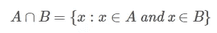

# Python 集合运算:完整指南-数据结构

> 原文：<https://towardsdatascience.com/python-set-operations-complete-guide-data-structures-98fcd0532296?source=collection_archive---------21----------------------->

## 在本文中，我们将重点介绍 Python 集合操作的完整过程。


马丁·桑切斯在 [Unsplash](https://unsplash.com/s/photos/basketball-court?utm_source=unsplash&utm_medium=referral&utm_content=creditCopyText) 上的照片

# **目录**

*   介绍
*   Python 集合并集
*   Python 集合交集
*   Python 集合差异
*   Python 集对称差
*   结论

# 介绍

此时，读者应该熟悉 [Python 集合](https://pyshark.com/everything-about-python-set-data-structure/)。如果你想复习，或者对 set 不熟悉，请查看 [Python sets 初学者指南](https://pyshark.com/everything-about-python-set-data-structure/)。

在本教程中，让我们从数学的角度考虑集合，并考虑集合论的部分内容。集合只是不同元素(或数学对象)的集合。

出于本教程的目的，我们将使用数字集合。类似于: **A** = {1，2，3，5，7}和 **B** = {1，2，4，8，9}。

# Python 集合并集

在集合论中，集合并是集合的集合。这意味着，如果我们有两个集合， **A** 和 **B** ，我们可以将它们组合起来，只取不同的元素(意味着重复的元素将被丢弃)。

但是这在数学上看起来如何呢？

这是:


作者图片

一个数值例子有助于理解它。考虑两组:

*   **A** = {1，2，3，5，7}
*   B = {1，2，4，8，9}

或者视觉上:


作者图片

在这种情况下:


作者图片

元素 ***1*** 和 **A** 和 **B** 都存在。当联合两个集合时，我们只考虑每个重复的元素一次。

下图中的黄色区域显示了集合 **A** 与集合 **B** 的联合:


作者图片

现在让我们看看如何使用 Python 来完成同样的操作。我们将首先创建两个集合， **A** 和 **B** 。然后使用**。**Python 集合的 union()【方法】执行 union 操作:

您应该得到:

```
{1, 2, 3, 4, 5, 7, 8, 9}
```

这是完全相同的集合，在上面信息图中的黄色区域有相同的元素。

# Python 集合交集

在集合论中，集合交是集合的互元素的集合。这意味着，如果我们有两个集合， **A** 和 **B** ，集合交集将包含两个集合中出现的所有元素。

从数学角度来说:



作者图片

一个数值例子有助于理解它。考虑两组:

*   **答** = {1，2，3，5，7}
*   **B** = {1，2，4，8，9}

或者视觉上:


作者图片

在这种情况下:


作者图片

下图中的黄色区域显示了集合 **A** 与集合 **B** 的交集:


作者图片

现在让我们看看如何使用 Python 来完成同样的操作。我们将首先创建两个集合， **A** 和 **B** 。然后使用**。**Python 集合的交集()方法执行交集操作:

您应该得到:

```
{1, 2}
```

# Python 集合差异

在集合论中，集合 **B** 和集合 **A** 之间的集合差，也称为集合 **B** 中集合 **A** 的相对补。它被定义为存在于集合 **B** 中但不存在于集合 **A** 中的元素集合。

或者，集合 **A** 和集合 **B** 之间的集合差异是集合 **A** 中存在但集合 **B** 中不存在的元素集合。

数学上:


作者图片

一个数值例子有助于理解它。考虑两组:

*   **A** = {1，2，3，5，7}
*   **B** = {1，2，4，8，9}

或者视觉上:


作者图片

在这种情况下:


作者图片

元素 ***1*** 和 **A** 和 **B** 是两组中唯一一起出现的。但是元素 ***4*** ， ***8*** ， ***9*** 只存在于集合 **B** 中。因此，集合 **B** 和集合 **A** 之间的集合差正是这些元素:{4，8，9}。

下面信息图中的黄色区域显示了器械包 **B** 和器械包 **A** 之间的器械包差异:


作者图片

现在让我们看看如何使用 Python 来完成同样的操作。我们将首先创建两个集合， **A** 和 **B** 。然后使用**。**Python 集合的 difference()【方法】执行差分运算:

您应该得到:

```
{8, 9, 4}
```

# Python 集对称差

在集合论中，两个集合( **A** 和 **B** )之间的对称差也称为析取连接。它被定义为存在于集合 **A** 或集合 **B** 中，但不同时存在于两者中的元素集合(不在集合 **A** 和集合 **B** 的交集中)。

数学上，它被计算为两个[差](https://pyshark.com/python-set-operations/#python-set-difference)的[并集](https://pyshark.com/python-set-operations/#python-set-union):


一个数值例子有助于理解它。考虑两组:

*   **A** = {1，2，3，5，7}
*   **B** = {1，2，4，8，9}

或者视觉上:


作者图片

这里有三个步骤来寻找对称差:

1.  找出集合 **A** 和集合 **B** 之间的集合差:A \ B = {3，7，5}，因为这些元素出现在集合 **A** 中，而不出现在集合 **B** 中。
2.  找出集合 **B** 与集合 **A** 之间的集合差异:B \ A = {4，8，9}，因为这些元素出现在集合 **B** 中，而不出现在集合 **A** 中。
3.  在步骤 1 和步骤 2 中找到的两个集合差的并集:(A \ B)∩(B \ A)= { 3，7，5，4，8，9}

在这种情况下:


作者图片

下图中的黄色区域显示了 set **A** 和 set **B** 的对称差异:


作者图片

现在让我们看看如何使用 Python 来完成同样的操作。我们将首先创建两个集合， **A** 和 **B** 。然后使用**。**Python 集合的 symmetric_difference()【方法】执行对称差分运算:

您应该得到:

```
{3, 4, 5, 7, 8, 9}
```

# 结论

这篇文章是关于 [Python 集合](https://pyshark.com/everything-about-python-set-data-structure/)操作的完整指南，有详细的公式解释和例子。

如果你有任何问题或对一些编辑有建议，请随时在下面留下评论，并查看更多我的[数据结构](https://pyshark.com/category/data-structures/)文章。

*最初发表于 2021 年 12 月 10 日*[*https://pyshark.com*](https://pyshark.com/python-set-operations/)*。*