# 面向初学者的 Python 统计

> 原文：<https://towardsdatascience.com/python-statistics-for-beginners-pearson-correlation-coefficient-69c9b1ef17f7?source=collection_archive---------11----------------------->

## 皮尔逊相关系数

# 什么是相关性？

我们都听过“相关性”这个词。虽然我们可能不确定它的确切含义，但我们知道它是两个变量相互关联程度的某种指标。你知道吗？这非常接近事实。

相关性本身是一种数学技术，用于检查两个定量变量之间的关系，例如汽车的价格和发动机的大小。

## 相关类型

那么有哪些类型的相关性呢？让我们画一些图表来更好地理解:

```
# Import working libraries
import pandas as pd
import numpy as np# Positive correlation
x = np.arange(start=0, stop=25, step=1)
plt.plot(x, 'o')# Negative correlation
x = np.arange(start=25, stop=0, step=-1)
plt.plot(x, 'o')# No correlation
x = np.random.rand(25)
plt.plot(x, 'o')
```

**正相关**表示两个变量会向同一个方向运动。换句话说，如果一个变量增加，另一个也会增加，如果一个变量减少，另一个也会等量减少。正相关关系可以说明如下:

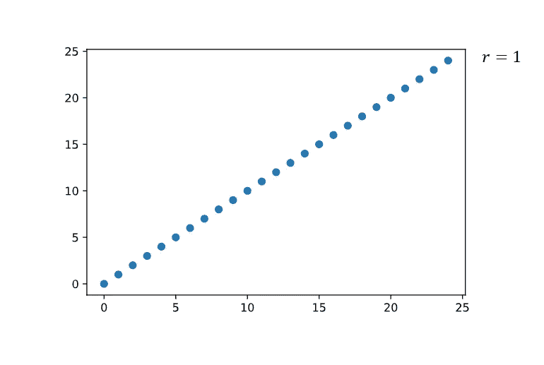

正相关。作者创建的图像。

**负相关**是两个变量之间的关系，其中一个变量的增加导致另一个变量的减少。负相关的一个很好的例子是氧气含量与海拔的关系。随着海拔的升高，空气中的含氧量会降低(极限登山运动员的通病)。负相关看起来像这样:

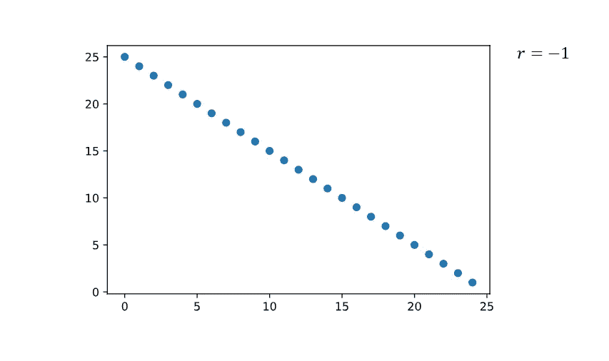

负相关。作者创建的图像。

最后但同样重要的是，第三种形式:**没有关联。**在这种情况下，数据图是完全随机的，没有显示任何相关的迹象。没有相关性可以这样来说明:


没有关联。作者创建的图像。

## 相关形式

关联有不同的形式。可以是**线性**、**非线性、**或**单调**。让我们再画一些图来说明不同之处 **:**

```
# Import additional working libraries
import seaborn as sns # Linear correlation plot
data1 = 20 * np.random.random(100) + 100
data2 = data1 + (10 * np.random.random(100) + 50)
sns.regplot(x=data1, y=data2) # Non-linear correlation plot
x = np.arange(0, 10, 0.1)
ytrue = np.exp(-x / 10000) + 2 * np.sin(x / 3)
y = ytrue + np.random.normal(size=len(x))
sns.regplot(x, y, lowess=True) # Monotonic non-linear correlation plot
def f(x, a, b, c, d):
    return a / (1\. + np.exp(-c * (x - d))) + ba, c = np.random.exponential(size=2)
b, d = np.random.randn(2)n = 100
x = np.linspace(-10., 10., n)
y_model = f(x, a, b, c, d)
y = y_model + a * .2 * np.random.randn(n)sns.scatterplot(x, y)
sns.lineplot(x, y_model)
```

**线性相关性**是数据中两个变量以恒定速率变化的趋势。例如，假设一个汽车经销商想要估计燃料消耗对汽车价格的影响。他们发现每多消耗一升燃料，汽车价格就会下降 1000 美元。这描述了燃料消耗和汽车价格之间的线性关系，其中汽车价格以 1000 美元的恒定比率受到燃料消耗的影响。线性相关性可以用一条直线来表示:

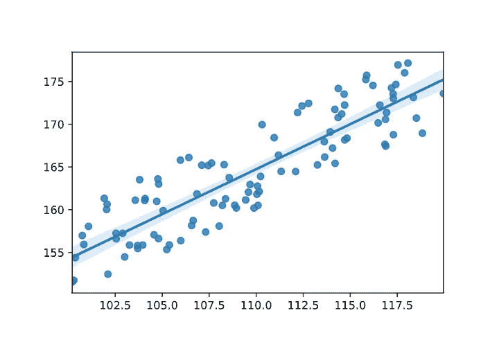

线性相关。作者创建的图像。

当两个变量不以恒定速率**变化时，相关性为**非线性**。**结果，变量之间的关系并没有用直线来表示，而是在数据中造成了某种程度的曲线模式。下图展示了这种情况:

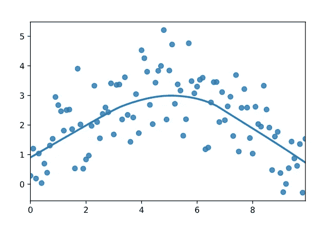

非线性相关。作者创建的图像。

类似于线性关系，**单调**关系中的两个变量将沿同一方向移动。然而，变量不一定要以恒定的速率移动。下一张图显示了两个变量同时增加但速率不同的情况。

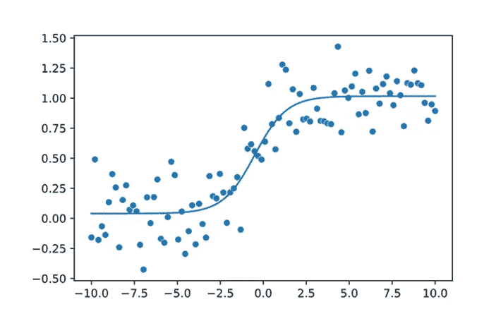

单调非线性相关。作者创建的图像。

# 皮尔逊相关系数

绘制数据及其关系的图表有助于我们确定我们面对的是哪种类型的相关性以及它的形式。然而，它并没有告诉我们实际上我们看到的相关性有多强。为了量化这两个变量之间的关系，我们需要计算**相关系数**。

**相关系数**是量化两个变量之间关系的统计度量。该系数的值介于-1.0 和 1.0 之间，而大于 1.0 的计算值表示函数中有错误。系数-1.0 表示完美的负相关**和 1.0 表示完美的正相关**。另一方面，系数 0.0 意味着两个变量之间没有关系。****

**有许多不同的方法来计算两个变量的相关系数。最常见的就是所谓的**皮尔逊相关系数 *(r)*** 。这是一种测试，用于测量两个正态分布变量之间的线性关系的强度。如果数据不是正态分布，可以使用 Kendall 和 Spearman 检验。**

**由于 ***(r)*** 的取值范围在-1.0 到 1.0 之间，所以当接近零时，它的解释会变得困难。关于如何解释 ***(r)*** 的不同值，有许多经验法则，但最常见的一个可能是 2003 年由 Dennis E. Hinkle 和他的合著者在他们的《行为科学应用统计学》的介绍性文本中发表的。它旨在教导学生，并为解释相关系数的大小提供一个经验法则:**

**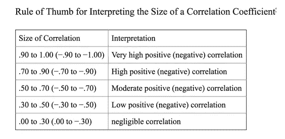**

**辛克尔德，威尔斯马 W，Jurs SG。行为科学应用统计学。第五版。波士顿:霍顿·米夫林；2003**

# ****意义****

**通过测量 *(r)* 值，我们量化了两个变量之间的关系有多强。但这只能告诉我们故事的一半，对吗？原因是我们计算的相关系数只代表一个样本，而不是整个群体。因此，虽然我们知道样本中的相关性，但我们不能确定我们量化的相关性是否代表整个总体。因此，我们现在要进行一个统计**显著性检验**，它可以告诉我们，我们的观察结果是否可以预期在整个人口中是真实的。让我们一步一步地设置我们的测试:**

## **步骤 1:制定一个假设**

**在假设检验中，我们总是要提出两个假设。一个叫做**零假设**，另一个叫做**备择假设**。他们通常陈述相反的结果:**

****零假设 *(Ho)*** 是我们试图反驳的假设。在我们的例子中，假设在给定的总体中，两个变量之间没有显著的线性相关性。**

****备选假设 *(Ha)*** 是我们试图为之提供证据的假设。在这个例子中，我们将试图证明总体中存在线性相关。**

## **步骤 2:进行 T 检验**

**不需要深入复杂的数学，T-检验(也称为学生 T-检验)允许我们在整个人口中检验一个假设。在我们的案例中，它将帮助我们发现我们在样本中观察到的相关性是否可以在整个人群中重现。**

**T 检验会给我们一个数字***【T】***，我们必须依次解释这个数字。****【t】***越高，相关性在群体内可重复的可能性越高。但这是为什么呢？***

***简单地说，T 检验计算两组之间的差异。在我们的例子中，我们使用 T-test 来比较**一个没有相关性的组和一个有确定关系的组。如果我们观察到的相关性是由于巧合而发生的，(t)将等于 0 左右，这表明这两个群体是相同的**。*******

***然而，如果两组**显著不同**，则 t 值将高得多，并位于群体的极端。这表明我们观察到的相关性不是由于巧合，也不能在没有相关性的人群中找到:***

```
*# Creating a bell curve for illustration purposes
from scipy.stats import normx = np.arange(-4, 4, 0.001)
y = norm.pdf(x,0,1)fig, ax = plt.subplots(figsize=(9,6))
ax.plot(x,y)
plt.show()*
```

***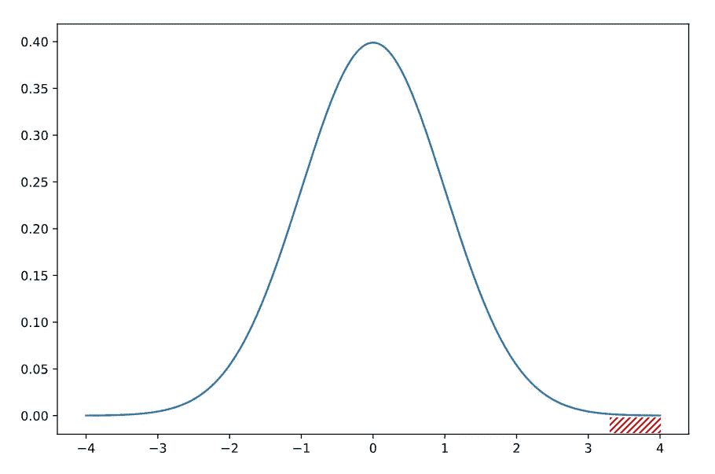***

***假设没有相关性的 Ho 的说明性总体。红色方块表示 Ha 和 a (t)值> 3.2 的交叉点，表明两组之间存在显著差异。作者创建的图像。***

## *****步骤 3:解释 p 值*****

***由于 *(t)* 是一个依赖于总体的理论检验统计量，我们不知道我们观察到的 t 值是否很高。换句话说，范围从 0 到 1，000 的总体将具有不同于范围从 0 到 1 的总体的其他 t 值。为了克服这个小问题，每次 T-Test 也计算所谓的 ***p-value (p)*** 。***

*****p 值**向我们展示了我们可以在 *Ho* 人群中观察到该 t 值的概率。你也可以把它想象成一场飞镖游戏。 *(p)* 越高，你的飞镖落在上图中 0 附近的几率就越高。 *(p)* 越低，你打中中路的几率越低。***

***因此(p)越低，我们的 t 值越有可能位于其中一个极端，因此“足够高”来表明我们两个群体之间的显著差异。或者换句话说:p 越低，我们观察到的相关性由于巧合而没有发生的概率就越高。***

## *****第四步:决定假设*****

***让我们进入最后一部分，看看最后一个问题——***(p)*需要多低？*****

***还是那句话，看情况。这取决于你为你的实验设定的**显著水平 *(a)*** 。显著性水平是 p 值的阈值。通常， ***(a)* 被设置为 0.05 或 5%** ，意味着大于该值的 p 值将导致接受零假设。或者换句话说:如果你不能 95%确定两组有显著差异，你**不能拒绝**零假设。***

***假设当我们将 *(a)* 设置为 0.05 时，我们已经接收到 p 值 0.002。在这种情况下*(p)***低于**我们的显著性水平，我们可以得出以下结论:***

***我们可以拒绝*何*而支持*哈*因为我们发现我们在样本中观察到的相关性可以在更大的人群中重复，并且不是巧合。***

# ***Python 示例***

***但是现在理论已经讲得够多了——让我们看一个现实生活中的例子，以及如何用 Python 完成所有这些！***

## ***你需要什么？***

***要完成本教程，您需要具备以下条件:***

*   ***一个**编辑**像 [VS Code](https://code.visualstudio.com/) 或者 [Spyder](https://www.spyder-ide.org/)***
*   *****Python 3.8.3** 或更高版本***
*   ***[**汽车数据集**](https://archive.ics.uci.edu/ml/machine-learning-databases/autos/) 来自 UCI 机器学习仓库***

## ***我们要做什么？***

***在本教程中，我们将看看 UCI 机器学习库提供的**汽车数据集**。该数据集包括 1985 年以来汽车的**技术**和**价格**数据以及**保险**信息。数据集是开源的，通常用于训练/测试回归模型。***

***我们将对这个数据集进行一些格式化，使其为我们所用，然后探索几个变量与变量**价格**的**相关性**。***

## ***步骤 1:导入工作库***

***首先，我们需要导入执行分析所需的库。如果您还没有安装它们，请在执行下面的代码之前检查相应的文档。***

```
*# Import working librariesimport pandas as pd
import numpy as np
import seaborn as sns
from scipy import stats*
```

## ***步骤 2:加载数据***

***如果您还没有完成，请从 UCI 网站下载“ [imports-85.data](https://archive.ics.uci.edu/ml/machine-learning-databases/autos/imports-85.data) ”并保存在您的工作目录中。请注意，你必须改变”。数据“到”。csv”来执行以下代码。***

```
*# Load data and show first 5 rowsdf = pd.read_csv("imports-85.csv")
df.head(5)*
```

******

***数据框。作者创建的图像。***

## ***步骤 3:格式化数据***

***你有没有注意到——我们的数据集没有标题，而且有些值显示一个问号？这是我们在运行相关性分析之前应该**解决的问题，否则我们的代码可能无法工作，得到的结果可能会失真。*****

***让我们在第一步**中添加**一些**列名**，以便我们更容易理解数据集并使用它。***

```
*# Add headers to df and display first 5 rowsheaders = ["symboling", "normalized-losses", "make", "fuel-type", "aspiration", "num-of-doors", "body-style", "drive-wheels", "engine-location", "wheel-base", "length", "width", "height", "curb-weight", "engine-type", "num-of-cylinders", "engine-size","fuel-system", "bore", "stroke", "compression-ratio", "horsepower", "peak-rpm", "city-mpg", "highway-mpg", "price"]df.columns = headers
df.head(5)*
```

***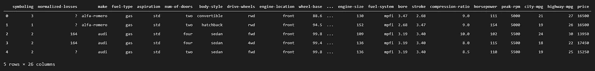***

***带标题的数据帧。作者创建的图像。***

***由于这看起来效果不错，我们现在应该看看归一化损失一栏中的这些问号。我们不能用它们来做进一步的分析，所以我们将用 **NaN** 值来**替换**值。注意，我们将在整个**数据帧上调用 pandas.replace 函数，而不仅仅是在一列上。我们这样做是为了确保我们以后不会在数据集中的其他地方遇到另一个问号**。*******

```
*# Replace ? with NaN and show first 5 rows of dfdf = df.replace('?',np.NaN)
df.head(5)*
```

***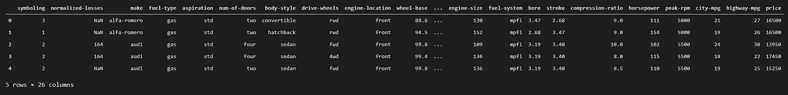***

***没有问号的数据框。作者创建的图像。***

***因为我们没有没有**的概述，现在**中缺少值，我们应该运行一个快速分析来找出 NaN 值。我们可以通过**首先检查**NaN 值的数据帧，然后使用 **for 循环打印出我们的分析。*****

```
*# Check df for missing valuesmissing_data = df.isnull()
missing_data.head(5)*
```

***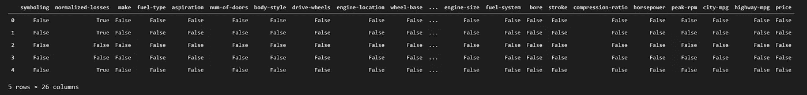***

***使用 bolean 检查缺失值的数据框。作者创建的图像。***

```
*# Run for loop to check for missing valuesfor column in missing_data.columns.values.tolist():
    print(column)
    print (missing_data[column].value_counts())
    print("")*
```

***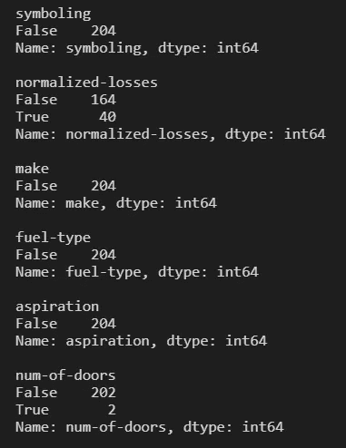***

***首先分析 for 循环的列。作者创建的图像。***

***如果您滚动分析，您会发现在下面的**列**中有**个缺失值(=True)** :***

*   ***标准化损失***
*   ***门的数量***
*   ***钻孔***
*   ***中风***
*   ***马力***
*   ***峰值转速***
*   ***价格***

***因为我们需要一个有效的数据集，所以我们必须找到一种方法来处理缺失的数据。一般来说，有两种选择。要么我们**丢弃**带有丢失数据的列或行，要么我们**替换**丢失的数据。***

***由于我们的数据集不够大，不能简单地删除所有带有缺失值的行/列，我们将使用剩余数据的**手段**来**替换**缺失值。***

***唯一的例外是门的数量一栏，因为这个数据是**而不是**的数字。这里我们将**用最常见的**变体**替换**缺失数据。在这种情况下，那就是“四”。***

```
*# Replacing NaNs with mean / most common variantavg_norm_loss = df["normalized-losses"].astype("float").mean(axis=0)
df["normalized-losses"].replace(np.nan, avg_norm_loss, inplace=True)avg_bore = df['bore'].astype('float').mean(axis=0)
df["bore"].replace(np.nan, avg_bore, inplace=True)avg_stroke = df['stroke'].astype('float').mean(axis=0)
df["stroke"].replace(np.nan, avg_stroke, inplace=True)avg_horsepower = df['horsepower'].astype('float').mean(axis=0)
df['horsepower'].replace(np.nan, avg_horsepower, inplace=True)avg_peakrpm = df['peak-rpm'].astype('float').mean(axis=0)
df['peak-rpm'].replace(np.nan, avg_peakrpm, inplace=True)avg_price = df['price'].astype('float').mean(axis=0)
df['price'].replace(np.nan, avg_price, inplace=True)df["num-of-doors"].replace(np.nan, "four", inplace=True)*
```

***还剩下什么？对！检查**数据表格**。我们可以通过执行以下代码轻松做到这一点:***

```
*# Checking df typesdf.dtypes*
```

***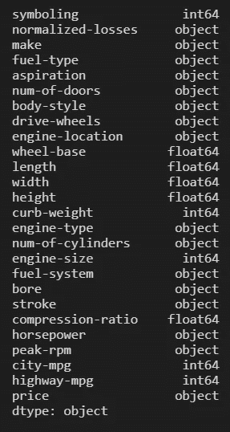***

***数据框类型。作者创建的图像。***

***如你所见，一些列仍然有错误的数据类型(例如，bore 应该有整数)。所以让我们快速纠正一下:***

```
*# Format data typesdf[["bore", "stroke"]] = df[["bore", "stroke"]].astype("float")
df[["normalized-losses"]] = df[["normalized-losses"]].astype("int")
df[["price"]] = df[["price"]].astype("float")
df[["peak-rpm"]] = df[["peak-rpm"]].astype("float")*
```

***在数据**标准化**和**规范化**方面，我们还可以做得更多，但我们在本教程中不需要这些，所以让我们继续。***

## *****第四步:浏览数据*****

***让我们快速回顾一下我们想要做的事情:我们想要寻找与汽车的**价格**有某种关联**的**变量**，对吗？所以我们需要首先检查**类型**和**形式**这两个变量之间的关系——最简单的方法就是多画一些图！*****

***为此，我们将使用 [**seaborn**](https://seaborn.pydata.org/) 库及其 **regplot** 函数。该功能将在 2D 图上为我们选择的变量绘制出**数据点**和**线性** **回归线**。虽然这并不能帮助我们量化相关性，但它帮助我们**确定****两个变量之间的关系类型和形式。*****

*****但事不宜迟，让我们开始看看价格与以下因素的关系:*****

*******发动机尺寸** 看看下图。我们可以观察到线性回归线**与**绘制的数据**非常吻合**。我们还可以观察到回归线有一个**陡峭向上的梯度**。但是考虑到相关性的类型和形式，这告诉我们什么呢？*****

*****虽然回归线的递增梯度向我们表明，我们可以预期发动机尺寸和价格之间存在**正相关性**，但回归线的良好拟合表明变量之间存在**线性相关性**。*****

```
***# Create a plot for engine-size and pricesns.regplot(x="engine-size", y="price", data=df)***
```

*****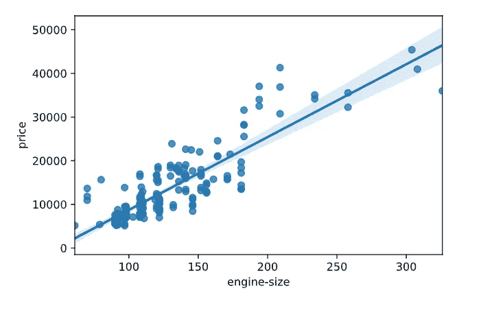*****

*****发动机尺寸和价格的回归图。作者创建的图像。*****

*****下图向我们展示了公路每加仑英里数(mpg)与汽车价格的回归曲线。这里我们可以观察到回归线是**递减**，表示一个**负相关**。然而，我们可以看到回归线没有覆盖 x 轴上 0 到 25 之间的异常值。这表明线性回归不是一个很好的拟合，并表明数据**可能**是**非线性的**。*****

```
***# Create a plot for highway-mpg and pricesns.regplot(x="highway-mpg", y="price", data=df)
plt.ylim(0,)***
```

*****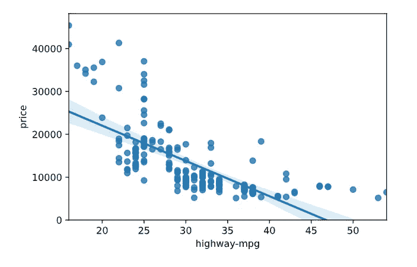*****

*****公路回归图-mpg 和价格。作者创建的图像。*****

*******峰值转速** 峰值转速和价格的图形看起来又不一样了。我们看到数据点有很大的**变化**，回归线几乎**水平**。基于这一观察，我们**无法**确定我们可以预期的相关形式，但是**假设**存在线性关系，则近乎平坦的回归线表明我们可以预期在 **0** 附近的相关系数。因此，我们可以得出结论，峰值转速和价格之间没有相关性。*****

```
***# Create a plot for peak-rpm and pricesns.regplot(x="peak-rpm", y="price", data=df)
plt.ylim(0,)***
```

*****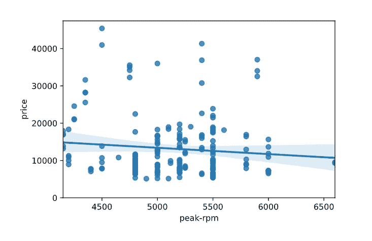*****

*****峰值转速和价格的回归图。作者创建的图像。*****

*****由于逐个查看每个变量对需要花费很长时间，我们可以使用 panda 的 ***corr()*** 函数来缩短这个过程:*****

```
***# Using pandas corr() functiondf.corr()***
```

*****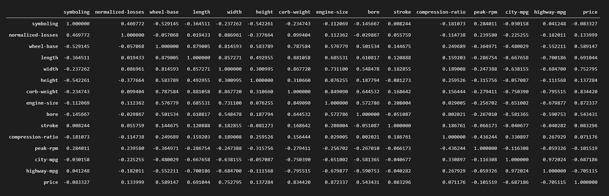*****

*****熊猫的 Corr()函数。作者创建的图像。*****

*****如您所见，pandas 的 *corr()* 函数创建了一个**相关矩阵**，其中包含了我们数据集中的所有变量。你可能会问——为什么我们不从一开始就这样做呢？*****

*****答案比较简单。虽然 *corr()* 函数默认计算**皮尔逊相关系数**，但它不会给出任何关于**形式**相关的信息。因此，它可以作为**一个很好的起点**来识别潜在的高相关性，但是单独检查变量对仍然是必要的。*****

## *****步骤 5:计算相关性和(p)值*****

*****在我们继续之前，让我们快速总结一下上述分析的结果:*****

*   *****我们可以预期发动机尺寸和价格之间存在正的线性关系*****
*   *****我们已经观察到公路里程数和价格之间的负相关性，这似乎是非线性的 T21。*****
*   *****我们假设 T22 峰值转速和价格之间没有相关性,并且我们没有相关形式的可靠信息 T24。*****

*****因此，我们可以得出这样的结论:变量 highway-mpg 和 peak-rpm 似乎**不适合**使用皮尔逊相关系数进行进一步分析。*****

*****为了进一步了解引擎大小，我们可以借助 [scipy.stats](https://docs.scipy.org/doc/scipy/reference/stats.html) 库来计算皮尔逊相关系数以及 p 值。*****

```
***# Calculate pearson coefficient and p-valuepearson_coef, p_value = stats.pearsonr(df['wheel-base'], df['price'])print("The Pearson Correlation Coefficient is", pearson_coef, " with a P-value of P =", p_value)***
```

**********

*****打印报表。作者创建的图像。*****

*****结果，我们得到的皮尔逊相关系数为 **~ 0.87** ，p 值几乎为 **0** 。*****

*****由于我们的系数> 0.7，但是<0.9, we conclude that we are observing a **发动机尺寸和价格之间的正相关性**很高。*****

*****最后，我们可以观察到我们的 p 值肯定是**低于**我们的显著性水平*(a)*0.05。因此，我们可以得出结论，我们上面计算的相关性不是巧合，因此**是重要的**。*****

# *****最后的话*****

*****如果我不说出下面这句著名的话，这就不是一个好的教程:*****

> *******相关性并不意味着因果关系。*******

*****我们已经知道**相关性**是描述两个变量之间关系程度的一种度量。**因果关系**另一方面是两个变量之间的因果关系。*****

*****即使我们观察到了相关性，我们**也不能**断定一个变量会引起另一个变量的变化。除非我们已经能够考虑所有不同的变量，否则我们**不得不**假设仍然有机会**巧合**或者第三个**因素**可能导致我们两个变量都发生变化。*****

*****因此，在得出关于相关数字的最终结论之前，进行**更全面的实验**总是很重要的。*****