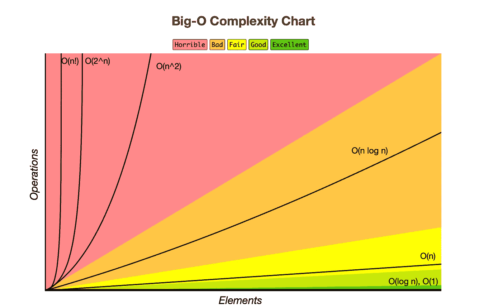

# 2021 年数据科学家的 Python 字符串操作

> 原文：<https://towardsdatascience.com/python-string-manipulation-for-data-scientists-in-2021-c5b9526347f4?source=collection_archive---------27----------------------->

## 破解数据科学面试

## 使用不同的重量训练你的 Python 编码肌肉


照片由[pix poeties](https://unsplash.com/@blackpoetry?utm_source=unsplash&utm_medium=referral&utm_content=creditCopyText)在 [Unsplash](https://unsplash.com/s/photos/string?utm_source=unsplash&utm_medium=referral&utm_content=creditCopyText) 上拍摄

数组和字符串操作是数据科学和软件工程面试中测试最多的话题之一。这是测试候选人程序性思维能力和编码流畅性的最佳面试题型。要想表现出色，我们必须熟悉数组/字符串、矩阵及其行/列结构的基本操作，以及 Python 语法。

在两篇类似的博客文章中，我已经触及了一些基本问题，并对几个真实的面试问题进行了现场编码。

</6-python-questions-you-should-practice-before-coding-interviews-f958af55ad13>  </essential-python-coding-questions-for-data-science-interviews-4d33d15008e6>  

在今天的帖子中，让我们尝试一些不同的东西。正如[Emma Ding](https://medium.com/u/1b25d5393c4f?source=post_page-----c5b9526347f4--------------------------------)(Airbnb 的数据科学家)和[Rob Wang](https://www.linkedin.com/in/robjwang/)(robin hood 的数据科学家)[的帖子所建议的那样，我们可以通过对同一个问题提出多种解决方案，同时比较和对比它们的优缺点，来显著提高我们对各种算法的理解。](/the-ultimate-guide-to-acing-coding-interviews-for-data-scientists-d45c99d6bddc)

这正是我们在这篇文章中要做的！

*我每天都在用 Python 写代码，并在这里记录了我的进步。如果您是编程新手，或者正在积极准备数据科学和软件工程面试，让我们组队一起编写代码。*

# 问题 1:在一个排序矩阵中计算负数，亚马逊和苹果

> -给定一个 m x n 矩阵网格，该网格按行和列的非递增顺序排序，返回网格中负数的个数。
> -[https://leet code . com/problems/count-负数-in-a-sorted-matrix/](https://leetcode.com/problems/count-negative-numbers-in-a-sorted-matrix/)

## 走过我的思考

亚马逊和苹果都问这个问题。作为热身，我们可以使用野蛮武力，直接迭代矩阵:检查一个元素是否为负数。

在 Python 中，我们可以做如下事情:

## 解决方案 1:嵌套 For 循环

```
8
```

> 第 3 行:使用 for 循环遍历行
> 
> 第 4 行:使用 for 循环遍历列

这里，我们使用一个嵌套的 for 循环来遍历矩阵并检查单个元素:如果元素是负的，count 就加 1。这是计算计数值的典型算法。

但是，缺点是计算效率低。它的时间复杂度 O(N)在运行时间上被认为是“恐怖的”。双 for 循环方法不适用于大型矩阵(例如，一百万行/列的矩阵)。

顺便提一下，如果你不熟悉**数据结构和算法(DSA)** ，你可能会发现下面的各种时间复杂度的比较很方便。在绿色和黄色区域，我们有 O(1)、O(log N)和 O(N)。在红色区域，我们有 O(N！)、O(2^N)和 O(N)。



【https://www.bigocheatsheet.com 号

O(N)是第三差的算法，仅比 O(N！)和 O(2^N).在真实的面试环境中，如果答案的时间复杂度为 O(N ),你的面试官总是会要求改进。

*我从阅读以下关于 DSA 的文章中受益匪浅:*[*Python 中的数据结构&算法*](/data-structures-algorithms-in-python-68c8dbb19c90) *，作者*[*Papa Moryba kou ate*](https://medium.com/u/6ae739c07b38?source=post_page-----c5b9526347f4--------------------------------)*，* [*数据科学家的数据结构指南&算法，第 1 部分*](/a-data-scientists-guide-to-data-structures-algorithms-1176395015a0)*&*[*第 2 部分*](/a-data-scientists-guide-to-data-structures-algorithms-part-2-6bc27066f3fe)

## 解决方案 2:导入包

```
8
```

如果我们被允许导入一个包，我们可以把矩阵变成一个 Numpy 数组，然后把它展平。然后，我们使用 for 循环来计算负值的数量。这种方法既快速又简单。它具有线性时间复杂度 O(N)，比 O(N)好得多。

*如果你是 Python Numpy 和矩阵运算的新手，请查看我关于这个主题的另一篇文章:*

</python-numpy-and-matrices-questions-for-data-scientists-167af1c9d3a4>  

然而，面试官可能会禁止外包，并希望增加一些趣味。

## 解决方案 3:二分搜索法

重新检查原问题后，有一个隐藏的条件，即***按行和列的非递增顺序排序*** *，*，这让我们想起了一个二分搜索法。

这是算法的基本逻辑。

我们创建一个由三个值限定的搜索空间——低(左)、中和高(右)——并找到一行中第一个负元素的位置，即-1。

如果选择的值是正数，我们向右移动并搜索更小的值，因为数组是按非递增顺序排序的。如果选择的值是负的，我们向左移动并搜索一个更大的值。

*这是一个相当简单的算法总结，请查看我关于这个主题的另一篇文章:*

</binary-search-in-python-the-programming-algorithm-8b8fa039eaa>  

```
8
```

与经典的二分搜索法算法(O(log(N))不同，我们将其嵌套在 for 循环(O(N))中。总的来说，其时间复杂度为 **O(N*log(N))** 。就运行时间而言，它介于第一种方法 O(N)和第二种方法 O(N)之间。

# 问题 2:用右边最大的元素替换亚马逊的元素

> -给定一个数组 arr，用它右边元素中最大的元素替换数组中的每个元素，用-1 替换最后一个元素。
> -完成后，返回数组。
> -[https://leet code . com/problems/replace-elements-with-great-element-on-right-side/](https://leetcode.com/problems/replace-elements-with-greatest-element-on-right-side/)

## 走过我的思考

亚马逊包括这个问题。对于一个数组，我们必须用它右边最大的元素替换每个元素。我们可以使用野蛮的武力，如下。

## 解决方案 1:暴力

```
[18, 6, 6, 6, 1, -1]
```

唯一的警告是我们必须保存最后一个元素并用-1 替换它。我们省略了第 5 行的最后一个元素，并将-1 加回第 8 行的数组。

## 解决方案 2:反转和替换

```
[18, 6, 6, 6, 1, -1]
```

第二种解决方案是向后迭代元素，首先读取最后一个元素:如果它大于右边的元素，则更新值。虽然这两种解决方案的运行时间相同，但是第二种方法最酷的地方在于它对最后(最右边)位置的处理。很多时候，我们会错过这些特例。

# #问题三:三连冠赔率，由大疆

> -给定一个整数数组 arr，如果数组中有三个连续的奇数，则返回 true。否则，返回 false。
> -[https://leetcode.com/problems/three-consecutive-odds/](https://leetcode.com/problems/three-consecutive-odds/)

## 走过我的思考

大疆问这个问题。我的首选算法是采用野蛮力法，检查三个连号是否都是奇数，如下:

## 解决方案 1

```
False
```

上述解决方案的唯一问题是 else 语句的缩进:它应该与 for 语句平行，而不是在 for 语句内部。另外，请不要忘记在第 2 行指定搜索边界。

## 解决方案 2

一种类似但更有技巧的方法是在 for 循环中设置一个计数器:如果计数达到 3，则返回 True。如果整个 for 循环不包含任何 3 个连续元素，则函数返回 False。因此，else 语句应该在 for 循环的外部，而不是内部。你的面试官可能会问这个缩进问题。

```
False
```

老实说，我只提出了第一个解决方案，并不得不检查其他人关于 Leetcode 的第二个解决方案，这是更 Pythonic 式的思维。

*完整的 Python 代码在我的* [*Github*](https://github.com/LeihuaYe/Python_LeetCode_Coding) *上有。*

# 外卖食品

*   熟能生巧！坚持每天阅读和练习可以显著提高每个人的编码技能。
*   提高编程最有效的方法是掌握基础知识，并将它们融入到你的日常工作中。
*   与其他 Python 问题相比，数组和字符串操作更简单，并且测试考生的基础知识。破解这类面试题需要时间和练习。

*Medium 最近进化出了它的* [*作家伙伴计划*](https://blog.medium.com/evolving-the-partner-program-2613708f9f3c) *，支持像我这样的普通作家。如果你还不是订户，通过下面的链接注册，我会收到一部分会员费。*

<https://leihua-ye.medium.com/membership>  

# 我的数据科学面试序列

</5-python-coding-questions-asked-at-faang-59e6cf5ba2a0>  </essential-sql-skills-for-data-scientists-in-2021-8eb14a38b97f>  </crack-data-science-interviews-essential-statistics-concepts-d4491d85219e>  

# 喜欢读这本书吗？

> 请在 [LinkedIn](https://www.linkedin.com/in/leihuaye/) 和 [Youtube](https://www.youtube.com/channel/UCBBu2nqs6iZPyNSgMjXUGPg) 找到我。
> 
> 还有，看看我其他关于人工智能和机器学习的帖子。