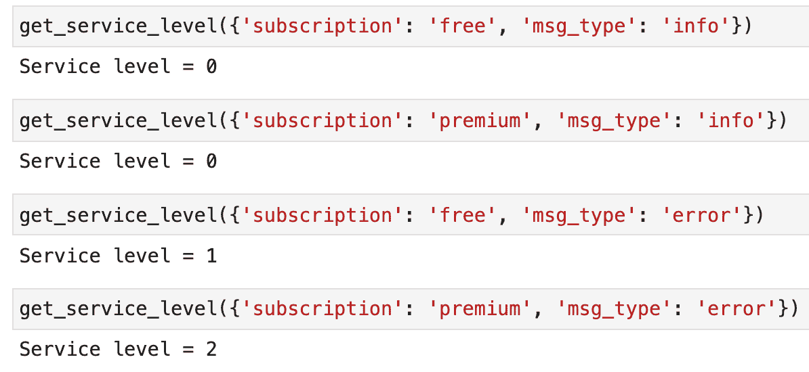
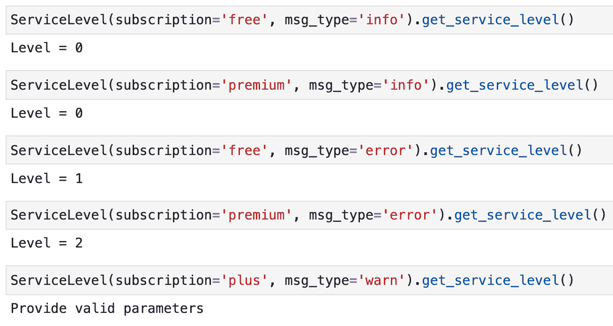

# Python 结构化模式匹配——帮助您入门的 3 大用例

> 原文：<https://towardsdatascience.com/python-structural-pattern-matching-top-3-use-cases-to-get-you-started-262160007fa0?source=collection_archive---------12----------------------->

## Python 3.10 增加了对 switch 语句的支持——这里有 3 个实用的例子来帮助您入门


照片由 [Grzegorz Walczak](https://unsplash.com/@grzegorzwalczak?utm_source=unsplash&utm_medium=referral&utm_content=creditCopyText) 在 [Unsplash](https://unsplash.com/?utm_source=unsplash&utm_medium=referral&utm_content=creditCopyText) 上拍摄

Python 的等价语句`switch`终于在 Python 3.10 中出现了。它隐藏在一个有趣的名字*结构模式匹配*的后面，做你所期望的和更多的事情。它支持处理原始数据类型、序列，甚至类和枚举。

今天我将向你展示如何开始，并讨论在什么情况下你应该使用它。我们将从创建一个基于 Python 3.10 的新环境开始。

不想看书？请观看我的视频:

# 如何配置 Python 3.10 环境

我们将使用 Anaconda 创建一个新的虚拟环境。如果您使用其他工具来管理 Python 工作流，请在线搜索等效的命令。

从终端逐行执行以下命令，创建一个名为`py310`的新 Python 3.10 虚拟环境，安装并启动 Jupyter Lab:

```
conda create — name py310 python=3.10
conda activate py310
conda install jupyter jupyterlab
jupyter lab
```

现在，您可以使用以下命令来验证您使用的是 Python 3.10(假设您使用的是 Jupyter 或 Python shell):

你应该看到`3.10.0`打印出来，这意味着你可以走了。

# Python 结构化模式匹配-基本语法

在深入到用例之前，让我们先了解一下结构模式匹配背后的基本语法。整个事情基于两个关键词:

*   `match` —您想要评估条件的受试者。它可能是 API 请求返回的状态代码。
*   `case` —评估个体条件以查看是否确认匹配。

下面是来自[官方文档](https://docs.python.org/3/whatsnew/3.10.html)的模式匹配的一般语法:

如您所见，Python 中的结构化模式匹配不需要在每个案例的结尾使用`break` 语句。如果在其他案例中没有找到精确匹配，将使用最后一个案例(`_`)。

您现在已经了解了基础知识，所以让我们深入到示例中。

# Python 结构化模式匹配-匹配简单值

先说一个简单的。我们将编写一个名为 http_error()的函数，它接受一个状态代码。然后，我们将使用状态代码作为匹配语句的主题，并针对不同的条件编写几个案例:

仅供参考，您可以使用|在一个模式中组合多个条件。例如，状态代码 401、403 和 404 返回相同的结果，因此编写三个不同的案例没有意义。

现在让我们用不同的状态代码调用 http_error()函数来验证它是否正常工作:


*图片 Python 中的基本结构模式匹配(图片由作者提供)*

如你所见，即使你传入一个字符串，这个函数也不会崩溃。接下来，我们将深入更高级的用例。

# Python 结构化模式匹配-匹配复杂模式

有时候匹配一个变量是不够的。好消息是——您可以在 Python 的匹配语句中加入几乎任何可以想象的东西。

看看下面的代码片段——它声明了一个名为`get_service_level()`的函数，该函数将用户数据作为字典接受。目标是基于用户*订阅类型*(免费，高级)和*消息类型*(信息，错误)，返回不同的服务级别。在 info 消息的情况下，不管订阅类型如何，服务级别都是 0。在有错误消息的自由用户的情况下，服务级别是 1。最后，在高级用户出现错误消息的情况下，服务级别是 2:

在一个关键词后面写一本字典有点不自然，但这是你必须习惯的事情。无论如何，以下是对所有四种可能情况的测试:



*图 2 —匹配 Python 中的复杂模式(图片由作者提供)*

您可以通过添加默认案例来进一步改进该功能，但是您已经知道如何做了。

# Python 结构化模式匹配-匹配类中的模式

可以对 Python 的类和数据类使用结构模式匹配。文档向您展示了如何使用数据类，所以我将在这里介绍常规的数据类。简而言之，您可以使用一个类名，后跟一个作为 case 模式传递给构造函数的参数列表。

以下示例向您展示了如何在 Python 类中实现相同的服务级别逻辑。向构造函数传递了两个参数—订阅类型和消息类型。对于任何信息消息，级别为 0。在自由用户出错的情况下，级别为 1。最后，在高级用户出错的情况下，级别为 2。我们还将添加一个默认案例，只是为了混淆一下:

语法与第二个例子中的不同，但仍然可以理解。我认为它也更容易阅读。假设您有两个以上的参数——将它们作为字典传递会很快变得混乱。

让我们针对四种可能的场景和一种默认情况进行测试:



*图片 Python 类中的结构模式匹配(图片由作者提供)*

很管用。让我们在这里停止使用实际的例子，把焦点转移到一个重要的问题上——什么时候应该使用结构模式匹配？

# 最后的想法

Python 中早就应该有一个专用的`switch`语句了。结构模式匹配打包了 switch 语句所做的一切，甚至更多。这是一种书写和评估条件的新方法。但是正如科里·泰勒曾经说过的那样——*新并不意味着最好*。

如果你所做的只是测试简单的条件，那么在结构模式匹配上费心是没有意义的。此外，结构模式匹配仅在 Python 3.10 中可用。如果您尝试使用旧的 Python 版本，将会得到一个错误。值得升级吗？

当您有更复杂的模式要评估时，主要使用结构化模式匹配，就像今天讨论的那些。

*你们觉得结构模式匹配怎么样？你是否用它替换了你的一些旧代码，为什么？*请在下面的评论区告诉我。

*喜欢这篇文章吗？成为* [*中等会员*](https://medium.com/@radecicdario/membership) *继续无限制学习。如果你使用下面的链接，我会收到你的一部分会员费，不需要你额外付费。*

[](https://medium.com/@radecicdario/membership) [## 通过我的推荐链接加入 Medium-Dario rade ci

### 作为一个媒体会员，你的会员费的一部分会给你阅读的作家，你可以完全接触到每一个故事…

medium.com](https://medium.com/@radecicdario/membership) 

# 保持联系

*   注册我的[简讯](https://mailchi.mp/46a3d2989d9b/bdssubscribe)
*   在 YouTube[上订阅](https://www.youtube.com/c/BetterDataScience)
*   在 [LinkedIn](https://www.linkedin.com/in/darioradecic/) 上连接