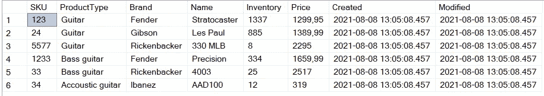
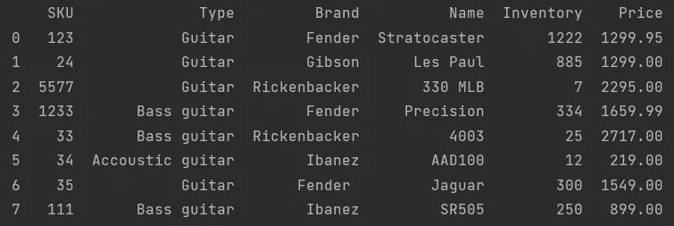
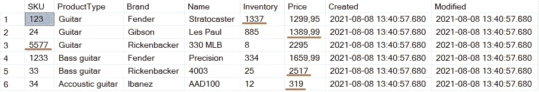
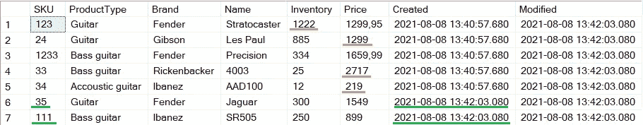

# Python 到 SQL —安全、轻松、快速地向上插入

> 原文：<https://towardsdatascience.com/python-to-sql-upsert-safely-easily-and-fast-17a854d4ec5a?source=collection_archive---------2----------------------->

## 使用 Python 进行闪电般的插入和/或更新

是时候更新我们的存储空间并插入一些新东西了(图片由[斯蒂夫·约翰森](https://unsplash.com/@steve_j)在 [Unsplash](https://unsplash.com/photos/S0j-5wSN3YQ) 上提供)

当您将数据向上插入到表中时，您会更新已存在的记录并插入新的记录。阅读完本文后，您将能够将 Python 应用程序连接到数据库，并以闪电般的速度更新数据。我们将通过几个实际例子来演示实现这一点的各种方法。它们都适合处理大型数据集；关注高速度和数据有效性。我们来编码吧！

*另外，我们将在本例中使用 SQL Server，但所使用的技术适用于各种数据库。*

# 1.设置和准备

我们有一个出售各种音乐文章的网站。每小时我们都会收到一份来自所有供应商的文件，上面有他们当前的库存；他们出售的所有商品以及股票和价格信息。

在本例中，我们将关注一个供应商的文件。我们的目标是增加销量；插入所有新文章并更新已经存在的文章。也许他们有新的股票价值或不同的价格。作为奖励，我们将了解如何删除缺货的商品。

## 1.1 数据库准备

让我们首先在数据库中创建一个可以插入的表。

我们的音乐物品表

如你所见，我们的小网店卖不了多少东西。没关系，虽然，它会保持这篇文章漂亮和简洁。最值得注意的是 SKU 专栏。这是库存单位；每个产品都有一个独一无二的编号。

## 1.2 Python 加载数据

假设我们的供应商给我们发送了新的 CSV 文件和他们的文章更新。我们已经编写了一个 Python 程序，它一检测到新文件就加载该文件。现在的目标是加载 CSV，然后将其插入数据库。请记住，不需要从 CSV 中读取您的数据；任何数据结构都可以。首先，我们将加载 CSV:

将新产品从 csv 加载到字典列表中

我选择使用熊猫来阅读我的 CSV，但这不是必需的。你可以用任何你喜欢的方法。这会产生以下数据帧:

## 1.3 Python 创建数据库连接

我们将使用 SQLAlchemy 创建一个数据库连接，连接到在我的本地主机上运行的 SQL Server 数据库。

通知`fast_executemany=True`。这是一个专门针对 SQL Server 的功能，它可以确保以闪电般的速度插入数据。更多信息请见本文[**。**](https://mikehuls.medium.com/dramatically-improve-your-database-inserts-with-a-simple-upgrade-6dfa672f1424)

准备工作做好了，我们来插入一些数据吧！(图片由[将](https://www.pexels.com/@elevate)提升到[像素](https://www.pexels.com/photo/person-using-forklift-1267338/)上)

# 2.向上插入

加载我们的 CSV，准备好我们的表，建立数据库连接；让我们插上！

## 这个计划

我们首先将所有数据插入到一个临时表中。然后，如果这成功了，我们将合并我们的表。该操作允许您在一条语句中插入、更新*和*删除！有关合并的更多信息，请查看本文[**。**](https://mikehuls.medium.com/sql-insert-delete-and-update-in-one-statement-sync-your-tables-with-merge-14814215d32c)

## 执行

我们将遍历下面的代码。

我们分 4 个步骤执行升级:

1.  创建一个名为#NewProducts 的临时表。这里没什么太令人兴奋的
2.  将新数据插入临时表。
    我们使用一些好的参数将我们的新值批量插入到临时表中。在插入到 SQL Server 时，此插入操作还使用 fast_executemany 选项；这是超快的。
3.  将临时表与目标表合并(MusicArticles)
    这就是神奇的地方:合并！我们拿 SKU 来比较产品。
    -如果它们不在目标(我们的音乐物品表)中，那么我们将简单地插入新的乐器。
    -两个表中都有 SKU 的产品得到更新。我们还更新了修改后的列。
    -在 MusicalArticles 中但不在 temp 表中的产品从 MusicalArticles 中删除。所以实际上这个语句不仅插入和更新，它还删除！您可以选择删除这一部分，以保持我们的声明是一个纯粹的 upsert。
4.  删除我们的临时表

## 安全的

还要注意，我们在起始于`with dbEngine.begin() as con`的代码块中执行这两个步骤。这将启动一个新的事务，确保块中的所有内容要么成功，要么回滚。这意味着如果合并失败，插入数据和创建临时表的操作将被撤消。更多交易信息请参见 [**本文**](https://mikehuls.medium.com/sql-rolling-back-statements-with-transactions-81937811e7a7) 。

如果有更多的步骤，例如在插入或与许多表格合并后清理数据，这将非常方便。或者，您可以将 insert 语句放在不同的块中，这样大型插入就不会回滚，而只是将数据存储在临时表中。

## 结果

当然，这是一些不错的代码，但让我们看看一些结果！这是我们执行这个 python 脚本前后的 MusicalArticles 表。

在插入之前(红色将被删除，橙色将被修改)

向上插入后(橙色被修改，绿色被新插入)

你会注意到 SKU 123，24，33 和 34 被修改了。不是价格变了就是库存变了。此外，我们还有两款新仪器 SKU 35 和 111。还有，SKU 5577 不见了！肯定卖光了。对于 SKU 1233，一切都没有改变。

# 结论

通过这篇文章，我希望对如何安全、方便、快速地插入数据有所启发。如果你有建议/澄清，请评论，以便我可以改进这篇文章。与此同时，请查看我的其他关于各种编程相关主题的文章，比如:

*   [删除进入另一个表](https://mikehuls.medium.com/sql-delete-into-another-table-b5b946a42299)
*   [更新进入另一个标签页](https://mikehuls.medium.com/sql-update-into-another-table-bfc3dff79a66) le
*   [在一条语句中插入、删除和更新](https://mikehuls.medium.com/sql-insert-delete-and-update-in-one-statement-sync-your-tables-with-merge-14814215d32c)
*   [更新选择一批记录](https://mikehuls.medium.com/sql-update-select-in-one-query-b067a7e60136)

编码快乐！

—迈克

页（page 的缩写）学生:比如我正在做的事情？[跟我来](https://github.com/mike-huls)！