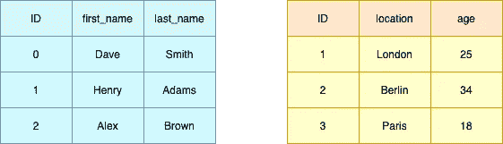
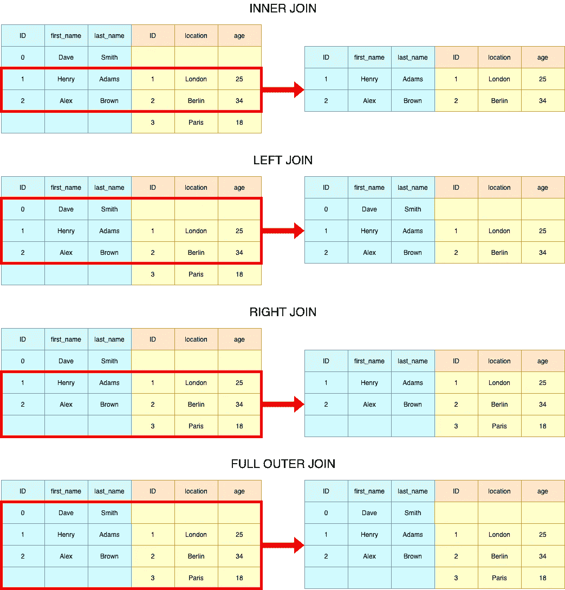

# Python 技巧:如何检查与熊猫的表合并

> 原文：<https://towardsdatascience.com/python-tricks-how-to-check-table-merging-with-pandas-cae6b9b1d540?source=collection_archive---------13----------------------->


照片由[米卡·鲍梅斯特](https://unsplash.com/@mbaumi?utm_source=medium&utm_medium=referral)在 [Unsplash](https://unsplash.com?utm_source=medium&utm_medium=referral) 上拍摄

## 一个让你免受挫折的关键词

欢迎阅读一系列短文，每篇短文都有方便的 Python 技巧，可以帮助你成为更好的 Python 程序员。在这篇博客中，我们将探讨检查熊猫的连接。

## 情况

当我们在 Python 中处理数据集集合时，知道如何将表连接在一起是至关重要的。我们都知道 SQL 中的`INNER JOIN`、`LEFT JOIN`、`RIGHT JOIN`、`FULL OUTER JOIN`以及在熊猫中是如何做到的，但你知道还有一个不太为人知的关键字参数叫`indicator`吗？

出于说明的目的，我们将使用下面的表格，其中`ID`将被用作本博客剩余部分的表格之间的公共键:

```
import pandas as pddf_left = pd.DataFrame({
    "ID": [0, 1, 2],
    "first_name": ["Dave", "Henry", "Alex"],
    "last_name": ["Smith", "Adams", "Brown"],
})df_right = pd.DataFrame({
    "ID": [1, 2, 3],
    "location": ["London", "Berlin", "Paris"],
    "age": [25, 34, 18],
})
```



说明性虚拟表格—作者图片

## Pandas 中类似 SQL 的连接操作的快速修改

```
**# Inner Join**
df_results = df_left.merge(
    df_right, 
    on=["ID"], 
    how="left"
)**# Left Join**
df_results = df_left.merge(
    df_right, 
    on=["ID"], 
    how="left"
)**# Right Join**
df_results = df_left.merge(
    df_right, 
    on=["ID"], 
    how="right"
)**# Outer Join**
df_results = df_left.merge(
    df_right, 
    on=["ID"], 
    how="outer"
)
```



加入插图-作者图片

注意，我们使用了一个列表作为关键字参数`on`的输入，以展示放入多个键列是可能的。如果`ID`是唯一的键列，请随意使用`"ID"`而不是`["ID"]`。

## 检查合并结果

每当连接两个表时，检查结果表。无数个夜晚，我试图合并表，并认为连接是正确的(双关语😉)意识到它应该被留下。您最不想做的事情就是重新访问您几个月前完成的连接，这就是为什么当您进行合并时，传递`indicator=True`以获得有关合并结果的更多信息:

```
**# Outer Join**
df_results = df_left.merge(
    df_right, 
    on=["ID"], 
    how="outer",
    indicator=True,
) ID first_name last_name location   age      _merge
0   0       Dave     Smith      NaN   NaN   left_only
1   1      Henry     Adams   London  25.0        both
2   2       Alex     Brown   Berlin  34.0        both
3   3        NaN       NaN    Paris  18.0  right_only
```

使用`_merge`列，我们不仅可以检查任意一个表中存在的行数，还可以提取精确的行以进行进一步的质量检查。这在很多情况下有助于理解数据处理流程中的问题。

## 排除合并/反合并

使用`_merge`列，我们还可以很容易地实现所谓的左/右合并，不包括连接和反合并。left excluding join 生成的表只包含第一个表中的记录，这些记录在第二个表中没有匹配项；右排除连接是它的镜像。反合并本质上是排除连接的左和右的组合。

```
**# LEFT EXCLUDING JOIN**
df_results = df_left.merge(
    df_right, 
    on=["ID"], 
    how="left",
    indicator=True,
)
df_results = df_results[df_results["_merge"] == "left_only"] ID first_name last_name location  age     _merge
0   0       Dave     Smith      NaN  NaN  left_only
```

不用在选择`_merge == "left_only"`之前分配中间结果，我们实际上可以使用 Pandas DataFrame 的`query`方法来实现，然后删除`_merge`列:

```
**# LEFT EXCLUDING JOIN**
df_results = (df_left.merge(df_right, 
                            on=["ID"], 
                            how="left",
                            indicator=True)
                     .query("_merge != 'both'")
                     .drop("_merge", 1)) ID first_name last_name location  age
0   0       Dave     Smith      NaN  NaN**# RIGHT EXCLUDING JOIN**
df_results = (df_left.merge(df_right, 
                            on="ID", 
                            how="right",
                            indicator=True)
                     .query("_merge != 'both'")
                     .drop("merge", 1)) ID first_name last_name location  age
2   3        NaN       NaN    Paris   18**# ANTI MERGE**
df_results = (df_left.merge(df_right, 
                            on=["ID"], 
                            how="outer",
                            indicator=True)
                     .query("_merge != 'both'")
                     .drop("_merge", 1)) ID first_name last_name location   age
0   0       Dave     Smith      NaN   NaN
3   3        NaN       NaN    Paris  18.0
```


加入插图-作者图片

这篇博文就讲到这里吧！我希望你已经发现这是有用的。如果你对其他 Python 技巧感兴趣，我为你整理了一份简短博客列表:

*   [Python 技巧:拉平列表](/python-tricks-flattening-lists-75aeb1102337)
*   [Python 技巧:简化 If 语句&布尔求值](/python-tricks-simplifying-if-statements-boolean-evaluation-4e10cc7c1e71)
*   [Python 技巧:对照单个值检查多个变量](/python-tricks-check-multiple-variables-against-single-value-18a4d98d79f4)

如果你想了解更多关于 Python、数据科学或机器学习的知识，你可能想看看这些帖子:

*   [改进数据科学工作流程的 7 种简单方法](/7-easy-ways-for-improving-your-data-science-workflow-b2da81ea3b2)
*   [熊猫数据帧上的高效条件逻辑](/efficient-implementation-of-conditional-logic-on-pandas-dataframes-4afa61eb7fce)
*   [常见 Python 数据结构的内存效率](/memory-efficiency-of-common-python-data-structures-88f0f720421)
*   [与 Python 并行](/parallelism-with-python-part-1-196f0458ca14)
*   [数据科学的基本 Jupyter 扩展设置](/cookiecutter-plugin-for-jupyter-easily-organise-your-data-science-environment-a56f83140f72)
*   [Python 中高效的根搜索算法](/mastering-root-searching-algorithms-in-python-7120c335a2a8)

如果你想了解更多关于如何将机器学习应用于交易和投资的信息，这里有一些你可能感兴趣的帖子:

*   [用 Python 实现交易策略优化的遗传算法](https://pub.towardsai.net/genetic-algorithm-for-trading-strategy-optimization-in-python-614eb660990d)
*   [遗传算法——停止过度拟合交易策略](https://medium.com/towards-artificial-intelligence/genetic-algorithm-stop-overfitting-trading-strategies-5df671d5cde1)
*   [人工神经网络选股推荐系统](https://pub.towardsai.net/ann-recommendation-system-for-stock-selection-c9751a3a0520)

<https://www.linkedin.com/in/louis-chan-b55b9287> 