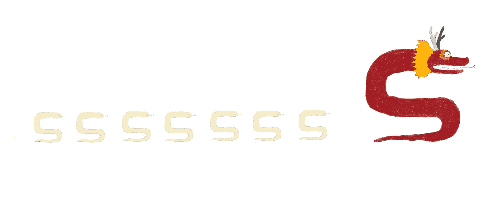
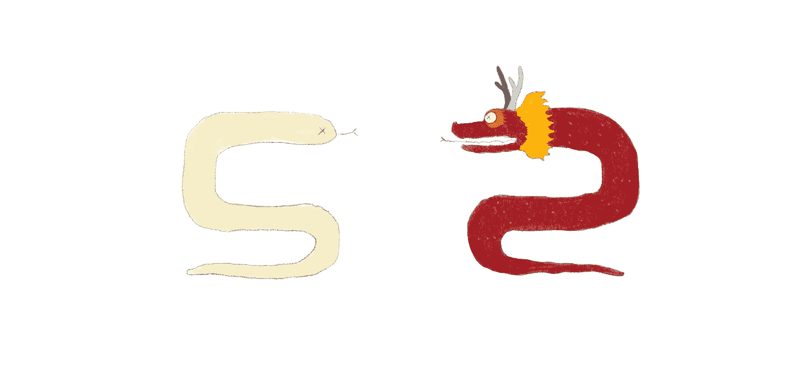
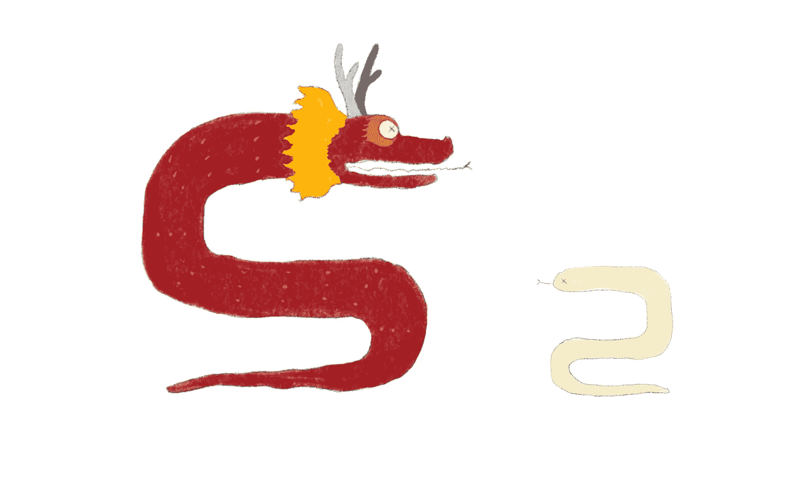
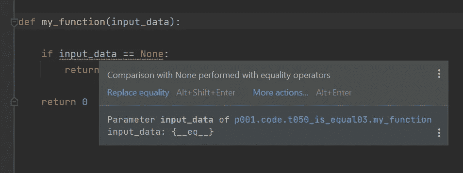

# Python 招数:“是”还是“==”

> 原文：<https://towardsdatascience.com/python-tricks-is-or-1033eddafa4?source=collection_archive---------45----------------------->

## 一个存在性问题背后的答案，用 python 写的！



作者图片

你有没有收到过 Pycharm 的警告说:

> 使用相等运算符执行与 None 的比较

想知道为什么？

好了，今天我们要彻底揭开这个秘密！

做好准备，这实际上是一个相当深刻的问题，可能会让你质疑生命的意义。

## 是 Python 吗？

> 是的是的是的。

众所周知，Python 有两个操作符:“is”和“==”，在许多常规情况下，它们会产生相同的结果。但是，如果不了解它们之间的区别，您可能会遇到一些令人费解的错误，这些错误会让您绞尽脑汁几个小时。

这里有一个例子:

```
from copy import copy

def compare(a, b):

    print("--- compare a and b")
    print(f"id(a): {id(a)}")
    print(f"id(b): {id(b)}")

    print(f"a == a: {a == a}")
    print(f"a == b: {a == b}")
    print(f"a is a: {a is a}")
    print(f"a is b: {a is b}")

class Python:
    def __init__(self, size):
        self.size = size

    def __eq__(self, other):
        return self.size == other.size

print('test 1')
a = Python(5)
b = Python(6)
compare(a, b)

print('test 2')
a = Python(5)
b = Python(5)
compare(a, b)

print('test 3')
a = Python(5)
b = copy(a)
compare(a, b)

print('test 4')
a = Python(5)
b = a
compare(a, b)
```

我们有一个非常简单的类，叫做 Python，它有一个“__eq__”操作符，如果要比较的另一个对象有相同的大小，它返回 True。

测试 1:实例化两条大小分别为 5、6 的 Pythons。

测试 2:实例化两条大小为 5 的蟒蛇。

测试 3:为 a 实例化一个 Python，为 b 制作一个副本。

测试 4，为 a 实例化一个 Python，然后赋给 b。

以下是结果:

```
test 1
--- compare a and b
id(a): 2810649485760
id(b): 2810649485664
a == a: True
**a == b: False** # different sizes
a is a: True
a is b: False
test 2
--- compare a and b
id(a): 2810648609840
id(b): 2810648608832
a == a: True
**a == b: True**
a is a: True
a is b: False
test 3
--- compare a and b
**id(a): 2810649485760
id(b): 2810649485808 # different ids**
a == a: True
a == b: True
a is a: True
**a is b: False**
test 4
--- compare a and b
**id(a): 2810648609840
id(b): 2810648609840** # same ids
a == a: True
a == b: True
a is a: True
**a is b: True**
```

查看测试 1 和测试 2 的结果，我们注意到“a == b”对于测试 1 为假，而对于测试 2 为真。这是可以理解的，因为 python a 和 b 对于 test 1 有不同的大小。

查看测试 3 和测试 4 的结果，我们看到“a 是 b”对于测试 3 为假，但是对于测试 4 为真。这很奇怪，因为在测试 3 和测试 4 中，a 和 b 的大小都是 5。但是看一下 a 和 b 的 id，在测试 3 中，id 是不同的，而在测试 4 中它们是相同的。

从这些测试中，我们可以得出结论:

**“= =”运算符调用“__eq__”函数确定相等，而“is”运算符比较对象 id 确定相等。**

## Python 是龙吗？

> 依赖



蟒蛇是龙吗？(图片由作者提供)

让我们定义另一个类 Dragon，并与 python 进行比较:

```
class Dragon:
    def __init__(self, size):
        self.size = size

print('test 5')
a = Python(5)
b = Dragon(5)
compare(a, b)

print('test 6')
a = Dragon(5)
b = Python(5)
compare(a, b)

print('test 7')
a = Dragon(5)
b = Dragon(5)
compare(a, b)
```

结果:

```
test 5
--- compare a and b
id(a): 2810649489264
id(b): 2810649488544
a == a: True
**a == b: True**
a is a: True
a is b: False
test 6
--- compare a and b
id(a): 2810648806784
id(b): 2810648806112
a == a: True
**a == b: True**
a is a: True
a is b: False
test 7
--- compare a and b
id(a): 2810649489264
id(b): 2810649488544
a == a: True
**a == b: False**
a is a: True
a is b: False
```

“is”的结果和预期的一样，它对三种情况都是假的，因为每种情况下的 id 都不同。

“==”的结果有点奇怪，在所有三种情况下，dragon 和 python 的大小都是 5，但是当我们使用“python == dragon”和“dragon == python”时，结果是真的，而“dragon == dragon”是假的。

这实际上是由于 Python 和 Dragon 类是如何定义的。仔细看，我们看到 Dragon 没有定义“__eq__”操作符。这意味着当我们测试“python == dragon”和“dragon == python”时，调用了 python 的“__eq__”运算符，但是当我们测试“dragon == dragon”时，由于两边都没有“__eq__”运算符，所以比较默认为“is”，它比较两条龙的 id，结果为 false。



龙，双倍大(图片由作者提供)

如果我们为 Dragon 定义一个“__eq__”操作符，情况会变得更加有趣:

```
class Dragon2:
    def __init__(self, size):
        self.size = size

    def __eq__(self, other):
        return self.size * 2 == other.size

print('test 8')
a = Python(5)
b = Dragon2(5)
compare(a, b)

print('test 9')
a = Dragon2(5)
b = Python(5)
compare(a, b)
```

龙是一个自负的物种，当他们和别人比较时，他们想象自己是两倍大:

```
test 8
--- compare a and b
id(a): 2810649486096
id(b): 2810649487920
a == a: True
**a == b: True**
a is a: True
a is b: False
test 9
--- compare a and b
id(a): 2810628730688
id(b): 2810649488544
a == a: False
**a == b: False**
a is a: True
a is b: False
```

**所以在这种情况下“Python(5) == Dragon2(5)”产生 true，而“Dragon2(5) == Python(5)”产生 false！**

## 0 等于 0 吗？

> 总是

既然我们已经了解了“是”和“==”是如何工作的，那么让我们来测试一个重要的默认类型，整数:

```
print('test 10')
a = int(0)
b = int(0)
compare(a, b)print('test 11')
a = int(0)
b = a
compare(a, b)print('test 12')
a = int(0)
b = copy(a)
compare(a, b)
```

结果:

```
test 10
--- compare a and b
id(a): 2810573515184
id(b): 2810573515184
a == a: True
a == b: True
a is a: True
a is b: True
test 11
--- compare a and b
id(a): 2810573515184
id(b): 2810573515184
a == a: True
a == b: True
a is a: True
a is b: True
test 12
--- compare a and b
id(a): 2810573515184
id(b): 2810573515184
a == a: True
a == b: True
a is a: True
a is b: True
```

你看，python 的创造者们一直在努力向你隐藏“是”和“==”之间的区别。F **或整数，只要值相同，使用“is”和“==”结果没有区别。**

## 是没有还是等于没有？

> 让我们不要迷惑自己



Pycharm 警告无比较(图片由作者提供)

**让我们来看看 None，那么为什么 Pycharm 警告你在与 None 比较时不要使用“== ”?**

**真的是为了保护你不犯粗心的错误。**因为 None 是一个常量，它总是只有一个实例，所以没有理由使用“==”操作符，它试图调用“__eq__”操作符，除非你真的想做一些奇怪的事情，如下所示:

```
class EndOfWorld:
    def __eq__(self, other):
        return other is None

a = EndOfWorld()
a == None
# Out[58]: True
```

## 忒修斯之船

> 让我们谈谈哲学

所以，python 的创造者们似乎做出了一个决定，每个对象都有一个 id，如果 id 相同，那么两个对象就是彼此。这与“忒修斯之船”的思想实验有着有趣的相似之处，在这个实验中，身份的问题是通过询问一艘所有组件都被替换的船是否仍然是同一艘船而提出的。

参见维基上的[忒修斯的船](https://en.wikipedia.org/wiki/Ship_of_Theseus)。

事实证明，你只需要一张身份证！

(我的 id 是什么？)

## 结论

我希望我的读者在学习 python 对象标识比较的细微差别时度过了一段美好的时光。这些概念不是 python 独有的，它们以引用和指针的形式存在于 C 和 C++中，类似地，在许多其他语言中也存在，所以值得花时间去理解细节以避免错误。

尽管在编程语言的抽象世界中给每样东西分配一个 id 是相当容易的，但是在现实生活中给对象分配一个 id 却不那么容易，你认为呢？