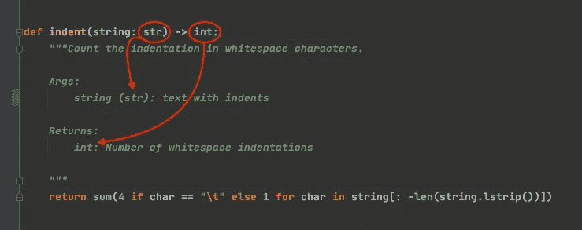
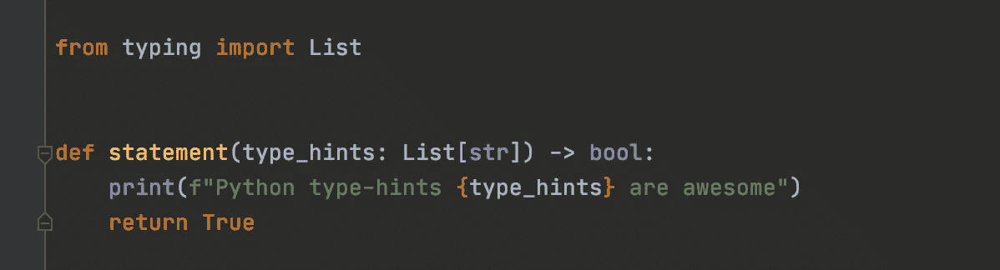
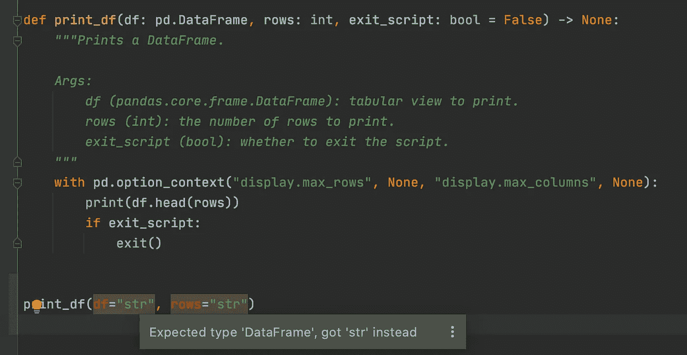
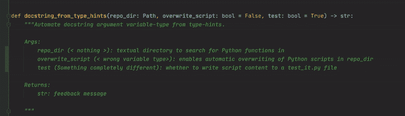
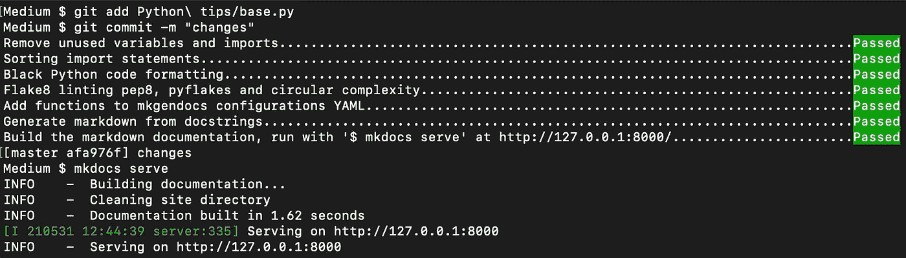
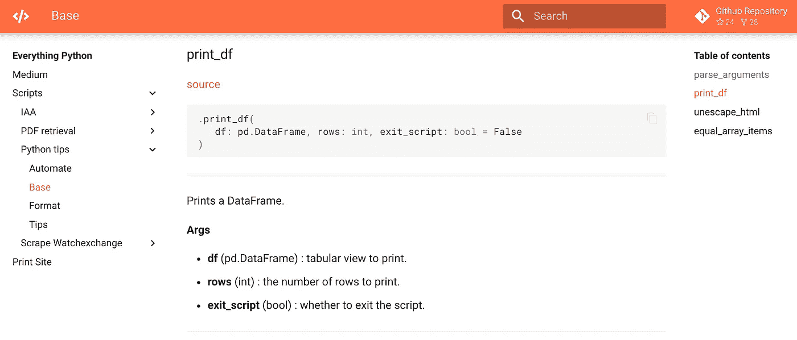

# Python 类型提示和文档字符串

> 原文：<https://towardsdatascience.com/python-type-hints-docstrings-7ec7f6d3416b?source=collection_archive---------7----------------------->

## 将 Python 的类型提示(3.5+)中的变量类型自动插入到 Google 风格的文档字符串中

从类型提示到文档字符串，作者的图像。

在这个故事中，您将跟随我从 Python 类型提示自动生成 Google 风格的文档字符串。我们将关注以下要素。

*   Python 类型提示
*   将类型提示插入函数文档字符串
*   通过预提交 Git 挂钩实现自动化

# Python 类型提示

从 Python 3.5+开始，我们已经看到了下一代代码文档:*在函数/类参数和返回语句中提示*哪些*变量的类型*。这使得格式化程序、linters 和 IDE 能够为类型检查提供运行时支持。

Python 类型提示示例

## 为什么是类型提示

简单地说，类型提示**增加了源代码文档和可读性**。它们是 Python 的增强协议(PEP)的一部分，PEP 是一个用于增加 Python 代码的清晰度和逻辑性的进化框架。

## 如何使用类型提示

类型提示可以从`typing`模块导入。格式为`<variable name> : <variable type>`，可以直接插入函数参数中。您可以用`-> <return variable>`包含返回声明。

## 类型检查

请注意，类型提示是可选的，因此 Python 解释器会完全忽略它们(带有错误格式的类型提示的 Python 代码仍然会运行)。然而，像 Pycharm 这样的 ide 已经集成了类型检查，并且像`mypy`这样的静态类型检查工具将类型错误作为 bug 挖掘出来。

PyCharm 中的类型检查

# 将类型提示插入函数文档字符串

为了从函数定义中提取参数及其类型提示，我们将

1.  使用`abstract syntax trees`解析 Python 脚本并读取函数及其参数
2.  使用库从我们的函数参数中获取变量类型提示
3.  使用`regular expressions`将变量类型映射到 Google 风格的 docstring 格式

Google 风格的文档字符串的自动变量类型添加

## 抽象语法树

`[ast](https://docs.python.org/3/library/ast.html#module-ast)`模块帮助 Python 应用程序处理 Python 抽象语法的树。我们现在可以通过`ast nodes`以编程方式读取语法，而不是将 Python 脚本作为文本文件读取。打印和理解这些节点的一个有用的包是`astpretty`。我们使用`ast`模块来获取脚本中的函数或类名。

`pathlib.Path`模块创建了一个面向对象的文件系统路径，您可以查询这个路径的属性，比如最后一个路径组件`.stem`，没有它的后缀。我们可以用`importlib.import_module`将函数或类作为*字符串*导入。

`getattr`从一个对象中提取命名属性，在本例中，是我们的 Python 模块中的函数，方式与我们做`from module import attribute`的方式相同。

## 打字

来自`typing`模块的方法`get_type_hints()`返回包含函数、方法、模块或类对象的类型提示的字典。`get_type_hints` *不支持*字符串，因此我们使用`ast`库来解析模块中的方法。

本词典中的最后一个`key`是“return ”,包含返回变量 type-hint(如果有),否则没有。我们可以用`.pop`方法从字典中排除这个键。

## 正则表达式

我们使用下面的正则表达式来理解函数参数在我们的 [Google 风格的文档字符串](https://google.github.io/styleguide/pyguide.html)中的定义位置。

首先，我们从函数节点`get_docstring`开始，寻找三个属性`Args`、`Example[s]`和`Return[s]`(第 8 行)。然后我们迭代每个函数参数(第 31 行)，用它选择我们的`type_hints`字典中的值(第 38 行)，删除打印的 type_hint 的`<class ''>`部分(第 39 行)，并将其插入括号中(第 43 行)。

请在这里找到完整的脚本，看看我们如何对函数返回参数的类型提示做同样的事情，并用新格式化的 docstring 文本覆盖我们的 Python 脚本。

# 通过预提交 Git 挂钩实现自动化

预提交 Git 管道

通过 Git 钩子，我们可以在每次提交和推送到我们的库之前运行林挺和格式化工具，比如`mypy`、`autoflake`、`flake8`、`isort`、`black`。这使我们能够在 Python 项目中自动创建“编码标准”。这些 Git 挂钩是由`pre-commit`包提供的，它使用一个`pre-commit-config.yaml`文件来指定在预提交管道中包含哪些包。

请在下面的故事中找到更多关于预提交 Git 挂钩的有用提示👇

<https://betterprogramming.pub/4-tips-to-automate-clean-code-in-python-527f59b5fe4e>  

除了林挺和格式化工具，您还可以通过 bash 命令在这些 Git 挂钩中包含 Python 脚本的执行，使我们能够自动化`docstring_from_type_hints()`功能。这样，在每次提交时，类型提示都会被插入到我们的 docstring 中。

MkDocs 中自动生成的 Google 风格的 docstring 示例

更进一步，我们可以用 Mkdocs 中的 Python 文档自动创建一个静态网站。以下是更多相关信息👇

</five-tips-for-automatic-python-documentation-7513825b760e> 