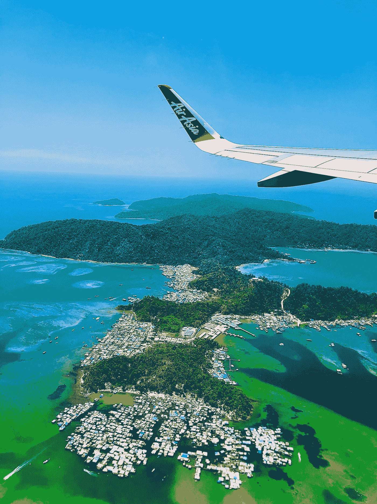

# Python:用 Delorean 和熊猫来计算你的下一次飞行时间

> 原文：<https://towardsdatascience.com/python-use-delorean-and-pandas-to-calculate-your-next-flight-time-76ecf87fea8a?source=collection_archive---------26----------------------->

## 操纵时区*感知*和*天真的*和`datetime`物体

[Ramon Kagie](https://unsplash.com/@ramonkagie?utm_source=unsplash&utm_medium=referral&utm_content=creditCopyText) 在 [Unsplash](/s/photos/takeoff?utm_source=unsplash&utm_medium=referral&utm_content=creditCopyText) 上拍摄的照片

# 范围

机票上注明了出发和到达的日期和时间，但却标注了各自的当地时区，这使得计算飞行时间有点棘手。在本文中，引入了`Delorean`库，并与`pandas`、`datetime`一起操作带有时区信息的对象。作为一个例子，计算了*英国伦敦希思罗机场*和*马来西亚吉隆坡*之间的飞行时间。

图片由作者提供|完整的归属细节见下文

# 介绍

如果你到了某个年龄，那么始于 20 世纪 80 年代的 [*【回到未来】*](https://www.themoviedb.org/movie/105-back-to-the-future) 系列电影是迄今为止最好的时间旅行系列。对于其他人来说，这是一个关于时间旅行的*托尼·斯塔克*引用自 [*复仇者联盟 4：终局之战*](https://www.themoviedb.org/movie/299534-avengers-endgame) 。这是一个啰嗦的说法，图书馆 [*Delorean*](https://delorean.readthedocs.io/en/latest/index.html) 是以九十年代 [*回到未来*](https://www.themoviedb.org/movie/105-back-to-the-future) 电影和高飞[电视动画片](https://www.thetvdb.com/series/back-to-the-future)中的汽车命名的。

`[Delorean](https://delorean.readthedocs.io/en/latest/index.html)`库提供了另一个接口来管理基于`[dateutil](https://dateutil.readthedocs.io/en/stable/)`和`[pytz](https://pythonhosted.org/pytz/)`的时区感知*对象。在本文中，我将介绍 *Delorean* ，创建并操作`datetime`对象，并应用该功能来确定从*伦敦希思罗机场*(LHR)*英国*到*吉隆坡* (KUL)的飞行时间。*

# Python 环境

## 德罗林装置

第一步是建立一个适当的环境；下面的 *gifcast* 展示了在使用`pip`安装`delorean`之前，用`conda`克隆一个环境的过程。

康达设置要点|作者

关键步骤是检查和克隆现有的`conda`环境(`ds01`)。`Delorean`似乎无法通过`conda-forge`获得，因此需要进行`pip`安装。虽然`conda`包不应该和`pip`包混在一起，但是如果`pip`安装是最后一项，它们是兼容的。

康达环境设置|由作者铸造

## Jupyter 笔记本设置

`delorean`环境已经预装了`jupyter`、熊猫和相关的软件包。为了提供可再现的分析，列出了包的版本:

Jupyter 笔记本进口|作者

# 德罗林

## 介绍

作者简介 Delorean

初始化一个`delorean`对象相当于在[世界协调时间](https://www.timeanddate.com/time/aboututc.html) (UTC)时区为当前日期时间生成一个`datetime`对象。因此，世界上任何地方的两个用户同时运行相同的命令都会得到相同的结果。第二个命令`Delorean.now()`将`datetime`对象定位到用户的本地时区，对我来说就是`Europe/London`。

## 时区转换

笔记本片段|作者

`shift`命令用于将`utc`变量的时区从`UTC`更改为`Europe/London`；然而，它似乎也改变了原来的`utc`变量，这是意料之外的。为了解决这个问题，必须重新初始化`utc`变量:

笔记本片段|作者

笔记本片段再次显示了`utc`变量的创建，但也显示了一个单独的`london`变量，该变量获取初始化的`Delorean`对象并将其转移到*伦敦*时区。通过将`timezone=”Europe/London”`参数传递给`Delorean`对象可以达到同样的目的。

两个变量(`london`和`utc`)之间的差异在微秒级，因为两个区域当前是相同的。存在微小的差异是因为两个变量是分别初始化的；为了使用一个公共时基，`Delorean`类接受一个时区 *naive* `datetime`对象:

笔记本片段|作者

由于两个变量现在使用相同的时间，但在不同的时区，它们之间的差异当然是零。

## 马来西亚吉隆坡

为了确定*马来西亚*中*吉隆坡*的时区，可以使用`pytz.common_timezones`列出最常见的时区:

笔记本片段|作者

公共时区列表可以用 list comprehension 来解析，查找关键字“Kuala”，并显示合适的时区是`Asia/Kuala_Lumpur`。然后用变量`utc`初始化一个新的变量`kuala_lumpur`和城市的时区。不出所料，伦敦和吉隆坡的时差是零——两个地理位置的时间当然是一样的！

# 熊猫日期时间

以下笔记本显示了与上述类似的步骤，但使用了`pandas`:

笔记本片段|作者

使用`pd.to_datetime(‘today’)`生成当前日期和时间(无时区信息)，然后使用`.tz_localize`将其本地化为`Europe/London`并存储为`pd_london`。然后可以使用`astimezone(‘Asia/Kuala_Lumpur’)`功能创建*吉隆坡*、*马来西亚*的日期和时间。注意显示时差和时区的两个变量的输出。不幸的是，与`Delorean`不同，没有简单的方法来减去两个时区*感知*变量之间的差异，因此出现了错误消息。

笔记本片段|作者

为了减少误差，可以使用`.to_pydatetime()`将`pandas`表示转换为`datetime`对象，这当然也显示了零时差。值得注意的是，这也是意料之中的事，两个不同地理位置的同一时间的时差为零。

为了计算两个时区之间的差异*，需要使用`.tz_localize(None)`将时区*感知*表示转换为时区*原始*表示，正如预期的那样，显示了 8 小时的差异。*

# 飞行时间计算

照片由 [Nysa Zainal](https://unsplash.com/@nysazainal?utm_source=unsplash&utm_medium=referral&utm_content=creditCopyText) 在 [Unsplash](/s/photos/malaysia-flights?utm_source=unsplash&utm_medium=referral&utm_content=creditCopyText) 上拍摄

## 熊猫来了

理解了使用`Delorean`和`pandas`进行时区操作的基础知识后，我们可以将它应用到实际应用中。我们将确定*伦敦希思罗机场*、*英国*和*吉隆坡*、*马来西亚*之间最后两个航班的飞行时间。数据来自 [*飞行雷达 24*](https://www.flightradar24.com/) ，针对*马航*MH3/MAS3 航班:

笔记本片段|作者

笔记本片段显示了使用基于*飞行雷达 24* 数据的列表字典创建一个`DataFrame` ( `df`)。它包括出发和到达时间以及时区信息。

笔记本片段|作者

将日期和时间信息转换成原生的`pandas` `datetime`对象可能很有诱惑力。请注意，这些是时区的简单表示。两个时间简单相减，显示飞行时间为 19 小时 40 分，与实际飞行时间不符。原因是时间表示没有考虑到两个不同的时区。

笔记本片段|作者

上面的代码首先将出发和到达时间定位到各自的时区(使用`.tz_localize`)。注意`datatypes`信息是如何进行时区编码的。为了计算飞行时间，两列相减是不够的，因为 pandas 不支持两个不同时区的这种操作。必须将其中一列转换(使用`.dt.tz_convert`)为通用时区。结果显示正确的飞行时间约为 11 小时 40 分钟。简单的心算还应该证明，根据时区之间的 8 小时时差调整后，之前的 19 小时 40 分钟产生了大约 11 小时 40 分钟。

## 用 Delorean 进行理智检查

作为最后一项检查，使用`datetime.datetime.strptime`创建出发和到达时区*简单的* `datetime`对象——其中`strptime`使用一个字符串和一种格式生成一个`datetime`对象。然后用两个各自的时区初始化一个`Delorean`对象。两个对象之间的差异被表示为一个`timedelta`对象。`timedelta`格式的一个限制是差异用`days`和`seconds`的组合来表示，而不是更合适的单位，如小时:

笔记本片段|作者

健全性检查显示，两个时间之间的差异与之前使用`pandas`进行的计算一致。

# 结束语

我们已经讨论了时区*幼稚*和*感知* `datetime`对象，并介绍了`Delorean`作为时间操作的替代接口。我们还研究了`pandas`如何执行类似的计算，并将其应用于计算飞行时间的真实用例。

用过`Delorean`，虽然有`.humanize()`等一些好看的功能，但是从 2018 年开始就没有更新过，可以说很笨重。因此，我会继续推荐使用`pandas`来代替。

## 属性

所有`gists`，笔记本，终端演员表均为作者。所有作品都是基于拥有 [CC0 或公共领域](https://creativecommons.org/share-your-work/public-domain/cc0/)许可或[SIL of](https://scripts.sil.org/cms/scripts/page.php?item_id=OFL_web)的资产，因此不侵权。

使用的 [*Python 标志*](https://www.python.org/community/logos/) 与 *Python 软件基金会*指南一致。

主题灵感来自并基于我最喜欢的`vim`主题:[grubbox](https://github.com/morhetz/gruvbox)。