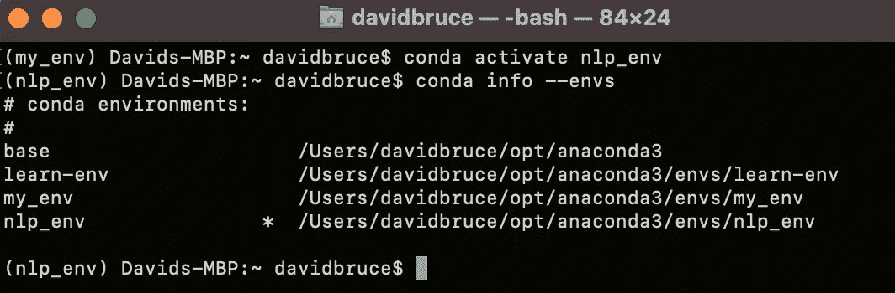

# Python 虚拟环境

> 原文：<https://towardsdatascience.com/python-virtual-environments-22f2362c22ec?source=collection_archive---------33----------------------->

## 通过将 Python 虚拟环境与 Anaconda 结合使用，避免未来的麻烦

几个月来，我一直在 Anaconda (conda)虚拟环境中使用 Jupyter 笔记本电脑中的数据，一个接一个地安装 Python 包，天真地不知道我的计算机不断增长的 PyPI 库怎么可能会出错——直到出现一些冲突，我使用的代码表明它依赖于我已经安装的包的早期版本。

如果您正开始使用 Python 处理数据，并且正在疯狂地学习伴随 Python 知识而来的不断增长的软件包库，那么我给你的建议是:通过从一开始就知道如何使用 Python 虚拟环境，您将节省数小时的错误修复和回溯时间。如果你还没有，从下载 [Anaconda](https://www.anaconda.com/products/individual) 开始。这可能需要一点时间，所以去给自己冲一点咖啡(或茶！)下载，然后你可以在大约 5 分钟内完成这篇博客的其余部分。


照片由[内容小精灵](https://unsplash.com/@contentpixie?utm_source=medium&utm_medium=referral)在 [Unsplash](https://unsplash.com?utm_source=medium&utm_medium=referral) 上拍摄

简单地说，虚拟环境是一种隔离每个项目的依赖关系的方式。

通过建立单独的虚拟环境，你将把自己(和其他想要添加或复制你的代码的人)从无尽的挫折中解救出来。如果您曾经因为不同的包版本需求或任何种类的过时(大声说出这个词)而经历过代码中断，Python 虚拟环境就是您的解决方案。有了虚拟环境，您将能够直接从命令行(如果使用 Windows，则从 Anaconda 提示符窗口)为所有独特的项目设置和导航专门的工作环境。

现在，您已经对虚拟环境有了概念性的了解，并且已经下载了 conda，我们将介绍如何设置、导航、更新和删除您的虚拟环境的一些基础知识，您将很快就能进行完美的生产。

我从康达网站上了解到所有这些，所以如果你想更深入地了解，这是我推荐的起点。

## 步骤 1:创建和激活新的虚拟环境

现在安装了 conda，只要我们打开它，我们就已经在 conda(基础)虚拟环境中了。我们不想向我们的基础环境添加任何包，因为这将是我们的白板，我们的家“基础”相反，我们将为任何我们想要开始工作的项目创造一个新的环境。打开一个终端窗口，键入下面的命令。您可以将 my_env 替换为虚拟环境中您想要的任何名称，并在您的环境中选择您想要的 Python 版本(默认情况下，它将是您在安装 conda 时拥有的 Python 版本):

```
conda create --name my_env python=3.8.3
```

一旦终端提示您是否要继续，您的新环境就创建好了([y]/n)？键入 y 并按回车键。现在它会问你是否要激活环境。要激活它，请遵循命令行提示并键入:

```
conda activate my_env
```

您将知道您的环境已被激活，因为您给出的名称将显示在终端左侧的括号中。


作者图片

## 步骤 2:更新您的虚拟环境

在我们新的虚拟环境中，我们可以像任何其他项目一样使用 pip install 添加软件包，该环境的优点是任何新的安装都不会影响您计算机的其他部分，只会影响我们已经设置的虚拟环境。我现在正在做一个自然语言处理项目，所以我将把自然语言工具包( [nltk](https://pypi.org/project/nltk/) )安装到我的环境中，如下所示:

```
pip install nltk
```

现在这个包已经安装在我为我的 NLP 项目设置的环境中，不会在其他地方或以后对我造成任何冲突。

## 步骤 3:导航多个虚拟环境

在不同环境间导航很容易。要停用一个环境，您只需输入命令`conda deactivate`。这将带您回到基本环境。切换目录的一种更快速的方法是只激活您想要切换到的新目录，例如:



作者图片

正如您在上面看到的，我从 my_env 环境开始，然后通过使用`conda activate`命令激活它，快速切换到另一个名为 nlp_env 的环境。在下一行中，我使用了这个命令

```
conda info --envs
```

这将弹出我的所有环境的列表，星号表示哪个环境是活动的。

## 步骤 4:删除虚拟环境

删除或移除环境也可以通过一行代码来完成。确保您已经停用了想要删除的环境，然后运行这行代码

```
conda remove --name my_env --all
```

## 结论

我再怎么强调这对你前进的帮助也不为过。Anaconda 应用程序有更多的功能和有用的 GUI，但是如果您在数据科学相关的项目中较少使用 Python，并且没有发现自己在使用 Anaconda 作为资源，我建议安装 PyPI 的 [pipenv](https://pypi.org/project/pipenv/) 来为您的任何编程项目建立相同的独立虚拟环境框架。在使用虚拟环境时，实际的 Python 文档有点过时，所以我建议坚持使用 conda 和 pipenv。希望这有所帮助，并可能让你很多头痛！