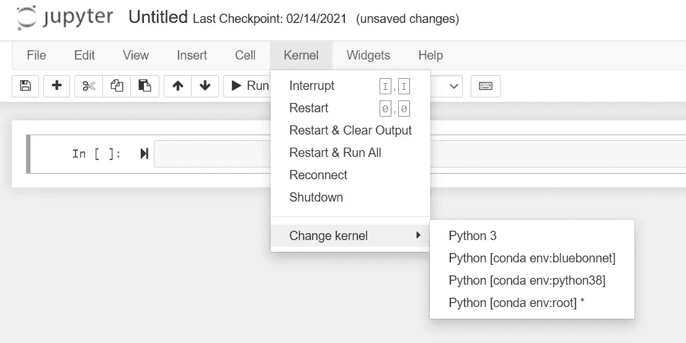

# Python 虚拟环境& Jupyter 笔记本

> 原文：<https://towardsdatascience.com/python-virtual-environments-jupyter-notebook-bb5820d11da8?source=collection_archive---------4----------------------->

## 用 conda 在 Jupyter 中创建虚拟环境和相应的内核

# **TL；博士**

```
conda create -n myenv python=3.8
conda activate myenv
conda install jupyter
conda install -n base nb_conda_kernels
jupyter notebook
```

*注意，我在 Windows* 上运行 Python 3.8(与 Anaconda 一起安装)


由[麦克斯韦·纳尔逊](https://unsplash.com/@maxcodes?utm_source=medium&utm_medium=referral)在 [Unsplash](https://unsplash.com?utm_source=medium&utm_medium=referral) 上拍摄的照片

# 完整的操作方法

我最近决定清理我的 Python 安装，因为我的已经变得一团糟。我用 Anaconda 卸载/重新安装了 Python，并选择在开始新项目时开始创建虚拟环境，以保持 Python 的基本安装整洁。虚拟环境将允许我安装给定项目所需的任何包的任何版本，而不会干扰我的基本安装。这样，我可以拥有我需要的所有软件包的所有版本，并且不会出现我不知道的恼人的不兼容错误。

## 第一步。

要创建一个新的虚拟环境，打开 Anaconda 提示符并运行以下命令*(用您选择的虚拟环境名替换“myenv”):*

```
conda create -n myenv python=3.8
conda activate myenv
```

请注意，您必须指定 Python 版本，否则您的虚拟环境将被创建为一个完全空的文件夹，没有预先安装 Python 和一些像 pip 这样的基本包。你可以通过运行 **conda list** 来查看哪些包已经在那里(提示:应该有> 0)，以确保你已经正确安装了它。

此时，您可以使用 **conda** 或 **pip** 在新激活的虚拟环境中安装您需要的**或**软件包。

## 第二步。

当您在 Jupyter Notebook 中运行项目时，您需要一种方法来引用这个新的虚拟环境，而不是您的基础环境。在 Anaconda 提示符下(在虚拟环境仍然激活的情况下)，运行以下命令。请记住，您必须在您创建的每个虚拟环境中运行此操作。

```
conda install jupyter
```

## 第三步。

然后，在您的基础环境中，您需要安装 **nb_conda_kernels** (只需一次)，它会为您创建的每个虚拟环境自动创建一个新的内核，前提是您已经在其中安装了 jupyter。

```
conda install -n base nb_conda_kernels
```

## 第四步。

您的 Jupyter 笔记本现在可以在任何一个内核(base 或 myenv)上运行，因此可以根据手头的项目获得正确的包/版本。您可以使用下面的命令从任何激活的环境中启动 Jupyter Notebook，它将打开您的笔记本位置(我的位置在 C:/Users/myusername 中，我的 Anaconda3 也安装在那里)。

`jupyter notebook`

打开一个新的 Jupyter 笔记本，点击**内核** > **改变内核** >，选择你需要的虚拟环境。



我希望这有所帮助！